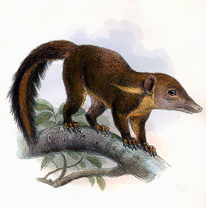

---
aliases:
  - Tupaia
title: Tupaia
---

# [[Tupaia]] 

## #has_/text_of_/abstract 

> **Tupaia** (also spelled Tupaea or Tupia; c. 1725 – 20 December 1770) was a Tahitian Polynesian navigator and arioi (a kind of priest), originally from the island of Ra'iatea in the Pacific Islands group known to Europeans as the Society Islands.  His remarkable navigational skills and Pacific geographical knowledge were used by Lt. James Cook, R.N. when he took him aboard HMS Endeavour as guide on its voyage of exploration to Terra Australis Incognita. Tupaia travelled with Cook to New Zealand, acting as the expedition's navigator to the Polynesian Māori, and Australia. He died in December 1770 from a shipborne illness contracted when Endeavour was docked in Batavia for repairs ahead of its return journey to England.
>
> [Wikipedia](https://en.wikipedia.org/wiki/Tupaia%20(navigator))

## Phylogeny 

-   « Ancestral Groups  
    -  [Scandentia](../Scandentia.md) 
    -  [Eutheria](../../Eutheria.md) 
    -  [Mammal](../../../Mammal.md) 
    -   [Therapsida](../../../../Therapsida.md)
    -   [Synapsida](../../../../../Synapsida.md)
    -   [Amniota](../../../../../../Amniota.md)
    -   [Terrestrial Vertebrates](../../../../../../../Terrestrial.md)
    -   [Sarcopterygii](../../../../../../../../Sarc.md)
    -   [Gnathostomata](../../../../../../../../../Gnath.md)
    -   [Vertebrata](../../../../../../../../../../Vertebrata.md)
    -   [Craniata](../../../../../../../../../../../Craniata.md)
    -   [Chordata](../../../../../../../../../../../../Chordata.md)
    -   [Deuterostomia](../../../../../../../../../../../../../Deutero.md)
    -  [Bilateria](../../../../../../../../../../../../../../Bilateria.md) 
    -  [Animals](../../../../../../../../../../../../../../../Animals.md) 
    -  [Eukarya](../../../../../../../../../../../../../../../../Eukarya.md) 
    -   [Tree of Life](../../../../../../../../../../../../../../../../Tree_of_Life.md)

-   ◊ Sibling Groups of  Scandentia
    -   Tupaia

-   » Sub-Groups 

	-   *Tupaia belangeri*
	-   *Tupaia chrysogaster*
	-   *Tupaia dorsalis*
	-   *Tupaia glis*
	-   *Tupaia gracilis*
	-   *Tupaia javanica*
	-   *Tupaia longipes*
	-   *Tupaia minor*
	-   *Tupaia moellendorffi*
	-   *Tupaia montana*
	-   *Tupaia nicobarica*
	-   *Tupaia palawanensis*
	-   *Tupaia picta*
	-   *Tupaia splendidula*
	-   *Tupaia tana*
	-   *Tupaia miocenica* †
	-   *Palaeotupaia sivalicus* †

## Title Illustrations

----------------
 
Scientific Name ::  Tupaia splendidula
Creator           Chromolithograph by Joseph Wolf (1865)

## Confidential Links & Embeds: 

### #is_/same_as :: [[/_Standards/bio/bio~Domain/Eukarya/Animal/Bilateria/Deutero/Chordata/Craniata/Vertebrata/Gnath/Sarc/Tetrapods/Amniota/Synapsida/Therapsida/Mammal/Eutheria/Scandentia/Tupaia|Tupaia]] 

### #is_/same_as :: [[/_public/bio/bio~Domain/Eukarya/Animal/Bilateria/Deutero/Chordata/Craniata/Vertebrata/Gnath/Sarc/Tetrapods/Amniota/Synapsida/Therapsida/Mammal/Eutheria/Scandentia/Tupaia.public|Tupaia.public]] 

### #is_/same_as :: [[/_internal/bio/bio~Domain/Eukarya/Animal/Bilateria/Deutero/Chordata/Craniata/Vertebrata/Gnath/Sarc/Tetrapods/Amniota/Synapsida/Therapsida/Mammal/Eutheria/Scandentia/Tupaia.internal|Tupaia.internal]] 

### #is_/same_as :: [[/_protect/bio/bio~Domain/Eukarya/Animal/Bilateria/Deutero/Chordata/Craniata/Vertebrata/Gnath/Sarc/Tetrapods/Amniota/Synapsida/Therapsida/Mammal/Eutheria/Scandentia/Tupaia.protect|Tupaia.protect]] 

### #is_/same_as :: [[/_private/bio/bio~Domain/Eukarya/Animal/Bilateria/Deutero/Chordata/Craniata/Vertebrata/Gnath/Sarc/Tetrapods/Amniota/Synapsida/Therapsida/Mammal/Eutheria/Scandentia/Tupaia.private|Tupaia.private]] 

### #is_/same_as :: [[/_personal/bio/bio~Domain/Eukarya/Animal/Bilateria/Deutero/Chordata/Craniata/Vertebrata/Gnath/Sarc/Tetrapods/Amniota/Synapsida/Therapsida/Mammal/Eutheria/Scandentia/Tupaia.personal|Tupaia.personal]] 

### #is_/same_as :: [[/_secret/bio/bio~Domain/Eukarya/Animal/Bilateria/Deutero/Chordata/Craniata/Vertebrata/Gnath/Sarc/Tetrapods/Amniota/Synapsida/Therapsida/Mammal/Eutheria/Scandentia/Tupaia.secret|Tupaia.secret]] 

