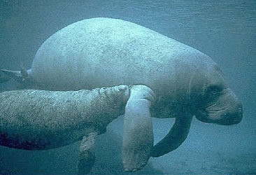

# Sirenia

#is_/same_as :: [[../../../../../../../../../../../../../../../../../WikiData/WD~Sirenia,25431|WD~Sirenia,25431]] 

## Dugongs, sea cows, and manatees 

## #has_/text_of_/abstract 

> The **Sirenia**, commonly referred to as sea cows or sirenians, 
> are an order of fully aquatic, herbivorous mammals 
> that inhabit swamps, rivers, estuaries, marine wetlands, and coastal marine waters. 
> 
> The extant Sirenia comprise two distinct families: Dugongidae (the dugong and the now extinct Steller's sea cow) and Trichechidae (manatees, namely the Amazonian manatee, West Indian manatee, and West African manatee) with a total of four species. The Protosirenidae (Eocene sirenians) and Prorastomidae (terrestrial sirenians) families are extinct. Sirenians are classified in the clade Paenungulata, alongside the elephants and the hyraxes, and evolved in the Eocene 50 million years ago (mya). The Dugongidae diverged from the Trichechidae in the late Eocene or early Oligocene (30–35 mya).
>
> Sirenians grow to between 2.5 and 4 metres (8.2 and 13.1 feet) in length and 1,500 kilograms (3,300 pounds) in weight. The recently extinct Steller's sea cow was the largest known sirenian to have lived, reaching lengths of 10 metres (33 feet) and weights of 5 to 10 tonnes (5.5 to 11.0 short tons).
>
> Sirenians have a large, fusiform body which reduces drag through the water and heavy bones that act as ballast to counteract the buoyancy of their blubber. They have a thin layer of blubber and consequently are sensitive to temperature fluctuations, which cause large-scale migrations when water temperatures dip too low. Sirenians are slow-moving, typically coasting at 8 kilometres per hour (5.0 miles per hour), but they can reach 24 kilometres per hour (15 miles per hour) in short bursts. They use their strong lips to pull out seagrasses, consuming 10–15% of their body weight per day.
>
> While breathing, sirenians hold just their nostrils above the surface, sometimes standing on their tails to do so. They typically inhabit warm, shallow, coastal waters, or rivers. They are mainly herbivorous, but have been known to consume animals such as birds and jellyfish. Males typically mate with more than one female and may gather in leks to mate. Sirenians are K-selected, displaying parental care.
>
> 
>
> The meat, oil, bones, and skins of sirenians are commercially valuable. Mortality is often caused by direct hunting from humans or by other human-induced causes, such as habitat destruction, entanglement in fishing gear, and watercraft collisions. Steller's sea cow was finally driven to extinction due to overhunting in 1768.
>
> [Wikipedia](https://en.wikipedia.org/wiki/Sirenia)

### Information on the Internet

-   [Order     Sirenia](http://animaldiversity.ummz.umich.edu/chordata/mammalia/sirenia.html).
    Animal Diversity Web. University of Michigan Museum of Zoology.
-   [Introduction to the Sirenia: Dugongs and     Manatees](http://www.ucmp.berkeley.edu/mammal/mesaxonia/sirenia.html).
    UCMP Berkeley.
-   [Sirenian International](http://www.sirenian.org/). A grassroots
    organization of people who share a dedication to manatee & dugong
    research, education, and conservation.
-   [Sirenia](http://www.ultimateungulate.com/sirenia.html). The
    Ultimate Ungulate Page.

## Phylogeny 

-   « Ancestral Groups  
    -  [Eutheria](../Eutheria.md))
    -  [Mammal](../../Mammal.md))
    -   [Therapsida](../../../Therapsida.md)
    -   [Synapsida](../../../../Synapsida.md)
    -   [Amniota](../../../../../Amniota.md)
    -   [Terrestrial Vertebrates](../../../../../../Terrestrial.md)
    -   [Sarcopterygii](../../../../../../../Sarc.md)
    -   [Gnathostomata](../../../../../../../../Gnath.md)
    -   [Vertebrata](../../../../../../../../../Vertebrata.md)
    -   [Craniata](../../../../../../../../../../Craniata.md)
    -   [Chordata](../../../../../../../../../../../Chordata.md)
    -   [Deuterostomia](../../../../../../../../../../../../Deutero.md)
    -  [Bilateria](../../../../../../../../../../../../../Bilateria.md))
    -  [Animals](../../../../../../../../../../../../../../Animals.md))
    -  [Eukarya](../../../../../../../../../../../../../../../Eukarya.md))
    -   [Tree of Life](../../../../../../../../../../../../../../../Tree_of_Life.md)

-   ◊ Sibling Groups of  Eutheria
    -   [Edentata](Edentata.md)
    -   [Pholidota](Pholidota.md)
    -  [Lagomorpha](Glires/Lagomorpha.md))
    -   [Rodentia](Rodentia.md)
    -   [Macroscelididae](Macroscelididae.md)
    -   [Primates](Primates.md)
    -   [Scandentia](Scandentia.md)
    -   [Bat](Bat.md)
    -   [Dermoptera](Dermoptera.md)
    -   [Insectivora](Insectivora.md)
    -   [Carnivora](Carnivora.md)
    -   [Artiodactyla](Artiodactyla.md)
    -   [Whale](Whale.md)
    -   [Tubulidentata](Tubulidentata.md)
    -   [Perissodactyla](Perissodactyla.md)
    -   [Hyracoidea](Hyracoidea.md)
    -   Sirenia
    -   [Proboscidea](Eukarya/Animal/Bilateria/Deutero/Chordata/Craniata/Vertebrata/Gnath/Sarc/Terrestrial/Amniota/Synapsida/Therapsida/Mammal/Eutheria/Proboscidea.md)

-   » Sub-Groups
    -  [Dugongidae](Sirenia/Dugongidae.md))
    -  [Trichechidae](Sirenia/Trichechidae.md))
	-   *Prorastomus* †

## Title Illustrations

-------------------

Scientific Name ::     Trichechus manatus
Location ::           Florida
Comments             West Indian manatee
Creator              Galen Rathbun
Acknowledgements     Courtesy of the U.S. Fish and Wildlife Service
Specimen Condition   Live Specimen
Life Cycle Stage ::     cow and calf

## Confidential Links & Embeds: 

### #is_/same_as :: [Sirenia](/_Standards/bio/bio~Domain/Eukarya/Animal/Bilateria/Deutero/Chordata/Craniata/Vertebrata/Gnath/Sarc/Tetrapods/Amniota/Synapsida/Therapsida/Mammal/Eutheria/Sirenia.md) 

### #is_/same_as :: [Sirenia.public](/_public/bio/bio~Domain/Eukarya/Animal/Bilateria/Deutero/Chordata/Craniata/Vertebrata/Gnath/Sarc/Tetrapods/Amniota/Synapsida/Therapsida/Mammal/Eutheria/Sirenia.public.md) 

### #is_/same_as :: [Sirenia.internal](/_internal/bio/bio~Domain/Eukarya/Animal/Bilateria/Deutero/Chordata/Craniata/Vertebrata/Gnath/Sarc/Tetrapods/Amniota/Synapsida/Therapsida/Mammal/Eutheria/Sirenia.internal.md) 

### #is_/same_as :: [Sirenia.protect](/_protect/bio/bio~Domain/Eukarya/Animal/Bilateria/Deutero/Chordata/Craniata/Vertebrata/Gnath/Sarc/Tetrapods/Amniota/Synapsida/Therapsida/Mammal/Eutheria/Sirenia.protect.md) 

### #is_/same_as :: [Sirenia.private](/_private/bio/bio~Domain/Eukarya/Animal/Bilateria/Deutero/Chordata/Craniata/Vertebrata/Gnath/Sarc/Tetrapods/Amniota/Synapsida/Therapsida/Mammal/Eutheria/Sirenia.private.md) 

### #is_/same_as :: [Sirenia.personal](/_personal/bio/bio~Domain/Eukarya/Animal/Bilateria/Deutero/Chordata/Craniata/Vertebrata/Gnath/Sarc/Tetrapods/Amniota/Synapsida/Therapsida/Mammal/Eutheria/Sirenia.personal.md) 

### #is_/same_as :: [Sirenia.secret](/_secret/bio/bio~Domain/Eukarya/Animal/Bilateria/Deutero/Chordata/Craniata/Vertebrata/Gnath/Sarc/Tetrapods/Amniota/Synapsida/Therapsida/Mammal/Eutheria/Sirenia.secret.md)

