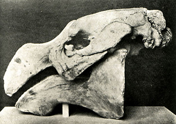

---
aliases:
  - Dugongidae
title: Dugongidae
---

# [[Dugongidae]] 

Dugongs 
 

## #has_/text_of_/abstract 

> **Dugongidae** is a family in the order of Sirenia. 
> The family has one surviving species, the dugong (Dugong dugon),  
> one recently extinct species, Steller's sea cow (Hydrodamalis gigas), 
> and a number of extinct genera known from fossil records.
>
>  Dugongidae's body weight ranges from 217 to 307 kg for juveniles, 334 to 424 kg for subadults, and 435 to 568.5 kg for adults. 
>  
>  Oral temperatures for individual dugongs is determined from 24° to 34.2 °C. 
>  Heart rate readings are from 40 to 96 bpm and vary between individual dugongs. 
>  Respiration rate during the out-of-water phase is from 1 to 33.
>
> [Wikipedia](https://en.wikipedia.org/wiki/Dugongidae) 

## Phylogeny 

-   « Ancestral Groups  
    -  [Sirenia](../Sirenia.md) 
    -  [Eutheria](../../Eutheria.md) 
    -  [Mammal](../../../Mammal.md) 
    -   [Therapsida](../../../../Therapsida.md)
    -   [Synapsida](../../../../../Synapsida.md)
    -   [Amniota](../../../../../../Amniota.md)
    -   [Terrestrial Vertebrates](../../../../../../../Terrestrial.md)
    -   [Sarcopterygii](../../../../../../../../Sarc.md)
    -   [Gnathostomata](../../../../../../../../../Gnath.md)
    -   [Vertebrata](../../../../../../../../../../Vertebrata.md)
    -   [Craniata](../../../../../../../../../../../Craniata.md)
    -   [Chordata](../../../../../../../../../../../../Chordata.md)
    -   [Deuterostomia](../../../../../../../../../../../../../Deutero.md)
    -  [Bilateria](../../../../../../../../../../../../../../Bilateria.md) 
    -  [Animals](../../../../../../../../../../../../../../../Animals.md) 
    -  [Eukarya](../../../../../../../../../../../../../../../../Eukarya.md) 
    -   [Tree of Life](../../../../../../../../../../../../../../../../Tree_of_Life.md)

-   ◊ Sibling Groups of  Sirenia
    -   Dugongidae
    -   [Trichechidae](Trichechidae.md)

-   » Sub-Groups 
	-   *Eotheroides* †
	-   *Sirenotherium* †
	-   *Miodugong* †
	-   *Protosireninae*
	    -   *Protosiren* †
	-   *Halitheriinae*
	    -   *Prototherium* †
	    -   *Paralitherium* †
	    -   *Halitherium* †
	    -   *Crenatosiren* †
	    -   *Thalattosiren* †
	-   *Hydrodamalinae*
	    -   *Caribosiren* †
	    -   *Metaxytherium* †
	    -   *Dusisiren* †
	    -   *Hesperosiren* †
	    -   *Hydrodamalis gigas* †
	        [(Steller\'s sea cow)]
	-   *Miosireninae*
	    -   *Anomotherium* †[
	        (incertae sedis) ]
	    -   *Miosiren* †
	-   *Rytiodontinae*
	    -   *Dioplotherium* †
	    -   *Rytiodus* †
	    -   *Xenosiren* †
	    -   *Corystosiren* †
	-   *Dugonginae*
	    -   *Indosiren* †
	    -   *Dugong dugon* [(dugong)]

### Information on the Internet

-   [Rothauscher\'s Dugong     Page](http://www.hans-rothauscher.de/dugong/dugong.htm).
-   [Dugong Conservation and its     Limitations](http://agrolink.moa.my/moa1/dugongbr.html). Ministry of
    Agriculture Malaysia.

## Title Illustrations

---------------------------- 
 
scientific_name ::  Hydrodamalis gigas
location ::        Specimen at the Natural History Museum, London
Reference         Lankester, E. R. 1905. Extinct Animals. Archibald Constable & Co. Ltd., London
Body Part         skull
View              lateral

## Confidential Links & Embeds: 

### #is_/same_as :: [[/_Standards/bio/bio~Domain/Eukarya/Animal/Bilateria/Deutero/Chordata/Craniata/Vertebrata/Gnath/Sarc/Tetrapods/Amniota/Synapsida/Therapsida/Mammal/Eutheria/Sirenia/Dugongidae|Dugongidae]] 

### #is_/same_as :: [[/_public/bio/bio~Domain/Eukarya/Animal/Bilateria/Deutero/Chordata/Craniata/Vertebrata/Gnath/Sarc/Tetrapods/Amniota/Synapsida/Therapsida/Mammal/Eutheria/Sirenia/Dugongidae.public|Dugongidae.public]] 

### #is_/same_as :: [[/_internal/bio/bio~Domain/Eukarya/Animal/Bilateria/Deutero/Chordata/Craniata/Vertebrata/Gnath/Sarc/Tetrapods/Amniota/Synapsida/Therapsida/Mammal/Eutheria/Sirenia/Dugongidae.internal|Dugongidae.internal]] 

### #is_/same_as :: [[/_protect/bio/bio~Domain/Eukarya/Animal/Bilateria/Deutero/Chordata/Craniata/Vertebrata/Gnath/Sarc/Tetrapods/Amniota/Synapsida/Therapsida/Mammal/Eutheria/Sirenia/Dugongidae.protect|Dugongidae.protect]] 

### #is_/same_as :: [[/_private/bio/bio~Domain/Eukarya/Animal/Bilateria/Deutero/Chordata/Craniata/Vertebrata/Gnath/Sarc/Tetrapods/Amniota/Synapsida/Therapsida/Mammal/Eutheria/Sirenia/Dugongidae.private|Dugongidae.private]] 

### #is_/same_as :: [[/_personal/bio/bio~Domain/Eukarya/Animal/Bilateria/Deutero/Chordata/Craniata/Vertebrata/Gnath/Sarc/Tetrapods/Amniota/Synapsida/Therapsida/Mammal/Eutheria/Sirenia/Dugongidae.personal|Dugongidae.personal]] 

### #is_/same_as :: [[/_secret/bio/bio~Domain/Eukarya/Animal/Bilateria/Deutero/Chordata/Craniata/Vertebrata/Gnath/Sarc/Tetrapods/Amniota/Synapsida/Therapsida/Mammal/Eutheria/Sirenia/Dugongidae.secret|Dugongidae.secret]] 

