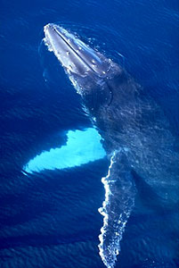

# [[Mysticeti]]

## Baleen whales 

## #has_/text_of_/abstract 

> Baleen whales (), also known as whalebone whales, are marine mammals of the parvorder **Mysticeti** in the infraorder Cetacea (whales, dolphins and porpoises), which use baleen plates (or "whalebone") in their mouths to sieve plankton from the water. Mysticeti comprises the families Balaenidae (right and bowhead whales), Balaenopteridae (rorquals), Eschrichtiidae (the gray whale) and Cetotheriidae (the pygmy right whale). There are currently 16 species of baleen whales. While cetaceans were historically thought to have descended from mesonychians, molecular evidence instead supports them as a clade of even-toed ungulates (Artiodactyla). Baleen whales split from toothed whales (Odontoceti) around 34 million years ago.
>
> Baleen whales range in size from the 6 m (20 ft) and 3,000 kg (6,600 lb) pygmy right whale to the 31 m (102 ft) and 190 t (210 short tons) blue whale, the largest known animal to have ever existed. They are sexually dimorphic. Baleen whales can have streamlined or large bodies, depending on the feeding behavior, and two limbs that are modified into flippers. The fin whale is the fastest baleen whale, recorded swimming at 10 m/s (36 km/h; 22 mph). Baleen whales use their baleen plates to filter out food from the water by either lunge-feeding or skim-feeding. Baleen whales have fused neck vertebrae, and are unable to turn their heads at all. Baleen whales have two blowholes. Some species are well adapted for diving to great depths. They have a layer of fat, or blubber, under the skin to keep warm in the cold water.
>
> Although baleen whales are widespread, most species prefer the colder waters of the Arctic and Antarctic. Gray whales are specialized for feeding on bottom-dwelling crustaceans. Rorquals are specialized at lunge-feeding, and have a streamlined body to reduce drag while accelerating. Right whales skim-feed, meaning they use their enlarged head to effectively take in a large amount of water and sieve the slow-moving prey. Males typically mate with more than one female (polygyny), although the degree of polygyny varies with the species. Male strategies for reproductive success vary between performing ritual displays (whale song) or lek mating. Calves are typically born in the winter and spring months and females bear all the responsibility for raising them. Mothers fast for a relatively long period of time over the period of migration, which varies between species. Baleen whales produce a number of infrasonic vocalizations, notably the songs of the humpback whale.
>
> The meat, blubber, baleen, and oil of baleen whales have traditionally been used by the indigenous peoples of the Arctic. Once relentlessly hunted by commercial industries for these products, cetaceans are now protected by international law. These protections have allowed their numbers to recover. However, the North Atlantic right whale is ranked critically endangered by the International Union for Conservation of Nature. Besides hunting, baleen whales also face threats from marine pollution and ocean acidification. It has been speculated that man-made sonar results in strandings. They have rarely been kept in captivity, and this has only been attempted with juveniles or members of one of the smallest species.
>
> [Wikipedia](https://en.wikipedia.org/wiki/Baleen%20whale) 

### Information on the Internet

-   [Whale Acoustics     Project](http://www.pmel.noaa.gov/vents/acoustics/whales/bioacoustics.html).
    NOAA\'s National Marine Mammal Laboratory in Seattle, Washington and
    Pacific Marine Environmental Laboratory in Newport, Oregon.
-   [The Origins and Adaptations of     Mysticetes](http://www.kanazawa-med.ac.jp/%7Ehum-sci/Fordyce.htm).
    Robert Ewan Fordyce, University of Otago, New Zealand.

## Introduction

[Michel C. Milinkovitch and Olivier Lambert]()

All living mysticetes are large filter-feeders although the exact means
by which baleens are used vary among species (gulp-feeding for
balaenopterids, skim-feeding for balaenids, and bottom ploughing for
eschrichtiids).

### Characteristics

The morphological modifications linked to filter-feeding are:

-   Loss of functional teeth (vestigial teeth are lost before birth),
-   Development of large body size and head,
-   Shortening of the neck,
-   Expanded maxillae (on which the epithelially-derived baleen plates
    develop),
-   Mandibular rami only attached to each other by a ligament (at the
    symphysis).

### Discussion of Phylogenetic Relationships

The relationships among extinct and extant groups of mysticetes have
been less extensively studied than the relationships among odontocetes.
Four families are currently recognized: **Balaenidae**,
**Balaenopteridae**, the **Neobalaenidae** (including a single extant
species, the pygmy right whale, *Caperea marginata*), and the
**Eschrichtiidae** (including a single extant species, the gray whale,
*Eschrichtius robustus*).

Some molecular analyses positioned the skim-feeding balaenids (right
whales) as the basal lineage of extant mysticetes (*e.g.*, Arnason and
Gulberg, 1994, 1996; Gatesy 1998). Uncertainty remains regarding the
phylogenetic position of neobalaenids: *Caperea* might be the sister
group to balaenopterids (rorquals) and *Eschrichtius* (gray whale)
(Arnason and Gulberg 1994), or to balaenids (Gatesy 1998). This latter
hypothesis is also supported by the morphological studies of McLeod et
al. (1993) and Bisconti (2000).

#### Discussion of some problematic extinct groups

Several fossil groups of mysticetes (*e.g.*, Aetiocetidae and
Cetotheriidae) are still taxonomically problematic; it is very likely
that some of them form paraphyletic groups. Systematic revisions,
additional anatomical data and cladistic analyses will be required
before reaching reasonable hypotheses regarding the phylogeny of these
groups.

-   The Oligocene family **Aetiocetidae** (review in Barnes et al. 1994)
    includes primitive toothed mysticetes (some of them having been
    erroneously placed within archaeocetes), showing a mix of
    archaeocete-like and mysticete-like skull features. This family
    persisted into Late Oligocene, at a time where more derived
    baleen-bearing whales had already evolved. Specimens have been found
    on both sides of the North Pacific.
-   The fossil specimens from other archaic toothed mysticete families
    (**Llanocetidae**, **Mammalodontidae**, and **Kekenodontidae**) have
    not been studied extensively enough to be meaningfully included into
    phylogenetic analyses. Members of these families, may have used
    their teeth for bulk feeding rather than for selecting individual
    preys, but functional studies are needed to confirm this hypothesis
    (Fordyce and Barnes, 1994).
-   **Cetotheriidae** is a very diverse paraphyletic family of Late
    Oligocene to Late Pliocene baleen-bearing whales. Many taxa are
    based on fragmentary material, leading to difficulties when trying
    to correlate taxa from distant fossil localities. Some cetotheriids
    exhibit character states reasonably interpreted as ancestral for
    balaenopterids (Mc Leod *et al.*1993; Kimura and Ozawa, 2002). Among
    Cetotheriidae s.l., Bouetel and Muizon (2006) isolate a monophyletic
    Cetotheriidae s.s., supported by a series of cranial characters and
    including six genera (*Cetotherium*, *Herpetocetus*, *Metopocetus*,
    *Mixocetus*, *Nannocetus*, and *Piscobalaena*). 

## Phylogeny 

-   « Ancestral Groups  
    -   [Whale](../Whale.md)
    -  [Eutheria](../../Eutheria.md))
    -  [Mammal](../../../Mammal.md))
    -   [Therapsida](../../../../Therapsida.md)
    -   [Synapsida](../../../../../Synapsida.md)
    -   [Amniota](../../../../../../Amniota.md)
    -   [Terrestrial Vertebrates](../../../../../../../Terrestrial.md)
    -   [Sarcopterygii](../../../../../../../../Sarc.md)
    -   [Gnathostomata](../../../../../../../../../Gnath.md)
    -   [Vertebrata](../../../../../../../../../../Vertebrata.md)
    -   [Craniata](../../../../../../../../../../../Craniata.md)
    -   [Chordata](../../../../../../../../../../../../Chordata.md)
    -   [Deuterostomia](../../../../../../../../../../../../../Deutero.md)
    -  [Bilateria](../../../../../../../../../../../../../../Bilateria.md))
    -  [Animals](../../../../../../../../../../../../../../../Animals.md))
    -  [Eukarya](../../../../../../../../../../../../../../../../Eukarya.md))
    -   [Tree of Life](../../../../../../../../../../../../../../../../Tree_of_Life.md)

-   ◊ Sibling Groups of  Cetacea
    -   [Odontoceti](Odontoceti.md)
    -   Mysticeti

-   » Sub-Groups
    -   [Balaenopteridae](Mysticeti/Balaenopteridae.md)
    -   [Balaenidae](Mysticeti/Balaenidae.md)

## Title Illustrations

------------------------------------------------------------------------------
Scientific Name ::     Megaptera novaeangliae
Location ::           Gerlache Strait (Antarctica)
Comments             Humpback whale (Balaenopteridae).
Creator              Photograph by Gerald and Buff Corsi
Specimen Condition   Live Specimen
Source Collection    [CalPhotos](http://calphotos.berkeley.edu/)
Copyright ::            © 2001 [California Academy of Sciences](http://www.calacademy.org/) 
------------------------------------------------------------------------------

## Confidential Links & Embeds: 

### #is_/same_as :: [Mysticeti](/_Standards/bio/bio~Domain/Eukarya/Animal/Bilateria/Deutero/Chordata/Craniata/Vertebrata/Gnath/Sarc/Tetrapods/Amniota/Synapsida/Therapsida/Mammal/Eutheria/Whale/Mysticeti.md) 

### #is_/same_as :: [Mysticeti.public](/_public/bio/bio~Domain/Eukarya/Animal/Bilateria/Deutero/Chordata/Craniata/Vertebrata/Gnath/Sarc/Tetrapods/Amniota/Synapsida/Therapsida/Mammal/Eutheria/Whale/Mysticeti.public.md) 

### #is_/same_as :: [Mysticeti.internal](/_internal/bio/bio~Domain/Eukarya/Animal/Bilateria/Deutero/Chordata/Craniata/Vertebrata/Gnath/Sarc/Tetrapods/Amniota/Synapsida/Therapsida/Mammal/Eutheria/Whale/Mysticeti.internal.md) 

### #is_/same_as :: [Mysticeti.protect](/_protect/bio/bio~Domain/Eukarya/Animal/Bilateria/Deutero/Chordata/Craniata/Vertebrata/Gnath/Sarc/Tetrapods/Amniota/Synapsida/Therapsida/Mammal/Eutheria/Whale/Mysticeti.protect.md) 

### #is_/same_as :: [Mysticeti.private](/_private/bio/bio~Domain/Eukarya/Animal/Bilateria/Deutero/Chordata/Craniata/Vertebrata/Gnath/Sarc/Tetrapods/Amniota/Synapsida/Therapsida/Mammal/Eutheria/Whale/Mysticeti.private.md) 

### #is_/same_as :: [Mysticeti.personal](/_personal/bio/bio~Domain/Eukarya/Animal/Bilateria/Deutero/Chordata/Craniata/Vertebrata/Gnath/Sarc/Tetrapods/Amniota/Synapsida/Therapsida/Mammal/Eutheria/Whale/Mysticeti.personal.md) 

### #is_/same_as :: [Mysticeti.secret](/_secret/bio/bio~Domain/Eukarya/Animal/Bilateria/Deutero/Chordata/Craniata/Vertebrata/Gnath/Sarc/Tetrapods/Amniota/Synapsida/Therapsida/Mammal/Eutheria/Whale/Mysticeti.secret.md)

