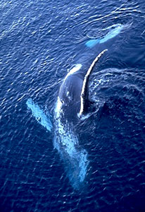

---
aliases:
- Balaenopteridae
- Balenopteredoj
- Balenoptéridos
- barázdásbálna-félék
- brazdasti kiti
- Brazdeni kitovi
- droimeiteach
- Fenvalar
- Finhvaler
- finnhvaler
- finnkvalfamilien
- Furchenwale
- Joslvaļu dzimta
- megenoleem
- Oluklu balinagiller
- plejtvákovití
- płetwalowate
- Raukšlėtieji banginiai
- Rorcual
- Rorqual
- uurteisvalaat
- Vaguvaallased
- Vinvisn
- Vinvissen
- Vinvèsse
- Vinwalvis
- Vráskavcovité (Balaenopteridae)
- Yoʻl-yoʻl kitlar
- Zere
- Zolaqlı balinalar
- Μπαλενοπτερίδες
- браздести китови
- Ивичести китове
- Паскавацікавыя
- полосатиковые
- смугачеві
- לווייתני ענק
- بزرگبالهایان
- هراكلة
- هراكله
- ರಾರ್ಕ್ವಲ್
- วงศ์วาฬแกลบ
- ზოლიანი ვეშაპისებრნი
- ナガスクジラ科
- 须鲸科
- 鬚鯨科
- 수염고래과
title: Balaenopteridae
has_id_wikidata: Q232829
dv_has_:
  name_:
    af: Vinwalvis
    an: Balaenopteridae
    ar: هراكلة
    arz: هراكله
    ast: Balaenopteridae
    avk: megenoleem
    az: Zolaqlı balinalar
    ban: Balaenopteridae
    be_tarask: Паскавацікавыя
    bg: Ивичести китове
    br: Balaenopteridae
    ca: Rorqual
    ceb: Balaenopteridae
    cs: plejtvákovití
    da: Finhvaler
    de: Furchenwale
    el: Μπαλενοπτερίδες
    en: Balaenopteridae
    eo: Balenopteredoj
    es: Balaenopteridae
    et: Vaguvaallased
    eu: Zere
    ext: Balaenopteridae
    fa: بزرگبالهایان
    fi: uurteisvalaat
    fr: Balaenopteridae
    ga: droimeiteach
    gl: Balenoptéridos
    he: לווייתני ענק
    hr: Brazdeni kitovi
    hu: barázdásbálna-félék
    ia: Balaenopteridae
    id: rorqual
    ie: Balaenopteridae
    io: Balaenopteridae
    it: Balaenopteridae
    ja: ナガスクジラ科
    ka: ზოლიანი ვეშაპისებრნი
    kn: ರಾರ್ಕ್ವಲ್
    ko: 수염고래과
    la: Balaenopteridae
    lfn: Rorcual
    li: Vinvèsse
    lt: Raukšlėtieji banginiai
    lv: Joslvaļu dzimta
    mk: браздести китови
    mul: Balaenopteridae
    nan: Balaenopteridae
    nb: finnhvaler
    nl: Vinvissen
    nn: finnkvalfamilien
    oc: Balaenopteridae
    pl: płetwalowate
    pt: Balaenopteridae
    pt_br: Balaenopteridae
    ro: Balaenopteridae
    ru: полосатиковые
    sh: Brazdeni kitovi
    sk: Vráskavcovité (Balaenopteridae)
    sl: brazdasti kiti
    sq: Balaenopteridae
    sv: Fenvalar
    th: วงศ์วาฬแกลบ
    tl: Balaenopteridae
    tr: Oluklu balinagiller
    uk: смугачеві
    uz: Yoʻl-yoʻl kitlar
    vi: Balaenopteridae
    vls: Vinvisn
    vo: Balaenopteridae
    war: Balaenopteridae
    wuu: 须鲸科
    zh: 鬚鯨科
    zh_cn: 须鲸科
    zh_hans: 须鲸科
    zh_hant: 鬚鯨科
    zh_hk: 鬚鯨科
    zh_sg: 须鲸科
    zh_tw: 鬚鯨科
---

# [[Balaenopteridae]]

## Rorquals 

## #has_/text_of_/abstract 

> Rorquals () are the largest group of baleen whales, comprising the family **Balaenopteridae**, which contains nine extant species in two genera. They include the largest known animal that has ever lived, the blue whale, which can reach 180 tonnes (200 short tons), and the fin whale, which reaches 120 tonnes (130 short tons); even the smallest of the group, the northern minke whale, reaches 9 tonnes (10 short tons).
>
> Rorquals take their name from French rorqual, which derives from the Norwegian word røyrkval: the first element røyr originated from the Old Norse name for this type of whale, reyðr, probably related to the Norse word for "red", and the second from the Norse word hvalr meaning "whale" in general. The family name Balaenopteridae is from the type genus, Balaenoptera.
>
> [Wikipedia](https://en.wikipedia.org/wiki/Rorqual) 

## Phylogeny 

-   « Ancestral Groups  
    -   [Mysticeti](../Mysticeti.md)
    -   [Whale](../../Whale.md)
    -  [Eutheria](../../../Eutheria.md) 
    -  [Mammal](../../../../Mammal.md) 
    -   [Therapsida](../../../../../Therapsida.md)
    -   [Synapsida](../../../../../../Synapsida.md)
    -   [Amniota](../../../../../../../Amniota.md)
    -   [Terrestrial Vertebrates](../../../../../../../../Terrestrial.md)
    -   [Sarcopterygii](../../../../../../../../../Sarc.md)
    -   [Gnathostomata](../../../../../../../../../../Gnath.md)
    -   [Vertebrata](../../../../../../../../../../../Vertebrata.md)
    -   [Craniata](../../../../../../../../../../../../Craniata.md)
    -   [Chordata](../../../../../../../../../../../../../Chordata.md)
    -   [Deuterostomia](../../../../../../../../../../../../../../Deutero.md)
    -  [Bilateria](../../../../../../../../../../../../../../../Bilateria.md) 
    -  [Animals](../../../../../../../../../../../../../../../../Animals.md) 
    -  [Eukarya](../../../../../../../../../../../../../../../../../Eukarya.md) 
    -   [Tree of Life](../../../../../../../../../../../../../../../../../Tree_of_Life.md)

-   ◊ Sibling Groups of  Mysticeti
    -   Balaenopteridae
    -   [Balaenidae](Balaenidae.md)

-   » Sub-Groups 
	-   *Notiocetus* †
	-   *Palaeocetus* †
	-   *Balaenoptera musculus* [(blue whale)]
	-   *Balaenoptera physalus* [(fin whale)]
	-   *Balaenoptera borealis* [(sei whale)]
	-   *Balaenoptera edeni* [(Bryde\'s whale)]
	-   *Balaenoptera acutorostrata* [(minke whale)]
	-   *Plesiocetus* †
	-   *Idiocetus* †
	-   *Megaptera novaeangliae* [(humpback whale)]
	-   *Megapteropsis* †
	-   *Burtinopsis* †

### Information on the Internet

-   [The Virtual Whale     Project](http://www.cs.sfu.ca/research/projects/Whales/). 3D
    Animation and sound environment for the visualization of the feeding
    behaviours of Pacific Humpback Whales.
-   [Humpback Whales: Biology and Natural     History](http://earthtrust.org/wlcurric/whales.html). Hawaii\'s
    Marine Wildlife. Earthtrust, Kailua, Hawaii.

## Title Illustrations

------------------------------------------------------------------------------
scientific_name ::     Megaptera novaeangliae
location ::           Gerlache Strait (Antarctica)
Comments             Humpback whale (Balaenopteridae)
Creator              Photograph by Gerald and Buff Corsi
specimen_condition ::  Live Specimen
Source Collection    [CalPhotos](http://calphotos.berkeley.edu/)
copyright ::            © 2001 [California Academy of Sciences](http://www.calacademy.org/) 
------------------------------------------------------------------------------

## Confidential Links & Embeds: 

### #is_/same_as :: [[/_Standards/bio/bio~Domain/Eukarya/Animal/Bilateria/Deutero/Chordata/Craniata/Vertebrata/Gnath/Sarc/Tetrapods/Amniota/Synapsida/Therapsida/Mammal/Eutheria/Whale/Mysticeti/Balaenopteridae|Balaenopteridae]] 

### #is_/same_as :: [[/_public/bio/bio~Domain/Eukarya/Animal/Bilateria/Deutero/Chordata/Craniata/Vertebrata/Gnath/Sarc/Tetrapods/Amniota/Synapsida/Therapsida/Mammal/Eutheria/Whale/Mysticeti/Balaenopteridae.public|Balaenopteridae.public]] 

### #is_/same_as :: [[/_internal/bio/bio~Domain/Eukarya/Animal/Bilateria/Deutero/Chordata/Craniata/Vertebrata/Gnath/Sarc/Tetrapods/Amniota/Synapsida/Therapsida/Mammal/Eutheria/Whale/Mysticeti/Balaenopteridae.internal|Balaenopteridae.internal]] 

### #is_/same_as :: [[/_protect/bio/bio~Domain/Eukarya/Animal/Bilateria/Deutero/Chordata/Craniata/Vertebrata/Gnath/Sarc/Tetrapods/Amniota/Synapsida/Therapsida/Mammal/Eutheria/Whale/Mysticeti/Balaenopteridae.protect|Balaenopteridae.protect]] 

### #is_/same_as :: [[/_private/bio/bio~Domain/Eukarya/Animal/Bilateria/Deutero/Chordata/Craniata/Vertebrata/Gnath/Sarc/Tetrapods/Amniota/Synapsida/Therapsida/Mammal/Eutheria/Whale/Mysticeti/Balaenopteridae.private|Balaenopteridae.private]] 

### #is_/same_as :: [[/_personal/bio/bio~Domain/Eukarya/Animal/Bilateria/Deutero/Chordata/Craniata/Vertebrata/Gnath/Sarc/Tetrapods/Amniota/Synapsida/Therapsida/Mammal/Eutheria/Whale/Mysticeti/Balaenopteridae.personal|Balaenopteridae.personal]] 

### #is_/same_as :: [[/_secret/bio/bio~Domain/Eukarya/Animal/Bilateria/Deutero/Chordata/Craniata/Vertebrata/Gnath/Sarc/Tetrapods/Amniota/Synapsida/Therapsida/Mammal/Eutheria/Whale/Mysticeti/Balaenopteridae.secret|Balaenopteridae.secret]] 

