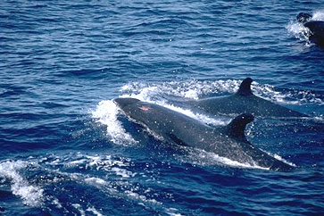

---
aliases:
  - Odontoceti
title: Odontoceti
---

# [[Odontoceti]]

## Toothed whales 

## #has_/text_of_/abstract 

> The toothed whales (also called odontocetes, systematic name **Odontoceti**) are a parvorder of cetaceans that includes dolphins, porpoises, and all other whales with teeth, such as beaked whales and the sperm whales. 73 species of toothed whales are described. They are one of two living groups of cetaceans, the other being the baleen whales (Mysticeti), which have baleen instead of teeth. The two groups are thought to have diverged around 34 million years ago (mya).
>
> Toothed whales range in size from the 1.4 m (4 ft 7 in) and 54 kg (119 lb) vaquita to the 20 m (66 ft) and 100 t (98 long tons; 110 short tons) sperm whale. Several species of odontocetes exhibit sexual dimorphism, in that there are size or other morphological differences between females and males. They have streamlined bodies and two limbs that are modified into flippers. Some can travel at up to 30 knots. Odontocetes have conical teeth designed for catching fish or squid. They have well-developed hearing that is well adapted for both air and water, so much so that some can survive even if they are blind. Some species are well adapted for diving to great depths. Almost all have a layer of fat, or blubber, under the skin to keep warm in the cold water, with the exception of river dolphins.
>
> Toothed whales consist of some of the most widespread mammals, but some, as with the vaquita, are restricted to certain areas. Odontocetes feed largely on fish and squid, but a few, like the orca, feed on mammals, such as pinnipeds. Males typically mate with multiple females every year, making them polygynous. Females mate every two to three years. Calves are typically born in the spring and summer, and females bear the responsibility for raising them, but more sociable species rely on the family group to care for calves. Many species, mainly dolphins, are highly sociable, with some pods reaching over a thousand individuals.
>
> Once hunted for their products, cetaceans are now protected by international law. Some species are very intelligent. At the 2012 meeting of the American Association for the Advancement of Science, support was reiterated for a cetacean bill of rights, listing cetaceans as nonhuman persons. Besides whaling and drive hunting, they also face threats from bycatch and marine pollution. The baiji, for example, is considered functionally extinct by IUCN, with the last sighting in 2004, due to heavy pollution to the Yangtze River. Whales sometimes feature in literature and film, as in the great white sperm whale of Herman Melville's Moby-Dick. Small odontocetes, mainly dolphins, are kept in captivity and trained to perform tricks. Whale watching has become a form of tourism around the world.
>
> [Wikipedia](https://en.wikipedia.org/wiki/Toothed%20whale) 

### Information on the Internet

-   [The Firecracker     Whale](http://www.mosquitonet.com/%7Egcn/kogia5.htm). A Compilation
    of Available Information on Kogia breviceps, the Pygmy Sperm Whale.
-   [The Twists in the Narwhal\'s     Horn](http://www.gi.alaska.edu/ScienceForum/ASF8/895.html). Alaska
    Science Forum.
-   [Charlotte, The Vermont     Whale](http://www.uvm.edu/whale/whalehome.html). Website about a
    fossil beluga whale. University of Vermont.
-   [Saint Lawrence Belugas     Program](http://www.medvet.umontreal.ca/pathologie_microbiologie/beluga/anglais/default_ang.asp).
    Université de Montréal.
-   [The Dolphin Institute](http://www.dolphin-institute.com/).
-   [Talamanca Dolphin Foundation](http://www.dolphinlink.org/).
-   [Dolphins: Oracles of the     Sea](http://library.thinkquest.org/17963/). ThinkQuest Library.
-   [Dolphins](http://earthtrust.org/wlcurric/dolphins.html). Hawaii\'s
    Marine Wildlife. Earthtrust, Kailua, Hawaii.
-   [Dolphins Around the     World](http://www.southwest.com.au/%7Ekirbyhs/).
-   [Fundacion Orca Patagonia - Antártida](http://www.fundorca.org.ar/).
    Observation program and study of behavior of orcas in the wild.
-   [OrcaLab](http://www.orcalab.org/). Long-term study of orcas in
    British Columbia, Canada.
-   [Killer Whale Biology](http://www.orca.online.fr/). Eric Poncelet.
-   [Porpoise Science and Conservation](http://www.phocoena.org/).

### Characteristics

[Michel C. Milinkovitch and Olivier Lambert]()

Extant odontocetes catch individual prey: fish, cephalopods (e.g.,
ziphiids and physeterids mainly eat squids in abyssal waters), and small
crustaceans, but also marine mammals (e.g., some killer whale
populations mainly feed on pinnipeds). Their feeding behavior is greatly
helped by their echolocation abilities (cf. below).

### Discussion of Phylogenetic Relationships

#### Physeteroidea (Physeteridae and Kogiidae)

The highly-derived morphology of their skull (related to the development
of the spermaceti organ) leads to important difficulties in the
establishment of the polarity of some characters. Some molecular studies
based on mitochondrial DNA sequences (Milinkovitch *et al.* 1993;
Milinkovitch *et al.* 1994) suggest that Physeteroidea are more closely
related to mysticetes than they are to other odontocetes. However, other
molecular data (*e.g.*, Nikaido *et al.* 1999; Gatesy *et al.* 1999)
support the monophyly of toothed whales (Odontoceti). Recent analyses
(Cassens *et al.* 2000) indicate that there is conflicting signal
between the nuclear DNA and mitochondrial DNA data. Whether this
conflict is due to differential lineage sorting or to misleading signal
from one or several data set(s) remains to be investigated.

Furthermore, the monophyly of toothed whales is supported by derived
morphological character states such as: maxillae covering the
supraorbital region, single blowhole, development of a melon,
development of proximal sacs (Heyning, 1989), most of the lateral side
of the periotic detached from the squamosal except for a small area near
the hiatus epitympanicus (Luo and Gingerich, 1999). A sister-group
relationship between sperm and baleen whale would prompt reappraisal of
morphological transformations in cetaceans (Milinkovitch, 1995).

Note that some morphological analyses have placed the Physeteroidea as
the sister-group to the Ziphiidae in a clade Physeterida characterized
by (among others):

-   The development of a large posterior process of the tympanic
    (Muizon, 1990);
-   An extreme reduction of the tuberculum of the malleus (Muizon,
    1990);
-   An enlarged, subspherical, and fused (to periotic) accessory ossicle
    of the periotic (Fordyce, 1994).

#### The special case of the so-called \"river dolphins\" 

While most of the 83 recognized extant species of cetaceans are
exclusively marine, several species live sporadically or exclusively in
fresh water. Some of them (*e.g.*, beluga, Tucuxi, Irrawaddy dolphin,
finless porpoise) are well characterized phylogenetically, *i.e.*, they
belong to the superfamily Delphinoidea (see, *e.g.*, Heyning, 1989;
LeDuc *et al.*, 1999). On the other hand, the taxonomic relationships of
the so-called \"river dolphins\" have been in a state of confusion for
more than a century. These include three exclusively riverine species:

1.  The blind river-dolphin, or \"susu\" (*Platanista gangetica*) living
    in the Indus, Ganges, and Brahmaputra river systems on the Indian
    sub-continent;
2.  The Yangtze river-dolphin, or \"baiji\" (*Lipotes vexillifer*) which
    lives in the lower and middle reaches of the Yangtze river in China,
    and
3.  The Amazon river-dolphin, or \"boto\" (*Inia geoffrensis*) which is
    largely distributed in northern South America in the Orinoco and
    Amazon River systems, and the upper Rio Madeira drainage.

The fourth species classified as a \"river dolphin\" is the La Plata
dolphin, or \"franciscana\" (*Pontoporia blainvillei*). It is found not
only in estuaries but also in coastal waters of eastern South America
from 19°S (Brazil) to 42°S (Argentina).

All \"river dolphins\" show a peculiar morphology with a characteristic
long and narrow rostrum, a low triangular dorsal fin, broad and visibly
fingered flippers, and a flexible neck. Their eyes have also been
reduced to various degrees (Pilleri 1974; the susu even lacks eye lenses
and is virtually blind) while echolocation abilities seem more refined
than in other cetaceans. In addition, shared skull characters led most
authors to classify them into a monophyletic group, either in the family
Platanistidae or in the superfamily Platanistoidea (sensu lato, Flower
1869; Cozzuol 1985). However, these diagnosing characters could be
ancestral (Rice 1998; Messenger 1994), hence phylogenetically
uninformative, or prone to convergence (because adaptive to living in
turbid waters). While the monophyly of the group was usually not
questioned, many morphological analyses emphasized the substantial
divergence among the four species (e.g., Kasuya 1973; Zhou *et al.*
1979), and this eventually led to the classification of the four genera
in four monotypic families (Pilleri 1980; Zhou 1982).

Morphological idiosyncrasies as well as the separation of the four
species on three subcontinents have created taxonomic disagreement among
morphologists with continuing debate regarding the reality of a river
dolphin clade and the position(s) of "river dolphins" within the
phylogeny of whales. Gray (1863) first challenged the monophyly of
\"river dolphins\" and was followed by other authors who included the
fransiscana within delphinids (Kellogg 1928; Miller 1923). Only
recently, morphologists revisited Gray\'s hypothesis. Heyning (1989)
recognized a clade including the boto, fransiscana, and baiji . On the
other hand, de Muizon (1985;1994), as well as Messenger and McGuire
(1998), defined the **Delphinida** clade, grouping the baiji with the
monophyletic \[boto , fransiscana , Delphinoidea\]. Morphological
characters supporting the Delphinida are:

-   Acquisition of a lateral lamina on palatine, virtual loss of
    posterior region of lateral lamina of pterygoid, excavation of
    postero-dorsal region of involucrum of tympanic (Muizon, 1988);
-   Evolution of a vestibular sac (Heyning, 1989);
-   Loss of anterior bullar facet on periotic (Fordyce, 1994);

Phylogenetic analyses of nucleotide sequences (from mitochondrial and
nuclear genes) confirmed that extant river dolphins are not monophyletic
(Cassens *et al.* 2000; Hamilton *et al.* 2001) and suggest that they
are **relict species** whose adaptation to riverine habitats
incidentally ensured their survival against major environmental changes
in the marine ecosystem or the emergence of Delphinidae (Cassens *et
al.* 2000). This work (Cassens *et al.* 2000) based on nucleotide
sequence analyses (cytochrome b, partial 12S rDNA and partial 16S rDNA)
and others (Nikaido *et al.* 2001) based on the analysis of SINE
retropositions also support the monophyly of **Delphinida**.

The restricted family **Platanistidae** (including the extant Platanista
and several Miocene marine relatives) is placed in recent molecular
studies as the sister-group of Delphinida , Ziphiidae (Cassens *et al.*
2000; Hamilton *et al.* 2001), a result which is not consistent with the
main recent morphological studies, that maintain the superfamily
Platanistoidea (including Platanistidae and two fossil families
Squalodontidae and Squalodelphinidae) as sister-group of the Delphinida
, Eurhinodelphinoidea (Muizon 1991) or as sister-group of all the extant
odontocete families, including the Physeteroidea (Fordyce 1994).

#### Discussion of some problematic extinct groups

Several fossil groups of odontocetes (*e.g.*, Agorophiidae,
Squalodontidae, Eurhinodelphinidae, and Kentriodontidae) are still
taxonomically problematic; it is very likely that some of them form
paraphyletic groups.

-   The poorly known Late Oligocene **Agorophiidae** probably form a
    grade in which all the primitive heterodont odontocetes retaining
    intertemporal dorsal exposition of the parietals (a primitive
    character which places them as a morphological link between
    archaeocetes and Squalodontidae; Rothausen, 1968) have been grouped
    (e.g., *Agorophius*, *Archaeodelphis* and *Xenorophus*; reviewed in
    Fordyce, 1981). A new family Simocetidae was recently proposed for
    the agorophid-like dolphin *Simocetus*, from the Oligocene of the
    Eastern North Pacific, indicating a more important morphological
    diversity among these archaic odontocetes (Fordyce, 2002).
-   The family **Squalodontidae** has long been recognized as very basal
    among odontocetes. This Late Oligocene to Late Miocene taxon is
    characterized by primitive heterodont teeth. However, some derived
    characters of the scapula suggest phylogenetic affinities with
    Platanistidae and Early Miocene Squalodelphinidae (Muizon, 1987;
    Fordyce, 1994). The family **Dalpiazinidae**, including the small
    and nearly homodont early Miocene *Dalpiazina ombonii*, has been
    loosely attached to squalodontids (Muizon, 1991). The monogeneric
    heterodont family **Waipatiidae**, known for now from the Late
    Oligocene of New Zealand is either related to the clade
    (Platanistidae , Squalodelphinidae) (Fordyce, 1994), to the clade
    (Eurhinodelphinidae , Ziphiidae) (Lambert, 2005), or basal to
    crown-Cetacea (Geisler & Sanders, 2003). 
-   **Eurhinodelphinidae** is a family of small- to moderate-size Late
    Oligocene to Miocene long-snouted odontocetes, including, among
    others, the genera *Eurhinodelphis*, *Schizodelphis*,
    *Ziphiodelphis* and *Xiphiacetus*. The only clear synapomorphy for
    the family is the edentulous premaxillae that extent far beyond the
    maxillae, getting the rostrum longer than the mandible. This
    specialized morphology of the feeding apparatus, combined with
    retention of a long neck, might suggest that these dolphins occupied
    a coastal or even estuarine habitat (Lambert, 2005a). Nevertheless,
    several species are known from both sides of the North Atlantic, a
    feature that contrasts with the seemingly endemic distribution of
    other species. Interestingly, members of the family where found in
    fresh water deposits from the Late Oligocene of southern Australia
    (Fordyce, 1983). Among other hypotheses, Eurhinodelphinidae have
    been phylogenetically located as the sister-group to Delphinida
    (Muizon, 1990; Fordyce, 1994). However, several similarities with
    beaked whales (Ziphiidae) (with respect to the morphology of the
    face, palate, and ear bones) suggest closer relationships with the
    latter (Lambert, 2005b). Muizon (1988) positioned the Italian
    Miocene long-beaked dolphin genus *Eoplatanista* (family
    **Eoplatanistidae**) as sister-group of the eurhinodelphinids and
    relationships within the family are investigated in Lambert
    (2005a).\
-   **Kentriodontidae** is a Late Oligocene to Late Miocene paraphyletic
    family whose ecological diversity has previously been underestimated
    (e.g., recently described large members of the family from the east
    coast of North America, Dawson, 1996a, b, long-snouted species from
    Portugal, Lambert et al. 2005), and from which extant delphinoids
    probably evolved. These archaic dolphins with numerous teeth were
    fish-eaters, like extant true dolphins. Similarities of the
    basicranium and sinus fossae with extant taxa indicate that
    kentriodontids already used echolocation for navigation and finding
    preys (Ichishima et al. 1994). The diagnosis of the family lacks
    well-defined synapomorphies, while the definition of the three known
    subfamilies Kentriodontinae (e.g., *Delphinodon*, the relatively
    cosmopolitan *Kentriodon*, *Macrokentriodon*, *Rudicetus*,
    *Tagicetus*), Pithanodelphininae (*Atocetus*, *Pithanodelphis*), and
    Lophocetinae (e.g., *Hadrodelphis*, *Lophocetus*) is somewhat better
    supported (discussion in Muizon, 1988; Ichishima et al. 1994;
    Dawson, 1996a,b; Bianucci, 2001; Lambert et al. 2005).

## Phylogeny 

-   « Ancestral Groups  
    -   [Whale](../Whale.md)
    -  [Eutheria](../../Eutheria.md) 
    -  [Mammal](../../../Mammal.md) 
    -   [Therapsida](../../../../Therapsida.md)
    -   [Synapsida](../../../../../Synapsida.md)
    -   [Amniota](../../../../../../Amniota.md)
    -   [Terrestrial Vertebrates](../../../../../../../Terrestrial.md)
    -   [Sarcopterygii](../../../../../../../../Sarc.md)
    -   [Gnathostomata](../../../../../../../../../Gnath.md)
    -   [Vertebrata](../../../../../../../../../../Vertebrata.md)
    -   [Craniata](../../../../../../../../../../../Craniata.md)
    -   [Chordata](../../../../../../../../../../../../Chordata.md)
    -   [Deuterostomia](../../../../../../../../../../../../../Deutero.md)
    -  [Bilateria](../../../../../../../../../../../../../../Bilateria.md) 
    -  [Animals](../../../../../../../../../../../../../../../Animals.md) 
    -  [Eukarya](../../../../../../../../../../../../../../../../Eukarya.md) 
    -   [Tree of Life](../../../../../../../../../../../../../../../../Tree_of_Life.md)

-   ◊ Sibling Groups of  Cetacea
    -   Odontoceti
    -   [Mysticeti](Mysticeti.md)

-   » Sub-Groups 

## Title Illustrations

------------------------------------------------------------------------------

Scientific Name ::     Pseudorca crassidens
Location ::           Ecuador
Comments             False killer whales (Delphinidae)
Creator              Photograph by Gerald and Buff Corsi
Specimen Condition   Live Specimen
Source Collection    [CalPhotos](http://calphotos.berkeley.edu/)
Copyright ::            © 2001 [California Academy of Sciences](http://www.calacademy.org/) 

## Confidential Links & Embeds: 

### #is_/same_as :: [Odontoceti](/_Standards/bio/bio~Domain/Eukarya/Animal/Bilateria/Deutero/Chordata/Craniata/Vertebrata/Gnath/Sarc/Tetrapods/Amniota/Synapsida/Therapsida/Mammal/Eutheria/Whale/Odontoceti.md) 

### #is_/same_as :: [Odontoceti.public](/_public/bio/bio~Domain/Eukarya/Animal/Bilateria/Deutero/Chordata/Craniata/Vertebrata/Gnath/Sarc/Tetrapods/Amniota/Synapsida/Therapsida/Mammal/Eutheria/Whale/Odontoceti.public.md) 

### #is_/same_as :: [Odontoceti.internal](/_internal/bio/bio~Domain/Eukarya/Animal/Bilateria/Deutero/Chordata/Craniata/Vertebrata/Gnath/Sarc/Tetrapods/Amniota/Synapsida/Therapsida/Mammal/Eutheria/Whale/Odontoceti.internal.md) 

### #is_/same_as :: [Odontoceti.protect](/_protect/bio/bio~Domain/Eukarya/Animal/Bilateria/Deutero/Chordata/Craniata/Vertebrata/Gnath/Sarc/Tetrapods/Amniota/Synapsida/Therapsida/Mammal/Eutheria/Whale/Odontoceti.protect.md) 

### #is_/same_as :: [Odontoceti.private](/_private/bio/bio~Domain/Eukarya/Animal/Bilateria/Deutero/Chordata/Craniata/Vertebrata/Gnath/Sarc/Tetrapods/Amniota/Synapsida/Therapsida/Mammal/Eutheria/Whale/Odontoceti.private.md) 

### #is_/same_as :: [Odontoceti.personal](/_personal/bio/bio~Domain/Eukarya/Animal/Bilateria/Deutero/Chordata/Craniata/Vertebrata/Gnath/Sarc/Tetrapods/Amniota/Synapsida/Therapsida/Mammal/Eutheria/Whale/Odontoceti.personal.md) 

### #is_/same_as :: [Odontoceti.secret](/_secret/bio/bio~Domain/Eukarya/Animal/Bilateria/Deutero/Chordata/Craniata/Vertebrata/Gnath/Sarc/Tetrapods/Amniota/Synapsida/Therapsida/Mammal/Eutheria/Whale/Odontoceti.secret.md)

