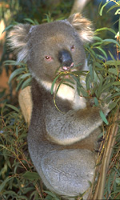
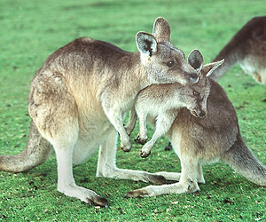
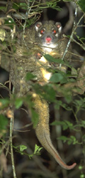

---
aliases:
  - Marsupialia
  - Marsupial
  - Marsupials
  - Beuteltier
  - marsupiali
  - torbacze
  - Beuteltiere
  - الجرابيَّات
  - vrečarji
  - 有袋上目
has_id_wikidata: Q25336
title: Marsupialia
described_by_source:
  - '[[../../../../../../../../../../../../../../../../WikiData/WD~Brockhaus_and_Efron_Encyclopedic_Dictionary,602358]]'
  - '[[_Standards/WikiData/WD~Encyclopædia_Britannica_11th_edition,867541]]'
  - '[[_Standards/WikiData/WD~Armenian_Soviet_Encyclopedia,2657718]]'
  - '[[_Standards/WikiData/WD~Small_Brockhaus_and_Efron_Encyclopedic_Dictionary,19180675]]'
  - '[[_Standards/WikiData/WD~Meyers_Konversations_Lexikon,_4th_edition_(1885_1890),19219752]]'
parent_taxon: '[[_Standards/WikiData/WD~Metatheria,1096960]]'
taxon_rank: '[[_Standards/WikiData/WD~infraclass,2007442]]'
start_time: -66000000-01-01T00:00:00Z
properties_for_this_type: time in the pouch
instance_of: '[[_Standards/WikiData/WD~taxon,16521]]'
OmegaWiki_Defined_Meaning: 2281
ITIS_TSN: 179918
taxon_common_name:
  - marsupiali
  - torbacze
  - Beuteltiere
  - الجرابيَّات
  - vrečarji
  - 有袋上目
image: http://commons.wikimedia.org/wiki/Special:FilePath/Kangaroo%20and%20joey03.jpg
Biology_Online_Biology_Dictionary_entry: marsupial
GS1_GPC_code: 10005467
pronunciation_audio: http://commons.wikimedia.org/wiki/Special:FilePath/LL-Q9288%20%28heb%29-Buffer-%D7%97%D7%99%D7%95%D7%AA%20%D7%9B%D7%99%D7%A1.wav
taxon_range_map_image: http://commons.wikimedia.org/wiki/Special:FilePath/Marsupial%20world%20distribution%20map.svg
montage_image: http://commons.wikimedia.org/wiki/Special:FilePath/Marsupialia%20collage.png
MeSH_tree_code: B01.050.150.900.649.573
Krugosvet_article_archived_: biologiya/sumchatye
UMLS_CUI: C0024852
Commons_category: Marsupialia
taxon_name: Marsupialia
---

# [[Marsupialia]] 

Metatheria, Kangaroos, koalas, gliders, wombats, opossums, bandicoots, bilbies, etc. 

  
 

#is_/same_as :: [[../../../../../../../../../../../../../../../../WikiData/WD~Marsupial,25336|WD~Marsupial,25336]]

## #has_/text_of_/abstract 

> Marsupials are a diverse group of mammals belonging to the infraclass **Marsupialia**. 
> They are natively found in Australasia, Wallacea, and the Americas. 
> 
> One of marsupials' unique features is their reproductive strategy: 
> the young are born in a relatively undeveloped state 
> and then nurtured within a pouch on their mother's abdomen.
>
> Extant marsupials encompass many species, including kangaroos, koalas, opossums, possums, Tasmanian devils, wombats, wallabies, and bandicoots.
>
> Marsupials constitute a clade stemming from the last common ancestor of extant Metatheria, which encompasses all mammals more closely related to marsupials than to placentals. The evolutionary split between placentals and marsupials occurred 125-160 million years ago, in the Middle Jurassic-Early Cretaceous period.
>
> Presently, close to 70% of the 334 extant marsupial species  are concentrated on the Australian continent, including mainland Australia, Tasmania, New Guinea, and nearby islands. The remaining 30% are distributed across the Americas, primarily in South America, with thirteen species in Central America and a single species, the Virginia opossum, inhabiting North America north of Mexico.
>
> Marsupial sizes range from a few grams in the long-tailed planigale, to several tonnes in the extinct Diprotodon.
>
> The word marsupial comes from marsupium, the technical term for the abdominal pouch. It, in turn, is borrowed from the Latin marsupium and ultimately from the ancient Greek μάρσιππος mársippos, meaning "pouch".
>
> [Wikipedia](https://en.wikipedia.org/wiki/Marsupial) 

### Information on the Internet

-   [Mammals of     Tasmania.](http://www.parks.tas.gov.au/wildlife/mammals/Tasmlist.html)
    Parks and Wildlife Service, Tasmania.
-   [Metatheria](http://animaldiversity.ummz.umich.edu/chordata/mammalia/metatheria.html).
    Animal Diversity Web, University of Michigan Museum of Zoology.
-   [Marsupial     Mammals](http://www.ucmp.berkeley.edu/mammal/marsupial/marsupial.html).
    UCMP Berkeley.
-   [Cooperative Research Centre for the Conservation and Management of     Marsupials](http://www.newcastle.edu.au/marsupialcrc/).
-   [Mammal Research     Projects](http://www.jcu.edu.au/school/tbiol/zoology/auxillry/mammals/mamres.html).
    Department of Zoology and Tropical Ecology, James Cook University,
    North Queensland, Australia
-   [The Marsupial     Ring](http://www.geocities.com/CapeCanaveral/Launchpad/9191/marsupial_ring.htm).
    A collection of personal web sites about marsupial mammals.†
-   [The Thylacine Museum](http://www.naturalworlds.org/thylacine/).
-   [The Australian Koala Foundation](http://www.akfkoala.gil.com.au/).
-   [Glider Central](http://sugarglider.net/).
-   [Glider Information     Network](http://www.geocities.com/RainForest/Canopy/8233/gin.html).
-   [The Leadbeater\'s Possum     Page](http://incres.anu.edu.au/possum/possum.html).
-   Information about Deltatheridium, a Cretaceous marsupial from
    Mongolia:
    -   [The making of the         marsupials](http://news.bbc.co.uk/hi/english/sci/tech/newsid_226000/226722.stm)
        . BBC News.
    -   [They came from Ukhaa         Tolgod](http://www.nature.com/nsu/981210/981210-4.html). Nature
        Science Update.

## Phylogeny 

-   « Ancestral Groups  
    -  [Mammal](../Mammal.md) 
    -   [Therapsida](../../Therapsida.md)
    -   [Synapsida](../../../Synapsida.md)
    -   [Amniota](../../../../Amniota.md)
    -   [Terrestrial Vertebrates](../../../../../Terrestrial.md)
    -   [Sarcopterygii](../../../../../../Sarc.md)
    -   [Gnathostomata](../../../../../../../Gnath.md)
    -   [Vertebrata](../../../../../../../../Vertebrata.md)
    -   [Craniata](../../../../../../../../../Craniata.md)
    -   [Chordata](../../../../../../../../../../Chordata.md)
    -   [Deuterostomia](../../../../../../../../../../../Deutero.md)
    -  [Bilateria](../../../../../../../../../../../../Bilateria.md) 
    -  [Animals](../../../../../../../../../../../../../Animals.md) 
    -  [Eukarya](../../../../../../../../../../../../../../Eukarya.md) 
    -   [Tree of Life](../../../../../../../../../../../../../../Tree_of_Life.md)

-   ◊ Sibling Groups of  Mammalia
    -   [Monotremata](Monotremata.md)
    -   Marsupialia
    -   [Eutheria](Eutheria.md)

-   » Sub-Groups 
	-   *Didelphimorphia* [(American opossums)]
	-   *Paucituberculata* [(\"shrew\" opossums)]
	-   *Microbiotheria* [(monito del monte & extinct
	    relatives)]
	-   *Dasyuromorphia* [(Australasian carnivorous
	    marsupials)]
	-   *Peramelemorphia* [(bandicoots and bilbies)]
	-   *Notoryctemorphia* [(marsupial \"moles\")]
	-   *Diprotodontia* [(kangaroos, wallabies, possums, koalas, gliders,
	    wombats, etc.)]

## Title Illustrations

From left to right:

-   **Koala** (Phascolarctos cinereus, Diprotodontia) feeding on
Eucalyptus leaves in wildlife park, Tasmania, Australia.
-   **Eastern Grey Kangaroo** (Macropus giganteus, Diprotodontia) mother
and nearly grown joey. Tasmania.
-   **Green Ringtail Possum** (Pseudochirops archeri, Diprotodontia), a
nocturnal marsupial endemic to North Queensland rain forests of
Australia, photographed at night in Atherton Tableland, Queensland
at an elevation of 300-1000 meters.

Photographs copyright © 1995 [Greg and Mary Beth Dimijian](http://www.dimijianimages.com/).
 
)
 

## Confidential Links & Embeds: 

### #is_/same_as :: [[/_Standards/bio/bio~Domain/Eukarya/Animal/Bilateria/Deutero/Chordata/Craniata/Vertebrata/Gnath/Sarc/Tetrapods/Amniota/Synapsida/Therapsida/Mammal/Marsupialia|Marsupialia]] 

### #is_/same_as :: [[/_public/bio/bio~Domain/Eukarya/Animal/Bilateria/Deutero/Chordata/Craniata/Vertebrata/Gnath/Sarc/Tetrapods/Amniota/Synapsida/Therapsida/Mammal/Marsupialia.public|Marsupialia.public]] 

### #is_/same_as :: [[/_internal/bio/bio~Domain/Eukarya/Animal/Bilateria/Deutero/Chordata/Craniata/Vertebrata/Gnath/Sarc/Tetrapods/Amniota/Synapsida/Therapsida/Mammal/Marsupialia.internal|Marsupialia.internal]] 

### #is_/same_as :: [[/_protect/bio/bio~Domain/Eukarya/Animal/Bilateria/Deutero/Chordata/Craniata/Vertebrata/Gnath/Sarc/Tetrapods/Amniota/Synapsida/Therapsida/Mammal/Marsupialia.protect|Marsupialia.protect]] 

### #is_/same_as :: [[/_private/bio/bio~Domain/Eukarya/Animal/Bilateria/Deutero/Chordata/Craniata/Vertebrata/Gnath/Sarc/Tetrapods/Amniota/Synapsida/Therapsida/Mammal/Marsupialia.private|Marsupialia.private]] 

### #is_/same_as :: [[/_personal/bio/bio~Domain/Eukarya/Animal/Bilateria/Deutero/Chordata/Craniata/Vertebrata/Gnath/Sarc/Tetrapods/Amniota/Synapsida/Therapsida/Mammal/Marsupialia.personal|Marsupialia.personal]] 

### #is_/same_as :: [[/_secret/bio/bio~Domain/Eukarya/Animal/Bilateria/Deutero/Chordata/Craniata/Vertebrata/Gnath/Sarc/Tetrapods/Amniota/Synapsida/Therapsida/Mammal/Marsupialia.secret|Marsupialia.secret]] 

