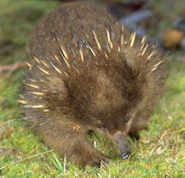
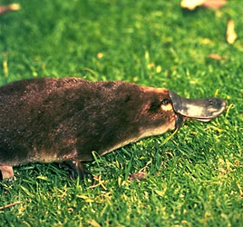

# [[Monotremata]]

## Platypus and echidnas 

) ) 

#is_/same_as :: [[../../../../../../../../../../../../../../../../WikiData/WD~Monotreme,21790|WD~Monotreme,21790]] 

## #has_/text_of_/abstract 

> Monotremes are mammals of the order **Monotremata**. 
> They are the only group of living mammals that lay eggs, rather than bearing live young. 
> The extant monotreme species are the platypus and the four species of echidnas. 
> 
> Monotremes are typified by structural differences in their 
> brains, jaws, digestive tract, reproductive tract, and other body parts, compared to the more common mammalian types. 
> Although they are different from other living mammals in that they lay eggs, 
> female monotremes are like other mammals in that they nurse their young with milk.
>
> Monotremes have been considered by some authors to be members of Australosphenida, a clade that contains extinct mammals from the Jurassic and Cretaceous of Madagascar, South America, and Australia, but this categorization is disputed and their taxonomy is under debate.
>
> All extant species of monotremes are indigenous to Australia and New Guinea, although they were also present during the Late Cretaceous and Paleocene epochs in southern South America, implying that they were also present in Antarctica, though remains have not yet been found there.
>
> The name monotreme derives from the Greek words μονός (monós 'single') and τρῆμα (trêma 'hole'), referring to the cloaca.
>
> [Wikipedia](https://en.wikipedia.org/wiki/Monotreme) 

### Information on the Internet

-   [Order     Monotremata](http://animaldiversity.ummz.umich.edu/chordata/mammalia/monotremata.html).
    Animal Diversity Web. University of Michigan Museum of Zoology.
-   [Systematics of the     Monotremata.](http://www.ucmp.berkeley.edu/mammal/monotremesy.html)
    UCMP Berkeley.

## Phylogeny 

-   « Ancestral Groups  
    -  [Mammal](../Mammal.md))
    -   [Therapsida](../../Therapsida.md)
    -   [Synapsida](../../../Synapsida.md)
    -   [Amniota](../../../../Amniota.md)
    -   [Terrestrial Vertebrates](../../../../../Terrestrial.md)
    -   [Sarcopterygii](../../../../../../Sarc.md)
    -   [Gnathostomata](../../../../../../../Gnath.md)
    -   [Vertebrata](../../../../../../../../Vertebrata.md)
    -   [Craniata](../../../../../../../../../Craniata.md)
    -   [Chordata](../../../../../../../../../../Chordata.md)
    -   [Deuterostomia](../../../../../../../../../../../Deutero.md)
    -  [Bilateria](../../../../../../../../../../../../Bilateria.md))
    -  [Animals](../../../../../../../../../../../../../Animals.md))
    -  [Eukarya](../../../../../../../../../../../../../../Eukarya.md))
    -   [Tree of Life](../../../../../../../../../../../../../../Tree_of_Life.md)

-   ◊ Sibling Groups of  Mammalia
    -   Monotremata
    -   [Marsupialia](Marsupialia.md)
    -   [Eutheria](Eutheria.md)

-   » Sub-Groups 
	-   *Tachyglossidae* [(echidnas)]
	    -   *Tachyglossus aculeatus* [(short-beaked echidna)]
	    -   *Zaglossus bruijni* [(long-beaked echidna)]
	-   *Ornithorhynchidae*
	    -   *Ornithorhynchus anatinus* [(platypus)]

## Title Illustrations

------------------------------------------------------------------------------)
Scientific Name ::  Tachyglossus aculeatus
Location ::        Cradle Mountain National Park, Tasmania
Comments          Short-beaked echidna
Copyright ::         © 1995 [Greg and Marybeth Dimijian](http://www.dimijianimages.com/) 

------------------------------------------------------------------------------)
Scientific Name ::     Ornithorhynchus anatinus
Comments             Duck-billed platypus
Creator              Lloyd Glenn Ingles
Specimen Condition   Live Specimen
Source Collection    [CalPhotos](http://calphotos.berkeley.edu/)
Copyright ::            © 2001 [California Academy of Sciences](http://www.calacademy.org/) 

## Confidential Links & Embeds: 

### #is_/same_as :: [Monotremata](/_Standards/bio/bio~Domain/Eukarya/Animal/Bilateria/Deutero/Chordata/Craniata/Vertebrata/Gnath/Sarc/Tetrapods/Amniota/Synapsida/Therapsida/Mammal/Monotremata.md) 

### #is_/same_as :: [Monotremata.public](/_public/bio/bio~Domain/Eukarya/Animal/Bilateria/Deutero/Chordata/Craniata/Vertebrata/Gnath/Sarc/Tetrapods/Amniota/Synapsida/Therapsida/Mammal/Monotremata.public.md) 

### #is_/same_as :: [Monotremata.internal](/_internal/bio/bio~Domain/Eukarya/Animal/Bilateria/Deutero/Chordata/Craniata/Vertebrata/Gnath/Sarc/Tetrapods/Amniota/Synapsida/Therapsida/Mammal/Monotremata.internal.md) 

### #is_/same_as :: [Monotremata.protect](/_protect/bio/bio~Domain/Eukarya/Animal/Bilateria/Deutero/Chordata/Craniata/Vertebrata/Gnath/Sarc/Tetrapods/Amniota/Synapsida/Therapsida/Mammal/Monotremata.protect.md) 

### #is_/same_as :: [Monotremata.private](/_private/bio/bio~Domain/Eukarya/Animal/Bilateria/Deutero/Chordata/Craniata/Vertebrata/Gnath/Sarc/Tetrapods/Amniota/Synapsida/Therapsida/Mammal/Monotremata.private.md) 

### #is_/same_as :: [Monotremata.personal](/_personal/bio/bio~Domain/Eukarya/Animal/Bilateria/Deutero/Chordata/Craniata/Vertebrata/Gnath/Sarc/Tetrapods/Amniota/Synapsida/Therapsida/Mammal/Monotremata.personal.md) 

### #is_/same_as :: [Monotremata.secret](/_secret/bio/bio~Domain/Eukarya/Animal/Bilateria/Deutero/Chordata/Craniata/Vertebrata/Gnath/Sarc/Tetrapods/Amniota/Synapsida/Therapsida/Mammal/Monotremata.secret.md)

