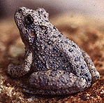

---
aliases:
- abinieki
- akesi pi nasin tu
- Allpa yaku kawsaq
- amfaibiach
- Amffibiad
- Amfibet
- amfibi
- Amfibia
- Amfibian
- Amfibie
- amfibien
- Amfibieni
- amfibier
- Amfibieë
- Amfibieën
- Amfibijad
- amfibiler
- Amfibio
- Amfibioj
- Amfibis
- amfibium
- amfibiya
- Amfibyen
- Amfiibie
- Amphibia
- Amphibian
- Amphibians
- Amphibie
- Amphibien
- Amphibiens
- amphibio
- Ampibi
- ampibia
- Ampibyan
- Anfibbiu
- Anfibe
- Anfibi
- anfibio
- Anfibios
- Anfibiu
- anfíbios
- banfi
- Batracyin
- Bejavî
- Beribiyood
- Biyáázh Tsʼǫʼasánígíí
- Daa-veaghagh
- Dagal-hareeyyii
- Divelfenneg
- Diwelvennek
- dvoživke
- Dzehugaro huviri
- Dà-bheathach
- Ensolo Lubbira
- froskdýr
- Groddjur
- Isele
- Jer-suw haywanları
- Kahepaiksed
- Kpataayala
- Kétéltűek
- Lióng-chhe-lūi
- Lurchen
- Lãnɔgodzikpletɔmewo
- lớp lưỡng cư or động vật lưỡng cư
- Mananap nga baki
- Monumanu nofo ʻuta mo vai
- obojživelníci
- Obojživelníky
- padde
- płazy
- Sammakkoeläimet
- Suda-quruda yaşayanlar
- Suvda va quruqlikda yashovchilar
- Timankalin
- Touk
- varliagyviai
- Varlēgīvē
- Vodozemac
- Vodozemci
- Ypegua
- Çĕрти-шыврисем
- động vật lưỡng cư
- İki yaşamlılar
- Αμφίβια
- аmphibia
- Амфибиэхэр
- Амфибия
- Амфибиялар
- амфибияос
- Амфибиясь
- Водоземци
- Газар уһанай амитад
- Донзæххонтæ
- Ер-һыу хайуандары
- Земнаводныя
- Земноводні
- Земноводни
- Земноводны
- Земноводные
- Обхокиҳо
- Сүүлтэй хоёр нутагтан
- җир-су хайваннары
- Қосмекенділер
- Երկկենցաղներ
- אמפיביע
- דו חיים
- דו-חיים
- البَرْمائِيَّات
- القَوَازِبُ
- امفيبيا
- برمائيات
- جل تھلیل
- جل تھلیہٕ
- جل تھلیے
- دوزیستان
- دوه ژوندوي
- سۇدا-قۇرودا یاشایانلار
- وشکاوی
- ٻٽي زندگي گذاريندڙ
- ߡߟߎ߬ߞߎ߬ߕߏߘߌ
- उभयचर
- उभयचर प्राणी
- एम्पिबियन
- मेघा
- উভচর প্রাণী
- উভচৰ প্ৰাণী
- ਜਲਥਲੀ
- நீர்நில வாழ்வன
- ఉభయచరము
- ಉಭಯಚರಗಳು
- ഉഭയജീവി
- උභය ජීවීන්
- สัตว์ครึ่งบกครึ่งน้ำ
- สัตว์สะเทินน้ำสะเทินบก
- སྐམ་ཆུ་གཉིས་འཚོའི་སྲོག་ཆགས།
- ကုန်းနေရေနေ သတ္တဝါ
- တူဝ်ယူႇၼိူဝ်လိၼ်
- ამფიბიები
- አምፊናል
- ᎢᏧᎳ ᎦᏙ ᎠᎹ ᏱᏃ ᎡᎯ
- ⵜⵉⵎⵙⴽⵍⵎⴰⵏⵉⵏ
- 両生綱
- 両生類
- 两栖动物
- 兩棲動物
- 兩棲綱
- 양서강
- 양서류
has_id_wikidata: Q10908
Archive_of_Our_Own_tag:
- amphibian
- Amphibians
code_of_nomenclature: '[[_Standards/WikiData/WD~International_Code_of_Zoological_Nomenclature,13011]]'
Commons_category: Amphibia
described_by_source:
- '[[../../../../../../../../../../../../WikiData/WD~Brockhaus_and_Efron_Encyclopedic_Dictionary,602358]]'
- '[[_Standards/WikiData/WD~Encyclopædia_Britannica_11th_edition,867541]]'
- '[[_Standards/WikiData/WD~Encyclopedic_Lexicon,4532135]]'
- "[[_Standards/WikiData/WD~The_New_Student's_Reference_Work,16082057]]"
- '[[_Standards/WikiData/WD~Small_Brockhaus_and_Efron_Encyclopedic_Dictionary,19180675]]'
- '[[_Standards/WikiData/WD~Meyers_Konversations-Lexikon,_4th_edition_(1885–1890),19219752]]'
- '[[_Standards/WikiData/WD~Great_Soviet_Encyclopedia_(1926–1947),20078554]]'
- '[[_Standards/WikiData/WD~The_Domestic_Encyclopædia;_Or,_A_Dictionary_Of_Facts,_And_Useful_Knowledge,56441911]]'
EPPO_Code: 1AMPHC
GS1_GPC_code: 10005458
has_use: '[[_Standards/WikiData/WD~biological_pest_control,116890]]'
Iconclass_notation: 25F5
image: http://commons.wikimedia.org/wiki/Special:FilePath/Amphibia.png
instance_of:
- '[[_Standards/WikiData/WD~taxon,16521]]'
ITIS_TSN: 173420
Krugosvet_article: nauka_i_tehnika/biologiya/ZEMNOVODNIE.html
main_food_source:
- '[[_Standards/WikiData/WD~Gastropoda,4867740]]'
- '[[_Standards/WikiData/WD~worm,47253]]'
MeSH_tree_code: B01.050.150.900.090
montage_image: http://commons.wikimedia.org/wiki/Special:FilePath/Examples%20of%20Amphibia.png
OmegaWiki_Defined_Meaning: 162
parent_taxon: '[[_Standards/WikiData/WD~Batrachomorpha,2521462]]'
Provenio_UUID:
- 2c8b2bd3-c61d-4e11-90a1-65ca8c618173
start_time: -370000000-01-01
studied_in:
- '[[_Standards/WikiData/WD~herpetology,174416]]'
- '[[_Standards/WikiData/WD~batrachology,4869597]]'
subreddit:
- Amphibians
taxon_common_name:
- dvoživke
- البَرْمائِيَّات
- القَوَازِبُ
- Земнаводныя
- Земноводни
- Divelfenneg
- Amfibis
- obojživelníci
- Amphibien
- Αμφίβια
- Amphibians
- Anfibios
- Sammakkoeläimet
- Amphibiens
- Amfiibie
- anfíbios
- דו חיים
- Kétéltűek
- Երկկենցաղներ
- Anfibi
- 両生綱
- 양서강
- Водоземци
- amfibier
- Amfibieën
- płazy
- Anfíbios
- Amfibieni
- Земноводные
- Obojživelníky
- Groddjur
- สัตว์ครึ่งบกครึ่งน้ำ
- สัตว์สะเทินน้ำสะเทินบก
- İki yaşamlılar
- Земноводні
- lớp lưỡng cư or động vật lưỡng cư
- 兩棲綱
taxon_name: Amphibia
taxon_rank: '[[_Standards/WikiData/WD~class,37517]]'
this_taxon_is_source_of: '[[_Standards/WikiData/WD~amphibian_as_food,124813117]]'
title: Living Amphibians
topic_s_main_category: '[[_Standards/WikiData/WD~Q8878457,8878457]]'
topic_s_main_template: '[[_Standards/WikiData/WD~Template_Amphibians,6677674]]'
topic_s_main_Wikimedia_portal: '[[_Standards/WikiData/WD~Portal_Amphibians,21813728]]'
UMLS_CUI: C0002668
dv_has_:
  name_:
    af: Amfibie
    am: አምፊናል
    an: Amphibia
    ar: برمائيات
    ary: برمائيات
    arz: برمائيات
    as: উভচৰ প্ৰাণী
    ast: Amphibia
    awa: मेघा
    az: Suda-quruda yaşayanlar
    azb: سۇدا-قۇرودا یاشایانلار
    ba: Ер-һыу хайуандары
    ban: Amphibia
    be: земнаводныя
    be_tarask: земнаводныя
    bg: земноводни
    bn: উভচর প্রাণী
    bo: སྐམ་ཆུ་གཉིས་འཚོའི་སྲོག་ཆགས།
    br: Divelfenneg
    bs: Vodozemci
    btm: Touk
    bxr: Газар уһанай амитад
    ca: amfibi
    ceb: Mananap nga baki
    chr: ᎢᏧᎳ ᎦᏙ ᎠᎹ ᏱᏃ ᎡᎯ
    ckb: وشکاوی
    crh: amfibiya
    cs: obojživelníci
    cv: Çĕрти-шыврисем
    cy: Amffibiad
    da: padde
    de: Amphibien
    ee: Lãnɔgodzikpletɔmewo
    el: αμφίβια
    en: Amphibia
    en_ca: Amphibian
    en_gb: amphibian
    eo: Amfibioj
    es: Amphibia
    et: Kahepaiksed
    eu: anfibio
    ext: Anfibiu
    fa: دوزیستان
    fi: sammakkoeläimet
    fr: amphibien
    frp: amfibien
    frr: Amfiibie
    fy: Amfibyen
    ga: amfaibiach
    gcr: Amphibia
    gd: Dà-bheathach
    gl: anfibio
    gn: Ypegua
    gsw: Amphibie
    guc: Anfibio
    gv: Daa-veaghagh
    he: דו-חיים
    hi: उभयचर
    hif: Amphibian
    hr: Vodozemci
    hu: kétéltűek
    hy: երկկենցաղներ
    ia: amphibio
    id: Amfibia
    ie: Amfibie
    ilo: ampibia
    io: Amfibio
    is: froskdýr
    it: Amphibia
    ja: 両生類
    jam: Amfibian
    jbo: banfi
    jv: Amfibi
    ka: ამფიბიები
    kaa: Jer-suw haywanları
    kab: Timankalin
    kbd: Амфибиэхэр
    kbp: Kpataayala
    kk: Қосмекенділер
    kn: ಉಭಯಚರಗಳು
    ko: 양서류
    koi: Amphibia
    ks: جل تھلیہٕ
    ku: Bejavî
    ku_latn: bejavî
    kw: Diwelvennek
    ky: Амфибиялар
    la: аmphibia
    lb: Lurchen
    lfn: Amfibio
    lg: Ensolo Lubbira
    li: Amfibieë
    lij: Amphibia
    lld: Anfibe
    lt: varliagyviai
    lv: abinieki
    mad: Amfibi
    mdf: Амфибиясь
    mg: Amphibia
    min: Amfibia
    mk: Водоземци
    ml: ഉഭയജീവി
    mn: Сүүлтэй хоёр нутагтан
    mr: उभयचर प्राणी
    ms: Amfibia
    ms_arab: امفيبيا
    mt: Amphibia
    mul: Amphibia
    my: ကုန်းနေရေနေ သတ္တဝါ
    nan: Lióng-chhe-lūi
    nap: Amphibia
    nb: amfibier
    nds: Amphibien
    nds_nl: amfibieën
    ne: उभयचर
    new: एम्पिबियन
    nl: amfibieën
    nn: amfibium
    nqo: ߡߟߎ߬ߞߎ߬ߕߏߘߌ
    nv: Biyáázh Tsʼǫʼasánígíí
    oc: Amphibia
    om: Dagal-hareeyyii
    os: Донзæххонтæ
    pa: ਜਲਥਲੀ
    pam: Amphibian
    pl: płazy
    pms: Anfibi
    pnb: جل تھلیے
    ps: دوه ژوندوي
    pt: Anfíbios
    pt_br: Anfíbios
    qu: Allpa yaku kawsaq
    rm: Amfibis
    ro: Amfibieni
    ru: земноводные
    rue: Земноводны
    rup: Amphibia
    sah: Амфибия
    scn: Anfibbiu
    sco: amphibian
    sd: ٻٽي زندگي گذاريندڙ
    sgs: Varlēgīvē
    sh: Vodozemac
    shn: တူဝ်ယူႇၼိူဝ်လိၼ်
    si: උභය ජීවීන්
    sk: obojživelníky
    sl: dvoživke
    sn: Dzehugaro huviri
    so: Beribiyood
    sq: Amfibet
    sr: водоземци
    stq: Amphibien
    su: Ampibi
    sv: groddjur
    sw: Amfibia
    ta: நீர்நில வாழ்வன
    te: ఉభయచరము
    tg: Обхокиҳо
    th: สัตว์สะเทินน้ำสะเทินบก
    tl: Amphibia
    to: Monumanu nofo ʻuta mo vai
    tok: akesi pi nasin tu
    tr: amfibiler
    tt: җир-су хайваннары
    udm: амфибияос
    uk: земноводні
    ur: جل تھلیل
    uz: Suvda va quruqlikda yashovchilar
    vep: Amfibijad
    vi: động vật lưỡng cư
    vls: Amfibieën
    vo: Amphibia
    wa: Batracyin
    war: Ampibyan
    wuu: 两栖动物
    xh: Isele
    yi: אמפיביע
    yue: 兩棲動物
    zea: Amfibieën
    zgh: ⵜⵉⵎⵙⴽⵍⵎⴰⵏⵉⵏ
    zh: 两栖动物
    zh_cn: 两栖动物
    zh_hans: 两栖动物
    zh_hant: 兩棲動物
    zh_hk: 两栖动物
    zh_mo: 两栖动物
    zh-my: 两栖动物
    zh_sg: 两栖动物
    zh_tw: 兩棲動物
---
# [[Amphibia]]

Frogs and toads, salamanders and newts, and caecilians 

 

#is_/same_as :: [[../../../../../../../../../../../../WikiData/WD~Amphibia,10908|WD~Amphibia,10908]] 

## #has_/text_of_/abstract 

> **Amphibian**s are ectothermic, anamniotic, four-limbed vertebrate animals 
> that constitute the class Amphibia. 
> 
> In its broadest sense, it is a paraphyletic group encompassing 
> all tetrapods excluding the amniotes 
> (tetrapods with an amniotic membrane, such as modern reptiles, birds and mammals). 
> 
> All extant (living) amphibians belong to the monophyletic subclass Lissamphibia, with three living orders: Anura (frogs and toads), Urodela (salamanders), and Gymnophiona (caecilians). Evolved to be mostly semiaquatic, amphibians have adapted to inhabit a wide variety of habitats, with most species living in freshwater, wetland or terrestrial ecosystems (such as riparian woodland, fossorial and even arboreal habitats). Their life cycle typically starts out as aquatic larvae with gills known as tadpoles, but some species have developed behavioural adaptations to bypass this.
>
> Young amphibians generally undergo metamorphosis from an aquatic larval form with gills to an air-breathing adult form with lungs. Amphibians use their skin as a secondary respiratory interface and some small terrestrial salamanders and frogs lack lungs and rely entirely on their skin. They are superficially similar to reptiles like lizards, but unlike reptiles and other amniotes, require access to water bodies to breed. With their complex reproductive needs and permeable skins, amphibians are often ecological indicators to habitat conditions; in recent decades there has been a dramatic decline in amphibian populations for many species around the globe.
>
> The earliest amphibians evolved in the Devonian period from tetrapodomorph sarcopterygians (lobe-finned fish with articulated limb-like fins) that evolved primitive lungs, which were helpful in adapting to dry land. They diversified and became ecologically dominant during the Carboniferous and Permian periods, but were later displaced in terrestrial environments by early reptiles and basal synapsids (predecessors of mammals). The origin of modern lissamphibians, which first appeared during the Early Triassic, around 250 million years ago, has long been contentious. The most popular hypothesis is that they likely originated from temnospondyls, the most diverse group of prehistoric amphibians, during the Permian period. Another hypothesis is that they emerged from lepospondyls. A fourth group of lissamphibians, the Albanerpetontidae, became extinct around 2 million years ago.
>
> The number of known amphibian species is approximately 8,000, of which nearly 90% are frogs. The smallest amphibian (and vertebrate) in the world is a frog from New Guinea (Paedophryne amauensis) with a length of just 7.7 mm (0.30 in). The largest living amphibian is the 1.8 m (5 ft 11 in) South China giant salamander (Andrias sligoi), but this is dwarfed by prehistoric temnospondyls such as Mastodonsaurus which could reach up to 6 m (20 ft) in length. The study of amphibians is called batrachology, while the study of both reptiles and amphibians is called herpetology.
>
> [Wikipedia](https://en.wikipedia.org/wiki/Amphibian) 

### Information on the Internet

-   [AmphibiaTree](http://www.amphibiatree.org/). The mission of this
    project is the realization of a comprehensive phylogeny of all taxa
    of extant and extinct amphibians.
-   [Amphibian Species of the     World](http://research.amnh.org/herpetology/amphibia/index.html)
-   [AmphibiaWeb](http://elib.cs.berkeley.edu/aw/).
-   [Declining Amphibian Population Task     Force](http://www.open.ac.uk/daptf/index.htm)
-   [Australian Herpetological     Directory](http://www.jcu.edu.au/school/tbiol/zoology/herp/herp2.shtml)
-   [California Academy of Sciences     Herpetology](http://www.calacademy.org/research/herpetology/)
-   [Biodiversity and Biological Collections Web Server Herpetology     Resources](http://biodiversity.uno.edu/cgi-bin/hl?herp)
-   [Society for the Study of Amphibians and     Reptiles](http://www.ukans.edu/%7Essar/)
-   [livingunderworld.org](http://www.livingunderworld.org/)
-   [Herps of Panama](http://home.earthlink.net/%7Eitec/Herps.html)

## Introduction

This group, which includes all living amphibians, as well as their
extinct relatives, goes by two formal names: Lissamphibia or Amphibia.

## Phylogeny 

-   « Ancestral Groups  
    -   [Terrestrial Vertebrates](../Terrestrial.md)
    -   [Sarcopterygii](../../Sarc.md)
    -   [Gnathostomata](../../../Gnath.md)
    -   [Vertebrata](../../../../Vertebrata.md)
    -   [Craniata](../../../../../Craniata.md)
    -   [Chordata](../../../../../../Chordata.md)
    -   [Deuterostomia](../../../../../../../Deutero.md)
    -   [Bilateria](../../../../../../../../Bilateria.md)
    -   [Animals](../../../../../../../../../Animals.md)
    -   [Eukarya](../../../../../../../../../../Eukarya.md)
    -   [Tree of Life](../../../../../../../../../../Tree_of_Life.md)

-   ◊ Sibling Groups of  Terrestrial Vertebrates
    -   [Amniota](Amniota.md)
    -   [Solenodonsaurus         janenschi](Solenodonsaurus_janenschi)
    -   Living Amphibians
    -   [Seymouriamorpha](Seymouriamorpha.md)
    -   [Temnospondyli](Temnospondyli.md)
    -   [Baphetidae](Baphetidae.md)
    -   [Crassigyrinus scoticus](Crassigyrinus_scoticus)
    -   [Ichthyostega](Ichthyostega.md)
    -   [Acanthostega gunnari](Acanthostega_gunnari)

-   » Sub-Groups
    -   [Salientia](Amphibia/Salientia.md)
    -   [Caudata](Amphibia/Caudata.md)
	-   *Gymnophiona* [(Caecilians)]

## Title Illustrations

---------

scientific_name ::     Hyla arenicolor
specimen_condition ::  Live Specimen

## Confidential Links & Embeds: 

### #is_/same_as :: [[/_Standards/bio/bio~Domain/Eukarya/Animal/Bilateria/Deutero/Chordata/Craniata/Vertebrata/Gnath/Sarc/Tetrapods/Amphibia|Amphibia]] 

### #is_/same_as :: [[/_public/bio/bio~Domain/Eukarya/Animal/Bilateria/Deutero/Chordata/Craniata/Vertebrata/Gnath/Sarc/Tetrapods/Amphibia.public|Amphibia.public]] 

### #is_/same_as :: [[/_internal/bio/bio~Domain/Eukarya/Animal/Bilateria/Deutero/Chordata/Craniata/Vertebrata/Gnath/Sarc/Tetrapods/Amphibia.internal|Amphibia.internal]] 

### #is_/same_as :: [[/_protect/bio/bio~Domain/Eukarya/Animal/Bilateria/Deutero/Chordata/Craniata/Vertebrata/Gnath/Sarc/Tetrapods/Amphibia.protect|Amphibia.protect]] 

### #is_/same_as :: [[/_private/bio/bio~Domain/Eukarya/Animal/Bilateria/Deutero/Chordata/Craniata/Vertebrata/Gnath/Sarc/Tetrapods/Amphibia.private|Amphibia.private]] 

### #is_/same_as :: [[/_personal/bio/bio~Domain/Eukarya/Animal/Bilateria/Deutero/Chordata/Craniata/Vertebrata/Gnath/Sarc/Tetrapods/Amphibia.personal|Amphibia.personal]] 

### #is_/same_as :: [[/_secret/bio/bio~Domain/Eukarya/Animal/Bilateria/Deutero/Chordata/Craniata/Vertebrata/Gnath/Sarc/Tetrapods/Amphibia.secret|Amphibia.secret]] 

