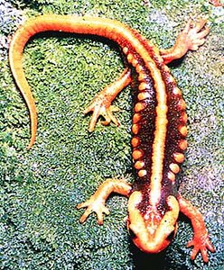

---
aliases:
  - Caudata
  - Salamander
has_id_wikidata: Q53663
title: Caudata
---

# [[Caudata]]

#is_/same_as :: [[../../../../../../../../../../../../../WikiData/WD~Caudata,53663|WD~Caudata,53663]] 

Salamanders 

## #has_/text_of_/abstract 

> The **Caudata** are a group of amphibians containing the extant salamanders (the order Urodela) 
> and all extinct species of amphibians more closely related to salamanders than to frogs. 
> 
> They are typically characterized by a superficially lizard-like appearance, 
> with slender bodies, blunt snouts, short limbs projecting at right angles to the body, 
> and the presence of a tail in both larvae and adults.
>
> Disagreement exists between different authorities as to the definition of the terms "Caudata" and "Urodela". 
> Some maintain that Urodela should be restricted to the crown group, 
> with Caudata being used for the total group. 
> 
> Others restrict the name Caudata to the crown group and use Urodela for the total group. 
> The former approach seems to be most widely adopted and is used in this article.
>
> [Wikipedia](https://en.wikipedia.org/wiki/Caudata) 

## Introduction

[Allan Larson, David Wake, and Tom Devitt](http://www.tolweb.org/) 

Salamanders are amphibians of the order Caudata (also called Urodela).
This taxon includes the newts, a group of rough-skinned species in the
salamander family Salamandridae. Salamanders are distinguished from
other amphibians (frogs and caecilians) most obviously by the presence
of a tail in all larvae, juveniles and adults, and by having limbs set
at right angles to the body with forelimbs and hindlimbs of
approximately equal size (except in the family Sirenidae, which lacks
hindlimbs). Salamanders are distinguished from frogs and caecilians also
by numerous characteristics of their skeleton and musculature (see
\"Characteristics\" below).

Many salamanders have a biphasic life cycle containing an aquatic larval
form with external gills and a metamorphosed terrestrial adult form that
breathes by lungs and/or through moist skin. Some species lack
metamorphosis and retain a larval appearance throughout their life,
whereas other species lack the aquatic larval stage and hatch on land as
terrestrial forms that resemble miniature adults. The general
association of lungs with terrestrial animals and gills with aquatic
ones is not universally true among salamanders; terrestrial plethodontid
salamanders lack lungs and breathe through the skin, whereas aquatic
adult amphiumas lack gills and use lungs to breathe. Salamanders are
carnivorous in the larval, juvenile and adult stages of their life
cycles; they prey mainly on small arthropods.

Most salamanders are relatively small for vertebrates, usually less than
15 cm long, although the aquatic cryptobranchid salamanders of the genus
*Andrias* may exceed 1.5 m in length.

Salamanders inhabit nearly all northern temperate regions of the world
where moist and cool habitats occur. The greatest phylogenetic diversity
of salamanders is in North America where representatives of 9 of the 10
extant taxonomic families occur. Lungless salamanders of the family
Plethodontidae occur also in tropical areas of Central and South
America. Terrestrial salamanders are usually found on the forest floor
under rocks or logs, from which they emerge at night to feed. Aquatic
forms live on the bottoms of streams or ponds, often under stones.
Salamanders are usually seasonal in their activity and are easily found
only during their active season, which differs among species.

Salamanders are unusual among animals in having very large amounts of
DNA in their nuclear genomes (reviewed by Morescalchi, 1975; Larson,
1984; Raff and Kaufman, 1983:314). Genome size measured as C-value (mass
of DNA in a haploid, unreplicated nucleus) ranges from approximately
15-90 pg. in salamanders (Morescalchi, 1975) and shows substantial
variation within some genera, such as *Plethodon;* for comparison, the
C-value for humans is approximately 3 pg. Much of this DNA is repetitive
and may constitute retrotransposons (Marracci et al., 1996). Large
genomes may limit rates of differentiation during development (Sessions
and Larson, 1987).

See Duellman and Trueb (1985) for detailed coverage of the biology of
salamanders, and Estes (1981) for treatment of fossil salamanders. For
reviews of various aspects of salamander reproductive biology and
phylogeny, see Bruce et al. (2000), Crump (1995), Halliday and Tejedo
(1995), Mathis et al. (1995), Nussbaum (1985), Sever (2003) and Sullivan
et al. (1995).

### Characteristics

In addition to presence of a tail and usually two pairs of limbs of
approximately equal size, salamanders are distinguished from other
amphibians by a combination of several technical features of the
skeleton and musculature. These include (1) absence of an otic notch and
middle ear, (2) presence of a large footplate and short stylus on the
columella in most taxa, (3) absence of postorbital, postparietal,
tabular, supratemporal, jugal, quadratojugal (present in Karauridae),
supraoccipital, basioccipital and ectopterygoid bones, (4) presence of
ribs, (5) presence of true teeth on both jaws, (6) gill slits and
external gills in aquatic larvae (when present), (7) origin of the
adductor mandibulae internus superficialis muscle on the top and back of
the skull (except Karauridae) and small size of the levator mandibulae
posterior. See Duellman and Trueb (1986) for further coverage of these
characters.

### Classification

Salamanders comprise the order Caudata (Urodela) of the Class Amphibia,
phylum Chordata. Living salamanders are divided taxonomically into ten
taxonomic families based upon phylogeny and anatomical features:
Ambystomatidae (mole salamanders), Amphiumidae (amphiumas),
Cryptobranchidae (hellbenders), Dicamptodontidae (Pacific giant
salamanders), Hynobiidae, Plethodontidae (lungless salamanders),
Proteidae (mudpuppies), Rhyacotritonidae (torrent salamanders),
Salamandridae (true salamanders and newts) and Sirenidae (sirens). Some
extinct species known only from fossils are grouped into the families
Batrachosauroididae, Karauridae, Prosirenidae and Scapherpetontidae.
Each extant family of salamanders is described in more detail on further
pages.

These families are grouped into four taxonomic suborders as follows:
Cryptobranchoidea (Cryptobranchidae, Hynobiidae), Karauroidea
(Karauridae), Salamandroidea (Ambystomatidae, Amphiumidae,
Batrachosauroididae, Dicamptodontidae, Plethodontidae, Prosirenidae,
Proteidae, Rhyacotritonidae, Salamandridae, Scapherpetontidae) and
Sirenoidea (Sirenidae).

A few Mesozoic fossil salamanders (genera *Comonecturoides, Galverpeton*
and *Hylaeobatrachus,* each containing a single species) have not been
assigned to taxonomic families or suborders.

See Frost (1985), Duellman and Trueb (1986) and Duellman (1993) for
further information on classification of salamanders.

### Discussion of Phylogenetic Relationships

Monophyly of each of the 10 extant salamander families is well
established. Evidence for monophyly of the families is discussed on the
separate Tree of Life pages devoted to each family. The phylogenetic
relationships among the different families of salamanders have been
somewhat difficult to resolve (Larson, 1991; Larson and Dimmick, 1993;
Larson et al., 2003). Larson and Dimmick (1993) investigated salamander
relationships based on an analysis of 209 phylogenetically informative
characters (177 from aligned ribosomal RNA sequences \[both large and
small subunit\], 20 from structures of the head and trunk, and 12 from
anatomy of the cloaca). Titus and Larson (1995) found further support
for some of the relationships recovered by Larson and Dimmick\'s (1993)
analysis using mitochondrial DNA (mtDNA) sequence data.\

Gao and Shubin (2001) investigated higher-level salamander relationships
using combined morphological and molecular (nuclear ribosomal RNA from
Larson and Dimmick, 1993) data, placing three of four families comprised
of paedomorphic species in a single clade. In contrast, previous
phylogenies (e.g., Duellman and Trueb, 1986;  Larson and Dimmick, 1993)
indicate that salamanders that retain at least some aquatic larval
characteristics throughout life (families Amphiumidae, Cryptobranchidae,
Proteidae, Sirenidae and parts of the Ambystomatidae and Plethodontidae)
do not form a monophyletic group, and thus evolutionary displacement of
larval characteristics into the adult phase of the life cycle must have
occurred independently multiple times in salamanders.

Wiens et al. (2005) investigated higher-level salamander relationships
using separate and combined parsimony and Bayesian analyses of new
morphological and molecular data. Their morphological data consisted
mostly of skeletal (n = 266) and external (n = 15) characters, along
with literature studies of vertebral (Edwards, 1976), auditory (Lombard,
1977), and cloacal morphology (Sever, 1991), and literature-based
characters of reproduction, larval morphology, and chromosome complement
(e.g., Duellman and Trueb, 1986; Crawford and Wake, 1998). Their
molecular data consisted of 1,742 characters: 212 ribosomal RNA
characters from Larson (1991) and Larson and Dimmick (1993), plus 1,530
base pairs of nuclear recombination-activating gene 1 (RAG-1). They
found that paedomorphic traits significantly confounded phylogenetic
analysis of morphological data, and rejected the hypothesis that
paedomorphic salamanders form a monophyletic group.  Their preferred
hypothesis of salamander relationships (their Fig. 8, see tree above)
was more similar to previous phylogenies (e.g., Larson and Dimmick,
1993) than to that of Gao and Shubin (2001).\

Wiens et al. (2005) found strong support for monophyly of salamanders
having internal fertilization of eggs (extant families of the suborder
Salamandroidea, or, all salamanders except for sirenids,
cryptobranchids, and hynobiids), a result supported by characters
derived from cloacal anatomy (see Sever, 1991a, 1991b). Additional
notable features of the Wiens et al. (2005) phylogeny include: 1)
Rhyacotritonidae as the sister taxon of Amphiumidae , Plethodontidae; 2)
monophyly of Proteidae (i. e., North American *Necturus* and European
*Proteus*; and 3) the possibility of Cryptobranchoidea as the sister
taxon to all other salamanders (rather than Sirenidae).  Although the
preferred tree of Wiens et al. (2005; their Fig. 8) placed Proteidae as
the sister taxon of (Salamandridae , (Dicamptodontidae ,
Ambystomatidae)), parsimony analyses provided support for a more basal
placement of proteids, suggesting that additional data are needed to
confidently place sirenids and proteids.

Weisrock et al. (2005) used \~2,100 base pairs of mitochondrial DNA
sequence data to investigate higher-level salamander relationships.
Parsimony analyses recovered monophyly of all families except Proteidae,
but interfamilial relationships were not well supported (Weisrock et
al., 2005). In contrast, model-based (Bayesian and maximum likelihood)
methods yielded a topology concordant with the preferred tree of Wiens
et al. (2005) based on nuclear rRNA sequences (Weisrock et al., 2005).
Unlike Wiens et al. (2005) however, Weisrock et al. (2005) statistically
rejected the monophyly of internally-fertilizing salamanders (suborder
Salamandroidea). This result was likely due to the difficulty of
inferring phylogeny when terminal branches are temporally long compared
to internal branches deep in the phylogeny. Parsimony analysis of
nuclear and mitochondrial DNA sequences by Frost et al. (2006) grouped
Proteidae and Sirenidae as sister taxa; this result suggests that the
perennibranchiate condition in these families might be homologous, but
it contradicts monophyly of suborder Salamandroidea.\

## Phylogeny 

-   « Ancestral Groups  
    -   [Living Amphibians](Living_Amphibians)
    -   [Terrestrial Vertebrates](../../Terrestrial.md)
    -   [Sarcopterygii](../../../Sarc.md)
    -   [Gnathostomata](../../../../Gnath.md)
    -   [Vertebrata](../../../../../Vertebrata.md)
    -   [Craniata](../../../../../../Craniata.md)
    -   [Chordata](../../../../../../../Chordata.md)
    -   [Deuterostomia](../../../../../../../../Deutero.md)
    -  [Bilateria](../../../../../../../../../Bilateria.md) 
    -  [Animals](../../../../../../../../../../Animals.md) 
    -  [Eukarya](../../../../../../../../../../../Eukarya.md) 
    -   [Tree of Life](../../../../../../../../../../../Tree_of_Life.md)

-   ◊ Sibling Groups of  Living Amphibians
    -   [Salientia](Salientia.md)
    -   Caudata

-   » Sub-Groups
    -   [Plethodontidae](Caudata/Plethodontidae.md)
    -   [Amphiumidae](Caudata/Amphiumidae.md)
    -   [Dicamptodontidae](Caudata/Dicamptodontidae.md)
    -   [Ambystomatidae](Caudata/Ambystomatidae.md)
    -   [Salamandridae](Caudata/Salamandridae.md)
    -   [Rhyacotritonidae](Caudata/Rhyacotritonidae.md)
    -   [Proteidae](Caudata/Proteidae.md)
    -   [Cryptobranchidae](Caudata/Cryptobranchidae.md)
    -   [Hynobiidae](Caudata/Hynobiidae.md)
    -   [Sirenidae](Caudata/Sirenidae.md)

## Title Illustrations

------------ 
 
scientific_name ::     Tylototriton shanjing
location ::           China
Comments             A newt (Salamandridae)
specimen_condition ::  Live Specimen
copyright ::            © 1996 Dr. Tom A. Titus

## Confidential Links & Embeds: 

### #is_/same_as :: [[/_Standards/bio/bio~Domain/Eukarya/Animal/Bilateria/Deutero/Chordata/Craniata/Vertebrata/Gnath/Sarc/Tetrapods/Amphibia/Caudata|Caudata]] 

### #is_/same_as :: [[/_public/bio/bio~Domain/Eukarya/Animal/Bilateria/Deutero/Chordata/Craniata/Vertebrata/Gnath/Sarc/Tetrapods/Amphibia/Caudata.public|Caudata.public]] 

### #is_/same_as :: [[/_internal/bio/bio~Domain/Eukarya/Animal/Bilateria/Deutero/Chordata/Craniata/Vertebrata/Gnath/Sarc/Tetrapods/Amphibia/Caudata.internal|Caudata.internal]] 

### #is_/same_as :: [[/_protect/bio/bio~Domain/Eukarya/Animal/Bilateria/Deutero/Chordata/Craniata/Vertebrata/Gnath/Sarc/Tetrapods/Amphibia/Caudata.protect|Caudata.protect]] 

### #is_/same_as :: [[/_private/bio/bio~Domain/Eukarya/Animal/Bilateria/Deutero/Chordata/Craniata/Vertebrata/Gnath/Sarc/Tetrapods/Amphibia/Caudata.private|Caudata.private]] 

### #is_/same_as :: [[/_personal/bio/bio~Domain/Eukarya/Animal/Bilateria/Deutero/Chordata/Craniata/Vertebrata/Gnath/Sarc/Tetrapods/Amphibia/Caudata.personal|Caudata.personal]] 

### #is_/same_as :: [[/_secret/bio/bio~Domain/Eukarya/Animal/Bilateria/Deutero/Chordata/Craniata/Vertebrata/Gnath/Sarc/Tetrapods/Amphibia/Caudata.secret|Caudata.secret]] 

