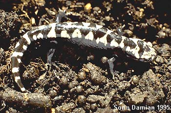

---
title: Ambystomatidae
---

# [[Ambystomatidae]]

Mole Salamanders 

## #has_/text_of_/abstract 

> **Ambystomatidae** is a family of salamanders belonging to the Suborder Salamandroidea in the class Amphibia. It contains two genera, Ambystoma (the mole salamanders) and Dicamptodon (the Pacific giant salamanders). Ambystoma contains 32 species and are distributed widely across North America, while Dicamptodon contains four species restricted to the Pacific Northwest. These salamanders are mostly terrestrial and eat invertebrates, although some species are known to eat smaller salamanders. They can be found throughout the US and some areas of Canada in damp forests or plains. This family contains some of the largest terrestrial salamanders in the world, the tiger salamander and the coastal giant salamander. Some species are toxic and can secrete poison from their bodies as protection against predators or infraspecific competition. Neoteny has been observed in several species in Ambystomatidae, and some of them like the axolotl live all of their lives under water in their larval stage.
>
> [Wikipedia](https://en.wikipedia.org/wiki/Ambystomatidae) 
## Introduction

[Allan Larson](http://www.tolweb.org/)

Salamanders of the family Ambystomatidae, commonly called \"mole
salamanders,\" are widely distributed throughout most of North America.
Metamorphosed, terrestrial adults have robust bodies and limbs and
short, blunt heads (Duellman and Trueb, 1986). They live under litter or
in burrows on the forest floor and return to ponds or slow streams to
breed. Aquatic larvae have broad heads, caudal fins and long filamentous
gills (Duellman and Trueb, 1986). In most *Ambystoma,* including the
widely distributed and familiar tiger salamanders *(A. tigrinum*
complex), mating occurs during the early spring in ponds where the eggs
are laid, often in visible clumps attached to submerged objects. Stages
of embryonic development are often visible through the clear, floating
eggs. Some species breed in autumn; these include the ringed salamander
*(A. annulatum)* which deposits eggs in ponds, and the marbled
salamander *(A. opacum)* which lays eggs on land in sheltered
depressions that later fill with rainwater.

Some ambystomatid populations are perennibranchiate, retaining into
adulthood the appearance and aquatic habitat characteristic of larvae.
The Mexican axolotls *(A. mexicanum)* are perhaps the most familiar
example of salamanders that are permanently aquatic and larval in form.
Other populations of ambystomatids may have a facultative metamorphosis,
in which individuals have the developmental options of retaining the
larval form into adulthood or undergoing a metamorphosis to a
terrestrial adult form. The terms \"paedomorphic\" and \"neotenic\"
often are used to refer to the perennibranchiate condition in
ambystomatids. \"Paedomorphic\" is a general term that refers to any
retention of characteristics normally associated with juveniles or
larvae into adulthood. This term correctly refers to perennibranchiate
ambystomatids but is not restricted to describing the perennibranchiate
condition. \"Neotenic\" refers to paedomorphosis that arises
developmentally by slowing the growth of organismal form without
accelerating attainment of reproductive maturity. This term also
correctly refers to many perennibranchiate ambystomatids but includes
other phenomena, as does \"paedomorphosis.\" Therefore, the term that
refers most specifically to the retention of the gilled, aquatic larval
form throughout adulthood in some ambystomatids is
\"perennibranchiate.\"

Two ambystomatid species from eastern North America demonstrate the
genetic and reproductive anomalies of chromosomal triploidy and
gynogenesis, respectively. *Ambystoma platineum* is an all-female,
triploid species containing two sets of chromosomes derived from *A.
jeffersonianum* and one from *A. laterale. Ambystoma tremblayi* is an
all-female triploid species containing one set of chromosomes from *A.
jeffersonianum* and two sets from *A. laterale.* To activate development
of their eggs, females of *A. platineum* mate with males of *A.
jeffersonianum,* but the sperm make no genetic contribution to the
offspring. Likewise, females of *A. tremblayi* activate development of
their eggs by mating with males of *A. laterale,* but the sperm make no
genetic contribution to the offspring. The ancient evolutionary origins
of these genetically and reproductively anomalous species are analyzed
by Hedges et al. (1992) and Spolsky et al. (1992). For discussion of
additional discoveries of triploid unisexual *Ambystoma* formed through
interspecific hybridization, see Kraus et al. (1991).

Ambystomas figured prominently in early embryological experiments in
which graft hybrids called chimeras were produced by transplanting
embryonic tissue from one species onto the developing embryo of another
species. The animals that resulted from these experiments were
monstrosities that possessed the characteristics of different species on
different parts of their bodies. This research is summarized in a
posthumous collection of the lectures of Ross Granville Harrison
(Harrison, 1969) and also by Twitty (1966). Harrison (1969) includes
detailed drawings of the developmental stages of the spotted salamander,
which he called *\"Amblystoma punctatum\"* and which is now known as
*Ambystoma maculatum.*

For many years, the tiger salamanders were considered a single polytypic
species, *A. tigrinum,* that had the most widespread geographic
distribution of any salamander species in North America. Molecular
genetic studies (Shaffer, 1984; Routman, 1993; Templeton et al., 1995;
Shaffer and McKnight, 1996) indicate that the tiger salamanders cannot
be considered a single species and that the formally recognized
subspecies may not be valid taxonomic units. Furthermore, *A. tigrinum*
as currently recognized is paraphyletic with respect to numerous Mexican
species, many of which are perennibranchiate forms having restricted
geographic distributions. Evolution of perennibranchiate forms probably
has occurred numerous times from within the *A. tigrinum* complex.

### Characteristics

#### Diagnosis

Adults have robust bodies and limbs, broad and blunt heads with small
eyes, prominent costal grooves and a laterally-flattened tail. Absence
of grooves between the nostrils and upper lip distinguishes ambystomatid
salamanders from plethodontid salamanders with which they co-occur.
Aquatic larvae resemble adults except that they have filamentous
external gills, four pairs of gill slits and their tail is more finlike.
Larvae inhabit ponds or slow streams and usually can be found throughout
the year. Some adults retain the appearance of the aquatic larvae; more
commonly, adults are terrestrial, metamorphosed forms that live under
cover objects or in animal burrows in the forest.

#### Detailed Characteristics of the Ambystomatidae

The morphological characters given below are the ones standardly used to
diagnose the salamander family Ambystomatidae and to assess its
phylogenetic relationships to other salamanders. The individual
characteristics are in most cases shared with other salamanders and
should not be interpreted as synapomorphies of the Ambystomatidae.
Absence of characteristics found in other salamanders is noted where it
is important for distinguishing ambystomatids from other salamanders
and/or determining their relationships to other salamanders. These
characteristics were assembled from a large number of original sources
by Duellman and Trueb (1986), Larson (1991) and Larson and Dimmick
(1993). For a detailed description of characters variable within the
Ambystomatidae and used to evaluate phylogenetic relationships among
ambystomatid salamanders, see Kraus (1988).

###### Morphology of the Skull

The premaxilla consists of separated, paired bones. Bilaterally paired
nasal bones each ossify from a single, laterally positioned anlage; long
posterior processes of the premaxillae extend between the paired nasal
bones and completely separate them. Maxillary bones are present and well
developed. Bilaterally paired septomaxillary bones are present. Lacrimal
bone is absent. Quadratojugal bone is absent. Pterygoid bones are
present. An internal carotid foramen is present in the parasphenoid bone
in some species. The angular bone is fused to the mandible. The
columella and operculum appear as separate ear bones detached from the
otic capsule in some species, and the columella is fused with the otic
capsule in others. Replacement of vomerine teeth proceeds from the
posterior of the vomer. Teeth have a distinct crown and pedicel. Origin
of the levator mandibulae anterior superficialis muscle includes the
exoccipital.

###### Inner Ear

A basilaris complex is present in the inner ear. The recessus
amphibiorum is oriented horizontally in the inner ear. The otic sac is
multilobate, vascularized and filled with calcium. The amphibian
periotic canal lacks fibrous connective tissue. The periotic cistern is
large.

###### Hyobranchial Structures

The first hypobranchial and first ceratobranchial (alternatively
homologized as the first ceratobranchial and first epibranchial,
respectively) exist as separate structures. The second ceratobranchial
(alternatively homologized as the second epibranchial) comprises a
single element. The otoglossal cartilage is present as a semicircular
ring in the hyoid apparatus of adults. Lungs and an ypsiloid cartilage
are present. Larvae have four pairs of gill slits.

###### Characteristics of the Trunk and Vertebral Column

The scapula and coracoid bones of the pectoral girdle are fused to form
the scapulocoracoid. Vertebral centra are amphicoelous. Ribs are
bicapitate. Spinal-nerve foramina are present in neural arches of all
vertebrae except for spinal nerves exiting between the atlas and first
trunk vertebra and between the first and second trunk vertebrae.
Anterior glomeruli of the kidney are reduced or absent.

###### Reproductive characters

Fertilization is internal. Ciliated epithelium is present in the cloacal
tube and/or anterior cloacal chamber of females. Epidermal lining is
absent from the anterior cloacal chamber of females. Evaginations are
present in the dorsolateral walls of the male cloacal tube. Anterior
ventral glands are present in the cloacae of females. Spermathecae are
present in the female cloacal chamber. Glands secreting into the dorsal
walls of the female cloaca are present. Anterior ventral glands are
present in male cloacae. Posterior ventral glands are present in male
cloacae. Kingsbury\'s glands are present in male cloacae. Dorsal pelvic
glands are present in males. Lateral pelvic glands are present in males.
Glands secreting into the male cloacal orifice are present. Parental
care of eggs by females is observed only for *Ambystoma opacum.*

The diploid number of chromosomes is 28.

### Classification

The family Ambystomatidae contains only two extant genera, *Ambystoma*
and *Rhyacosiredon,* with the latter comprising 4 species found in
streams in the mountains of Mexico. Molecular evolutionary studies
(Shaffer, 1984; Shaffer and McKnight, 1996) indicate that
*Rhyacosiredon* is phylogenetically nested within the *Ambystoma
tigrinum* complex. To avoid making *Ambystoma* paraphyletic, recognition
of *Rhyacosiredon* has been discontinued by some authors and its four
species added to the genus *Ambystoma.*

The Ambystomatidae formerly contained the genera *Dicamptodon* and
*Rhyacotriton,* both of which are now placed in their own taxonomic
families (Dicamptodontidae and Rhyacotritonidae, respectively).
Molecular phylogenetic studies show that *Dicamptodon* is closely
related to *Ambystoma* and that these genera (plus *Rhyacosiredon,* if
recognized separately from *Ambystoma)* together form a monophyletic
group (Larson, 1991; Larson and Dimmick, 1993). *Dicamptodon* (plus
extinct genera related to it) conceivably could be returned to the
family Ambystomatidae and recognition of the family Dicamptodontidae
discontinued. *Rhyacotriton* is only a distant relative of these genera,
however, and should not be placed in the family Ambystomatidae.

Some fossil vertebrae from the Upper Pliocene of Texas have been placed
in the genus *Amphitriton;* otherwise, all known fossil ambystomatids
belong to the genus *Ambystoma* (Estes, 1981).

Five species *(A. annulatum, A. barbouri, A. cingulatum, A. mabeei* and
*A. texanum)* have been recognized as the subgenus Linguaelapsus based
upon characteristics of the skull and hyobranchial skeleton, although
allozymic data have challenged the monophyly of this grouping (Shaffer
et al., 1991).

### Discussion of Phylogenetic Relationships

The ambystomatid phylogeny presented here is based upon a combined
analysis of 32 phylogenetically informative morphological characters
(Kraus, 1988) and 26 allozymic loci (Shaffer et al., 1991) as presented
by Shaffer et al. (1991). (This analysis excluded Mexican species
related to the *A. tigrinum* complex, whose relationships are based upon
the allozymic data of Shaffer \[1984\] and mitochondrial DNA sequences
of Shaffer and McKnight \[1996\]). The morphological and molecular data
favor different phylogenetic topologies when analyzed separately and
have been judged to contain significant phylogenetic conflicts (Shaffer
et al., 1991). The tree shown here provides a useful working hypothesis
of ambystomatid relationships based upon all data currently available,
but it should be viewed as fairly tentative and in need of further
testing.

The nodes that appear most strongly supported by the combined analysis
of morphological and molecular data include (1) the grouping of *A.
barbouri* and *A. texanum,* (2) the grouping of *A. annulatum* and *A.
cingulatum,* (3) the group containing *A. barbouri, A. texanum, A.
annulatum* and *A. cingulatum,* (4) the grouping of *A. californiense*
with *A. tigrinum* and its related Mexican species, (5) the grouping of
*A. gracile* with *A. maculatum* and (6) the grouping of species
comprising the subgenus *Linguaelapsus (A. annulatum, A. barbouri, A.
cingulatum, A. mabeei* and *A. texanum).* All other nodes on the tree
should be considered very tentative.

Studies of *A. tigrinum* and related species from Mexico (Shaffer, 1984;
Shaffer and McKnight, 1996) offer little support for monophyly of *A.
ordinarium, A. velasci, A. tigrinum* or the subspecies of *A. tigrinum.*
The remaining species in this group are mostly very restricted in
geographical distribution and are represented in the study by animals
from only one or two localities. The ambiguity of phylogenetic
relationships among these species is presented as a star phylogeny with
nine branches, shown as the sister group to a partially resolved branch
containing 5 additional species. These molecular studies collectively
indicate phylogenetic affinity among the species *A. dumerilii, A.
granulosum, A. lermaensis, R. altimirani* and *R. rivularis* as shown,
although some populations of *A. ordinarium* and *A. velasci* also fall
into this group in the analysis of Shaffer and McKnight (1996). Only the
monophyly of this entire complex of species and its placement as the
sister-group to *A. californiense* appear well supported by the
available data.

## Phylogeny 

-   « Ancestral Groups  
    -   [Caudata](../Caudata.md)
    -   [Living Amphibians](Living_Amphibians)
    -   [Terrestrial Vertebrates](../../../Terrestrial.md)
    -   [Sarcopterygii](../../../../Sarc.md)
    -   [Gnathostomata](../../../../../Gnath.md)
    -   [Vertebrata](../../../../../../Vertebrata.md)
    -   [Craniata](../../../../../../../Craniata.md)
    -   [Chordata](../../../../../../../../Chordata.md)
    -   [Deuterostomia](../../../../../../../../../Deutero.md)
    -  [Bilateria](../../../../../../../../../../Bilateria.md))
    -  [Animals](../../../../../../../../../../../Animals.md))
    -  [Eukarya](../../../../../../../../../../../../Eukarya.md))
    -   [Tree of Life](../../../../../../../../../../../../Tree_of_Life.md)

-   ◊ Sibling Groups of  Caudata
    -   [Plethodontidae](Plethodontidae.md)
    -   [Amphiumidae](Amphiumidae.md)
    -   [Dicamptodontidae](Dicamptodontidae.md)
    -   Ambystomatidae
    -   [Salamandridae](Salamandridae.md)
    -   [Rhyacotritonidae](Rhyacotritonidae.md)
    -   [Proteidae](Proteidae.md)
    -   [Cryptobranchidae](Cryptobranchidae.md)
    -   [Hynobiidae](Hynobiidae.md)
    -   [Sirenidae](Sirenidae.md)

-   » Sub-Groups 

## Title Illustrations

---------------)
Scientific Name ::     Ambystomatidae
Location ::           Eastern United States
Comments             The marbled salamander with eggs
Specimen Condition   Live Specimen
Copyright ::            © 1996 Sorin Damian

## Confidential Links & Embeds: 

### #is_/same_as ::[Ambystomatidae](Ambystomatidae.md)) 

### #is_/same_as :: [Ambystomatidae.public](/_public/bio/bio~Domain/Eukarya/Animal/Bilateria/Deutero/Chordata/Craniata/Vertebrata/Gnath/Sarc/Tetrapods/Amphibians/Caudata/Ambystomatidae.public.md) 

### #is_/same_as :: [Ambystomatidae.internal](/_internal/bio/bio~Domain/Eukarya/Animal/Bilateria/Deutero/Chordata/Craniata/Vertebrata/Gnath/Sarc/Tetrapods/Amphibians/Caudata/Ambystomatidae.internal.md) 

### #is_/same_as :: [Ambystomatidae.protect](/_protect/bio/bio~Domain/Eukarya/Animal/Bilateria/Deutero/Chordata/Craniata/Vertebrata/Gnath/Sarc/Tetrapods/Amphibians/Caudata/Ambystomatidae.protect.md) 

### #is_/same_as :: [Ambystomatidae.private](/_private/bio/bio~Domain/Eukarya/Animal/Bilateria/Deutero/Chordata/Craniata/Vertebrata/Gnath/Sarc/Tetrapods/Amphibians/Caudata/Ambystomatidae.private.md) 

### #is_/same_as :: [Ambystomatidae.personal](/_personal/bio/bio~Domain/Eukarya/Animal/Bilateria/Deutero/Chordata/Craniata/Vertebrata/Gnath/Sarc/Tetrapods/Amphibians/Caudata/Ambystomatidae.personal.md) 

### #is_/same_as :: [Ambystomatidae.secret](/_secret/bio/bio~Domain/Eukarya/Animal/Bilateria/Deutero/Chordata/Craniata/Vertebrata/Gnath/Sarc/Tetrapods/Amphibians/Caudata/Ambystomatidae.secret.md)

