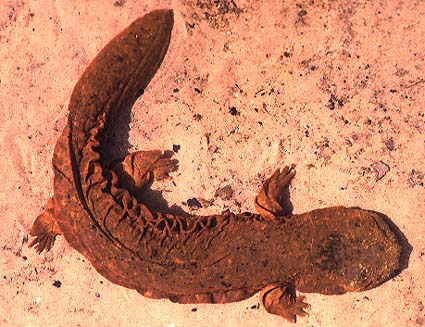

# Cryptobranchidae

Hellbenders 

Relationships among the three extant species of the family
Cryptobranchidae. For more information about the extinct species, see
Estes (1981).

Containing group: [Caudata](../Caudata.md)

## Introduction

[Allan Larson](http://www.tolweb.org/) 

Salamanders of the family Cryptobranchidae are elongate (length may
exceed 1.5 meters in the genus *Andrias),* dorsoventrally flattened, and
permanently aquatic. The genus *Andrias* contains the largest living
salamanders, and fossil species attained even larger sizes, exceeding 2
meters in body length. Fleshy dermal folds are visible along the lower
sides of the body in adults. Metamorphosis is partial; external gills
are lost in adults but eyelids do not develop and the tail remains
laterally compressed and finlike.

Because the partially metamorphic adults of the family Cryptobranchidae
resemble larvae of the related family Hynobiidae, cryptobranchids are
considered to have been derived evolutionarily from hynobiid-like
ancestors by retention of larval characteristics in adults (Duellman and
Trueb, 1986).

Cryptobranchids are generally found living in depressions under stones
in streams and rivers. *Andrias* occurs in central China and Japan,
whereas *Cryptobranchus* lives in eastern North America. Mating in
Cryptobranchus occurs in late summer or early fall. Males prepare nests
below large, submerged stones or logs. Females lay long, paired strings
of several hundred eggs which are fertilized externally by the male.
Males guard the eggs until they hatch in 2-3 months after laying.

Although extant species occur only in Asia, fossils of *Andrias* are
known from the Tertiary of Europe and North America (Estes, 1981).
Fossils indicate that *Cryptobranchus* formerly occurred also in western
North America.

Asian salamanders of the genus *Andrias* are used for food and are now
considered highly endangered.

### Characteristics

#### Diagnosis

These large, aquatic salamanders have dorsoventrally flattened bodies
except on the tail, which is laterally compressed and finlike. Limbs are
short but massive and sturdy. Folds are present in the skin, which forms
flaps along the lateral margins of the body. Eyes are small and lack
eyelids. Larvae have caudal fins and short, external gills. They live
under rocks on the bottoms of fast-flowing streams and rivers.

#### Detailed Characteristics of the Cryptobranchidae

The morphological characters given below are the ones standardly used to
diagnose the salamander family Cryptobranchidae and to assess its
phylogenetic relationships to other salamanders. The individual
characteristics are in most cases shared with other salamanders and
should not be interpreted as synapomorphies of the Cryptobranchidae.
Absence of characteristics found in other salamanders is noted where it
is important for distinguishing cryptobranchids from other salamanders
and/or determining their relationships to other salamanders. These
characteristics were assembled from a large number of original sources
by Duellman and Trueb (1986), Larson (1991) and Larson and Dimmick
(1993).

Metamorphosis is incomplete in the Cryptobranchidae, leading to a number
of paedomorphic characteristics in adults.

###### Morphology of the Skull

Premaxilla consists of separated, paired bones. Bilaterally paired nasal
bones each ossify from 2 anlagen, one positioned medially and the other
laterally on the skull; the paired nasal bones abut each other,
partially bisected by short posterior processes of the premaxillae.
Maxillary bones are present and well developed. Septomaxillary bones are
absent. Lacrimal bone is absent. Quadratojugal bone is absent. Pterygoid
bones are present. Internal carotid foramina are absent from
parasphenoid bones. The angular bone is separated from the mandible. Ear
bones include a detached columella but no operculum. Replacement of
vomerine teeth proceeds laterally in parallel to the maxillary teeth.
Teeth have a distinct crown and pedicel. Origin of the levator
mandibulae anterior superficialis muscle includes the exoccipital.
Eyelids are absent.

###### Inner Ear

A basilaris complex is present in the inner ear. The recessus
amphibiorum is oriented horizontally in the inner ear. The otic sac is
bulbar and unvascularized. The amphibian periotic canal lacks fibrous
connective tissue. The periotic cistern is large. The periotic cistern
does not protrude into the fenestra.

###### Hyobranchial Structures

The first hypobranchial and first ceratobranchial (alternatively
homologized as the first ceratobranchial and first epibranchial,
respectively) exist as separate structures. The second ceratobranchial
(alternatively homologized as the second epibranchial) comprises four
elements. Larvae have four pairs of gill slits. Adults have one pair of
gill slits (closed in *Andrias).* An ypsiloid cartilage is present.

###### Characteristics of the Trunk and Vertebral Column

Bodies are dorsoventrally depressed and have fleshy dermal folds. The
scapula and coracoid bones of the pectoral girdle are fused to form the
scapulocoracoid. Vertebral centra are amphicoelous. Ribs are
unicapitate. Neural arches of vertebrae lack foramina, and spinal nerves
exit intervertebrally. The pubotibialis and puboischiotibialis muscles
are fused together. Anterior glomeruli of the kidney are reduced or
absent.

###### Reproductive characters

Fertilization is external. Ciliated epithelium is present in the cloacal
tube and/or anterior cloacal chamber of females. Epidermal lining is
absent from the anterior cloacal chamber of females. Evaginations are
absent from the dorsolateral walls of the male cloacal tube. Anterior
ventral glands are present in the cloacae of females. No spermathecae
are present in the female cloacal chamber. Glands secreting into the
dorsal walls of the female cloaca are absent. Anterior ventral glands
are present in male cloacae. Posterior ventral glands are absent from
male cloacae. Kingsbury\'s glands are absent from male cloacae. Dorsal
pelvic glands are absent in males. Lateral pelvic glands are absent in
males. Glands secreting into the male cloacal orifice are absent.
Parental care of eggs is by males.

The diploid number of chromosomes is 60, 62 or 64 (Morescalchi, 1975).

### Classification

The salamander families Cryptobranchidae and Hynobiidae together form
the suborder Cryptobranchoidea. Monophyly of the Cryptobranchoidea is
supported by molecular evidence (Larson, 1991; Larson and Dimmick, 1993)
and by two morphological synapomorphies (fusion of first ceratobranchial
and first epibranchial; fusion of the pubotibialis and
puboischiotibialis muscles; see Estes, 1981).

The genus *Andrias* was formerly known as *Megalobatrachus,* and
references to the former name are still common.

### Discussion of Phylogenetic Relationships

The Cryptobranchidae is clearly a monophyletic group that is closely
related to the Asian family Hynobiidae, as revealed by phylogenetic
analysis of ribosomal RNA sequences (Larson, 1991; Larson and Dimmick,
1993) and morphological characters (Estes, 1981; Duellman and Trueb,
1986). These two families together form the sister taxon to the
internally fertilizing salamanders, suborder Salamandroidea (Duellman
and Trueb, 1986; Larson and Dimmick, 1993).

The relationships shown for extant cryptobranchids follow biogeography
and generic boundaries. Molecular phylogenetic studies including all
extant cryptobranchid species have not been performed, however, so this
grouping is somewhat tentative.

## Phylogeny 

-   « Ancestral Groups  
    -   [Caudata](../Caudata.md)
    -   [Living Amphibians](Living_Amphibians)
    -   [Terrestrial Vertebrates](../../../Terrestrial.md)
    -   [Sarcopterygii](../../../../Sarc.md)
    -   [Gnathostomata](../../../../../Gnath.md)
    -   [Vertebrata](../../../../../../Vertebrata.md)
    -   [Craniata](../../../../../../../Craniata.md)
    -   [Chordata](../../../../../../../../Chordata.md)
    -   [Deuterostomia](../../../../../../../../../Deutero.md)
    -  [Bilateria](../../../../../../../../../../Bilateria.md))
    -  [Animals](../../../../../../../../../../../Animals.md))
    -  [Eukarya](../../../../../../../../../../../../Eukarya.md))
    -   [Tree of Life](../../../../../../../../../../../../Tree_of_Life.md)

-   ◊ Sibling Groups of  Caudata
    -   [Plethodontidae](Plethodontidae.md)
    -   [Amphiumidae](Amphiumidae.md)
    -   [Dicamptodontidae](Dicamptodontidae.md)
    -   [Ambystomatidae](Ambystomatidae.md)
    -   [Salamandridae](Salamandridae.md)
    -   [Rhyacotritonidae](Rhyacotritonidae.md)
    -   [Proteidae](Proteidae.md)
    -   Cryptobranchidae
    -   [Hynobiidae](Hynobiidae.md)
    -   [Sirenidae](Sirenidae.md)

-   » Sub-Groups 

## Title Illustrations

--------------)
Scientific Name ::     Cryptobranchus alleghaniensis
Location ::           Missouri
Comments             The hellbender
Specimen Condition   Live Specimen
Copyright ::            © 1996 Dr. Eric J. Routman

## Confidential Links & Embeds: 

### #is_/same_as :: [Cryptobranchidae](/_Standards/bio/bio~Domain/Eukarya/Animal/Bilateria/Deutero/Chordata/Craniata/Vertebrata/Gnath/Sarc/Tetrapods/Amphibia/Caudata/Cryptobranchidae.md) 

### #is_/same_as :: [Cryptobranchidae.public](/_public/bio/bio~Domain/Eukarya/Animal/Bilateria/Deutero/Chordata/Craniata/Vertebrata/Gnath/Sarc/Tetrapods/Amphibia/Caudata/Cryptobranchidae.public.md) 

### #is_/same_as :: [Cryptobranchidae.internal](/_internal/bio/bio~Domain/Eukarya/Animal/Bilateria/Deutero/Chordata/Craniata/Vertebrata/Gnath/Sarc/Tetrapods/Amphibia/Caudata/Cryptobranchidae.internal.md) 

### #is_/same_as :: [Cryptobranchidae.protect](/_protect/bio/bio~Domain/Eukarya/Animal/Bilateria/Deutero/Chordata/Craniata/Vertebrata/Gnath/Sarc/Tetrapods/Amphibia/Caudata/Cryptobranchidae.protect.md) 

### #is_/same_as :: [Cryptobranchidae.private](/_private/bio/bio~Domain/Eukarya/Animal/Bilateria/Deutero/Chordata/Craniata/Vertebrata/Gnath/Sarc/Tetrapods/Amphibia/Caudata/Cryptobranchidae.private.md) 

### #is_/same_as :: [Cryptobranchidae.personal](/_personal/bio/bio~Domain/Eukarya/Animal/Bilateria/Deutero/Chordata/Craniata/Vertebrata/Gnath/Sarc/Tetrapods/Amphibia/Caudata/Cryptobranchidae.personal.md) 

### #is_/same_as :: [Cryptobranchidae.secret](/_secret/bio/bio~Domain/Eukarya/Animal/Bilateria/Deutero/Chordata/Craniata/Vertebrata/Gnath/Sarc/Tetrapods/Amphibia/Caudata/Cryptobranchidae.secret.md)

