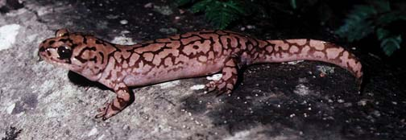

# [[Dicamptodontidae]]

Pacific Giant Salamanders 

 

## #has_/text_of_/abstract 

> The Pacific giant salamanders are members of the genus Dicamptodon. They are large salamanders endemic to the Pacific Northwest in North America. They are included in the family Ambystomatidae, or alternatively, in their own monogeneric family **Dicamptodontidae**.
>
> [Wikipedia](https://en.wikipedia.org/wiki/Pacific%20giant%20salamander) 

## Introduction

[Allan Larson](http://www.tolweb.org/) 

The salamander family Dicamptodontidae contains four extant species
placed in the single genus, *Dicamptodon* (Good, 1989) plus extinct
species placed in the genera *Ambystomichnus, Bargmannia, Chrysotriton,
Geyeriella* and *Wolterstorffiella* (Estes, 1981). Dicamptodons are
commonly known as Pacific giant salamanders because they are found along
the Pacific coast of western North America, and they attain relatively
large sizes (body length approaching 6 inches excluding the tail). They
inhabit coniferous forests of northwestern California, Oregon,
Washington, Idaho and British Columbia (Good, 1989). Larvae inhabit
springs and streams, where they can be found in pools under rocks.
Metamorphosed adults are found under logs, bark or stones or crawling
exposed on the forest floor. Adults are active particularly on wet
nights following a strong rain. Members of one species, *Dicamptodon
copei,* lack metamorphosis and retain gills and an aquatic habitat
throughout life.

Fossil remains indicate that the Dicamptodontidae formerly had a broader
geographic range than indicated by extant species (see Estes, 1981).
Fossils extend farther east in North America (Montana and North Dakota)
than extant species and are reported also from Europe (Germany and
Slovakia).

*Dicamptodon* and its fossil relatives formerly were placed in the
salamander family Ambystomatidae and later moved with *Rhyacotriton* to
the family Dicamptodontidae. Molecular phylogenetic studies (Larson,
1991; Larson and Dimmick, 1993) showed that *Dicamptodon* is a close
relative of *Ambystoma* and conceivably could have been left in the
family Ambystomatidae, but that *Rhyacotriton* is only a distant
relative of both genera and should not be grouped with them at the
family level. *Rhyacotriton* is now placed in the separate family
Rhyacotritonidae (Good and Wake, 1992).

### Characteristics

#### Diagnosis

Dicamptodontid salamanders resemble ambystomatids but attain larger
adult sizes (up to about 6 inches in body length excluding the tail).
Larvae have short external gills and 4 pairs of gill slits, and a dorsal
finlike projection on the tail. Some forms retain the larval appearance
into adulthood; others metamorphose into terrestrial adults that have
robust bodies and limbs, broad heads with prominent eyes, and a
laterally-flattened tail. The dorsal surface of the body usually has a
mottled brown and black pattern.

#### Detailed Characteristics of the Dicamptodontidae

The morphological characters given below are the ones standardly used to
diagnose the salamander family Dicamptodontidae and to assess its
phylogenetic relationships to other salamanders. The individual
characteristics are in most cases shared with other salamanders and
should not be interpreted as synapomorphies of the Dicamptodontidae.
Absence of characteristics found in other salamanders is noted where it
is important for distinguishing dicamptodontids from other salamanders
and/or determining their relationships to other salamanders. These
characteristics were assembled from a large number of original sources
by Duellman and Trueb (1986), Larson (1991) and Larson and Dimmick
(1993).

###### Morphology of the Skull

The premaxilla consists of separated, paired bones. Bilaterally paired
nasal bones each ossify from a single, laterally positioned anlage; long
posterior processes of the premaxillae extend between the paired nasal
bones and completely separate them. Maxillary bones are present and well
developed. Bilaterally paired septomaxillary bones are present. Lacrimal
bone is present. Quadratojugal bone is absent. Pterygoid bones are
present. An internal carotid foramen is present in the parasphenoid
bone. The angular bone is fused to the mandible. The columella and
operculum appear as separate ear bones detached from the otic capsule.
Replacement of vomerine teeth proceeds from the posterior of the vomer.
Teeth have a distinct crown and pedicel. Origin of the levator
mandibulae anterior superficialis muscle includes the exoccipital.

###### Inner Ear

A basilaris complex is present in the inner ear. The recessus
amphibiorum is oriented horizontally in the inner ear. The otic sac is
bulbar and unvascularized. The amphibian periotic canal lacks fibrous
connective tissue. The periotic cistern is large and protrudes into the
fenestra.

###### Hyobranchial structures

The first hypobranchial and first ceratobranchial (alternatively
homologized as the first ceratobranchial and first epibranchial,
respectively) exist as separate structures. The second ceratobranchial
(alternatively homologized as the second epibranchial) comprises a
single element. The otoglossal cartilage is present as a plate in the
hyoid apparatus of adults. Lungs and an ypsiloid cartilage are present.
Larvae have four pairs of gill slits.

###### Characteristics of the Trunk and Vertebral Column

The scapula and coracoid bones of the pectoral girdle are fused to form
the scapulocoracoid. Vertebral centra are amphicoelous. Ribs are
bicapitate. Only the sacral and postsacral vertebrae have spinal-nerve
foramina in their neural arches (foramen is partial in sacral vertebra).
Anterior glomeruli of the kidney are reduced or absent.

###### Reproductive characters

Fertilization is internal. Ciliated epithelium is present in the cloacal
tube and/or anterior cloacal chamber of females. Epidermal lining is
absent from the anterior cloacal chamber of females. Evaginations are
present in the dorsolateral walls of the male cloacal tube. Anterior
ventral glands are present in the cloacae of females. Spermathecae are
present in the female cloacal chamber. Glands secreting into the dorsal
walls of the female cloaca are absent. Anterior ventral glands are
present in male cloacae. Posterior ventral glands are present in male
cloacae. Kingsbury\'s glands are present in male cloacae. Dorsal pelvic
glands are present in males. Lateral pelvic glands are present in males.
Glands secreting into the male cloacal orifice are present. Parental
care of eggs is by females.

The diploid number of chromosomes is 28.

### Classification

The family Dicamptodontidae is part of the salamander suborder
Salamandroidea, which contains all of the internally fertilizing
salamanders (Duellman and Trueb, 1986). The family Rhyacotritonidae
formerly was recognized as the subfamily Rhyacotritoninae of the family
Dicamptodontidae, but was given family-level status by Good and Wake
(1992) following evidence that the Dicamptodontidae as formerly
recognized was not monophyletic (Larson, 1991; Larson and Dimmick,
1993). The family Dicamptodontidae as currently recognized contains what
formerly was considered the subfamily Dicamptodontinae *(Dicamptodon*
plus the extinct genera *Ambystomichnus, Bargmannia, Chrysotriton,
Geyeriella* and *Wolterstorffiella)* prior to removal of *Rhyacotriton*
to a separate family.

### Discussion of Phylogenetic Relationships

Knowledge of phylogenetic relationships among the four extant species of
*Dicamptodon* comes from the allozymic studies of Daugherty et al.
(1983) and Good (1989). The phylogenetic relationships shown are as
revealed Good\'s (1989) parsimony analysis of allozymic data using
presence versus absence of alleles as characters. Although neither
allozymic study used an outgroup to root the tree, the genetic distance
separating the Idaho populations *(D. aterrimus)* from the coastal ones
*(D. copei, D. ensatus* and *D. tenebrosus)* is much higher than genetic
distances among populations within either of these geographical regions;
therefore, the earliest phylogenetic split among lineages leading to
extant *Dicamptodon* appears to have separated *D. aterrimus* from the
other species. The exact placement of the three coastal species relative
to each other is more tentative; alternative methods of phylogenetic
analysis of the same data yield conflicting groupings of species (Good,
1989).

## Phylogeny 

-   « Ancestral Groups  
    -   [Caudata](../Caudata.md)
    -   [Living Amphibians](Living_Amphibians)
    -   [Terrestrial Vertebrates](../../../Terrestrial.md)
    -   [Sarcopterygii](../../../../Sarc.md)
    -   [Gnathostomata](../../../../../Gnath.md)
    -   [Vertebrata](../../../../../../Vertebrata.md)
    -   [Craniata](../../../../../../../Craniata.md)
    -   [Chordata](../../../../../../../../Chordata.md)
    -   [Deuterostomia](../../../../../../../../../Deutero.md)
    -  [Bilateria](../../../../../../../../../../Bilateria.md))
    -  [Animals](../../../../../../../../../../../Animals.md))
    -  [Eukarya](../../../../../../../../../../../../Eukarya.md))
    -   [Tree of Life](../../../../../../../../../../../../Tree_of_Life.md)

-   ◊ Sibling Groups of  Caudata
    -   [Plethodontidae](Plethodontidae.md)
    -   [Amphiumidae](Amphiumidae.md)
    -   Dicamptodontidae
    -   [Ambystomatidae](Ambystomatidae.md)
    -   [Salamandridae](Salamandridae.md)
    -   [Rhyacotritonidae](Rhyacotritonidae.md)
    -   [Proteidae](Proteidae.md)
    -   [Cryptobranchidae](Cryptobranchidae.md)
    -   [Hynobiidae](Hynobiidae.md)
    -   [Sirenidae](Sirenidae.md)

-   » Sub-Groups 

## Title Illustrations

--------------------------------------------------------------------------------)
Scientific Name ::     Dicamptodontidae
Location ::           Mendocino County, California
Comments             The Pacific Giant Salamander
Specimen Condition   Live Specimen
Copyright ::            © 1996 [Kevin de Queiroz](http://www.si.edu/ofg/Staffhp/deQueirozK.htm) 

## Confidential Links & Embeds: 

### #is_/same_as :: [Dicamptodontidae](/_Standards/bio/bio~Domain/Eukarya/Animal/Bilateria/Deutero/Chordata/Craniata/Vertebrata/Gnath/Sarc/Tetrapods/Amphibia/Caudata/Dicamptodontidae.md) 

### #is_/same_as :: [Dicamptodontidae.public](/_public/bio/bio~Domain/Eukarya/Animal/Bilateria/Deutero/Chordata/Craniata/Vertebrata/Gnath/Sarc/Tetrapods/Amphibia/Caudata/Dicamptodontidae.public.md) 

### #is_/same_as :: [Dicamptodontidae.internal](/_internal/bio/bio~Domain/Eukarya/Animal/Bilateria/Deutero/Chordata/Craniata/Vertebrata/Gnath/Sarc/Tetrapods/Amphibia/Caudata/Dicamptodontidae.internal.md) 

### #is_/same_as :: [Dicamptodontidae.protect](/_protect/bio/bio~Domain/Eukarya/Animal/Bilateria/Deutero/Chordata/Craniata/Vertebrata/Gnath/Sarc/Tetrapods/Amphibia/Caudata/Dicamptodontidae.protect.md) 

### #is_/same_as :: [Dicamptodontidae.private](/_private/bio/bio~Domain/Eukarya/Animal/Bilateria/Deutero/Chordata/Craniata/Vertebrata/Gnath/Sarc/Tetrapods/Amphibia/Caudata/Dicamptodontidae.private.md) 

### #is_/same_as :: [Dicamptodontidae.personal](/_personal/bio/bio~Domain/Eukarya/Animal/Bilateria/Deutero/Chordata/Craniata/Vertebrata/Gnath/Sarc/Tetrapods/Amphibia/Caudata/Dicamptodontidae.personal.md) 

### #is_/same_as :: [Dicamptodontidae.secret](/_secret/bio/bio~Domain/Eukarya/Animal/Bilateria/Deutero/Chordata/Craniata/Vertebrata/Gnath/Sarc/Tetrapods/Amphibia/Caudata/Dicamptodontidae.secret.md)

