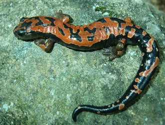

# [[Bolitoglossinae]] 

 

## #has_/text_of_/abstract 

> **Bolitoglossinae** is a subfamily of lungless salamander. Most of them are native to tropical areas in Central and South America, though a few such as Batrachoseps are found in temperate regions. Its sister group is the extinct genus Palaeoplethodon.
>
> [Wikipedia](https://en.wikipedia.org/wiki/Bolitoglossinae) 

## Introduction

[David Wake and Tom Devitt](http://www.tolweb.org/) 

Members of the subfamily Bolitoglossinae occur in western North America,
Central America and South America. All of the tropical representatives
are included within a single clade (supergenus *Bolitoglossa*) that has
undergone an extensive evolutionary radiation in the New World tropics,
including highly arboreal and fossorial groups (Wake and Lynch, 1976).
Convergent and parallel evolutionary origins of webbing of the feet are
observed in several genera, with the most extensive webbing found in
arboreal and semiarboreal members of the genus *Bolitoglossa* (Wake and
Lynch, 1976; Alberch, 1981; Wake, 1991; Parra-Olea et al., 2004).
Convergent and parallel evolutionary trends are observed also for
elongate, fossorial forms among the tropical genera *Lineatriton* and
*Oedipina* and the temperate supergenus *Batrachoseps* (Parra-Olea and
Wake, 2001).

The supergenus *Bolitoglossa* contains about two-thirds of plethodontid
species and 40% of all species of salamanders. The genus *Bolitoglossa*
represents the largest and most widely distributed genus of salamander,
with over 90 species, or about 17% of all recognized salamander species
([AmphibiaWeb: Amphibian Facts](http://www.amphibiaweb.org/amphibian/facts.html)). The supergenus
*Batrachoseps* is comprised of a single genus (*Batrachoseps*) with two
subgenera recognized, *Batrachoseps* and *Plethopsis*, which are
restricted to the west coast of North America.

### Characteristics

#### Diagnosis

A unique synapomorphy of *Batrachoseps* , *Bolitoglossa* is loss of one
pair of chromosomes (N=13).

#### Detailed Characteristics of the Subfamily Bolitoglossinae 

Morphological characteristics detailed below are summarized from Lombard
and Wake\'s (1986) phylogenetic analysis of major plethodontid lineages
with special emphasis on evolution of feeding mechanisms. These
characteristics are useful in combination for distinguishing
bolitoglossine salamanders from other plethodontids, although the
characteristics listed are not synapomorphies of the subfamily
Bolitoglossinae.\

##### Tongue and Hyobranchial Apparatus

All bolitoglossines have attached projectile (*Batrachoseps*) or freely
projectile tongues (i.e., lack the genioglossus muscle and anterior
connective tissue; Lombard and Wake, 1986). The hyobranchial skeleton
lacks a urohyal, has an expanded basibranchial, and radii that are
closely attached to and continuous with the basibranchial. The
epibranchial is relatively longer than the basibranchial and first
ceratobranchial. The second ceratobranchial is larger in diameter than
the first ceratobranchial and constitutes the primary force-transmitting
element in the movement of the tongue. The rectus cervicis profundis
muscle is folded dorsally near its anterior end. The slip in the rectus
cervicis superficialis has been lost. The omohydoideus, genioglossus,
and circumglossus have been lost. The intraglossus is attached to the
anterior end of basibranchial, lingual cartilage, or equivalent, or to
the anterior end of the glossal ligament, ventral to the basibranchial.
The basiradialis muscle may be present or absent. The hyoglossus muscle
has a complete anterior section and posteriorly-oriented fibers in the
posterior section. The suprapeduncularis muscle is present. The ramus
hypoglossus bifurcates posteriorly, between the attachment of the first
ceratobranchial to the basibranchial and to the epibranchial.

##### Epibranchial Number

Embryos have a single epibranchial.

##### Tail Autotomy 

Cutaneous wound healing in the tail occurs, there are 2 caudosacral
vertebrae, the first caudal vertebra is specialized, and tail breakage
is localized.

##### Brain Stem Motor Column

There is only one class of brain stem motor column cells.

##### Jaws, Cranial Osteology and Structure of the Inner Ear

The bony shelf of the preorbital process is absent. A distinct lateral
spur on the parietal is present. Premaxillary bones are relatively
slender, and the intermaxillary gland is posterior to the pars dentalis.
The periotic canal is straight or with a dorsal loop after it leaves the
periotic cistern. Growth of otic semicircular ducts is nearly isometric.

##### Chromosome Number 

The diploid number of chromosomes is 26. 

##### Development 

Development is direct. 

### Classification

Traditionally, Plethdontidae was subdivided into two subfamilies,
Desmognathinae and Plethodontinae, the latter of which was further
subdivided into the tribes Bolitoglossini, Hemidactyliini and
Plethodontini (Wake, 1966; Lombard and Wake, 1986). More recent
phylogenetic analyses of whole mitochondrial genomic DNA sequences
(Mueller et al., 2004; Macey, 2005) and combined mitochondrial DNA,
nuclear DNA and morphology (Chippindale et al., 2004) reject the
monophyly of these traditional groupings. Consistent with their
phylogeny, Chippindale et al. (2004) recommended several taxonomic
changes that required minimal changes to traditional taxonomic
arrangements, including elevating the tribe Bolitoglossini to the
subfamily Bolitoglossinae.

### Discussion of Phylogenetic Relationships

Lombard and Wake (1986) postulated a sister-group relationship between
*Batrachoseps* and the supergenus *Bolitoglossa* based on 30
morphological characters with an emphasis on the hyobranchial skeleton
and musculature of the feeding system. Subsequent phylogenetic analyses
of combined mitochondrial DNA and morphology (Jackman et al., 1997) and
combined mitochondrial DNA, nuclear DNA and morphology support this
relationship (Chippindale et al., 2004). In contrast, Bayesian and
maximum likelihood analysis of whole mitochondrial genomic DNA sequences
recovered a sister-group relationship between *Batrachoseps* and
*Hemidactylium scutatum*, while parsimony analysis placed
*Hemidactylium* basal to all other plethodontids (Mueller et al., 2004;
Macey, 2005).

## Phylogeny 

-   « Ancestral Groups  
    -   [Plethodontidae](../Plethodontidae.md)
    -   [Caudata](../../Caudata.md)
    -   [Living Amphibians](Living_Amphibians)
    -   [Terrestrial Vertebrates](../../../../Terrestrial.md)
    -   [Sarcopterygii](../../../../../Sarc.md)
    -   [Gnathostomata](../../../../../../Gnath.md)
    -   [Vertebrata](../../../../../../../Vertebrata.md)
    -   [Craniata](../../../../../../../../Craniata.md)
    -   [Chordata](../../../../../../../../../Chordata.md)
    -   [Deuterostomia](../../../../../../../../../../Deutero.md)
    -  [Bilateria](../../../../../../../../../../../Bilateria.md))
    -  [Animals](../../../../../../../../../../../../Animals.md))
    -  [Eukarya](../../../../../../../../../../../../../Eukarya.md))
    -   [Tree of Life](../../../../../../../../../../../../../Tree_of_Life.md)

-   ◊ Sibling Groups of  Plethodontidae
    -   Bolitoglossinae
    -   [Spelerpinae](Spelerpinae.md)
    -   [Hemidactylium scutatum](Hemidactylium_scutatum)
    -   [Plethodontinae](Plethodontinae.md)

-   » Sub-Groups
    -   [Bolitoglossa](Bolitoglossinae/Bolitoglossa.md)

## Title Illustrations

-----------------------

Scientific Name ::     Bolitoglossa lincolni
Location ::           Caxaque (San Marcos, Guatemala)
Specimen Condition   Live Specimen
Copyright ::            © 2006 [Sean Michael Rovito](mailto:smrovito@berkeley.edu)

## Confidential Links & Embeds: 

### #is_/same_as :: [Bolitoglossinae](/_Standards/bio/bio~Domain/Eukarya/Animal/Bilateria/Deutero/Chordata/Craniata/Vertebrata/Gnath/Sarc/Tetrapods/Amphibia/Caudata/Plethodontidae/Bolitoglossinae.md) 

### #is_/same_as :: [Bolitoglossinae.public](/_public/bio/bio~Domain/Eukarya/Animal/Bilateria/Deutero/Chordata/Craniata/Vertebrata/Gnath/Sarc/Tetrapods/Amphibia/Caudata/Plethodontidae/Bolitoglossinae.public.md) 

### #is_/same_as :: [Bolitoglossinae.internal](/_internal/bio/bio~Domain/Eukarya/Animal/Bilateria/Deutero/Chordata/Craniata/Vertebrata/Gnath/Sarc/Tetrapods/Amphibia/Caudata/Plethodontidae/Bolitoglossinae.internal.md) 

### #is_/same_as :: [Bolitoglossinae.protect](/_protect/bio/bio~Domain/Eukarya/Animal/Bilateria/Deutero/Chordata/Craniata/Vertebrata/Gnath/Sarc/Tetrapods/Amphibia/Caudata/Plethodontidae/Bolitoglossinae.protect.md) 

### #is_/same_as :: [Bolitoglossinae.private](/_private/bio/bio~Domain/Eukarya/Animal/Bilateria/Deutero/Chordata/Craniata/Vertebrata/Gnath/Sarc/Tetrapods/Amphibia/Caudata/Plethodontidae/Bolitoglossinae.private.md) 

### #is_/same_as :: [Bolitoglossinae.personal](/_personal/bio/bio~Domain/Eukarya/Animal/Bilateria/Deutero/Chordata/Craniata/Vertebrata/Gnath/Sarc/Tetrapods/Amphibia/Caudata/Plethodontidae/Bolitoglossinae.personal.md) 

### #is_/same_as :: [Bolitoglossinae.secret](/_secret/bio/bio~Domain/Eukarya/Animal/Bilateria/Deutero/Chordata/Craniata/Vertebrata/Gnath/Sarc/Tetrapods/Amphibia/Caudata/Plethodontidae/Bolitoglossinae.secret.md)

