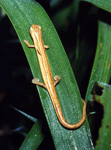

---
aliases:
- Bolitoglossa
- Pilzzungensalamander
- Shádiʼááhdę́ę́ʼ tsinlátah tsxilghááh
- سمندرهای زبانقارچی
- బొలీతొగ్లాస్స
- 游舌螈属
- 游舌螈屬
title: Bolitoglossa
dv_is_:
  same_as:
  - '[[/_Standards/bio/bio~Domain/Eukarya/Animal/Bilateria/Deutero/Chordata/Craniata/Vertebrata/Gnath/Sarc/Tetrapods/Amphibia/Caudata/Plethodontidae/Bolitoglossinae/Bolitoglossa|Bolitoglossa]]'
  - '[[/_public/bio/bio~Domain/Eukarya/Animal/Bilateria/Deutero/Chordata/Craniata/Vertebrata/Gnath/Sarc/Tetrapods/Amphibia/Caudata/Plethodontidae/Bolitoglossinae/Bolitoglossa.public|Bolitoglossa.public]]'
  - '[[/_internal/bio/bio~Domain/Eukarya/Animal/Bilateria/Deutero/Chordata/Craniata/Vertebrata/Gnath/Sarc/Tetrapods/Amphibia/Caudata/Plethodontidae/Bolitoglossinae/Bolitoglossa.internal|Bolitoglossa.internal]]'
  - '[[/_protect/bio/bio~Domain/Eukarya/Animal/Bilateria/Deutero/Chordata/Craniata/Vertebrata/Gnath/Sarc/Tetrapods/Amphibia/Caudata/Plethodontidae/Bolitoglossinae/Bolitoglossa.protect|Bolitoglossa.protect]]'
  - '[[/_private/bio/bio~Domain/Eukarya/Animal/Bilateria/Deutero/Chordata/Craniata/Vertebrata/Gnath/Sarc/Tetrapods/Amphibia/Caudata/Plethodontidae/Bolitoglossinae/Bolitoglossa.private|Bolitoglossa.private]]'
  - '[[/_personal/bio/bio~Domain/Eukarya/Animal/Bilateria/Deutero/Chordata/Craniata/Vertebrata/Gnath/Sarc/Tetrapods/Amphibia/Caudata/Plethodontidae/Bolitoglossinae/Bolitoglossa.personal|Bolitoglossa.personal]]'
  - '[[/_secret/bio/bio~Domain/Eukarya/Animal/Bilateria/Deutero/Chordata/Craniata/Vertebrata/Gnath/Sarc/Tetrapods/Amphibia/Caudata/Plethodontidae/Bolitoglossinae/Bolitoglossa.secret|Bolitoglossa.secret]]'
dv_is_same_as:
- '[[/_Standards/bio/bio~Domain/Eukarya/Animal/Bilateria/Deutero/Chordata/Craniata/Vertebrata/Gnath/Sarc/Tetrapods/Amphibia/Caudata/Plethodontidae/Bolitoglossinae/Bolitoglossa|Bolitoglossa]]'
- '[[/_public/bio/bio~Domain/Eukarya/Animal/Bilateria/Deutero/Chordata/Craniata/Vertebrata/Gnath/Sarc/Tetrapods/Amphibia/Caudata/Plethodontidae/Bolitoglossinae/Bolitoglossa.public|Bolitoglossa.public]]'
- '[[/_internal/bio/bio~Domain/Eukarya/Animal/Bilateria/Deutero/Chordata/Craniata/Vertebrata/Gnath/Sarc/Tetrapods/Amphibia/Caudata/Plethodontidae/Bolitoglossinae/Bolitoglossa.internal|Bolitoglossa.internal]]'
- '[[/_protect/bio/bio~Domain/Eukarya/Animal/Bilateria/Deutero/Chordata/Craniata/Vertebrata/Gnath/Sarc/Tetrapods/Amphibia/Caudata/Plethodontidae/Bolitoglossinae/Bolitoglossa.protect|Bolitoglossa.protect]]'
- '[[/_private/bio/bio~Domain/Eukarya/Animal/Bilateria/Deutero/Chordata/Craniata/Vertebrata/Gnath/Sarc/Tetrapods/Amphibia/Caudata/Plethodontidae/Bolitoglossinae/Bolitoglossa.private|Bolitoglossa.private]]'
- '[[/_personal/bio/bio~Domain/Eukarya/Animal/Bilateria/Deutero/Chordata/Craniata/Vertebrata/Gnath/Sarc/Tetrapods/Amphibia/Caudata/Plethodontidae/Bolitoglossinae/Bolitoglossa.personal|Bolitoglossa.personal]]'
- '[[/_secret/bio/bio~Domain/Eukarya/Animal/Bilateria/Deutero/Chordata/Craniata/Vertebrata/Gnath/Sarc/Tetrapods/Amphibia/Caudata/Plethodontidae/Bolitoglossinae/Bolitoglossa.secret|Bolitoglossa.secret]]'
dv_scientific_name: Bolitoglossa striatula
dv_location: Costa Rica
dv_image_use: '[Attribution-NonCommercial-ShareAlike 2.0 Creative Commons License](http://creativecommons.org/licenses/by-nc-sa/2.0/).'
dv_copyright: © 2006 [Jack Goldfarb](http://flickr.com/people/the_horned_jew_lizard/)
has_id_wikidata: Q2670457
dv_has_:
  name_:
    an: Bolitoglossa
    ast: Bolitoglossa
    bg: Bolitoglossa
    ca: Bolitoglossa
    ceb: Bolitoglossa
    de: Pilzzungensalamander
    en: Bolitoglossa
    eo: Bolitoglossa
    es: Bolitoglossa
    eu: Bolitoglossa
    ext: Bolitoglossa
    fa: سمندرهای زبانقارچی
    fi: Bolitoglossa
    fr: Bolitoglossa
    ga: Bolitoglossa
    gl: Bolitoglossa
    ia: Bolitoglossa
    ie: Bolitoglossa
    io: Bolitoglossa
    it: Bolitoglossa
    la: Bolitoglossa
    mul: Bolitoglossa
    nl: Bolitoglossa
    nv: Shádiʼááhdę́ę́ʼ tsinlátah tsxilghááh
    oc: Bolitoglossa
    pl: Bolitoglossa
    pt: Bolitoglossa
    pt_br: Bolitoglossa
    ro: Bolitoglossa
    ru: Bolitoglossa
    sq: Bolitoglossa
    sv: Bolitoglossa
    te: బొలీతొగ్లాస్స
    tr: Bolitoglossa
    uk: Bolitoglossa
    vi: Bolitoglossa
    vo: Bolitoglossa
    war: Bolitoglossa
    zh: 游舌螈属
    zh_cn: 游舌螈属
    zh_hans: 游舌螈属
    zh_tw: 游舌螈屬
---

# [[Bolitoglossa]] 

## #has_/text_of_/abstract 

> **Bolitoglossa** is a genus of lungless salamanders, commonly called mushroom-tongued salamanders, tropical climbing salamanders, and web-footed salamanders, in the family Plethodontidae. Their combined geographic ranges extend from northern Mexico through Central America to Colombia, Venezuela, Ecuador, Peru, northeastern Brazil, and central Bolivia. Neotropical salamanders of the genus Bolitoglossa make up the largest genus in the order Caudata, consisting of approximately one-fifth of all known species of salamanders.  Adult salamanders of the genus Bolitoglossa have a snout-to-vent length in the range of 45–200 mm (1.8–7.9 in) depending on the particular species. They are known for the ability to project the tongue to seize prey items. They are also known for webbed feet, having significantly more webbing than any other species outside their genus with the exception of the cave-dwelling Mexican bolitoglossine Chiropterotriton magnipes. Although webbed feet are a common characteristic of these salamanders, only about half of the species in this genus contain webbed feet.
>
> [Wikipedia](https://en.wikipedia.org/wiki/Bolitoglossa) 

## Introduction

[Tom Devitt and David Wake](http://www.tolweb.org/) 

The supergenus *Bolitoglossa* has undergone an extensive adaptive
radiation in Neotropical middle America and South America (Wake and
Lynch, 1976), containing about two-thirds of plethodontid species and
40% of all species of salamanders. Thirteen genera comprise the
supergenus *Bolitoglossa*: *Bolitoglossa, Bradytriton, Chiropterotriton,
Cryptotriton, Dendrotriton, Ixalotriton, Lineatriton, Nototriton,
Nyctanolis, Oedipina, Parvimolge, Pseudoeurycea*, and *Thorius*.
*Parvimolge, Lineatriton* and *Ixalotriton* are nested within the large
genus *Pseudoeurycea*, pending revision of the latter. At present
*Pseudoeurycea* sensu lato includes 51 species. The genus *Bolitoglossa*
represents the largest and most widely distributed genus of salamander,
with over 90 species, or about 17% of all recognized salamander species
([AmphibiaWeb: Amphibian Facts](http://amphibiaweb.org/amphibian/facts.html)).

Convergent and parallel evolutionary origins of webbing of the feet are
observed in several genera, with the most extensive webbing found in
arboreal and semiarboreal members of the genus *Bolitoglossa* (Wake and
Lynch, 1976; Alberch, 1981; Wake, 1991; Parra-Olea et al., 2004). Other
species with extensively-webbed feet include *Chiropterotriton magnipes*
and *Oedipina carablanca*. Convergent and parallel evolutionary trends
are observed also for elongate, fossorial forms among the tropical
genera *Lineatriton* and *Oedipina* (Parra-Olea and Wake, 2001).

### Characteristics

#### Detailed Characteristics of the Supergenus *Bolitoglossa*

Morphological characteristics detailed below are summarized from Lombard
and Wake\'s (1986) phylogenetic analysis of major plethodontid lineages
with special emphasis on evolution of feeding mechanisms. These
characteristics are useful in combination for distinguishing
bolitoglossine salamanders from other plethodontids, although the
characteristics listed are not synapomorphies of the supergenus
*Bolitoglossa*.\

##### Tongue and Hyobranchial Apparatus

Members of the supergenus *Bolitoglossa* have freely projectile tongues
(i.e., lack the genioglossus muscle and anterior connective tissue;
Lombard and Wake, 1986). The hyobranchial skeleton lacks a urohyal, has
an expanded basibranchial, and radii that are closely attached to and
continuous with the basibranchial. The epibranchial is relatively longer
than the basibranchial and first ceratobranchial. The second
ceratobranchial is larger in diameter than the first ceratobranchial and
constitutes the primary force-transmitting element in the movement of
the tongue. The rectus cervicis profundis muscle is folded dorsally near
its anterior end. The slip in the rectus cervicis superficialis has been
lost. The omohydoideus, genioglossus, and circumglossus have been lost.
The intraglossus is attached to the anterior end of basibranchial,
lingual cartilage, or equivalent, or to the anterior end of the glossal
ligament, ventral to the basibranchial. The basiradialis muscle may be
present or absent. The hyoglossus muscle has a complete anterior section
and posteriorly-oriented fibers in the posterior section. The
suprapeduncularis muscle is present. The ramus hypoglossus bifurcates
posteriorly, between the attachment of the first ceratobranchial to the
basibranchial and to the epibranchial.\

##### Epibranchial Number

Embryos have a single epibranchial.

##### Tail Autotomy 

Cutaneous wound healing in the tail occurs, there are 2 caudosacral
vertebrae, the first caudal vertebra is specialized, and tail breakage
is localized.

##### Brain Stem Motor Column

There is only one class of brain stem motor column cells.

##### Jaws, Cranial Osteology and Structure of the Inner Ear

The bony shelf of the preorbital process is absent. A distinct lateral
spur on the parietal is present. Premaxillary bones are relatively
slender, and the intermaxillary gland is posterior to the pars dentalis.
The periotic canal is straight or with a dorsal loop after it leaves the
periotic cistern. Growth of otic semicircular ducts is nearly isometric.

##### Chromosome Number 

The diploid number of chromosomes is 26. 

##### Development 

Development is direct. 

### Classification

The supergenus *Bolitoglossa* at present includes 13 genera (Wiens et
al., 2007). Three genera are involved in a paraphyletic to polyphyletic
relationship with *Pseudoeurycea*, and revisionary studies are in
progress. The two species of *Ixalotriton* form a clade but their sister
taxon is unclear. Wiens et al. (2007) found *Parvimolge* to be the
sister taxon, but without strong statistical support. *Parvimolge* may
be the sister taxon of *Pseudoeurycea* , *Ixalotriton* , *Lineatriton*.
*Lineatriton* is diphyletic with respect to mtDNA and is deeply nested
within *Pseudoeurycea*, close to species associated with *P. leprosa*.
The diminutive *Cryptotriton* is at present improbably resolved as the
sister taxon of all remaining members of the supergenus. 
*Bolitoglossa*, the largest genus, is comprised of 6 subgenera, based on
mtDNA, all well-supported statistically (Parra-Olea et al., 2004).

### Discussion of Phylogenetic Relationships

Phylogenetic relationships within genera of tropical bolitoglossines
have been inferred primarily using mitochondrial DNA sequence data
(e.g., García-París and Wake, 2000; García-París et al., 2000;
Parra-Olea and Wake, 2001; Parra-Olea 2002, 2003; Parra-Olea et al.
2002, 2004; Wiens et al., 2007). Frost et al. (2006) used both
mitochondrial and nuclear DNA sequence data in their higher-level
analysis of amphibian relationships, which included 10 of 13 tropical
bolitoglossine genera, but they used only data from GenBank for most of
the species, and had nuclear data for only three species. Wiens et al.
(2007) investigated relationships among genera with more comprehensive
taxon sampling but using only mitochondrial DNA sequences.

The results of Wiens et al. (2007) and Frost et al. (2006) are generally
concordant, placing *Thorius* sister to a clade comprising
*Bolitoglossa, Pseudoeurycea* and related smaller genera nested within
*Pseudoeurycea* (*Ixalotriton, Lineatriton*). Both Wiens et al. (2007)
and Frost et al. (2006) recovered *Oedipina, Nototriton*, and
*Dendrotriton* together in a basal clade. However, Wiens et al. (2007)
placed *Parvimolge* with *Pseudoeurycea* while Frost et al. (2006)
placed it with *Bolitoglossa*. Wiens et al. (2007) placed *Cryptotriton*
as sister to all other tropical bolitoglossines, while Frost et al.
(2006) placed *Cryptotriton* sister to *Dendrotriton*. Wiens et al.
(2007) placed *Nyctanolis* sister to *Dendrotriton*, with these two
sister to a clade containing *Nototriton* and *Oedipina , Bradytriton*.

## Phylogeny 

-   « Ancestral Groups  
    -   [Bolitoglossinae](../Bolitoglossinae.md)
    -   [Plethodontidae](../../Plethodontidae.md)
    -   [Caudata](../../../Caudata.md)
    -   [Living Amphibians](Living_Amphibians)
    -   [Terrestrial Vertebrates](../../../../../Terrestrial.md)
    -   [Sarcopterygii](../../../../../../Sarc.md)
    -   [Gnathostomata](../../../../../../../Gnath.md)
    -   [Vertebrata](../../../../../../../../Vertebrata.md)
    -   [Craniata](../../../../../../../../../Craniata.md)
    -   [Chordata](../../../../../../../../../../Chordata.md)
    -   [Deuterostomia](../../../../../../../../../../../Deutero.md)
    -  [Bilateria](../../../../../../../../../../../../Bilateria.md) 
    -  [Animals](../../../../../../../../../../../../../Animals.md) 
    -  [Eukarya](../../../../../../../../../../../../../../Eukarya.md) 
    -   [Tree of Life](../../../../../../../../../../../../../../Tree_of_Life.md)

-   ◊ Sibling Groups of  Bolitoglossinae
    -   Bolitoglossa

-   » Sub-Groups 

## Title Illustrations

------------------------------------------------------------------ 
 
<<<<<<< HEAD
 scientific_name = `$= dv.current.dv_scientific_name` 
 location = `$= dv.current.dv_location` 
Acknowledgements     This image is licensed under the [Attribution-NonCommercial-ShareAlike 2.0 Creative Commons License](http://creativecommons.org/licenses/by-nc-sa/2.0/).
Specimen Condition   Live Specimen
 image_use = `$= dv.current.dv_image_use` 
 copyright = `$= dv.current.dv_copyright` 
=======
scientific_name ::     Bolitoglossa striatula
location ::           Costa Rica
Acknowledgements     This image is licensed under the [Attribution-NonCommercial-ShareAlike 2.0 Creative Commons License](http://creativecommons.org/licenses/by-nc-sa/2.0/).
specimen_condition ::  Live Specimen
Image Use ::    [Attribution-NonCommercial-ShareAlike 2.0 Creative Commons License](http://creativecommons.org/licenses/by-nc-sa/2.0/).
copyright ::            © 2006 [Jack Goldfarb](http://flickr.com/people/the_horned_jew_lizard/)
>>>>>>> 3e86c9139ca52bccc61f0fc9e1d5cb2c79ce56c4

## Confidential Links & Embeds: 

### #is_/same_as :: [[/_Standards/bio/bio~Domain/Eukarya/Animal/Bilateria/Deutero/Chordata/Craniata/Vertebrata/Gnath/Sarc/Tetrapods/Amphibia/Caudata/Plethodontidae/Bolitoglossinae/Bolitoglossa|Bolitoglossa]] 

### #is_/same_as :: [[/_public/bio/bio~Domain/Eukarya/Animal/Bilateria/Deutero/Chordata/Craniata/Vertebrata/Gnath/Sarc/Tetrapods/Amphibia/Caudata/Plethodontidae/Bolitoglossinae/Bolitoglossa.public|Bolitoglossa.public]] 

### #is_/same_as :: [[/_internal/bio/bio~Domain/Eukarya/Animal/Bilateria/Deutero/Chordata/Craniata/Vertebrata/Gnath/Sarc/Tetrapods/Amphibia/Caudata/Plethodontidae/Bolitoglossinae/Bolitoglossa.internal|Bolitoglossa.internal]] 

### #is_/same_as :: [[/_protect/bio/bio~Domain/Eukarya/Animal/Bilateria/Deutero/Chordata/Craniata/Vertebrata/Gnath/Sarc/Tetrapods/Amphibia/Caudata/Plethodontidae/Bolitoglossinae/Bolitoglossa.protect|Bolitoglossa.protect]] 

### #is_/same_as :: [[/_private/bio/bio~Domain/Eukarya/Animal/Bilateria/Deutero/Chordata/Craniata/Vertebrata/Gnath/Sarc/Tetrapods/Amphibia/Caudata/Plethodontidae/Bolitoglossinae/Bolitoglossa.private|Bolitoglossa.private]] 

### #is_/same_as :: [[/_personal/bio/bio~Domain/Eukarya/Animal/Bilateria/Deutero/Chordata/Craniata/Vertebrata/Gnath/Sarc/Tetrapods/Amphibia/Caudata/Plethodontidae/Bolitoglossinae/Bolitoglossa.personal|Bolitoglossa.personal]] 

### #is_/same_as :: [[/_secret/bio/bio~Domain/Eukarya/Animal/Bilateria/Deutero/Chordata/Craniata/Vertebrata/Gnath/Sarc/Tetrapods/Amphibia/Caudata/Plethodontidae/Bolitoglossinae/Bolitoglossa.secret|Bolitoglossa.secret]] 

