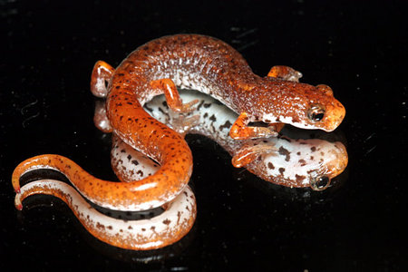

---
aliases:
  - Hemidactylinae
title: Hemidactylium scutatum
---

## [[Hemidactylinae]] 

Hemidactylium scutatum
The Four-Toed Salamander 

 

## Introduction

[Tom Devitt](http://www.tolweb.org/) 

The Four-Toed Salamander is a small plethodontid with a widespread,
fragmented distribution ranging from southern Canada southward to the
Gulf of Mexico and westward to Oklahoma, Missouri, and Wisconsin
(Petranka, 1998). Adults of this species are terrestrial and inhabit
forested areas with fishless swamps or vernal pools that serve as
breeding areas. Females often nest in moss clumps near the water's edge,
and may utilize communal nests. Joint nests in Michigan have been
recorded containing over 1,000 eggs from 30-35 females (Blanchard,
1934). Unlike most other plethodontids which are capable of caudal
autotomy only when grabbed by a predator, *Hemidactylium scutatum* may
voluntarily autotomize its tail (Petranka, 1998).

### Characteristics

#### Diagnosis 

*Hemidactylium scutatum* is readily identified by having only four toes
on each hindfoot, a constriction around the base of the tail, and a
boldly patterned venter that is white with black blotches.

#### Detailed Characteristics of the Subfamily Hemidactylinae

Characteristics are summarized from Lombard and Wake\'s (1986)
phylogenetic analysis of major plethodontid lineages based on 30
morphological characters with special emphasis on the hyobranchial
skeleton and musculature of the feeding system. These characteristics
are useful in combination for distinguishing *Hemidactylium* from other
plethodontids, although the characteristics listed are not
synapomorphies of the subfamily Hemidactylinae.\

##### Tongue and Hyobranchial Apparatus

The tongue is projectile (attached). The hyobranchial skeleton includes
a urohyal, an expanded basibranchial, and radii that are discrete,
rounded elements tapered towards their tips and distinctly separated
from and articulated with the basibranchials. The epibranchial is
relatively longer than the basibranchial or first ceratobranchial. The
first ceratobranchial is larger than the second ceratobranchial and
constitutes the main force-transmitting element in movement of the
tongue. The rectus cervicis profundis muscle is folded dorsally near its
anterior end. The rectus cervicis superficialis has a lateral slip. The
omohydoideus, circumglossus and basiradialis muscles are present. The
genioglossus muscle is also present, and its origin is shifted
posteriorly along the mandible. The intraglossus is attached to the
anterior end of basibranchial, lingual cartilage, or equivalent. The
anterior section of the hyoglossus muscle has been lost. The posterior
fibers of the hyoglossus are oriented posteriorly. The suprapeduncularis
muscle is well developed. The ramus hypoglossus bifurcates distally,
near the tip of the basibranchial.\

##### Epibranchial Number

Larvae have three or four epibranchials (Rose, 1995, 2003).\

##### Tail Autotomy

Cutaneous wound healing occurs, there are 3 caudosacral vertebrae, the
first and second caudal vertebrae are specialized, and tail breakage is
localized.\

##### Brain Stem Motor Column 

There are two distinct classes of cells in the motor column of the neck
and trunk.\

##### Jaws, Cranial Osteology and Structure of the Inner Ear

The tooth row lies anterior to a bony shelf of the preorbital process.
Parietal bones have a distinct ventrolateral shelf. The facial lobe of
the maxilla is located in a position near the anterior end of the
maxilla, with a distinct section of the pars dentalis extending anterior
to it. The premaxillae surround an intermaxillary gland that lies
directly behind the pars dentalis. In the inner ear, the periotic canal
forms a ventral loop immediately after leaving the periotic cistern. The
bore radius of the otic semiarticular ducts has a negative allometry
with respect to body weight.\

##### Chromosome Number

The diploid number of chromosomes is 28.\

##### Development 

*Hemidactylium scutatum* has a biphasic life history featuring gilled,
aquatic larvae and fully metamorphosed adults.\

### Phylogenetic Position of *Hemidactylium scutatum*

The phylogenetic placement of *Hemidactylium* is currently uncertain,
although it does not appear to be closely related to other members of
the former tribe Hemidactyliini (*Eurycea, Gyrinophilus, Haideotriton,
Pseudotriton, Stereochilus*) or nested within any of the other major
plethodontid clades (Bolitoglossinae or Plethodontinae \[including the
supergenus *Desmognathus*\]; Chippindale et al., 2004; Mueller et al.,
2004; Macey, 2005; Min et al., 2005).

### Classification

Based on their phylogenetic analysis of morphology, mitochondrial DNA
and nuclear DNA sequences, Chippindale et al. (2004) recommended
elevating the tribe Hemidactyliini (sensu Wake, 1966; Lombard and Wake,
1986) to the subfamily Hemidactylinae, reserving the name Hemidactylinae
for *Hemidactylium* and recognizing the subfamily Spelerpinae to
represent remaining members of the Hemidactyliini (*Eurycea*,
*Gyrinophilus*, *Haideotriton*, *Pseudotriton*, and *Stereochilus*).
Similarly, Macey (2005) recommended placing *Hemidactylium* in its own
subfamily (Hemidactylinae) and recognizing remaining taxa previously
assigned to Hemidactyliini in their own subfamily, based on his analysis
of whole mitochondrial genomic DNA sequences.

## Phylogeny 

-   « Ancestral Groups  
    -   [Plethodontidae](../Plethodontidae.md)
    -   [Caudata](../../Caudata.md)
    -   [Living Amphibians](Living_Amphibians)
    -   [Terrestrial Vertebrates](../../../../Terrestrial.md)
    -   [Sarcopterygii](../../../../../Sarc.md)
    -   [Gnathostomata](../../../../../../Gnath.md)
    -   [Vertebrata](../../../../../../../Vertebrata.md)
    -   [Craniata](../../../../../../../../Craniata.md)
    -   [Chordata](../../../../../../../../../Chordata.md)
    -   [Deuterostomia](../../../../../../../../../../Deutero.md)
    -  [Bilateria](../../../../../../../../../../../Bilateria.md) 
    -  [Animals](../../../../../../../../../../../../Animals.md) 
    -  [Eukarya](../../../../../../../../../../../../../Eukarya.md) 
    -   [Tree of Life](../../../../../../../../../../../../../Tree_of_Life.md)

-   ◊ Sibling Groups of  Plethodontidae
    -   [Bolitoglossinae](Bolitoglossinae.md)
    -   [Spelerpinae](Spelerpinae.md)
    -   Hemidactylium scutatum
    -   [Plethodontinae](Plethodontinae.md)

-   » Sub-Groups 

## Title Illustrations

---------------------

scientific_name ::     Hemidactylium scutatum
location ::           St. Genevieve Co., Missouri
specimen_condition ::  Live Specimen
copyright ::            © 2005 [Michael Cravens](http://michaelcravens.com/)

## Confidential Links & Embeds: 

### #is_/same_as :: [[/_Standards/bio/bio~Domain/Eukarya/Animal/Bilateria/Deutero/Chordata/Craniata/Vertebrata/Gnath/Sarc/Tetrapods/Amphibia/Caudata/Plethodontidae/Hemidactylinae|Hemidactylinae]] 

### #is_/same_as :: [[/_public/bio/bio~Domain/Eukarya/Animal/Bilateria/Deutero/Chordata/Craniata/Vertebrata/Gnath/Sarc/Tetrapods/Amphibia/Caudata/Plethodontidae/Hemidactylinae.public|Hemidactylinae.public]] 

### #is_/same_as :: [[/_internal/bio/bio~Domain/Eukarya/Animal/Bilateria/Deutero/Chordata/Craniata/Vertebrata/Gnath/Sarc/Tetrapods/Amphibia/Caudata/Plethodontidae/Hemidactylinae.internal|Hemidactylinae.internal]] 

### #is_/same_as :: [[/_protect/bio/bio~Domain/Eukarya/Animal/Bilateria/Deutero/Chordata/Craniata/Vertebrata/Gnath/Sarc/Tetrapods/Amphibia/Caudata/Plethodontidae/Hemidactylinae.protect|Hemidactylinae.protect]] 

### #is_/same_as :: [[/_private/bio/bio~Domain/Eukarya/Animal/Bilateria/Deutero/Chordata/Craniata/Vertebrata/Gnath/Sarc/Tetrapods/Amphibia/Caudata/Plethodontidae/Hemidactylinae.private|Hemidactylinae.private]] 

### #is_/same_as :: [[/_personal/bio/bio~Domain/Eukarya/Animal/Bilateria/Deutero/Chordata/Craniata/Vertebrata/Gnath/Sarc/Tetrapods/Amphibia/Caudata/Plethodontidae/Hemidactylinae.personal|Hemidactylinae.personal]] 

### #is_/same_as :: [[/_secret/bio/bio~Domain/Eukarya/Animal/Bilateria/Deutero/Chordata/Craniata/Vertebrata/Gnath/Sarc/Tetrapods/Amphibia/Caudata/Plethodontidae/Hemidactylinae.secret|Hemidactylinae.secret]] 

