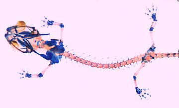

# [[Plethodontinae]] 

## #has_/text_of_/abstract 

> Plethodontidae, or lungless salamanders, are a family of salamanders. With over 500 species, lungless salamanders are by far the largest family of salamanders in terms of their diversity. Most species are native to the Western Hemisphere, from British Columbia to Brazil. Only two extant genera occur in the Eastern Hemisphere: Speleomantes (native to Sardinia and mainland Europe south of the Alps) and Karsenia (native to South Korea).
>
> [Wikipedia](https://en.wikipedia.org/wiki/Plethodontidae) 

## Introduction

[Allan Larson, David Wake, and Tom Devitt](http://www.tolweb.org/) 

The subfamily Plethodontinae (sensu Chippindale et al., 2004 and Min et
al., 2005) contains salamanders of the genera *Aneides* and *Plethodon,*
which occur in both eastern and western North America, the western North
American genus *Ensatina*, the Korean *Karsenia koreana*, the supergenus
*Desmognathus* of the eastern U.S., and the genus *Hydromantes* of
California, southern Europe, and Sardinia (sensu Wake et al., 2005).
*Aneides*, *Plethodon* and *Ensatina* inhabit underground retreats where
eggs are laid during drier periods, becoming active just beneath the
surface under logs and rocks on the forest floor during wetter periods.
These salamanders are completely terrestrial and have no free-living
aquatic larval stage. Surface activity is highly seasonal for most
species and usually occurs on wet nights.

Members of the supergenus *Desmognathus* are widely distributed in the
forests of eastern North America. Three species (*Desmognathus aeneus*,
*Desmognathus wrighti* and *Phaeognathus hubrichti)* are strictly
terrestrial and lack an aquatic larval stage. Eggs are laid on land and
hatch fully formed. All remaining species belong to the genus
*Desmognathus* and have biphasic life histories featuring gilled,
aquatic larvae and fully metamorphosed adults. *Hydromantes* salamanders
are associated with caves and rocky areas of relief in California
(subgenus *Hydromantes*) and southern Europe (southwestern France and
Peninsular Italy and Sardinia; subgenera *Atylodes* and *Speleomantes*).

*Ensatina* and *Plethodon* (except *Plethodon petraeus)* occur primarily
on the forest floor and have only limited ability for climbing in low
vegetation. Some *Aneides* species show greater climbing ability and
associated arboreality (most highly developed in *A. ferreus*, *A.
vagrans,* and *A. lugubris*; Larson et al., 1981) or use of rock
crevices (*A. aeneus*)*.* Morphological changes associated with
evolution of climbing in *Aneides* include lengthening of the limbs and
digits, rearrangements of the cartilaginous carpal and tarsal elements,
and expansion of terminal phalanges to enhance grasping (Wake, 1963;
Larson et al., 1981). *Plethodon petraeus* (Wynn et al., 1988)
demonstrates adaptations for climbing in rock crevices, some of which
parallel those of *Aneides.*

*Aneides* also demonstrates morphological evolutionary changes that
strengthen the jaws, including fusion of premaxillary bones, enlarged
unicuspid teeth, dorsoventral expansion of the posterior portion of the
maxilla, and rearranged throat musculature (Wake, 1963; Larson et al.,
1981: Wake and Larson, 1987). The prominent jaw muscles of *Aneides*
give their head a more massive and triangular appearance relative to the
other plethodonine salamanders. These features are often especially
pronounced in males. The strengthened jaws and enlarged, sharp teeth of
*Aneides* are used in aggressive encounters among conspecifics (Staub,
1993). When handled, *Aneides lugubris* occasionally delivers bites that
can draw blood but are not seriously dangerous. The strengthened jaws of
*Aneides* have been hypothesized to be adaptations for acquiring food
while maintaining a perch in arboreal habitats (Larson et al., 1981).

The genus *Hydromantes* comprises three clades, one in California
(subgenus *Hydromantes*), and two in Southern Europe and Sardinia
(subgenera *Atylodes* and *Speleomantes*; Wake et al., 2005). Members of
the genus *Hydromantes* inhabit wet rocky areas and caves,  and possess
unique adaptations for locomotion on slippery rock surfaces, including
flattened digits that are webbed in some species. The short tail is used
to assist in maintaining a purchase on the substrate by pushing the tip
of the tail against the substrate each time a hind foot is moved
forward. One species, *Hydromantes platycephalus*, exhibits a unique
escape behavior. Like many other plethodontids, this species coils
tightly into a ball when disturbed or picked up. Unlike any other
species however, *H. platycephalus* will actually roll downhill  if
dropped (Garcia-Paris and Deban, 1995).

The salamanders of the genus *Ensatina* have been featured prominently
as an example of a ring species (Stebbins, 1949; Dobzhansky, 1958;
Futuyma, 1998; Dawkins, 2004; Wake, 2006). Populations of *Ensatina
eschscholtzii* demonstrate extensive variation in coloration, forming
seven recognized subspecies arranged geographically in a \"ring\"
encircling the central valley of California. Hybridization and
intergradation occur between adjacent subspecies in the ring except
where coastal and inland populations make contact at the southern end of
the geographic range of the species. This geographic pattern is
interpreted to illustrate gradual evolution of reproductive barriers
between populations, an important component of the formation of species.
Because molecular evolutionary studies illustrate extensive genetic
differentiation among populations of *Ensatina,* some systematists
prefer to regard this genus as containing two or more species rather
than a single \"ring species\" (Frost and Hillis, 1990; Highton, 1990).

Geographic variation in reproductive isolation among populations also
exists for members of the *Plethodon glutinosus* and *P. cinereus*
groups (Highton, 1972; Highton et al., 1989, respectively). *Plethodon
shermani*, a member of the *P. jordani* group, hybridizes with members
of the *P. glutinosus* group (Weisrock et al., 2005). A detailed
behavioral analysis of the evolution of sexual isolation within the
Plethodon glutinosus group was presented by Reagan (1992).

Members of the subfamily Plethodontinae show unusually high variation in
the mass of DNA in the cell nucleus. The C-value (mass of DNA in a
haploid, unreplicated set of chromosomes) has been reported to range
from 18 pg to 69 pg in the subfamily Plethodontinae with the full range
being evident within the genus *Plethodon* (reviewed by Larson, 1984;
Sessions and Larson, 1987; Gregory, 2006). Mass of the nuclear genome
may be inversely proportional to developmental rates, especially rates
of differentiation of regenerating limbs (Sessions and Larson, 1987).

### Characteristics

#### Detailed Characteristics of the Subfamily Plethodontinae

Characteristics are summarized from Lombard and Wake\'s (1986)
phylogenetic analysis of major plethodontid lineages based on 30
morphological characters with special emphasis on the hyobranchial
skeleton and musculature of the feeding system. These characteristics
are useful in combination for distinguishing plethodontine salamanders
from other plethodontids, although the characteristics listed are not
synapomorphies of the subfamily Plethodontinae. Because Wake and
Lombard's (1986) analysis of 30 morphological characters predated the
discovery of *Karsenia* (Min et al., 2005), the characteristics detailed
below were scored for *Karsenia* only where noted.

##### Tongue and Hyobranchial Apparatus

Tongues are attached to the jaw by a short muscle plus connective and
mucosal tissue. Tongues are protrusible (attached) in *Aneides*,
(supergenus) *Desmognathus*, *Karsenia*, and *Plethodon*; projectile
(attached) in *Ensatina*; and projectile (free) in *Hydromantes*.  The
hyobranchial skeleton includes a urohyal (except in *Hydromantes*),
cylindrical basibranchial (except in *Hydromantes* which has an expanded
basibranchial), and radii that are broad and flat and independent of the
basibranchial (except in the supergenus *Desmognathus*, where the radii
are rodlike structures of near constant diameter which retain their
individuality, and in *Hydromantes*, where the radii have been lost).
The basibranchial, first ceratobranchial and epibranchial elements are
of approximately equal length, differing from *Hydromantes*, where the
epibranchial is relatively longer, and the ceratobranchials are
relatively shorter. The first ceratobranchial is the longest element in
*Karsenia*, and the epibranchial is shorter than the basibranchial. The
mostly ossified basibranchial of *Karsenia* has a pronounced anterior
projection in front of the slender, elongate cornua. The first
ceratobranchial is larger than the second ceratobranchial and
constitutes the main force-transmitting element in movement of the
tongue, with the exception of *Hydromantes*, where the the second
ceratobranchial is larger in diameter than the first and constitutes the
primary force-transmitting element. The rectus cervicis profundis muscle
is linearly arranged, except in *Hydromantes* where the muscle is folded
dorsally near its anterior end. The rectus cervicis superficialis has a
lateral slip that has been lost in *Hydromantes*. The omohydoideus,
genioglossus, circumglossus and basiradialis muscles are present in all
taxa save for *Hydromantes*. *Hydromantes* is the only taxon in this
clade that possesses a muscular projection cylinder. The intraglossus is
attached to the anterior end of basibranchial, lingual cartilage, or
equivalent, except in *Ensatina*, where it attaches instead to the
anterior end of the glossal ligament, ventral to the basibranchial. The
anterior section of the hyoglossus muscle has been lost, apart from the
supergenus *Desmognathus*. The posterior fibers of the hyoglossus are
oriented posteriorly, excepting *Plethodon* and *Aneides* where these
fibers are oriented anteriorly. The suprapeduncularis muscle is well
developed in *Hydromantes*, but weakly developed in other members of
this clade. The ramus hypoglossus bifurcates distally, near the tip of
the basibranchial, except in *Ensatina* where the bifurcation is
posterior, between the attachment of the first ceratobranchial to the
basibranchial and to the epibranchial; in *Hydromantes*, the supply to
the tongue from the posterior bifurcationjoins with the ramus
linguinalis branch of cranial nerve IX.

Skeleton of *Aneides flavipunctatus* (juvenile specimen) (red = bone;
blue = cartilage). The hyobranchial skeleton is visible in blue at the
anterior portion of the specimen. (Photograph © Allan Larson)

 

##### Epibranchial Number 

*Plethodon*, *Aneides*, and *Ensatina* embryos have three epibranchials,
members of the supergenus *Desmognathus* have four, and *Hydromantes*
embryos have only one.

##### Tail Autotomy 

In *Plethodon*, *Aneides* and *Hydromantes*, cutaneous wound healing
occurs, there are 3 caudosacral vertebrae, the first caudal vertebra is
normal (not specialized), and tail breakage is not localized. In the
supergenus *Desmognathus*, cutaneous wound healing does not occur, there
are 2 caudosacral vertebrae, the first caudal vertebra is normal and
tail breakage is not localized. In *Ensatina*, cutaneous wound healing
in the tail occurs, there are 3 caudosacral vertebrae, the first caudal
vertebra is specialized, and tail breakage is localized. 

##### Brain Stem Motor Column

There are two distinct classes of cells in the motor column of the neck
and trunk, except in *Hydromantes*, which has only one class of cells. 

##### Jaws, Cranial Osteology and Structure of the Inner Ear

In the supergenus *Desmognathus*, the jaws are unique in having a
ligament extending from the jaw to the atlas vertebra. The vomer lacks
the bony shelf anterior to the preorbital process, not including the
supergenus *Desmognathus*. Parietal bones are relatively simple,
scalelike structures except in the supergenus *Desmognathus*, where a
deep, saddlelike groove is present that extends across the
posterolateral portion of the bone to accommodate the ligament extending
from the lower jaw to the atlas. In *Plethodon*, *Aneides*, and
*Ensatina*, the facial lobe of the maxilla is located in a relatively
posterior position, near the center of the pars dentalis; in the
supergenus *Desmognathus*, the facial lobe extends into the area vacated
by the prefrontal bones; in *Hydromantes*, the facial lobe lies in a
position near the anterior end of the maxilla, with a distinct section
of the pars dentalis extending anterior to it. The premaxillae surround
an intermaxillary gland that lies directly behind the pars dentalis,
except in the supergenus *Desmognathus*, where the premaxillary bones
are fused and the intermaxillary gland is entirely surrounded and,
occasionally, completely roofed by the expanded bony growth. In the
inner ear, the periotic canal forms a ventral loop immediately after
leaving the periotic cistern; *Hydromantes* differs in having a dorsal
loop. The bore radius of the otic semiarticular ducts has a negative
allometry with respect to body weight, although only slightly so in
*Ensatina*; the growth of the ducts is nearly isometric in
*Hydromantes*.

##### Chromosome Number

The diploid number of chromosomes is 28.

##### Development

Development is direct in *Aneides*, *Ensatina*, *Hydromantes*,
*Karsenia*, *Plethodon*, and three species of the supergenus
*Desmognathus* (*Desmognathus aeneus*, *D. wrighti* and *Phaeognathus
hubrichti*). All remaining species of the supergenus *Desmognathus*
belong to the genus *Desmognathus* and have biphasic life histories
featuring gilled, aquatic larvae and fully metamorphosed adults. 

### Classification

Traditionally, Plethdontidae was subdivided into two subfamilies,
Desmognathinae and Plethodontinae, the latter of which was further
subdivided into the tribes Bolitoglossini, Hemidactyliini and
Plethodontini (Wake, 1966; Lombard and Wake, 1986). Recent phylogenetic
analyses using whole mitochondrial genomic DNA sequences (Macey, 2005;
Mueller et al., 2004) and combined mitochondrial DNA, nuclear DNA and
morphology (Chippindale et al., 2004) however, have found desmognathines
to be nested within plethodontines.

As a result, Chippindale et al. (2004) recommended making the subfamily
Plethodontinae equivalent to the former tribe Plethodontini plus
*Desmognathus* and *Phaeognathus*, with those genera forming the
supergenus *Desmognathus* within Plethodontinae. Similarly, Macey (2005)
also recommended discontinuing recognition of the subfamily
Desmognathinae, instead including that group within Plethodontinae along
with *Hydromantes*, a taxon not included in the analysis of Chippindale
et al. (2004).\

Subsequently, Min et al. (2005) added the newly-discovered *Karsenia
koreana* to the subfamily Plethodontinae based on morphological and
molecular data.\
[ ]

Thus, the subfamily Plethodontinae (sensu Chippindale et al. \[2004\],
Macey \[2005\], and Min et al. \[2005\]),  comprises the genera
*Aneides, Ensatina*, *Hydromantes,* *Karsenia* and *Plethodon* plus the
supergenus *Desmognathus*. Although the closest relatives of
*Hydromantes* remain to be determined, recent phylogenetic results place
it within this clade  (Mueller et al., 2004; Macey, 2005; Min et al.,
2005).\

*Aneides* contains six species noteworthy because of evolutionarily
derived structures in the limbs and jaws (see introduction section
above). *Ensatina* is currently recognized as one species, although some
criteria would require that it be recognized as several different
species (Frost and Hillis, 1990; Highton, 1990).

The genus *Plethodon* has been divided into eight species groups
(Highton and Larson, 1979) based on statistical analysis of protein
variation (Highton, 1991; 1995), which are supported by phylogenetic
analysis of mitochondrial DNA sequence data (Mahoney, 2001).\

### Discussion of Phylogenetic Relationships

Phylogenetic relationships among plethodontines have been inferred from
allozymic, immunological, DNA sequence, and morphological data (Highton
and Larson, 1979; Maxson et al, 1979; Larson et al., 1981; Larson, 1984;
Highton et al., 1989; Highton, 1991; Wynn et al., 1988; Chippindale et
al., 2004; Mueller et al., 2004; Macey, 2005; Min et al., 2005). The
most recent phylogenetic analyses have recovered relationships that
contrast strongly with traditional taxonomic groupings based on
morphology, e.g., the placement of desmognathines within plethodontines
(Chippindale et al., 2004; Mueller et al., 2004; Macey, 2005; Min et
al., 2005).

Determining the phylogenetic positions of *Hydromantes*, *Ensatina*, and
*Hemidactylium* has been particularly problematic. Using partitioned
Bayesian and maximum likelihood analyses of whole mitochondrial genomic
DNA sequences, Mueller et al. (2004) found support for *Ensatina* as
sister to *Desmognathus* + *Phaeognathus*. *Hemidactylium* was placed
sister to *Batrachoseps* in partitioned Bayesian and maximum likelihood
analyses, while maximum parsimony placed *Hemidactylium* either at the
base of the tree or sister to all other plethodontids. *Hydromantes* was
placed as sister to *Aneides* when employing a single model of
nucleotide substitution, although this relationship was not supported
using their preferred method of analysis employing different models of
nucleotide substitution for different partitions of the data.

Similar to Mueller et al. (2004) Macey (2005) placed *Hemidactylium* as
sister to all other plethodontids using maximum parsimony.

Using Bayesian and maximum parsimony analysis based on separate and
combined analyses of morphological and molecular data, Chippindale et
al. (2004) placed *Ensatina* sister to (*Aneides*,
(*Desmognathus*,*Phaeognathus*)), with *Hemidactylium* sister to
(*Ensatina*,(*Aneides*,(*Desmognathus*,*Phaeognathus*))). *Hydromantes*
was not sampled in their study.

Min et al. (2005) investigated the phylogenetic position of *Karsenia*
using Bayesian phylogenetic analysis of the nuclear-encoded *RAG-1*
gene. Their analysis placed *Karsenia* as the sister taxon to a clade
comprising *Aneides* and members of the supergenus *Desmognathus* (sensu
Chippindale et al., 2004). *Ensatina* was placed sister to
*Hydromantes*, and together this clade was sister to
(*Karsenia*(*Aneides*,*Desmognathus*)). *Plethodon* was sister to
(*Ensatina*,*Hydromantes*(*Karsenia*(*Aneides*,*Desmognathus*))).
*Hemidactylium* was placed in a polytomy with a clade comprising members
of the Bolitoglossinae and another containing members of the Spelerpinae
(sensu Chippindale et al., 2004).

## Phylogeny 

-   « Ancestral Groups  
    -   [Plethodontidae](../Plethodontidae.md)
    -   [Caudata](../../Caudata.md)
    -   [Living Amphibians](Living_Amphibians)
    -   [Terrestrial Vertebrates](../../../../Terrestrial.md)
    -   [Sarcopterygii](../../../../../Sarc.md)
    -   [Gnathostomata](../../../../../../Gnath.md)
    -   [Vertebrata](../../../../../../../Vertebrata.md)
    -   [Craniata](../../../../../../../../Craniata.md)
    -   [Chordata](../../../../../../../../../Chordata.md)
    -   [Deuterostomia](../../../../../../../../../../Deutero.md)
    -  [Bilateria](../../../../../../../../../../../Bilateria.md))
    -  [Animals](../../../../../../../../../../../../Animals.md))
    -  [Eukarya](../../../../../../../../../../../../../Eukarya.md))
    -   [Tree of Life](../../../../../../../../../../../../../Tree_of_Life.md)

-   ◊ Sibling Groups of  Plethodontidae
    -   [Bolitoglossinae](Bolitoglossinae.md)
    -   [Spelerpinae](Spelerpinae.md)
    -   [Hemidactylium scutatum](Hemidactylium_scutatum)
    -   Plethodontinae

-   » Sub-Groups
    -   [Desmognathus](Plethodontinae/Desmognathus.md)

## Title Illustrations

--------------)
Scientific Name ::     Plethodon websteri
Location ::           southeastern United States
Specimen Condition   Live Specimen
Copyright ::            © 1996 Dr. Robert S. Simmons

## Confidential Links & Embeds: 

### #is_/same_as :: [Plethodontinae](/_Standards/bio/bio~Domain/Eukarya/Animal/Bilateria/Deutero/Chordata/Craniata/Vertebrata/Gnath/Sarc/Tetrapods/Amphibia/Caudata/Plethodontidae/Plethodontinae.md) 

### #is_/same_as :: [Plethodontinae.public](/_public/bio/bio~Domain/Eukarya/Animal/Bilateria/Deutero/Chordata/Craniata/Vertebrata/Gnath/Sarc/Tetrapods/Amphibia/Caudata/Plethodontidae/Plethodontinae.public.md) 

### #is_/same_as :: [Plethodontinae.internal](/_internal/bio/bio~Domain/Eukarya/Animal/Bilateria/Deutero/Chordata/Craniata/Vertebrata/Gnath/Sarc/Tetrapods/Amphibia/Caudata/Plethodontidae/Plethodontinae.internal.md) 

### #is_/same_as :: [Plethodontinae.protect](/_protect/bio/bio~Domain/Eukarya/Animal/Bilateria/Deutero/Chordata/Craniata/Vertebrata/Gnath/Sarc/Tetrapods/Amphibia/Caudata/Plethodontidae/Plethodontinae.protect.md) 

### #is_/same_as :: [Plethodontinae.private](/_private/bio/bio~Domain/Eukarya/Animal/Bilateria/Deutero/Chordata/Craniata/Vertebrata/Gnath/Sarc/Tetrapods/Amphibia/Caudata/Plethodontidae/Plethodontinae.private.md) 

### #is_/same_as :: [Plethodontinae.personal](/_personal/bio/bio~Domain/Eukarya/Animal/Bilateria/Deutero/Chordata/Craniata/Vertebrata/Gnath/Sarc/Tetrapods/Amphibia/Caudata/Plethodontidae/Plethodontinae.personal.md) 

### #is_/same_as :: [Plethodontinae.secret](/_secret/bio/bio~Domain/Eukarya/Animal/Bilateria/Deutero/Chordata/Craniata/Vertebrata/Gnath/Sarc/Tetrapods/Amphibia/Caudata/Plethodontidae/Plethodontinae.secret.md)

