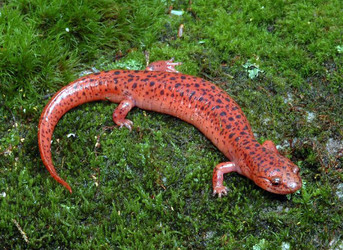
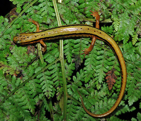

---
aliases:
- Bezpłucnikowate
- Keuhkottomat salamanterit
- longloze salamanders
- lungeløse salamandere
- lungeløse salamandre
- Lungenlose Salamander
- Lungless salamander
- Lunglösa salamandrar
- mločíci
- Oʻpkasiz salamandralar
- Plethodontidae
- Pletodontedoj
- Pletodòntid
- Spelerpinae
- Tsxilghááh íiyisígíí
- tüdőtlenszalamandra-félék
- безбелодробни саламандри
- Безлёгочные саламандры
- Безлегеневі саламандри
- Бязлёгачныя саламандры
- Өкпесіз саламандрлар
- פלתודוניים
- سمندر بیشش
- سمندر عديم الرئة
- سمندر عديمة الرئه
- უფილტვო სალამანდრისებრნი
- プレソドン科
- 无肺螈科
- 무폐도롱뇽류
title: Spelerpinae
has_id_wikidata: Q100340
dv_has_:
  name_:
    an: Plethodontidae
    ar: سمندر عديم الرئة
    arz: سمندر عديمة الرئه
    ast: Plethodontidae
    be: Бязлёгачныя саламандры
    bg: безбелодробни саламандри
    br: Plethodontidae
    ca: Pletodòntid
    ceb: Plethodontidae
    cs: mločíci
    da: lungeløse salamandre
    de: Lungenlose Salamander
    de_ch: Lungenlose Salamander
    en: Plethodontidae
    en_ca: Lungless salamander
    en_gb: Lungless salamander
    eo: Pletodontedoj
    es: Plethodontidae
    eu: Plethodontidae
    ext: Plethodontidae
    fa: سمندر بیشش
    fi: Keuhkottomat salamanterit
    fr: Plethodontidae
    ga: Plethodontidae
    gl: Plethodontidae
    he: פלתודוניים
    hu: tüdőtlenszalamandra-félék
    ia: Plethodontidae
    ie: Plethodontidae
    io: Plethodontidae
    it: Plethodontidae
    ja: プレソドン科
    ka: უფილტვო სალამანდრისებრნი
    kk: Өкпесіз саламандрлар
    ko: 무폐도롱뇽류
    la: Plethodontidae
    ms: Plethodontidae
    mul: Plethodontidae
    nb: lungeløse salamandere
    nl: longloze salamanders
    nv: Tsxilghááh íiyisígíí
    oc: Plethodontidae
    pl: Bezpłucnikowate
    pt: Plethodontidae
    pt_br: Plethodontidae
    ro: Plethodontidae
    ru: Безлёгочные саламандры
    sq: Plethodontidae
    sv: Lunglösa salamandrar
    tr: Plethodontidae
    uk: Безлегеневі саламандри
    uz: Oʻpkasiz salamandralar
    vi: Plethodontidae
    vo: Plethodontidae
    war: Plethodontidae
    zh: 无肺螈科
    zh_cn: 无肺螈科
    zh_hans: 无肺螈科
---

# [[Spelerpinae]] 

 

## #has_/text_of_/abstract 

> Plethodontidae, or lungless salamanders, are a family of salamanders. With over 500 species, lungless salamanders are by far the largest family of salamanders in terms of their diversity. Most species are native to the Western Hemisphere, from British Columbia to Brazil. Only two extant genera occur in the Eastern Hemisphere: Speleomantes (native to Sardinia and mainland Europe south of the Alps) and Karsenia (native to South Korea).
>
> [Wikipedia](https://en.wikipedia.org/wiki/Plethodontidae) 

## Introduction

[David Wake and Tom Devitt](http://www.tolweb.org/) 

Salamanders of the subfamily Spelerpinae are widely distributed across
eastern North America, extending as far west as the Interior Highlands
(Ozark Plateau and Ouachita Mountains) of the United States and the
Edwards Plateau region of central Texas. Populations of *Eurycea* found
in these highland regions likely represent relicts that became
restricted to mesic habitats as conditions became more arid (Wake, 1966;
Sweet, 1977, 1978, 1982; Chippindale, 2000). Some species exhibit a
biphasic life history (*Pseudotriton*, *Eurycea* except *Paedomolge*),
while others (*Haideotriton*, *Paedomolge*) are obligately aquatic and
perennibranchiate, retaining the morphological and ecological
characteristics of aquatic larvae throughout life.

Many perennibranchiate species are troglobitic (cave-dwelling),
exhibiting a range of morphological features associated with life in
caves, such as reduced eyes and skin pigmentation, broadening and
flattening of the skull, limb elongation, and reduction in the number of
trunk vertebrae (Chippindale, 2000). Multiple instances of convergence
(similarity between organisms that is the result of independent
adaptation to similar environments, rather than shared evolutionary
history) in troglobitic forms have confounded attempts to delimit
species and infer phylogenetic relationships based on morphological
features (Sweet, 1978, 1984; Chippindale et al., 2000; Wiens et al.,
2003). The application of molecular genetic data to spelerpine
salamanders has repeatedly uncovered substantial cryptic diversity
(Chippindale et al., 2000; Hillis et al., 2001; Bonett and Chippindale,
2004; Kozak et al., 2006).

### Characteristics

#### Detailed Characteristics of the Subfamily Spelerpinae

Characteristics are summarized from Lombard and Wake\'s (1986)
phylogenetic analysis of major plethodontid lineages based on 30
morphological characters with special emphasis on the hyobranchial
skeleton and musculature of the feeding system. These characteristics
are useful in combination for distinguishing spelerpines from other
plethodontids, although the characteristics listed are not
synapomorphies of the subfamily Spelerpinae.

##### Tongue and Hyobranchial Apparatus

Tongue is attached projectile (*Haideotriton*, *Stereochilus*, *Eurycea*
(*Typhlotriton*) *spelaeus*, *Typhlomolge* \[*Eurycea rathbuni, E.
robusta*, and probably *E. waterlooensis*\]) or free projectile
(remaining *Eurycea*, *Gyrinophilus*, and *Pseudotriton*). The
hyobranchial skeleton includes a urohyal, an expanded basibranchial, and
radii that are discrete, rounded elements tapered towards their tips and
distinctly separated from and articulated with the basibranchials. The
epibranchial is relatively longer than the basibranchial or first
ceratobranchial. The first ceratobranchial is larger than the second
ceratobranchial and constitutes the main force-transmitting element in
movement of the tongue. The rectus cervicis profundis muscle is linearly
arranged. The rectus cervicis superficialis has a lateral slip. The
omohydoideus, circumglossus and basiradialis muscles are present. The
genioglossus muscle is absent. The intraglossus is attached to the
anterior end of basibranchial, lingual cartilage, or equivalent. The
anterior section of the hyoglossus muscle is present. The posterior
fibers of the hyoglossus are oriented posteriorly. The suprapeduncularis
muscle is well developed. The ramus hypoglossus bifurcates distally,
near the tip of the basibranchial. 

##### Epibranchial Number

Larvae or embryos have three epibranchials.

##### Tail Autotomy

Cutaneous wound does not occur, there are 3 caudosacral vertebrae, the
first and second caudal vertebrae are normal (not specialized), and tail
breakage is not localized.

##### Brain Stem Motor Column

There are two distinct classes of cells in the motor column of the neck
and trunk. 

##### Jaws, Cranial Osteology and Structure of the Inner Ear

The tooth row lies anterior to a bony shelf of the preorbital process.
Parietal bones have a distinct ventrolateral shelf. The facial lobe of
the maxilla is located in a position near the anterior end of the
maxilla, with a distinct section of the pars dentalis extending anterior
to it. The premaxillae surround an intermaxillary gland that lies
directly behind the pars dentalis, or may be fused, with the
intermaxillary gland entirely surrounded and occasionally completely
roofed by the bony growth. In the inner ear, the periotic canal forms a
ventral loop immediately after leaving the periotic cistern. The bore
radius of the otic semiarticular ducts has a negative allometry with
respect to body weight.

##### Chromosome Number

The diploid number of chromosomes is 28.

##### Development

Some species exhibit a biphasic life history (*Pseudotriton*, *Eurycea*
except *Paedomolge*), while others remain perennibranchiate throughout
life (*Haideotriton*, *Paedomolge*).

### Classification

Chippindale et al. (2004) recommended recognizing the subfamily
Spelerpinae to represent members of the former tribe Hemidactyliini
(Wake, 1966; Lombard and Wake, 1986; *Eurycea*, *Gyrinophilus*,
*Haideotriton*, *Pseudotriton*, and *Stereochilus*), reserving the name
Hemidactylinae for *Hemidactylium*, based on phylogenetic analysis of
molecular and morphological data. Similarly, Macey (2005) recommended
placing *Hemidactylium* in its own subfamily (Hemidactylinae) and
recognizing remaining taxa previously assigned to Hemidactyliini in
their own subfamily, based on phylogenetic analysis of complete
mitochondrial genomic DNA sequences.

Within the Spelerpinae, Mitchell and Reddell (1965) proposed that
*Typhlomolge* be placed in the genus *Eurycea*, a change subsequently
supported by the molecular phylogenetic analysis of Chippindale et al.
(2000). Hillis et al. (2001) provided a phylogenetic taxonomy for this
group, assigning node-based clade names to several major clades. They
proposed retaining the name *Typhlomolge* to represent the lineage
comprising the last common ancestor of *E. rathbuni, E. robusta,* and
*E. waterlooensis*, plus all of its descendants. Bonnett and Chippindale
(2004) reassigned *Typhlotriton* to the genus *Eurycea* based on
phylogenetic analyses of mitochondrial DNA sequence data, and suggested
retaining the name *Typhlotriton* under a phylogenetic system of
classification.

### Discussion of Phylogenetic Relationships

Chippindale (2000), Chippindale et al. (1993, 1998, 2000), Hillis et al.
(2001) and Wiens et al. (2003) investigated phylogenetic relationships
within the central Texas paedomorphic clade of *Eurycea* (including
species formerly assigned to *Typhlomolge*) using allozymes,
mitochondrial DNA sequence data, and morphology. Bonett and Chippindale
(2004) used mitochondrial DNA sequence data to investigate phylogenetic
relationships among members of the *Eurycea multiplicata* complex, a
clade endemic to the Interior Highlands (Ozark Plateau and Ouachita
Mountains) of the United States that includes paedomorphic
surface-dwelling, metamorphic surface-dwelling, and metamorphic
subterranean members. Kozak et al. (2006) investigated the
phylogeography of members of the *Eurycea bislineata* complex using
mitochondrial DNA sequence data, revealing substantial
geographically-structured genetic diversity.

## Phylogeny 

-   « Ancestral Groups  
    -   [Plethodontidae](../Plethodontidae.md)
    -   [Caudata](../../Caudata.md)
    -   [Living Amphibians](Living_Amphibians)
    -   [Terrestrial Vertebrates](../../../../Terrestrial.md)
    -   [Sarcopterygii](../../../../../Sarc.md)
    -   [Gnathostomata](../../../../../../Gnath.md)
    -   [Vertebrata](../../../../../../../Vertebrata.md)
    -   [Craniata](../../../../../../../../Craniata.md)
    -   [Chordata](../../../../../../../../../Chordata.md)
    -   [Deuterostomia](../../../../../../../../../../Deutero.md)
    -  [Bilateria](../../../../../../../../../../../Bilateria.md) 
    -  [Animals](../../../../../../../../../../../../Animals.md) 
    -  [Eukarya](../../../../../../../../../../../../../Eukarya.md) 
    -   [Tree of Life](../../../../../../../../../../../../../Tree_of_Life.md)

-   ◊ Sibling Groups of  Plethodontidae
    -   [Bolitoglossinae](Bolitoglossinae.md)
    -   Spelerpinae
    -   [Hemidactylium scutatum](Hemidactylium_scutatum)
    -   [Plethodontinae](Plethodontinae.md)

-   » Sub-Groups 

## Title Illustrations

------------------------------------------------------------------

scientific_name ::     Pseudotriton ruber nitidus
specimen_condition ::  Live Specimen
Source               [Blue Ridge Red Salamander](http://flickr.com/photos/the_horned_jew_lizard/41503888/)
Source Collection    [Flickr](http://flickr.com/)
Image Use ::    [Attribution-NonCommercial-ShareAlike 2.0 Creative Commons License](http://creativecommons.org/licenses/by-nc-sa/2.0/).
copyright ::            © 2004 [Jack Goldfarb](http://flickr.com/people/the_horned_jew_lizard/)

------------------------------------------------------------------ 
 
scientific_name ::     Eurycea cirrigera
Acknowledgements     This image is licensed under the [Attribution-NonCommercial-ShareAlike 2.0 Creative Commons License](http://creativecommons.org/licenses/by-nc-sa/2.0/).
specimen_condition ::  Live Specimen
Image Use ::    [Attribution-NonCommercial-ShareAlike 2.0 Creative Commons License](http://creativecommons.org/licenses/by-nc-sa/2.0/).
copyright ::            © 2004 [Jack Goldfarb](http://flickr.com/people/the_horned_jew_lizard/)

## Confidential Links & Embeds: 

### #is_/same_as :: [[/_Standards/bio/bio~Domain/Eukarya/Animal/Bilateria/Deutero/Chordata/Craniata/Vertebrata/Gnath/Sarc/Tetrapods/Amphibia/Caudata/Plethodontidae/Spelerpinae|Spelerpinae]] 

### #is_/same_as :: [[/_public/bio/bio~Domain/Eukarya/Animal/Bilateria/Deutero/Chordata/Craniata/Vertebrata/Gnath/Sarc/Tetrapods/Amphibia/Caudata/Plethodontidae/Spelerpinae.public|Spelerpinae.public]] 

### #is_/same_as :: [[/_internal/bio/bio~Domain/Eukarya/Animal/Bilateria/Deutero/Chordata/Craniata/Vertebrata/Gnath/Sarc/Tetrapods/Amphibia/Caudata/Plethodontidae/Spelerpinae.internal|Spelerpinae.internal]] 

### #is_/same_as :: [[/_protect/bio/bio~Domain/Eukarya/Animal/Bilateria/Deutero/Chordata/Craniata/Vertebrata/Gnath/Sarc/Tetrapods/Amphibia/Caudata/Plethodontidae/Spelerpinae.protect|Spelerpinae.protect]] 

### #is_/same_as :: [[/_private/bio/bio~Domain/Eukarya/Animal/Bilateria/Deutero/Chordata/Craniata/Vertebrata/Gnath/Sarc/Tetrapods/Amphibia/Caudata/Plethodontidae/Spelerpinae.private|Spelerpinae.private]] 

### #is_/same_as :: [[/_personal/bio/bio~Domain/Eukarya/Animal/Bilateria/Deutero/Chordata/Craniata/Vertebrata/Gnath/Sarc/Tetrapods/Amphibia/Caudata/Plethodontidae/Spelerpinae.personal|Spelerpinae.personal]] 

### #is_/same_as :: [[/_secret/bio/bio~Domain/Eukarya/Animal/Bilateria/Deutero/Chordata/Craniata/Vertebrata/Gnath/Sarc/Tetrapods/Amphibia/Caudata/Plethodontidae/Spelerpinae.secret|Spelerpinae.secret]] 

