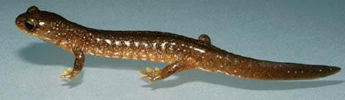

---
aliases:
  - Rhyacotritonidae
title: Rhyacotritonidae
---

# Rhyacotritonidae

Torrent Salamanders 

 

## #has_/text_of_/abstract 

> The torrent salamanders or Cascade salamanders are a family of salamanders (**Rhyacotritonidae**) with only one genus, Rhyacotriton. The torrent salamanders have highly reduced lungs and are endemic to the United States in the Pacific Northwest (including northwestern California).
>
> [Wikipedia](https://en.wikipedia.org/wiki/Torrent%20salamander) 

## Introduction

[Allan Larson](http://www.tolweb.org/) 

The salamander family Rhyacotritonidae contains four extant,
geographically distinct species placed in the single genus,
*Rhyacotriton* (Good and Wake, 1992). All species inhabit well aerated
springs and streams in the humid coniferous forests of northwestern
California, and the coastal and cascade regions of Oregon and Washington
(Good and Wake, 1992).

*Rhyacotriton* has a biphasic life cycle with gilled, aquatic larvae and
metamorphosed adults that generally live under rocks in streams,
although adults also utilize moist terrestrial habitats on the forest
floor. Good and Wake (1992) note that *Rhyacotriton* populations are
closely tied to old-growth forest and do not tolerate logging, making
*Rhyacotriton* a useful biological indicator of the recovery of degraded
habitats.

Prior to the work of Good et al. (1987), *Rhyacotriton* was considered a
single species, *Rhyacotriton olympicus.* This species was placed in the
salamander family Ambystomatidae and later moved with *Dicamptodon* to
the family Dicamptodontidae. Molecular phylogenetic studies (Larson,
1991; Larson and Dimmick, 1993) showed that *Rhyacotriton* is only a
distant relative to the genera *Ambystoma* and *Dicamptodon,* which are
closer phylogenetically to salamandrid and proteid genera than they are
to *Rhyacotriton. Rhyacotriton* represents an ancient lineage within the
clade of internally fertilizing salamanders and it has no close
relatives. Good and Wake (1992) formally recognized the family
Rhyacotritonidae to acknowledge the evolutionary distinctness of this
taxon.

### Characteristics

#### Diagnosis

Rhyacotritonids are relatively small salamanders (body length under 5
inches) having short tails and small heads with eyes proportionally
large and prominent. Dorsal coloration is brown, sometimes mottled with
grey, and the ventral coloration is yellow-orange, sometimes with black
spotting. Costal grooves usually number 14-15 and are clearly
demarcated.

#### Detailed Characteristics of the Rhyacotritonidae

The morphological characters given below are the ones standardly used to
diagnose the salamander family Rhyacotritonidae and to assess its
phylogenetic relationships to other salamanders. The individual
characteristics are in most cases shared with other salamanders and
should not be interpreted as synapomorphies of the Rhyacotritonidae.
Absence of characteristics found in other salamanders is noted where it
is important for distinguishing *Rhyacotriton* from other salamanders
and/or determining its relationships to other salamanders. These
characteristics were assembled from a large number of original sources
by Duellman and Trueb (1986), Larson (1991), Good and Wake (1992) and
Larson and Dimmick (1993).

###### Morphology of the Skull

The premaxilla consists of separated, paired bones. Nasal bones are
absent or reduced in size. Premaxillary processes have long posterior
extensions. Maxillary bones are present and well developed. Bilaterally
paired septomaxillary bones are present. Lacrimal bone is present.
Quadratojugal bone is absent. Pterygoid bones are present but small.
Internal carotid foramina are present in the parasphenoid bone. The
angular bone is fused to the mandible. Ear bones include a detached
columella but no operculum. Replacement of vomerine teeth proceeds from
the posterior of the vomer. Teeth have a distinct crown and pedicel.
Origin of the levator mandibulae anterior superficialis muscle includes
the exoccipital.

###### Inner Ear

A basilaris complex is present in the inner ear. Recessus amphibiorum is
oriented horizontally in the inner ear. The otic sac is bulbar and
unvascularized. The amphibian periotic canal lacks fibrous connective
tissue. The periotic cistern is small and does not protrude into the
fenestra.

###### Hyobranchial Structures

The first hypobranchial and first ceratobranchial (alternatively
homologized as the first ceratobranchial and first epibranchial,
respectively) exist as separate structures. The second ceratobranchial
(alternatively homologized as the second epibranchial) comprises a
single element. The otoglossal cartilage is present as a semicircular
ring in the hyoid apparatus of adults. Lungs are present but reduced in
size. An ypsiloid cartilage is present. Larvae have four pairs of gill
slits. Presence of three larval gill rakers is unique to *Rhyacotriton.*

###### Characteristics of the Trunk and Vertebral Column

The scapula and coracoid bones of the pectoral girdle are fused to form
the scapulocoracoid. Vertebral centra are amphicoelous. Ribs are
bicapitate. Only the sacral and postsacral vertebrae have spinal-nerve
foramina in their neural arches (foramen is partial in sacral vertebra).
The pubotibialis and puboischiotibialis exist as separate muscles.
Anterior glomeruli of the kidney are reduced or absent.

###### Reproductive Characters

Fertilization is internal. Ciliated epithelium is absent from the
cloacal tube and anterior cloacal chamber of females. Epidermal lining
is present in the anterior cloacal chamber of females. Evaginations are
present in dorsolateral walls of the cloacal tube in males. Anterior
ventral glands are absent from the cloacae of females. Spermathecae are
present in the female cloacal chamber. Glands secreting into the dorsal
walls of the female cloaca are absent. Anterior ventral glands are
present in male cloacae. Kingsbury\'s glands are present in male
cloacae. Dorsal pelvic glands are present in males. Lateral pelvic
glands are present in males. Glands secreting into the male cloacal
orifice are present. A tail-wagging display during courtship appears
unique to *Rhyacotriton.* Parental care of eggs is absent.

The diploid number of chromosomes is 26.

### Classification

The family Rhyacotritonidae was recognized by Good and Wake (1992) as
containing the single genus *Rhyacotriton.* This genus formerly was
placed in the families Ambystomatidae and Dicamptodontidae, but the
phylogenetic analyses of Larson (1991) and Larson and Dimmick (1993)
indicate that *Rhyacotriton* is only a distant relative of the other
salamanders placed in these families.

### Discussion of Phylogenetic Relationships

Knowledge of phylogenetic relationships among the four species of
*Rhyacotriton* comes from the allozymic studies of Good et al. (1987).
The phylogenetic relationships shown are revealed by analysis of Nei\'s
genetic distances using UPGMA clustering, analysis of Rogers\'s genetic
distances using the Fitch-Margoliash procedure, and analysis of
presence/absence of protein variants using the Wagner phylogenetic
method (Good et al., 1987). Outgroups were not used in these analyses,
so the position of the root corresponds to the midpoint of the tree and
should be considered tentative.

## Phylogeny 

-   « Ancestral Groups  
    -   [Caudata](../Caudata.md)
    -   [Living Amphibians](Living_Amphibians)
    -   [Terrestrial Vertebrates](../../../Terrestrial.md)
    -   [Sarcopterygii](../../../../Sarc.md)
    -   [Gnathostomata](../../../../../Gnath.md)
    -   [Vertebrata](../../../../../../Vertebrata.md)
    -   [Craniata](../../../../../../../Craniata.md)
    -   [Chordata](../../../../../../../../Chordata.md)
    -   [Deuterostomia](../../../../../../../../../Deutero.md)
    -  [Bilateria](../../../../../../../../../../Bilateria.md) 
    -  [Animals](../../../../../../../../../../../Animals.md) 
    -  [Eukarya](../../../../../../../../../../../../Eukarya.md) 
    -   [Tree of Life](../../../../../../../../../../../../Tree_of_Life.md)

-   ◊ Sibling Groups of  Caudata
    -   [Plethodontidae](Plethodontidae.md)
    -   [Amphiumidae](Amphiumidae.md)
    -   [Dicamptodontidae](Dicamptodontidae.md)
    -   [Ambystomatidae](Ambystomatidae.md)
    -   [Salamandridae](Salamandridae.md)
    -   Rhyacotritonidae
    -   [Proteidae](Proteidae.md)
    -   [Cryptobranchidae](Cryptobranchidae.md)
    -   [Hynobiidae](Hynobiidae.md)
    -   [Sirenidae](Sirenidae.md)

-   » Sub-Groups 

## Title Illustrations

-------------------------------------------------------------------------------

scientific_name ::  Rhyacotriton variegatus
location ::        Lincoln County, Oregon
copyright ::         © 1996 [Kevin de Queiroz](http://www.si.edu/ofg/Staffhp/deQueirozK.htm) 

## Confidential Links & Embeds: 

### #is_/same_as :: [[/_Standards/bio/bio~Domain/Eukarya/Animal/Bilateria/Deutero/Chordata/Craniata/Vertebrata/Gnath/Sarc/Tetrapods/Amphibia/Caudata/Rhyacotritonidae|Rhyacotritonidae]] 

### #is_/same_as :: [[/_public/bio/bio~Domain/Eukarya/Animal/Bilateria/Deutero/Chordata/Craniata/Vertebrata/Gnath/Sarc/Tetrapods/Amphibia/Caudata/Rhyacotritonidae.public|Rhyacotritonidae.public]] 

### #is_/same_as :: [[/_internal/bio/bio~Domain/Eukarya/Animal/Bilateria/Deutero/Chordata/Craniata/Vertebrata/Gnath/Sarc/Tetrapods/Amphibia/Caudata/Rhyacotritonidae.internal|Rhyacotritonidae.internal]] 

### #is_/same_as :: [[/_protect/bio/bio~Domain/Eukarya/Animal/Bilateria/Deutero/Chordata/Craniata/Vertebrata/Gnath/Sarc/Tetrapods/Amphibia/Caudata/Rhyacotritonidae.protect|Rhyacotritonidae.protect]] 

### #is_/same_as :: [[/_private/bio/bio~Domain/Eukarya/Animal/Bilateria/Deutero/Chordata/Craniata/Vertebrata/Gnath/Sarc/Tetrapods/Amphibia/Caudata/Rhyacotritonidae.private|Rhyacotritonidae.private]] 

### #is_/same_as :: [[/_personal/bio/bio~Domain/Eukarya/Animal/Bilateria/Deutero/Chordata/Craniata/Vertebrata/Gnath/Sarc/Tetrapods/Amphibia/Caudata/Rhyacotritonidae.personal|Rhyacotritonidae.personal]] 

### #is_/same_as :: [[/_secret/bio/bio~Domain/Eukarya/Animal/Bilateria/Deutero/Chordata/Craniata/Vertebrata/Gnath/Sarc/Tetrapods/Amphibia/Caudata/Rhyacotritonidae.secret|Rhyacotritonidae.secret]] 

