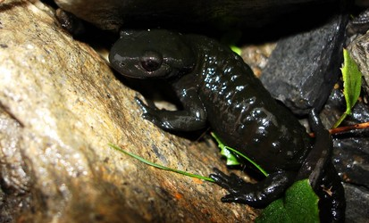

---
aliases:
- daždevnjak
- Eigentlech Salamanderen
- Eigentliche Salamander
- Marasàndula
- močerad
- Salamander
- salamandr
- Salamandra
- Salamandras
- Salamandro
- tulisalamanterit
- Tó wónaanídę́ę́ʼ tsxilghááh daalkizhígíí dóó bikʼéí
- даждевњак
- Саламандрæтæ
- Саламандра
- Саламандрасем
- саламандри
- סלמנדרה
- سالاماندرا
- سمندرهای سالاماندرا
- سمندل
- சலமாண்டிரா
- サラマンドラ属
- 真螈属
- 真螈屬
- 노랑무늬영원속
title: Salamandra
has_id_wikidata: Q62181
dv_has_:
  name_:
    an: Salamandra
    ar: سمندل
    arz: سالاماندرا
    ast: Salamandra
    bg: саламандри
    br: Salamandra
    ca: Salamandra
    ceb: Salamandra
    cs: Salamandra
    cv: Саламандрасем
    de: Eigentliche Salamander
    el: Salamandra
    eml: Marasàndula
    en: Salamandra
    eo: Salamandro
    es: Salamandra
    et: Salamander
    eu: Salamandra
    ext: Salamandra
    fa: سمندرهای سالاماندرا
    fi: tulisalamanterit
    fr: Salamandra
    ga: Salamandra
    gl: Salamandra
    he: סלמנדרה
    hy: salamandr
    ia: Salamandra
    ie: Salamandra
    io: Salamandra
    it: Salamandra
    ja: サラマンドラ属
    kk: Саламандра
    ko: 노랑무늬영원속
    la: Salamandra
    lb: Eigentlech Salamanderen
    lv: Salamandras
    mul: Salamandra
    nl: Salamandra
    nv: Tó wónaanídę́ę́ʼ tsxilghááh daalkizhígíí dóó bikʼéí
    oc: Salamandra
    os: Саламандрæтæ
    pl: Salamandra
    pt: Salamandra
    pt_br: Salamandra
    ro: Salamandra
    ru: Salamandra
    sco: Salamandra
    sl: močerad
    sq: Salamandra
    sr: даждевњак
    sr_ec: даждевњак
    sr_el: daždevnjak
    sv: Salamandra
    ta: சலமாண்டிரா
    tr: Salamandra
    uk: Саламандра
    vi: Salamandra
    vls: Salamandra
    vo: Salamandra
    war: Salamandra
    zh: 真螈属
    zh_cn: 真螈属
    zh_hans: 真螈属
    zh_tw: 真螈屬
---
# [[Salamandra]] 

## #has_/text_of_/abstract 

> **Salamandra** is a genus of six species of salamanders localized in central and southern Europe, Northern Africa, and western Asia.
>
> [Wikipedia](https://en.wikipedia.org/wiki/Salamandra) 

## Phylogeny 

-   « Ancestral Groups  
    -   [Salamandridae](../Salamandridae.md)
    -   [Caudata](../../Caudata.md)
    -   [Living Amphibians](Living_Amphibians)
    -   [Terrestrial Vertebrates](../../../../Terrestrial.md)
    -   [Sarcopterygii](../../../../../Sarc.md)
    -   [Gnathostomata](../../../../../../Gnath.md)
    -   [Vertebrata](../../../../../../../Vertebrata.md)
    -   [Craniata](../../../../../../../../Craniata.md)
    -   [Chordata](../../../../../../../../../Chordata.md)
    -   [Deuterostomia](../../../../../../../../../../Deutero.md)
    -  [Bilateria](../../../../../../../../../../../Bilateria.md) 
    -  [Animals](../../../../../../../../../../../../Animals.md) 
    -  [Eukarya](../../../../../../../../../../../../../Eukarya.md) 
    -   [Tree of Life](../../../../../../../../../../../../../Tree_of_Life.md)

-   ◊ Sibling Groups of  Salamandridae
    -   [Salamandrina](Salamandrina.md)
    -   Salamandra

-   » Sub-Groups 

## Title Illustrations

----------------------------------------------------------------------- 
 
scientific_name ::     Salamandra salamandra
location ::           Romania
specimen_condition ::  Live Specimen
Identified By        Horia Bogdan
Image Use ::    [Attribution-NonCommercial 2.0 Creative Commons License](http://creativecommons.org/licenses/by-nc/2.0/).
copyright ::            © [Horia Bogdan](http://herp-or.uv.ro/index) 

----------------------------------------------------------------------- 
 
scientific_name ::     Salamandra atra
location ::           Pont de Nant nature reserve in the western swiss alps
specimen_condition ::  Live Specimen
Source               [Salamandra atra](http://www.flickr.com/photos/philgimp/205901169/)
Source Collection    [Flickr](http://flickr.com/)
Image Use ::    [Attribution-NonCommercial-ShareAlike 2.0 Creative Commons License](http://creativecommons.org/licenses/by-nc-sa/2.0/).
copyright ::            © 2006 [Philippe Henry](http://flickr.com/people/66579298@N00)

## Confidential Links & Embeds: 

### #is_/same_as :: [[/_Standards/bio/bio~Domain/Eukarya/Animal/Bilateria/Deutero/Chordata/Craniata/Vertebrata/Gnath/Sarc/Tetrapods/Amphibia/Caudata/Salamandridae/Salamandra|Salamandra]] 

### #is_/same_as :: [[/_public/bio/bio~Domain/Eukarya/Animal/Bilateria/Deutero/Chordata/Craniata/Vertebrata/Gnath/Sarc/Tetrapods/Amphibia/Caudata/Salamandridae/Salamandra.public|Salamandra.public]] 

### #is_/same_as :: [[/_internal/bio/bio~Domain/Eukarya/Animal/Bilateria/Deutero/Chordata/Craniata/Vertebrata/Gnath/Sarc/Tetrapods/Amphibia/Caudata/Salamandridae/Salamandra.internal|Salamandra.internal]] 

### #is_/same_as :: [[/_protect/bio/bio~Domain/Eukarya/Animal/Bilateria/Deutero/Chordata/Craniata/Vertebrata/Gnath/Sarc/Tetrapods/Amphibia/Caudata/Salamandridae/Salamandra.protect|Salamandra.protect]] 

### #is_/same_as :: [[/_private/bio/bio~Domain/Eukarya/Animal/Bilateria/Deutero/Chordata/Craniata/Vertebrata/Gnath/Sarc/Tetrapods/Amphibia/Caudata/Salamandridae/Salamandra.private|Salamandra.private]] 

### #is_/same_as :: [[/_personal/bio/bio~Domain/Eukarya/Animal/Bilateria/Deutero/Chordata/Craniata/Vertebrata/Gnath/Sarc/Tetrapods/Amphibia/Caudata/Salamandridae/Salamandra.personal|Salamandra.personal]] 

### #is_/same_as :: [[/_secret/bio/bio~Domain/Eukarya/Animal/Bilateria/Deutero/Chordata/Craniata/Vertebrata/Gnath/Sarc/Tetrapods/Amphibia/Caudata/Salamandridae/Salamandra.secret|Salamandra.secret]] 

