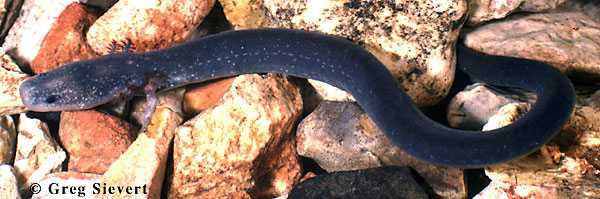

---
aliases:
  - Sirenidae
title: Sirenidae
---

# Sirenidae

Sirens 

## #has_/text_of_/abstract 

> **Sirenidae**, the sirens, are a family of neotenic aquatic salamanders. Family members have very small fore limbs, and lack hind limbs altogether. In one species, the skeleton in their fore limbs is made of only cartilage. In contrast to most other salamanders, they have external gills bunched together on the neck in both larval and adult states. Sirens are found only in the Southeastern United States and northern Mexico.
>
> Although they are primarily carnivorous, they are the only salamanders observed eating plant material.
>
> [Wikipedia](https://en.wikipedia.org/wiki/Sirenidae) 

## Introduction

[Allan Larson](http://www.tolweb.org/) 

Salamanders of the family Sirenidae do not metamorphose and retain the
appearance of an aquatic larva throughout life. They are long and
slender, with external gills, gill slits, small forelimbs and no
hindlimbs. The complete absence of hindlimbs distinguishes sirens from
all other salamanders. Sirens are often described as eel-like in
appearance.

Sirens inhabit shallow water in swamps, ditches and ponds, where muddy
substrates and dense growth of weeds produce favored habitats.

Sirens are often nocturnal in their activities and spend the day under
cover objects, burrowing in mud and weeds. Glands in the skin can create
a moisture-retaining seal over the body, permitting sirens to aestivate
in mud burrows when the shallow water of their habitats evaporates. When
active, sirens feed on a variety of invertebrate prey and plants, and
the greater siren also eats small fish.

Breeding occurs in winter or spring, and larvae hatch in spring. Mating
has not been observed for sirens, but fertilization of the eggs is
assumed to be external because the cloacal glands used by internally
fertilizing salamanders are absent in sirens (see \"Characteristics\"
section below). Eggs are guarded by females until they hatch.

Geographic distributions of the dwarf siren *(Pseudobranchus striatus)*
and greater siren *(Siren lacertina)* center around the Florida
peninsula and include adjacent areas in southern and coastal Georgia and
South Carolina. The greater siren also extends north along the Atlantic
coast through Virginia and west along the Gulf coast to Alabama. The
intermediate siren *(Siren intermedia)* inhabits Atlantic and Gulf
coastal regions from North Carolina to Texas and northern Mexico, and
also extends north through Arkansas, Missouri, Tennessee, Kentucky,
Illinois, Indiana and Michigan. Fossils indicate that the Sirenidae
formerly had a broader geographic distribution in North America than
currently observed, extending at least to Wyoming. No fossil sirenids
are known from outside North America.

### Characteristics

#### Diagnosis

Sirens are permanently aquatic and larval in form with a finlike tail,
large external gills, 1 or 3 pairs of gill slits, small eyes and no
eyelids. Forelimbs are relatively small (although larger than those of
amphiumas) and have four digits. Absence of hindlimbs distinguishes
sirens from all other salamanders. Sirens can aestivate in mud burrows
by secreting mucus around the body to protect it from desiccation.
Sirens have highly elongated bodies and are sometimes mistaken for eels.

#### Detailed Characteristics of the Sirenidae

The morphological characters given below are the ones standardly used to
diagnose the salamander family Sirenidae and to assess its phylogenetic
relationships to other salamanders. The individual characteristics are
in many cases shared with other salamanders and should not be
interpreted as synapomorphies of the Sirenidae. Absence of
characteristics found in other salamanders is noted where it is
important for distinguishing sirens from other salamanders and/or
determining their relationships to other salamanders. These
characteristics were assembled from a large number of original sources
by Duellman and Trueb (1986), Larson (1991) and Larson and Dimmick
(1993).

Metamorphosis is absent in the Sirenidae, leading to a number of
paedomorphic characteristics in adults.

###### Morphology of the skull

Premaxilla consists of separated, paired bones. Bilaterally paired nasal
bones each ossify from a single, medially-positioned anlage; long
posterior processes of the premaxillae extend lateral to the nasal
bones, which abut each other. Maxillary bones are present but small.
Septomaxillary bones are absent. Lacrimal bone is absent. Quadratojugal
bone is absent. Pterygoid bones are present but small. Internal carotid
foramina are absent from parasphenoid bones. The angular bone is fused
with the mandible. Ear bones include a detached columella but no
operculum. Replacement of vomerine teeth proceeds laterally in parallel
to the maxillary teeth. Teeth do not have a distinct crown and pedicel.
Origin of the levator mandibulae anterior superficialis muscle occurs on
the side of the skull and does not include the exoccipital. Eyelids are
absent.

###### Inner ear

A basilaris complex is present in the inner ear. The recessus
amphibiorum is oriented horizontally in the inner ear. The otic sac is
bulbar and partially vascularized. The amphibian periotic canal lacks
fibrous connective tissue. The periotic cistern is large. The periotic
cistern protrudes into the fenestra.

###### Hyobranchial structures

The first hypobranchial and first ceratobranchial (alternatively
homologized as the first ceratobranchial and first epibranchial,
respectively) exist as separate structures. The second ceratobranchial
(alternatively homologized as the second epibranchial) comprises four
elements. Lungs are present but the ypsiloid cartilage is absent. Larvae
have one pair *(Pseudobranchus)* or three pairs *(Siren)* of gill slits.

###### Characteristics of the trunk and vertebral column

The scapula and coracoid occur as separate bones of the pectoral girdle.
Vertebral centra are amphicoelous. Ribs are bicapitate. Spinal-nerve
foramina are present in neural arches of vertebrae for all spinal nerves
except those exiting between the atlas and first trunk vertebra. The
pubotibialis and puboischiotibialis are present as separate muscles.
Anterior glomeruli of the kidney are well developed.

###### Reproductive characters

Fertilization has not been observed but is presumed to be external.
Ciliated epithelium is absent from the cloacal tube and anterior cloacal
chamber of females. Epidermal lining is present in the anterior cloacal
chamber of females. Evaginations are absent from the dorsolateral walls
of the male cloacal tube. Anterior ventral glands are absent from the
cloacae of females. No spermathecae are present in the female cloacal
chamber. Glands secreting into the dorsal walls of the female cloaca are
absent. Anterior ventral glands are absent from male cloacae. Posterior
ventral glands are absent from male cloacae. Kingsbury\'s glands are
absent from male cloacae. Dorsal pelvic glands are absent in males.
Lateral pelvic glands are absent in males. Glands secreting into the
male cloacal orifice are absent. Parental care of eggs is by females.

The diploid number of chromosomes is high (46 for *Siren intermedia,* 52
for *Siren lacertina* and 64 for *Pseudobranchus striatus;* see
Morescalchi, 1975).

### Classification

The salamander family Sirenidae is the sole member of the caudate
suborder Sirenoidea. Sirens are sufficiently different from other
salamanders that they sometimes have been considered a separate
taxonomic order (named Meantes or Trachystomata) of amphibians.
Phylogenetic studies have disagreed on the exact placement of sirens,
but the best current hypothesis (see below) is that they are the sister
taxon to all remaining salamanders. They are clearly closer to the
salamanders than to any other extant amphibians, and their placement in
the order Caudata therefore is appropriate.

### Discussion of Phylogenetic Relationships

Unique morphological characteristics clearly establish monophyly of the
Sirenidae (Duellman and Trueb, 1986) and monophyly is supported also by
molecular data (Larson, 1991). The phylogeny presented here assumes
monophyly of the genus *Siren,* but additional molecular studies are
needed to test this hypothesis.

The best current hypothesis of salamander family relationships based
upon molecular and morphological data (Larson and Dimmick, 1993) places
the Sirenidae as the sister taxon to all remaining salamanders. This
relationship was suggested earlier by Duellman and Trueb (1986) based
upon morphology. The Sirenidae therefore appears to represent an ancient
lineage that has no close phylogenetic relatives among extant organisms.

## Phylogeny 

-   « Ancestral Groups  
    -   [Caudata](../Caudata.md)
    -   [Living Amphibians](Living_Amphibians)
    -   [Terrestrial Vertebrates](../../../Terrestrial.md)
    -   [Sarcopterygii](../../../../Sarc.md)
    -   [Gnathostomata](../../../../../Gnath.md)
    -   [Vertebrata](../../../../../../Vertebrata.md)
    -   [Craniata](../../../../../../../Craniata.md)
    -   [Chordata](../../../../../../../../Chordata.md)
    -   [Deuterostomia](../../../../../../../../../Deutero.md)
    -  [Bilateria](../../../../../../../../../../Bilateria.md) 
    -  [Animals](../../../../../../../../../../../Animals.md) 
    -  [Eukarya](../../../../../../../../../../../../Eukarya.md) 
    -   [Tree of Life](../../../../../../../../../../../../Tree_of_Life.md)

-   ◊ Sibling Groups of  Caudata
    -   [Plethodontidae](Plethodontidae.md)
    -   [Amphiumidae](Amphiumidae.md)
    -   [Dicamptodontidae](Dicamptodontidae.md)
    -   [Ambystomatidae](Ambystomatidae.md)
    -   [Salamandridae](Salamandridae.md)
    -   [Rhyacotritonidae](Rhyacotritonidae.md)
    -   [Proteidae](Proteidae.md)
    -   [Cryptobranchidae](Cryptobranchidae.md)
    -   [Hynobiidae](Hynobiidae.md)
    -   Sirenidae

-   » Sub-Groups 

## Title Illustrations

----------------------- 
)
Scientific Name ::  Siren intermedia
Location ::        Berkeley Co., South Carolina
Copyright ::         © 1996 [Greg Sievert](http://academic.emporia.edu/sievertg/)

## Confidential Links & Embeds: 

### #is_/same_as :: [Sirenidae](/_Standards/bio/bio~Domain/Eukarya/Animal/Bilateria/Deutero/Chordata/Craniata/Vertebrata/Gnath/Sarc/Tetrapods/Amphibia/Caudata/Sirenidae.md) 

### #is_/same_as :: [Sirenidae.public](/_public/bio/bio~Domain/Eukarya/Animal/Bilateria/Deutero/Chordata/Craniata/Vertebrata/Gnath/Sarc/Tetrapods/Amphibia/Caudata/Sirenidae.public.md) 

### #is_/same_as :: [Sirenidae.internal](/_internal/bio/bio~Domain/Eukarya/Animal/Bilateria/Deutero/Chordata/Craniata/Vertebrata/Gnath/Sarc/Tetrapods/Amphibia/Caudata/Sirenidae.internal.md) 

### #is_/same_as :: [Sirenidae.protect](/_protect/bio/bio~Domain/Eukarya/Animal/Bilateria/Deutero/Chordata/Craniata/Vertebrata/Gnath/Sarc/Tetrapods/Amphibia/Caudata/Sirenidae.protect.md) 

### #is_/same_as :: [Sirenidae.private](/_private/bio/bio~Domain/Eukarya/Animal/Bilateria/Deutero/Chordata/Craniata/Vertebrata/Gnath/Sarc/Tetrapods/Amphibia/Caudata/Sirenidae.private.md) 

### #is_/same_as :: [Sirenidae.personal](/_personal/bio/bio~Domain/Eukarya/Animal/Bilateria/Deutero/Chordata/Craniata/Vertebrata/Gnath/Sarc/Tetrapods/Amphibia/Caudata/Sirenidae.personal.md) 

### #is_/same_as :: [Sirenidae.secret](/_secret/bio/bio~Domain/Eukarya/Animal/Bilateria/Deutero/Chordata/Craniata/Vertebrata/Gnath/Sarc/Tetrapods/Amphibia/Caudata/Sirenidae.secret.md)

