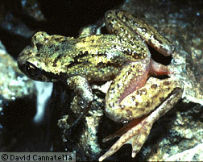
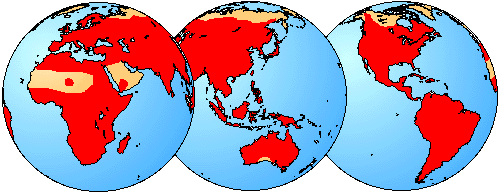
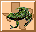

---
aliases:
- Salienta
- Salientia
- Salientuloj
- Skaczące
- قوافز
- پرشگران
- უკუდო ამფიბიები
- 无尾类
title: Salientia
has_id_wikidata: Q1746027
dv_has_:
  name_:
    an: Salientia
    ar: قوافز
    arz: قوافز
    ast: Salientia
    bg: Salientia
    ca: Salientia
    ceb: Salientia
    cs: Salientia
    de: Salientia
    el: Salientia
    en: Salientia
    eo: Salientuloj
    es: Salientia
    eu: Salientia
    ext: Salientia
    fa: پرشگران
    fi: Salientia
    fr: Salientia
    ga: Salientia
    gl: Salientia
    ia: Salientia
    id: Salientia
    ie: Salientia
    io: Salientia
    it: Salientia
    ka: უკუდო ამფიბიები
    la: Salientia
    mul: Salientia
    nb: Salienta
    nl: Salientia
    oc: Salientia
    pl: Skaczące
    pt: Salientia
    pt-br: Salientia
    ro: Salientia
    ru: Salientia
    sl: Salientia
    sq: Salientia
    sr: Salientia
    uk: Salientia
    vi: Salientia
    vo: Salientia
    war: Salientia
    zh: 无尾类
    zh-cn: 无尾类
---
# [[Salientia]]

## Frogs and toads 

## #has_/text_of_/abstract 

> The **Salientia** (Latin salire, salio meaning "to jump") are a total group of amphibians that includes the order Anura, the frogs and toads, and various extinct proto-frogs that are more closely related to the frogs than they are to the Urodela, the salamanders and newts. The oldest fossil "proto-frog" appeared in the early Triassic of Madagascar, but molecular clock dating suggests their origins may extend further back to the Permian, 265 million years ago.
>
> [Wikipedia](https://en.wikipedia.org/wiki/Salientia) 

### Information on the Internet

-   [AmphibiaTree](http://www.amphibiatree.org/). The mission of this
    project is the realization of a comprehensive phylogeny of all taxa
    of extant and extinct amphibians.
-   [AmphibiaWeb](http://elib.cs.berkeley.edu/aw/). A site inspired by
    global amphibian declines, is an online system that allows free
    access to information on amphibian biology and conservation.
-   [Amphibian Species of the     World](http://research.amnh.org/herpetology/amphibia/index.php).
    American Museum of Natural History.
-   [FrogWeb: Amphibian Declines &     Deformities](http://www.frogweb.gov/). National Biological
    Information Infrastructure.
-   [Froglog](http://www.open.ac.uk/daptf/froglog/). Newsletter of the
    Declining Amphibian Populations Task Force of the World Conservation
    Union\'s Species Survival Commission.
-   [FROGS.ORG](http://www.frogs.org/). Website of the Amphibian
    Conservation Alliance.
-   [Frogs. A Chorus of Colors](http://www.amnh.org/exhibitions/frogs/).
    American Museum of Natural History.
-   [Exploratorium:     Frogs](http://www.exploratorium.edu/frogs/index.html). An exhibition
    at the Exploratorium, the museum of science, art and human
    perception.
-   [The Frog Files](http://www.westernwildlife.com.au/frogs/index.htm).
    Information on the frogs of Western Australia.
-   [MidWest Frogs](http://www.midwestfrogs.com/). Frog call video
    clips.
-   [Frogs Home](http://www.seagrant.wisc.edu/frogs/index.html).
    University of Wisconsin Sea Grant Institute.
-   [A Thousand Friends of Frogs](http://cgee.hamline.edu/frogs/).
    Connecting children, parents, educators, and scientists to study and
    celebrate frogs and their habitats. Center for Global Environmental
    Education, Hamline University.
-   [Frogs and Toads in Color and     Sound](http://www.naturesound.com/frogs/frogs.html). Lang Elliott,
    NatureSound Studio.
-   [Manitoba Frog and Toad     Calls](http://www.naturenorth.com/spring/sound/shfrsnd.html).
-   Virtual frog dissections:
    -   [Net Frog](http://curry.edschool.virginia.edu/go/frog/Frog2/).
        Frog dissection and anatomy
    -   [Froguts](http://www.froguts.com/). The first true virtual
        online frog dissection.
    -   [LBL ITG Whole Fro         Project](http://www-itg.lbl.gov/ITG.hm.pg.docs/Whole.Frog/Whole.Frog.html).
        Interactive frog dissection kit.

## Introduction

[David Cannatella, Linda Ford, and Lori Bockstanz](http://www.tolweb.org/)

Salientia (Anura) includes frogs, toads and their close fossil
relatives. The closest living relatives of the Salientia are the other
amphibians, salamanders and caecilians. Frogs outnumber both of these
groups substantially; there are 162 living species of caecilians, 352
living salamanders, and 3438 species of frogs (Duellman and Trueb,
1986).

The earliest known salientian is †Triadobatrachus massinoti, from the
Early Triassic of Madagascar. This \"proto-frog\" is about 250 million
years old. We call it that because it had not yet quite evolved the
combination of features that we now think of as being associated with
frogs. For more information see [Triadobatrachus massinoti](tree?group=Triadobatrachus_massinoti&contgroup=Salientia).

The earliest \"true\" frog is †[Vieraella herbsti](tree?group=Vieraella_herbsti&contgroup=Salientia),
from the Early Jurassic era (188-213 my). Thus, perfectly respectable
frogs were around just before most of the major groups of dinosaurs had
appeared. †[Notobatrachus degiustoi](tree?group=Notobatrachus_degiustoi&contgroup=Salientia)
from the Middle Jurassic is just a bit younger, about 155-170 million
years old.

There are many distinctive features of living frogs. Frogs have at most
nine vertebrae in front of the sacrum, and the three or four posterior
to the sacrum are fused into a rod called the urostyle. In contrast,
caecilians and salamanders have many more vertebrae and they do not have
a urostyle. Frogs do not possess tails in the adult stage (\"Anura\"
means without tail), as caecilians and salamanders do. Frogs also have a
radioulna, which represents a fused radius and ulna (bones of the
forearm), and a tibiofibula, the fused tibia and fibula (bones of the
shank). The tibiale and fibulare (ankle bones; also called astragalus
and calcaneum) of frogs are greatly elongate. Thus there is effectively
an additional lever system that frogs can utilize in jumping. Indeed,
the origin of saltation and its morphological correlates (lack of a
tail, reduction in vertebrae, elongation of propulsive segments of the
body) seems to be one of the features that clearly sets frogs apart from
other major vertebrate groups (Gans and Parsons, 1966).

In addition to morphological distinctions, frogs also have a distinctive
life phase known as the tadpole, which is a highly specialized \"eating
machine.\" Salamanders and caecilians have a larval form, but in neither
does the larva possess the many specializations (such as the ceratohyal
pump) that frog tadpoles have (Wassersug, 1974). Even the most basal
living frogs have the beginnings of a unique mechanism of tongue
projection (Nishikawa and Cannatella, 1991; Nishikawa and Roth, 1991)
that is associated with extreme modification of the gill arches into a
fused hyobranchial plate.

Although there is no scientific distinction between \"frogs\" and
\"toads\", frogs are typically smooth-skinned, have long hind limbs for
leaping, and live in water, while toads have warty, drier skin, with
shorter hind limbs for hopping, and live on land (Halliday and Adler,
1986).

With so many species of frogs and toads, it is not surprising that they
inhabit a wide variety of habitats. Habitat types range from arid desert
regions to mountainous regions to swamps to tropical rainforests.

Temperature and water regulation are critical to frogs and toads, and
amphibians in general. Being ectotherms, frogs and toads are reliant on
the ambient temperature for body temperature regulation. In the winter
months, frogs in temperate zones cannot remain active and must enter
into a state of torpor, or extremely reduced activity. In the
contrasting summer months, frogs can avoid the extreme heat by remaining
underground in daylight, and being active at night (Halliday and Adler,
1986).

Salientians are also susceptible to the loss of body water due to
extremely hot or dry conditions. Moisture regulation in frogs varies
with their habitat. Those in temperate climates maintain moist skin to
aid in evaporative cooling. As external air passes over the moist skin,
the frog\'s body temperature is lowered. Additionally, permeable skin
allows the frog the ability to absorb water simply by jumping into a
pond or sitting in a puddle. Frogs in arid regions, on the other hand,
have different ways of regulating body water. Their skin is often
impermeable to water to prevent rapid evaporation and dehydration.
Instead, they may cover their bodies with a thick mucus, or burrow to
avoid the heat altogether.

Breeding in frogs is triggered by environmental cues such as temperature
change and rainfall. During the breeding season (which varies with each
species) hundreds or thousands of frogs may be seen in a congregation.
Male frogs attract mates by calling; often many males call in chorus.
Calling usually occurs near a body of water, such as a pond, where the
eggs can be laid and fertilized. Egg masses may be laid in long chains
or in large clumps. Parental care in frogs and toads is variable; some
species lay many smaller eggs and have little parental care, while
others lay a few larger eggs and remain with them until tadpoles or
froglets develop.

### Geographic Distribution

The global distribution of Salientia is indicated in red.

### Herpetological Fauna of Texas

The Salientia clade includes all frogs and toads from around the world.
For a list of only the frog families and species found in Texas, as well
as those for other amphibians and reptiles, click on the Herps of Texas
icon below. (Under construction)

](http://www.zo.utexas.edu/research/txherps/)
[Herps of Texas](http://www.zo.utexas.edu/research/txherps/)

### Discussion of Phylogenetic Relationships

#### Salientia

The name Salientia generally has referred to †Triadobatrachus + Anura
(Milner, 1988). Ford and Cannatella (1993) defined it as a stem-based
name for amphibians that are more closely related to Anura than to
Caudata or Gymnophiona. Synapomorphies that unite all of the currently
known taxa in Salientia include 14 presacral vertebrae, elongate and
anteriorly directed ilium, presence of a frontoparietal, and a toothless
dentary (Milner, 1988). To these, Trueb and Cloutier (1991) added the
absence of a lacrimal and unicapitate ribs as other unique
synapomorphies, and four other synapomorphies that showed homoplasy
among closely related dissorophoid temnospondyls.

#### Anura (Node A)

The node-based name Anura was defined by Ford and Cannatella (1993) as
the last common ancestor of living frogs and all its descendants.
According to this definition, †Triadobatrachus is not part of Anura,
following Trueb and Cloutier (1991). The late Jurassic fossil
†Notobatrachus degiustoi may or may not be part of Anura, depending on
whether it is the sister-group of Anura (Cannatella, 1985) or possibly
more closely related to Leiopelma (Estes and Reig, 1973). †Vieraella
herbstii is another relatively complete early Jurassic fossil, but is
less well-preserved than †Notobatrachus (Estes and Reig, 1973). The
presence of nine presacral vertebrae places it among the basal
salientians, but other characters are not sufficiently preserved to
permit definitive placement in Anura. The third well-preserved Jurassic
fossil taxon, †Eodiscoglossus santonje, has eight presacral vertebrae
(Estes and Reig, 1973), and thus is clearly within Anura. The other
Jurassic frogs are not sufficiently diagnosable to be relevant to a
discussion of the content of the Anura.

Synapomorphies of Anura include nine presacral vertebrae, atlas with a
single centrum, presence of a urostyle formed from caudal vertebral
segments, hindlimb longer than forelimb, fusion of radius and ulna,
fusion of tibia and fibula, elongate ankle bones (tibiale and fibulare =
astragalus and calcaneum), absence of a prefrontal, fusion of
hyobranchial elements into a hyoid plate, presence of keratinous beaks
and denticles on larval mouthparts, a single median spiracle in the
larva (a characteristic of the Type 3 tadpole), skin with large
subcutaneous lymph spaces, and two protractor lentis muscles attached to
lens (Milner, 1988, 1993; Saint-Aubain, 1981; Trueb and Cloutier, 1991).

The monophyly of Anura has rarely been questioned. Griffiths (1963:279)
considered Anura to be diphyletic; i.e., Ascaphus and Leiopelma
comprised one lineage, and all other frogs a second, \"\...stemming
independently from either different levels of a single proanuran
organization or different proanuran stocks.\" Rocek (1981) considered
†Triadobatrachus to be within Anura, and placed Pelobatidae (including
only Pelobates and some related fossils), and somewhat tentatively,
Pipidae, †Palaeobatrachidae, and Rhinophrynidae, in Archaeosalientia.
†Triadobatrachus and remaining anurans were included in Neosalientia.
The character distinguishing the two groups is a median dermal bone, the
interparietal (Reinbach, 1939), which Rocek homologized with the median
extrascapular of the osteolepiform fish †Eusthenopteron. The
interparietal is found in Pelobates and some fossil relatives, but not
in any pipoid frogs. Milner (1988) provided a cogent review of the
interpretation of this dermal element.

In a study of tetrapod phylogeny, Hedges et al. (1990) analyzed 123
phylogenetically informative sites from 18S ribosomal RNA of 21
tetrapods, including four salamanders, four caecilians, and one species
each from Bufonidae, Discoglossidae, Hylidae, Leptodactylidae,
Microhylidae, Pelobatidae, and Sooglossidae. Bootstrap analyses using
both maximum-parsimony and neighbor-joining algorithms did not support
the monophyly of Anura, Caudata, or Gymnophiona, but a monophyletic
Amphibia was supported with a bootstrap value of 100%. Hedges and Maxson
(1993) and Hillis et al. (1993) presented analyses of anuran
relationships based on DNA sequence data from the mitochondrial and
nuclear ribosomal genes, respectively.

Hedges et al. (1990) also analyzed 35 variable sites from 28S rRNA of
four species of frogs, from Discoglossidae, Hylidae, Pelobatidae, and
Pipidae. Bootstrap analysis of maximum parsimony trees yielded a
monophyletic Anura, but with no resolution among the four taxa. The
neighbor-joining analysis indicated a sister-group relationship between
the discoglossid and pipid, and between the bufonid and hylid, but the
bootstrap value for both of these nodes was less than 50%. Neither
analysis yielded a monophyletic Amphibia.

Hay et al. (1995) is the most comprehensive molecular systematics
treatment of the relationships among the families of amphibians. Their
neighbor-joining tree yielded a monophlyletic Anura, Caudata, and
Gymnophiona.

#### \"Archaeobatrachia\"

Archaeobatrachians have generally included discoglossoids, pipoids and
pelobatoids (Duellman, 1975; Reig, 1958). The synapomorphies discussed
below for Leiopelmatanura, Bombinanura, Discoglossanura, and Pipanura
collectively indicate that \"Archaeobatrachia\" is paraphyletic. The
informal term archaeobatrachian is a convenient term for anurans that
are not part of Neobatrachia.

#### Leiopelmatanura (Node B)

This new node-based name was applied by Ford and Cannatella (1993) to
the node that is the most recent ancestor of living Leiopelma +
Bombinanura (Ford and Cannatella, 1993). Synapomorphies of this clade
(Cannatella, 1985) include elongate arms on the sternum; loss of the
ascending process of the palatoquadrate; sphenethmoid ossifying in the
anterior position; the root of the facial nerve exits the braincase
through the facial foramen, anterior to the auditory capsule, rather
than via the anterior acoustic foramen into the auditory capsule
(Slabbert and Maree, 1945; Stephenson, 1951); and a palatoquadrate
articulation with the braincase via a pseudobasal process, rather than a
basal process (Pusey, 1943).

#### Bombinanura (Node C)

Bombinanura, a new node-based name, was defined by Ford and Cannatella
(1993) to be the most recent common ancestor of living Bombinatoridae
and Discoglossanura, and all its descendants. Synapomorphies of
Bombinanura include fusion of the halves of the sphenethmoid, eight
presacral vertebrae, absence of the m. epipubicus, and absence of the
caudalipuboischiotibialis muscle (Cannatella, 1985). Subclades of
Bombinanura include Bombinatoridae and Discoglossanura.

#### \"Discoglossidae\"

Most workers have placed Alytes, Discoglossus, Bombina, and Barbourula
in the family Discoglossidae although the dissimilarity of Alytes and
Discoglossus, on one hand, and Bombina on the other has often been noted
(e.g., Lanza et al., 1976). There are apparently no published
synapomorphies for \"Discoglossidae\", and synapomorphies of
Discoglossanura (below) reject the monophyly of \"Discoglossidae\" as
traditionally used. Griffiths (1963) stated that the diagnostic feature
of \"Discoglossidae\" (including Bombinatoridae and Discoglossidae) is a
triradiate sternum. However, this type of sternum is also present in
Leiopelma, and is interpreted as a synapomorphy of Leiopelmatanura.

#### Discoglossanura (Node D)

The new node-based name Discoglossanura is defined as the most recent
common ancestor of living Discoglossidae + Mesobatrachia + Neobatrachia,
and all its descendants. Synapomorphies of Discoglossanura include a
bicondylar sacrococcygeal articulation and the presence of an
episternum. Discoglossanura has two subgroups, Discoglossidae and
Pipanura.

Saint-Aubain (1981) listed synapomorphies from the ontogeny of the
carpus that suggested that Ascaphus, Leiopelma, bombinatorids,
discoglossids, and pipids form a clade. However, her sampling of taxa is
not sufficient to provide strong support for this clade, especially in
light of the synapomorphies supporting other arrangements.

#### Pipanura (Node E)

The node-based name Pipanura was proposed by Ford and Cannatella (1993)
for the most recent common ancestor of living Mesobatrachia +
Neobatrachia, and all its descendants. The subordinal name Ranoidei was
coined for this clade by Sokol (1977), but that name was re-assigned to
a less inclusive taxon by Dubois (1983, 1984). Sokol\'s (1977) use of
this name was unfortunate because the informal name, ranoid, is
homonymous with the widely used name Ranoidea.

Synapomorphies include a sinistral spiracle in the larvae (a
characteristic feature of Orton\'s Type 4 tadpole), absence of free ribs
in adults, torsion in the carpal elements, the presence of vocal sacs,
and fusion of the trigeminal and facial ganglia (Cannatella, 1985;
Sokol, 1975).

#### Mesobatrachia (Node F)

Ford and Cannatella (1993) applied the name Mesobatrachia to the node
that is the most recent common ancestor of the living Pelobatoidea and
Pipoidea. Synapomorphies of Mesobatrachia include closure of the
frontoparietal fontanelle by juxtaposition of the frontoparietal bones,
partial closure of the hyoglossal sinus by the ceratohyals (=hyalia),
absence of the taenia tecti medialis, and absence of the taenia tecti
transversum (Cannatella, 1985; Sokol, 1981). Mesobatrachia as proposed
by Laurent (1979) was a paraphyletic group. Cannatella (1985) first
applied the name to a clade. Most other taxonomies have placed the
Pelobatoidea as the sister-group to Neobatrachia, rather than to
Pipoidea. A derived character that refutes the monophyly of
Mesobatrachia is the fusion of the third distal carpal to other carpals,
which Pelodytes shares with Neobatrachia (Cannatella, 1985).

#### Pelobatoidea (Node G)

The name was applied to the node that is the common ancestor of living
Megophryidae, Pelobatidae, and Pelodytes. Synapomorphies of Pelobatoidea
include the presence of a palatine process of the maxilla and
ossification of the sternum into a bony style (Cannatella, 1985).
Duellman and Trueb (1986) listed the presence of a dorsal gap in the
cricoid ring as a synapomorphy for this clade. However, there is no gap
in Scaphiopus, Spea, Pelobates (except for the smallest species, P.
fuscus), or several megophryids; at best, the presence of a dorsal gap
would be an ambiguous synapomorphy. Relationships among the living
pelobatoids are an unresolved trichotomy of Megophryidae, Pelobatidae,
and Pelodytes.

#### Pipoidea (Node H)

Pipoidea was defined by Cannatella and Ford (1993) to be the most recent
common ancestor of living Pipidae + Rhinophrynidae, and all its
descendants. Pipoidea is diagnosed by several distinctive
synapomorphies, including the absence of mentomeckelian bones (see
comments below on †Palaeobatrachidae), absence of lateral alae of the
parasphenoid, fusion of the frontoparietals into an azygous element,
greatly enlarged otic capsules, and a tadpole with paired spiracles, and
lacking beaks and denticles (Orton Type 1 tadpole). Clades of Pipoidea
are Pipidae, †Palaeobatrachidae, some unplaced fossils \"pipids\" and
Rhinophrynidae.

#### Pipimorpha (Stem I)

The new stem-based name Pipimorpha was defined by Ford and Cannatella
(1993) to be those taxa that are more closely related to living Pipidae
than to living Rhinophrynus. Pending a more detailed assessment of the
relationships of †Palaeobatrachidae, Pipidae, and the fossil \"pipids,\"
we consider †Palaeobatrachidae, †Thoraciliacus, †Cordicephalus,
†Saltenia, †Shomronella, and †Eoxenopoides to be part of Pipimorpha.

## Phylogeny 

-   « Ancestral Groups  
    -   [Living Amphibians](Living_Amphibians)
    -   [Terrestrial Vertebrates](../../Terrestrial.md)
    -   [Sarcopterygii](../../../Sarc.md)
    -   [Gnathostomata](../../../../Gnath.md)
    -   [Vertebrata](../../../../../Vertebrata.md)
    -   [Craniata](../../../../../../Craniata.md)
    -   [Chordata](../../../../../../../Chordata.md)
    -   [Deuterostomia](../../../../../../../../Deutero.md)
    -  [Bilateria](../../../../../../../../../Bilateria.md) 
    -  [Animals](../../../../../../../../../../Animals.md) 
    -  [Eukarya](../../../../../../../../../../../Eukarya.md) 
    -   [Tree of Life](../../../../../../../../../../../Tree_of_Life.md)

-   ◊ Sibling Groups of  Living Amphibians
    -   Salientia
    -   [Caudata](Caudata.md)

-   » Sub-Groups
    -   
    -   [Vieraella herbsti](Salientia/Vieraella_herbsti.md)
    -   [Notobatrachus degiustoi](Salientia/Notobatrachus_degiustoi.md)
    -   [Ascaphus truei](Salientia/Ascaphus_truei.md)
    -   [Leiopelma](Salientia/Leiopelma.md)
    -   
    -   [Bombinatoridae](Salientia/Bombinatoridae.md)
    -   [Discoglossidae](Salientia/Discoglossidae.md)
    -   [Eopelobatinae](Salientia/Eopelobatinae.md)
    -   [Megophryidae](Salientia/Megophryidae.md)
    -   [Pelobatidae](Salientia/Pelobatidae.md)
    -   [Pelodytidae](Salientia/Pelodytidae.md)
    -   [Rhinophrynidae](Salientia/Rhinophrynidae.md)
    -   [\'Pipids\'](%27Pipids%27)
    -   [Palaeobatrachidae](Salientia/Palaeobatrachidae.md)
    -   [Pipid](Salientia/Pipid.md)
    -   [Neobatrachia](Salientia/Neobatrachia.md)

## Title Illustrations

-------------------------------------------------------------------------- 
 
scientific_name ::     Ascaphus truei
location ::           Oregon
specimen_condition ::  Live Specimen
Sex ::                Male
copyright ::            © 1995 [David Cannatella](http://www.catfishlab.org/) 

## Confidential Links & Embeds: 

### #is_/same_as :: [[/_Standards/bio/bio~Domain/Eukarya/Animal/Bilateria/Deutero/Chordata/Craniata/Vertebrata/Gnath/Sarc/Tetrapods/Amphibia/Salientia|Salientia]] 

### #is_/same_as :: [[/_public/bio/bio~Domain/Eukarya/Animal/Bilateria/Deutero/Chordata/Craniata/Vertebrata/Gnath/Sarc/Tetrapods/Amphibia/Salientia.public|Salientia.public]] 

### #is_/same_as :: [[/_internal/bio/bio~Domain/Eukarya/Animal/Bilateria/Deutero/Chordata/Craniata/Vertebrata/Gnath/Sarc/Tetrapods/Amphibia/Salientia.internal|Salientia.internal]] 

### #is_/same_as :: [[/_protect/bio/bio~Domain/Eukarya/Animal/Bilateria/Deutero/Chordata/Craniata/Vertebrata/Gnath/Sarc/Tetrapods/Amphibia/Salientia.protect|Salientia.protect]] 

### #is_/same_as :: [[/_private/bio/bio~Domain/Eukarya/Animal/Bilateria/Deutero/Chordata/Craniata/Vertebrata/Gnath/Sarc/Tetrapods/Amphibia/Salientia.private|Salientia.private]] 

### #is_/same_as :: [[/_personal/bio/bio~Domain/Eukarya/Animal/Bilateria/Deutero/Chordata/Craniata/Vertebrata/Gnath/Sarc/Tetrapods/Amphibia/Salientia.personal|Salientia.personal]] 

### #is_/same_as :: [[/_secret/bio/bio~Domain/Eukarya/Animal/Bilateria/Deutero/Chordata/Craniata/Vertebrata/Gnath/Sarc/Tetrapods/Amphibia/Salientia.secret|Salientia.secret]] 

