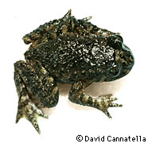
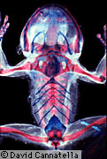
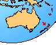

# [[Leiopelma]] 

    

## #has_/text_of_/abstract 

> **Leiopelma** is a genus of New Zealand primitive frogs, belonging to the suborder Archaeobatrachia. It is the only genus in the monotypic family Leiopelmatidae. The leiopelmatids' relatively basal form indicates they have an ancient lineage. While some taxonomists have suggested combining the North American frogs of the genus Ascaphus in the family Ascaphidae with the New Zealand frogs of the genus Leiopelma in the family Leiopelmatidae, the current consensus is that these two groups constitute two separate families. The three extant species of Leiopelmatidae are only found in New Zealand.
>
> [Wikipedia](https://en.wikipedia.org/wiki/Leiopelma)

## Introduction

[David Cannatella](http://www.tolweb.org/)

There are only three living species of Leiopelma (family
Leiopelmatidae), and these are the only native frogs in New Zealand.
Human occupation has reduced the range of these species. Leiopelma
archeyi is restricted to the Coromandel Range. Leiopelma hamiltoni is
known only from Stephens and Maud Islands. Leiopelma hochstetteri
remains from a few isolated localities on the North Island. However,
three other recently extinct species are known from cave deposits in
karsted limestone regions of the North Island, and the genus was more
widespread until Recent times.

Adults of the living species reach a maximum size of about 50 mm.
However, the subfossil Leiopelma †waitomoensis reached approximately 100
mm in snout-vent length. Leiopelma are terrestrial and are found under
stones and logs, in damp areas. They lay their eggs in similar damp
areas rather than in pools of water. Rather than having aquatic
tadpoles, their young undergo a more \"direct\" development to froglets.
In Leiopelma hamiltoni and L. archeyi, the male sits over the eggs until
they hatch; the froglets, still with a tail, climb up on the male\'s
back and complete development there. In Leiopelma hochstetteri, the
young move into nearby water after hatching, and there seems to be no
direct parental care.

Leiopelma is unique among living frogs in having elongate pieces of
cartilage in the muscles of the abdomen, called inscriptional ribs. Like
Ascaphus truei, Leiopelma retains certain primitive features such as
nine vertebrae in front of the sacrum, and \"tailwagging\" muscles.
These features do not indicate a close relationship, however. Ascaphus
truei and Leiopelma are distinct lineages of frogs.

As is the case with Ascaphus truei, the only taxon in the family
Leiopelmatidae is the genus Leiopelma; so Leiopelmatidae is redundant.
In the tree diagram we have used Leiopelma in preference to
Leiopelmatidae (but there is no harm in using Leiopelmatidae).

### Geographic Distribution

The distribution of the living members of the family Leiopelmatidae ais
indicated in red.\

### Discussion of Phylogenetic Relationships

Ford and Cannatella (1993) defined Leiopelma to be the most recent
common ancestor of the living species of Leiopelma (hochstetteri,
hamiltoni, and archeyi), and all of its descendants. By this definition,
Leiopelma includes the three subfossil species included in Worthy\'s
(1987) cladogram of Leiopelma.

Synapomorphies of Leiopelma include the presence of ventral
inscriptional ribs, low diploid chromosome numbers (18-22), absence of
horny beaks in the larvae, and reduction of opercular folds during
development resulting in the lack of a closed branchial chamber and
spiracle (Green and Cannatella, 1993; Stephenson, 1955).

Hay et al. (1995) analyzed relationships among families of frogs using
12S and 16S rRNA and found Ascaphus and Leiopelma to be sister-groups.
This is in contrast to an earlier study of 12S rRNA sequence data by
Hedges and Maxson (1993) and other recent work (Ford and Cannatella,
1993; Green and Cannatella, 1993) that found no sister-relationship
between Ascaphus and Leiopelma. For more information see the account of
Ascaphus truei.

## Phylogeny 

-   « Ancestral Groups  
    -   [Salientia](../Salientia.md)
    -   [Living Amphibians](Living_Amphibians)
    -   [Terrestrial Vertebrates](../../../Terrestrial.md)
    -   [Sarcopterygii](../../../../Sarc.md)
    -   [Gnathostomata](../../../../../Gnath.md)
    -   [Vertebrata](../../../../../../Vertebrata.md)
    -   [Craniata](../../../../../../../Craniata.md)
    -   [Chordata](../../../../../../../../Chordata.md)
    -   [Deuterostomia](../../../../../../../../../Deutero.md)
    -  [Bilateria](../../../../../../../../../../Bilateria.md))
    -  [Animals](../../../../../../../../../../../Animals.md))
    -  [Eukarya](../../../../../../../../../../../../Eukarya.md))
    -   [Tree of Life](../../../../../../../../../../../../Tree_of_Life.md)

-   ◊ Sibling Groups of  Salientia
    -   [Triadobatrachus         massinoti](Triadobatrachus_massinoti.md)
    -   [Vieraella herbsti](Vieraella_herbsti.md)
    -   [Notobatrachus degiustoi](Notobatrachus_degiustoi.md)
    -   [Ascaphus truei](Ascaphus_truei.md)
    -   Leiopelma
    -   [Eodiscoglossus         santonjae](Eodiscoglossus_santonjae.md)
    -   [Bombinatoridae](Bombinatoridae.md)
    -   [Discoglossidae](Discoglossidae.md)
    -   [Eopelobatinae](Eopelobatinae.md)
    -   [Megophryidae](Megophryidae.md)
    -   [Pelobatidae](Pelobatidae.md)
    -   [Pelodytidae](Pelodytidae.md)
    -   [Rhinophrynidae](Rhinophrynidae.md)
    -   [\'Pipids\'](%27Pipids%27)
    -   [Palaeobatrachidae](Palaeobatrachidae.md)
    -   [Pipid](Pipid.md)
    -   [Neobatrachia](Neobatrachia.md)

-   » Sub-Groups 

## Title Illustrations

--------------------------------------------------------------------------

Scientific Name ::   Leiopelma hochstetteri
Acknowledgements   frog loaned by David Green
Copyright ::          © 1995 [David Cannatella](http://www.catfishlab.org/) 

--------------------------------------------------------------------------

Scientific Name ::     Leiopelma hamiltoni
Specimen Condition   Dead Specimen
Body Part            Cleared and stained skeleton
Copyright ::            © 1995 [David Cannatella](http://www.catfishlab.org/) 

## Confidential Links & Embeds: 

### #is_/same_as :: [Leiopelma](/_Standards/bio/bio~Domain/Eukarya/Animal/Bilateria/Deutero/Chordata/Craniata/Vertebrata/Gnath/Sarc/Tetrapods/Amphibia/Salientia/Leiopelma.md) 

### #is_/same_as :: [Leiopelma.public](/_public/bio/bio~Domain/Eukarya/Animal/Bilateria/Deutero/Chordata/Craniata/Vertebrata/Gnath/Sarc/Tetrapods/Amphibia/Salientia/Leiopelma.public.md) 

### #is_/same_as :: [Leiopelma.internal](/_internal/bio/bio~Domain/Eukarya/Animal/Bilateria/Deutero/Chordata/Craniata/Vertebrata/Gnath/Sarc/Tetrapods/Amphibia/Salientia/Leiopelma.internal.md) 

### #is_/same_as :: [Leiopelma.protect](/_protect/bio/bio~Domain/Eukarya/Animal/Bilateria/Deutero/Chordata/Craniata/Vertebrata/Gnath/Sarc/Tetrapods/Amphibia/Salientia/Leiopelma.protect.md) 

### #is_/same_as :: [Leiopelma.private](/_private/bio/bio~Domain/Eukarya/Animal/Bilateria/Deutero/Chordata/Craniata/Vertebrata/Gnath/Sarc/Tetrapods/Amphibia/Salientia/Leiopelma.private.md) 

### #is_/same_as :: [Leiopelma.personal](/_personal/bio/bio~Domain/Eukarya/Animal/Bilateria/Deutero/Chordata/Craniata/Vertebrata/Gnath/Sarc/Tetrapods/Amphibia/Salientia/Leiopelma.personal.md) 

### #is_/same_as :: [Leiopelma.secret](/_secret/bio/bio~Domain/Eukarya/Animal/Bilateria/Deutero/Chordata/Craniata/Vertebrata/Gnath/Sarc/Tetrapods/Amphibia/Salientia/Leiopelma.secret.md)

