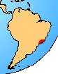

---
aliases:
  - Brachycephalidae
title: Brachycephalidae
---

# [[Brachycephalidae]]

Gold Frogs 

## #has_/text_of_/abstract 

> The **Brachycephalidae** () are a family of frogs confined to eastern and southern Brazil and northern Argentina. The family is composed of two externally quite different genera: the tiny, often (but not always) colourful and plump saddleback toads (Brachycephalus) from Brazil, and the larger, slimmer and more drab genus Ischnocnema from both Brazil and Argentina. The family is mainly defined by molecular characteristics, and are linked by few anatomical features. It was erected from two genera of the previously large family Eleutherodactylidae, which is now split into four families.
>
> The Brachycephalidae all have direct development and hatch like miniature adults rather than as tadpoles like most frogs. The members of the genus Brachycephalus are all very diminutive animals, with many species under 1 cm (0.4 in) in snout–to–vent length.
>
> [Wikipedia](https://en.wikipedia.org/wiki/Brachycephalidae) 

## Introduction

[David Cannatella]()

This small group of tiny frogs is found in forests of southeastern
Brazil. The Gold Frog (Brachycephalus ephippium) is the best known
member of this family, and is distinctive because of its color and
possession of bony dorsal shields that are fused to the vertebrae.
However, other populations of Brachycephalus (currently synonymized)
have less ossification. With a snout-vent length of only 9.8 mm,
Psyllophryne didactyla is one of the world\'s smallest amphibians. Both
genera exhibit reduction of the number of digits. The two genera are
united by the absence of a sternum. There are no fossil brachycephalids.

### Geographic Distribution

The distribution of living members of the family Brachycephalidae is
indicated in red.\

### Discussion of Phylogenetic Relationships

Ford and Cannatella (1993) defined Brachycephalidae to be the most
recent common ancestor of Brachycephalus and Psyllophryne, and all its
descendants. Synapomorphies include the absence of a sternum, digital
reduction, and complete ossification of epicoracoid cartilages with
coracoids and clavicles (data from Izecksohn, 1971).

Brachycephalids have always been considered to be neobatrachians. A
photo in Halliday and Adler (1986:38-39) shows Brachycephalus ephippium
in inguinal amplexus, a behavior that is rare in Neobatrachia (Nussbaum,
1980).

## Phylogeny 

-   « Ancestral Groups  
    -   [Neobatrachia](../Neobatrachia.md)
    -   [Salientia](../../Salientia.md)
    -   [Living Amphibians](Living_Amphibians)
    -   [Terrestrial Vertebrates](../../../../Terrestrial.md)
    -   [Sarcopterygii](../../../../../Sarc.md)
    -   [Gnathostomata](../../../../../../Gnath.md)
    -   [Vertebrata](../../../../../../../Vertebrata.md)
    -   [Craniata](../../../../../../../../Craniata.md)
    -   [Chordata](../../../../../../../../../Chordata.md)
    -   [Deuterostomia](../../../../../../../../../../Deutero.md)
    -  [Bilateria](../../../../../../../../../../../Bilateria.md))
    -  [Animals](../../../../../../../../../../../../Animals.md))
    -  [Eukarya](../../../../../../../../../../../../../Eukarya.md))
    -   [Tree of Life](../../../../../../../../../../../../../Tree_of_Life.md)

-   ◊ Sibling Groups of  Neobatrachia
    -   [Allophryne ruthveni](Allophryne_ruthveni.md)
    -   Brachycephalidae
    -   [Bufonidae](Bufonidae.md)
    -   [Heleophryne](Heleophryne.md)
    -   [\'Leptodactylidae\'](%27Leptodactylidae%27)
    -   [Limnodynastinae](Limnodynastinae.md)
    -   [Myobatrachinae](Myobatrachinae.md)
    -   [Sooglossidae](Sooglossidae.md)
    -   [Rhinoderma](Rhinoderma.md)
    -   [Dendrobatidae](Dendrobatidae.md)
    -   [Pseudidae](Pseudidae.md)
    -   [Hylidae](Hylidae.md)
    -   [Centrolenidae](Centrolenidae.md)
    -   [Microhylidae](Microhylidae.md)
    -   [Hemisus](Hemisus.md)
    -   [Arthroleptidae](Arthroleptidae.md)
    -   [\'Ranidae\'](%27Ranidae%27)
    -   [Hyperoliidae](Hyperoliidae.md)
    -   [Rhacophoridae](Rhacophoridae.md)

-   » Sub-Groups 
	-   *Brachycephalus ephippium*
	-   *Psyllophryne didactyla*

## Confidential Links & Embeds: 

### #is_/same_as :: [Brachycephalidae](/_Standards/bio/bio~Domain/Eukarya/Animal/Bilateria/Deutero/Chordata/Craniata/Vertebrata/Gnath/Sarc/Tetrapods/Amphibia/Salientia/Neobatrachia/Brachycephalidae.md) 

### #is_/same_as :: [Brachycephalidae.public](/_public/bio/bio~Domain/Eukarya/Animal/Bilateria/Deutero/Chordata/Craniata/Vertebrata/Gnath/Sarc/Tetrapods/Amphibia/Salientia/Neobatrachia/Brachycephalidae.public.md) 

### #is_/same_as :: [Brachycephalidae.internal](/_internal/bio/bio~Domain/Eukarya/Animal/Bilateria/Deutero/Chordata/Craniata/Vertebrata/Gnath/Sarc/Tetrapods/Amphibia/Salientia/Neobatrachia/Brachycephalidae.internal.md) 

### #is_/same_as :: [Brachycephalidae.protect](/_protect/bio/bio~Domain/Eukarya/Animal/Bilateria/Deutero/Chordata/Craniata/Vertebrata/Gnath/Sarc/Tetrapods/Amphibia/Salientia/Neobatrachia/Brachycephalidae.protect.md) 

### #is_/same_as :: [Brachycephalidae.private](/_private/bio/bio~Domain/Eukarya/Animal/Bilateria/Deutero/Chordata/Craniata/Vertebrata/Gnath/Sarc/Tetrapods/Amphibia/Salientia/Neobatrachia/Brachycephalidae.private.md) 

### #is_/same_as :: [Brachycephalidae.personal](/_personal/bio/bio~Domain/Eukarya/Animal/Bilateria/Deutero/Chordata/Craniata/Vertebrata/Gnath/Sarc/Tetrapods/Amphibia/Salientia/Neobatrachia/Brachycephalidae.personal.md) 

### #is_/same_as :: [Brachycephalidae.secret](/_secret/bio/bio~Domain/Eukarya/Animal/Bilateria/Deutero/Chordata/Craniata/Vertebrata/Gnath/Sarc/Tetrapods/Amphibia/Salientia/Neobatrachia/Brachycephalidae.secret.md)

