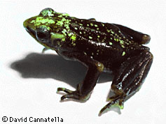
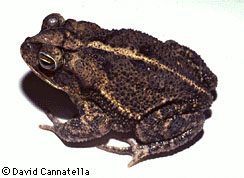
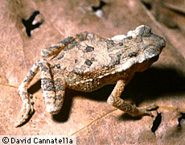
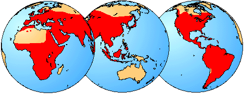

# [[Bufonidae]]

True Toads 

      

## #has_/text_of_/abstract 

> A true toad is any member of the family **Bufonidae**, in the order Anura (frogs and toads). This is the only family of anurans in which all members are known as toads, although some may be called frogs (such as harlequin frogs). The bufonids now comprise more than 35 genera, Bufo being the best known.
>
> [Wikipedia](https://en.wikipedia.org/wiki/True%20toad) 

## Introduction

[David Cannatella and Anna Graybeal](http://www.tolweb.org/)

Bufonids are the true toads, although some are not particularly
toadlike. The large genus Bufo has about 200 species and is naturally
cosmopolitan except for Australia. The other genera are distributed in
three tropical areas: South America, Africa, and southeast Asia. Some of
these other genera are clearly derived from Bufo, but others belong to a
major evolutionary lineage that is distinct from Bufo and its allies.

Bufonids range in size from 20 to more than 200 mm. No bufonids have
teeth, although the absence of teeth occurs sporadically in other frog
groups. Also, many bufonids (but not all) have a Bidder\'s organ, which
is a mass of gonadal tissue in males that has the appearance of an
immature testis. If the testis of a male is surgically removed, the
Bidder\'s organ will enlarge and differentiate into a functional ovary.

Most toads of the genus Bufo are dull. However, Bufo periglenes is
brightly colored and exhibits extreme color dimorphism between males and
females. This rare toad lives in the cool wind-swept cloud forests of
Costa Rica near Monteverde. It has not been observed in several years
and may be extinct.

Species of the genus Atelopus, also called Harlequin Frogs, are brightly
colored. Atelopus zeteki from Panama have skin toxins (Brown et al.
1977). Bufo spinulosus is among the highest ranging amphibians; it is
known from about 5000 m elevation in the Andes of South America.

### Geographic Distribution

The distribution of living members of the family Bufonidae is indicated
in red.\

### Discussion of Phylogenetic Relationships

Ford and Cannatella (1993) defined Bufonidae as the node-based name for
the most recent common ancestor of living bufonids (Bufo, Frostius,
etc., as listed in Frost \[1985\]), and all its descendants. Putative
synapomorphies of Bufonidae are the presence of Bidder\'s organ
(Duellman and Trueb, 1986); a unique pattern of insertion of the
hyoglossus muscle; absence of the posterior constrictor muscle(Trewavas,
1933); the absence of teeth; origin of depressor mandibulae muscle
solely from the squamosal, and associated angle of orientation of the
squamosal (Griffiths, 1954; Starrett, 1968); and the presence of the
\"otic element,\" an independent ossification in the temporal region
that fuses to the otic ramus of the squamosal (Griffiths, 1954).

The distribution of Bidder\'s organ was summarized by Roessler et al.
(1990), and knowledge of the taxonomic distribution is reasonably good.
No bufonids are known to have teeth, but teeth are absent in unrelated
taxa, including some basal telmatobiine leptodactylids with no clear
relationships to other taxa. Barring the close relationship of any of
these taxa to Bufonidae, the absence of teeth is tentatively considered
a synapomorphy of Bufonidae. The conformation of the hyoglossus muscle
and absence of the constrictor posterior muscle were listed by Trewavas
(1933) as possible diagnostic features of Bufonidae. These characters
are virtually unique in bufonids among frogs, and Cannatella has
confirmed the presence of these in several other bufonid genera, but
greater taxonomic coverage is needed. Griffiths (1954) stated that the
\"otic element\" is diagnostic of bufonids, but his observations on its
development were limited to seven species of Bufo and two species of
Atelopus.

Graybeal and Cannatella (1995) discussed the phylogenetic status of all
of the bufonid genera.

## Phylogeny 

-   « Ancestral Groups  
    -   [Neobatrachia](../Neobatrachia.md)
    -   [Salientia](../../Salientia.md)
    -   [Living Amphibians](Living_Amphibians)
    -   [Terrestrial Vertebrates](../../../../Terrestrial.md)
    -   [Sarcopterygii](../../../../../Sarc.md)
    -   [Gnathostomata](../../../../../../Gnath.md)
    -   [Vertebrata](../../../../../../../Vertebrata.md)
    -   [Craniata](../../../../../../../../Craniata.md)
    -   [Chordata](../../../../../../../../../Chordata.md)
    -   [Deuterostomia](../../../../../../../../../../Deutero.md)
    -  [Bilateria](../../../../../../../../../../../Bilateria.md))
    -  [Animals](../../../../../../../../../../../../Animals.md))
    -  [Eukarya](../../../../../../../../../../../../../Eukarya.md))
    -   [Tree of Life](../../../../../../../../../../../../../Tree_of_Life.md)

-   ◊ Sibling Groups of  Neobatrachia
    -   [Allophryne ruthveni](Allophryne_ruthveni.md)
    -   [Brachycephalidae](Brachycephalidae.md)
    -   Bufonidae
    -   [Heleophryne](Heleophryne.md)
    -   [\'Leptodactylidae\'](%27Leptodactylidae%27)
    -   [Limnodynastinae](Limnodynastinae.md)
    -   [Myobatrachinae](Myobatrachinae.md)
    -   [Sooglossidae](Sooglossidae.md)
    -   [Rhinoderma](Rhinoderma.md)
    -   [Dendrobatidae](Dendrobatidae.md)
    -   [Pseudidae](Pseudidae.md)
    -   [Hylidae](Hylidae.md)
    -   [Centrolenidae](Centrolenidae.md)
    -   [Microhylidae](Microhylidae.md)
    -   [Hemisus](Hemisus.md)
    -   [Arthroleptidae](Arthroleptidae.md)
    -   [\'Ranidae\'](%27Ranidae%27)
    -   [Hyperoliidae](Hyperoliidae.md)
    -   [Rhacophoridae](Rhacophoridae.md)

-   » Sub-Groups 
	-   *Ansonia*
	-   *Atelopus*
	-   *Bufo*
	-   *Bufoides*
	-   *Capensibufo*
	-   *Crepidophryne*
	-   *Dendrophryniscus*
	-   *Didynamipus*
	-   *Laurentophryne*
	-   *Leptophryne*
	-   *Melanophryniscus*
	-   *Mertensophryne*
	-   *Nectophryne*
	-   *Nectophrynoides*
	-   *Oreophrynella*
	-   *Osornophryne*
	-   *Pedostibes*
	-   *Pelophryne*
	-   *Peltophryne*
	-   *Pseudobufo*
	-   *Rhamphophryne*
	-   *Schismaderma*
	-   *Stephopaedes*
	-   *Truebella*
	-   *Werneria*
	-   *Wolterstorffina*

## Title Illustrations

-------------------------------------------------------------------------
1. Atelopus varius, Costa Rica; photo © 1995 David Cannatella )
Scientific Name ::  Atelopus varius
Location ::        Costa Rica

-------------------------------------------------------------------------
2. Bufo valliceps; photo © 1995 David Cannatella )
Scientific Name ::  Bufo valliceps

-------------------------------------------------------------------------
3. Leptophryne sp; photo © 1995 David Cannatella)
Scientific Name ::     Leptophryne
Specimen Condition   Live Specimen

## Confidential Links & Embeds: 

### #is_/same_as :: [Bufonidae](/_Standards/bio/bio~Domain/Eukarya/Animal/Bilateria/Deutero/Chordata/Craniata/Vertebrata/Gnath/Sarc/Tetrapods/Amphibia/Salientia/Neobatrachia/Bufonidae.md) 

### #is_/same_as :: [Bufonidae.public](/_public/bio/bio~Domain/Eukarya/Animal/Bilateria/Deutero/Chordata/Craniata/Vertebrata/Gnath/Sarc/Tetrapods/Amphibia/Salientia/Neobatrachia/Bufonidae.public.md) 

### #is_/same_as :: [Bufonidae.internal](/_internal/bio/bio~Domain/Eukarya/Animal/Bilateria/Deutero/Chordata/Craniata/Vertebrata/Gnath/Sarc/Tetrapods/Amphibia/Salientia/Neobatrachia/Bufonidae.internal.md) 

### #is_/same_as :: [Bufonidae.protect](/_protect/bio/bio~Domain/Eukarya/Animal/Bilateria/Deutero/Chordata/Craniata/Vertebrata/Gnath/Sarc/Tetrapods/Amphibia/Salientia/Neobatrachia/Bufonidae.protect.md) 

### #is_/same_as :: [Bufonidae.private](/_private/bio/bio~Domain/Eukarya/Animal/Bilateria/Deutero/Chordata/Craniata/Vertebrata/Gnath/Sarc/Tetrapods/Amphibia/Salientia/Neobatrachia/Bufonidae.private.md) 

### #is_/same_as :: [Bufonidae.personal](/_personal/bio/bio~Domain/Eukarya/Animal/Bilateria/Deutero/Chordata/Craniata/Vertebrata/Gnath/Sarc/Tetrapods/Amphibia/Salientia/Neobatrachia/Bufonidae.personal.md) 

### #is_/same_as :: [Bufonidae.secret](/_secret/bio/bio~Domain/Eukarya/Animal/Bilateria/Deutero/Chordata/Craniata/Vertebrata/Gnath/Sarc/Tetrapods/Amphibia/Salientia/Neobatrachia/Bufonidae.secret.md)

