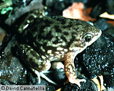

---
aliases:
  - Hemisus
title: Hemisus
---

# [[Hemisus]]

Shovel-Nosed Frogs 

 

## #has_/text_of_/abstract 

> The shovelnose frogs are the species of frogs in the genus, **Hemisus**, the only genus in the family Hemisotidae. They are found in tropical and subtropical sub-Saharan Africa. The shovelnose frogs are moderate-sized frogs, reaching a length of 8 cm (3.1 in). They are round-bodied, with short legs. Their heads are small and narrow, with hard, upturned noses.
>
> The shovelnose frogs are burrowing frogs, living most of their lives underground. The female digs underground while in amplexus, and lays her eggs in an underground cavity. The male leaves through the tunnel, and the female remains with the eggs. Once sufficient rain has fallen, the female burrows with her nose towards a water source, where the tadpoles will remain until metamorphosis. The tadpoles may remain out of water up to a few days.
>
> Unlike most burrowing frogs, the shovelnose frogs burrow head-first, as opposed to rear-first, hence their other common names - snout-burrowers. Some species are kept as pets.
>
> [Wikipedia](https://en.wikipedia.org/wiki/Shovelnose%20frog) 

## Introduction

[David Cannatella](http://www.tolweb.org/)

Hemisus are the Shovel-Nosed frogs of Africa. This frog burrows
head-first in contrast to many other burrowers. The head is solidly
bony, and the tip of the snout is pointed; the forelimbs are unusually
stout. There are about eight species of Hemisus. The genus is usually
placed in its own subfamily or family group.

### Discussion of Phylogenetic Relationships

Duellman and Trueb (1986) treated this taxon as a subfamily of ranids.
Laurent (1979) and Dubois (1981) listed it as Hemisidae; the appropriate
form is Hemisotidae. Either family-group name is redundant with Hemisus,
the only genus. Ford and Cannatella (1993) defined Hemisus to be the
node-based name for the last common ancestor of species of Hemisus
listed in Frost (1985), and all of its descendants. Synapomorphies
include the lack of sternum (convergent with Rhinophrynus and
Brachycephalidae) and a skull highly modified for head-first burrowing.
Hemisus lacks a sternum, and has a vertical pupil, fused carpals and
tarsals, and a notched tongue. The vertical pupil suggests that it is
closely related to Hyperoliidae and the notched tongue suggests
relationship to Ranidae.

## Phylogeny 

-   « Ancestral Groups  
    -   [Neobatrachia](../Neobatrachia.md)
    -   [Salientia](../../Salientia.md)
    -   [Living Amphibians](Living_Amphibians)
    -   [Terrestrial Vertebrates](../../../../Terrestrial.md)
    -   [Sarcopterygii](../../../../../Sarc.md)
    -   [Gnathostomata](../../../../../../Gnath.md)
    -   [Vertebrata](../../../../../../../Vertebrata.md)
    -   [Craniata](../../../../../../../../Craniata.md)
    -   [Chordata](../../../../../../../../../Chordata.md)
    -   [Deuterostomia](../../../../../../../../../../Deutero.md)
    -  [Bilateria](../../../../../../../../../../../Bilateria.md) 
    -  [Animals](../../../../../../../../../../../../Animals.md) 
    -  [Eukarya](../../../../../../../../../../../../../Eukarya.md) 
    -   [Tree of Life](../../../../../../../../../../../../../Tree_of_Life.md)

-   ◊ Sibling Groups of  Neobatrachia
    -   [Allophryne ruthveni](Allophryne_ruthveni.md)
    -   [Brachycephalidae](Brachycephalidae.md)
    -   [Bufonidae](Bufonidae.md)
    -   [Heleophryne](Heleophryne.md)
    -   [\'Leptodactylidae\'](%27Leptodactylidae%27)
    -   [Limnodynastinae](Limnodynastinae.md)
    -   [Myobatrachinae](Myobatrachinae.md)
    -   [Sooglossidae](Sooglossidae.md)
    -   [Rhinoderma](Rhinoderma.md)
    -   [Dendrobatidae](Dendrobatidae.md)
    -   [Pseudidae](Pseudidae.md)
    -   [Hylidae](Hylidae.md)
    -   [Centrolenidae](Centrolenidae.md)
    -   [Microhylidae](Microhylidae.md)
    -   Hemisus
    -   [Arthroleptidae](Arthroleptidae.md)
    -   [\'Ranidae\'](%27Ranidae%27)
    -   [Hyperoliidae](Hyperoliidae.md)
    -   [Rhacophoridae](Rhacophoridae.md)

-   » Sub-Groups 

	-   *Hemisus brachydactylum*
	-   *Hemisus guineensis*
	-   *Hemisus guttatus*
	-   *Hemisus marmoratus*
	-   *Hemisus microscaphus*
	-   *Hemisus olivaceus*
	-   *Hemisus perreti*
	-   *Hemisus wittei*

## Title Illustrations

------------------------------------------------------------------------
Hemisus marmoratum; photo copyright © 1995 David Cannatella)

## Confidential Links & Embeds: 

### #is_/same_as :: [Hemisus](/_Standards/bio/bio~Domain/Eukarya/Animal/Bilateria/Deutero/Chordata/Craniata/Vertebrata/Gnath/Sarc/Tetrapods/Amphibia/Salientia/Neobatrachia/Hemisus.md) 

### #is_/same_as :: [Hemisus.public](/_public/bio/bio~Domain/Eukarya/Animal/Bilateria/Deutero/Chordata/Craniata/Vertebrata/Gnath/Sarc/Tetrapods/Amphibia/Salientia/Neobatrachia/Hemisus.public.md) 

### #is_/same_as :: [Hemisus.internal](/_internal/bio/bio~Domain/Eukarya/Animal/Bilateria/Deutero/Chordata/Craniata/Vertebrata/Gnath/Sarc/Tetrapods/Amphibia/Salientia/Neobatrachia/Hemisus.internal.md) 

### #is_/same_as :: [Hemisus.protect](/_protect/bio/bio~Domain/Eukarya/Animal/Bilateria/Deutero/Chordata/Craniata/Vertebrata/Gnath/Sarc/Tetrapods/Amphibia/Salientia/Neobatrachia/Hemisus.protect.md) 

### #is_/same_as :: [Hemisus.private](/_private/bio/bio~Domain/Eukarya/Animal/Bilateria/Deutero/Chordata/Craniata/Vertebrata/Gnath/Sarc/Tetrapods/Amphibia/Salientia/Neobatrachia/Hemisus.private.md) 

### #is_/same_as :: [Hemisus.personal](/_personal/bio/bio~Domain/Eukarya/Animal/Bilateria/Deutero/Chordata/Craniata/Vertebrata/Gnath/Sarc/Tetrapods/Amphibia/Salientia/Neobatrachia/Hemisus.personal.md) 

### #is_/same_as :: [Hemisus.secret](/_secret/bio/bio~Domain/Eukarya/Animal/Bilateria/Deutero/Chordata/Craniata/Vertebrata/Gnath/Sarc/Tetrapods/Amphibia/Salientia/Neobatrachia/Hemisus.secret.md)

