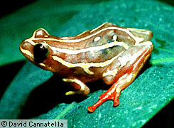
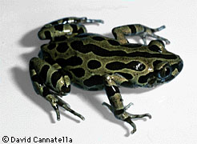
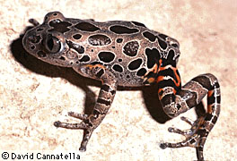
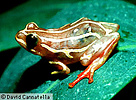

---
aliases:
  - Hyperoliidae
title: Hyperoliidae
has_id_wikidata: Q55476
---
# [[Hyperoliidae]]

Sedge and Bush Frogs 

    

## #has_/text_of_/abstract 

> The **Hyperoliidae**, or sedge frogs and bush frogs, are a large family of small to medium-sized, brightly colored frogs which contain more than 250 species in 19 genera. Seventeen genera are native to sub-Saharan Africa. In addition, the monotypic genus Tachycnemis occurs on the Seychelles Islands, and the genus Heterixalus (currently 10 species) is endemic to Madagascar.
>
> Hyperoliids range from 1.5 to 8 cm (0.59 to 3.15 in) in body length. Many species have smooth, brightly patterned skin that almost looks enameled.
>
> Most hyperoliids are arboreal, but some are terrestrial, including several Kassina species that move by walking or running rather than hopping. Diets vary widely, with examples including Paracassina, which specializes in snails, and Afrixalus fornasini, the only terrestrial frog known to prey on eggs of other species of anurans.
>
> Breeding in this family begins at the start of the rainy season, when hyperoliids congregate at breeding sites. Most hyperoliids lay their eggs in water, although foam nesting, tree-hole breeding, and laying eggs in vegetation above water are all known behaviors. Afrixalus builds leaf nests for its eggs, by folding and gluing the edges of the leaves. Tadpoles are pond type larvae with large dorsal fins on their tails.
>
> No fossil hyperoliids are known.
>
> [Wikipedia](https://en.wikipedia.org/wiki/Hyperoliidae) 

## Introduction

[David Cannatella](http://www.tolweb.org/)

Hyperoliids are the Sedge and Bush Frogs of Africa, Madagascar, and
Seychelles Islands. The genus Hyperolius (Reed and Lily frogs) has more
than 100 species of small, often brightly colored and polymorphic
species. The genus Kassina has medium-sized species that prefer to walk
and even run in place of hopping. Leptopelis tend to be more properly
\"tree\" frogs, whereas Hyperolius frequent sedges and rushes.
Tornierella are specialized snail-eaters (Drewes and Roth, 1981). There
are three subfamilies: Hyperoliinae, Kassininae, and Leptopelinae.

### Discussion of Phylogenetic Relationships

Ford and Cannatella (1993) defined Hyperoliidae as the node-based name
for the common ancestor of the hyperoliid taxa listed in Duellman and
Trueb (1986:547) (Acanthixalus, Afrixalus, etc.), and all of its
descendants. The two synapomorphies listed by Drewes (1984) were the
lack of fusions of the second distal carpal and second tarsal elements,
a condition he considered paedomorphic; these were not shared with any
ranids. As discussed above, Laurent\'s data on these characters
differed. Channing (1989) reanalyzed Drewes\' (1984) data (slightly
modified) on hyperoliids and a subset of Liem\'s (1970) data on
hyperoliids and rhacophorids (including mantellines). Channing concluded
that hyperoliids and rhacophorids (including mantellines) were each
monophyletic and that they were sister-groups. However, given that he
included no ranids in his analysis, Channing would be unable to
demonstrate that they were not each others\' closest relatives, even if
one were paraphyletic with respect to the other.

Channing\'s re-analysis of Drewes\' (1984) data assumed monophyly of
Hyperoliidae, so synapomorphies were not listed. Channing\'s
(1989:Fig. 1) analysis of Liem\'s (1970) combined data on hyperoliids
and rhacophorids yielded 13 synapomorphies of Hyperoliidae including (1)
presence of a dentomentalis muscle, (2) absence of a nuptial pad, (3)
claw-shaped terminal phalanges, (4) absence of the posterolateral
process of the hyoid, (5) vertical pupil, and (6) a cartilaginous
sternum. Drewes (1984) did not examine characters 1 and 2, differed from
Channing in the description of character 3, and indicated that
characters 4, 5, and 6 were present in a more inclusive clade, including
arthroleptines and astylosternines. Because Channing used \"ranids\" as
the outgroup, without discriminating states in arthroleptines and
astylosternines from other ranids, the number of synapomorphies for
Hyperoliidae is likely inflated.

Duellman and Trueb (1986) used the presence of three tarsalia (unfused
second tarsal; character Q) to unite hyperoliids and mantellines.
However, Liem (1970) stated that the second tarsal was fused in all
mantellines examined (three species of Mantidactylus and one of
Aglyptodactylus). However, he indicated the second carpal was not fused
in these taxa, a feature shared with hyperoliids.

### Additional Photographs

\
Hyperolius puncticulatus; photo © David Cannatella\
\

\
Kassina maculata; photo © David Cannatella\
\

## Phylogeny 

-   « Ancestral Groups  
    -   [Neobatrachia](../Neobatrachia.md)
    -   [Salientia](../../Salientia.md)
    -   [Living Amphibians](Living_Amphibians)
    -   [Terrestrial Vertebrates](../../../../Terrestrial.md)
    -   [Sarcopterygii](../../../../../Sarc.md)
    -   [Gnathostomata](../../../../../../Gnath.md)
    -   [Vertebrata](../../../../../../../Vertebrata.md)
    -   [Craniata](../../../../../../../../Craniata.md)
    -   [Chordata](../../../../../../../../../Chordata.md)
    -   [Deuterostomia](../../../../../../../../../../Deutero.md)
    -  [Bilateria](../../../../../../../../../../../Bilateria.md) 
    -  [Animals](../../../../../../../../../../../../Animals.md) 
    -  [Eukarya](../../../../../../../../../../../../../Eukarya.md) 
    -   [Tree of Life](../../../../../../../../../../../../../Tree_of_Life.md)

-   ◊ Sibling Groups of  Neobatrachia
    -   [Allophryne ruthveni](Allophryne_ruthveni.md)
    -   [Brachycephalidae](Brachycephalidae.md)
    -   [Bufonidae](Bufonidae.md)
    -   [Heleophryne](Heleophryne.md)
    -   [\'Leptodactylidae\'](%27Leptodactylidae%27)
    -   [Limnodynastinae](Limnodynastinae.md)
    -   [Myobatrachinae](Myobatrachinae.md)
    -   [Sooglossidae](Sooglossidae.md)
    -   [Rhinoderma](Rhinoderma.md)
    -   [Dendrobatidae](Dendrobatidae.md)
    -   [Pseudidae](Pseudidae.md)
    -   [Hylidae](Hylidae.md)
    -   [Centrolenidae](Centrolenidae.md)
    -   [Microhylidae](Microhylidae.md)
    -   [Hemisus](Hemisus.md)
    -   [Arthroleptidae](Arthroleptidae.md)
    -   [\'Ranidae\'](%27Ranidae%27)
    -   Hyperoliidae
    -   [Rhacophoridae](Rhacophoridae.md)

-   » Sub-Groups 
	-   *Hyperoliinae*
	    -   *Callixalus*
	    -   *Chrysobatrachus*
	    -   *Cryptothylax*
	    -   *Heterixalus*
	    -   *Hyperolius*
	    -   *Opisthothylax*
	    -   *Tachycnemis*
	-   *Kassininae*
	    -   *Afrixalus*
	    -   *Kassina*
	    -   *Kassinula*
	    -   *Phlyctimantis*
	    -   *Tornierella*
	-   *Leptopelinae*
	    -   *Acanthixalus*
	    -   *Leptopelis*

## Title Illustrations

------------------------------------------------------------------------
1. Hyperolius sp.; photo © 1995 David Cannatella\

------------------------------------------------------------------------
2. Kassina sp.; photo © David Cannatella\
 

## Confidential Links & Embeds: 

### #is_/same_as :: [[/_Standards/bio/bio~Domain/Eukarya/Animal/Bilateria/Deutero/Chordata/Craniata/Vertebrata/Gnath/Sarc/Tetrapods/Amphibia/Salientia/Neobatrachia/Hyperoliidae|Hyperoliidae]] 

### #is_/same_as :: [[/_public/bio/bio~Domain/Eukarya/Animal/Bilateria/Deutero/Chordata/Craniata/Vertebrata/Gnath/Sarc/Tetrapods/Amphibia/Salientia/Neobatrachia/Hyperoliidae.public|Hyperoliidae.public]] 

### #is_/same_as :: [[/_internal/bio/bio~Domain/Eukarya/Animal/Bilateria/Deutero/Chordata/Craniata/Vertebrata/Gnath/Sarc/Tetrapods/Amphibia/Salientia/Neobatrachia/Hyperoliidae.internal|Hyperoliidae.internal]] 

### #is_/same_as :: [[/_protect/bio/bio~Domain/Eukarya/Animal/Bilateria/Deutero/Chordata/Craniata/Vertebrata/Gnath/Sarc/Tetrapods/Amphibia/Salientia/Neobatrachia/Hyperoliidae.protect|Hyperoliidae.protect]] 

### #is_/same_as :: [[/_private/bio/bio~Domain/Eukarya/Animal/Bilateria/Deutero/Chordata/Craniata/Vertebrata/Gnath/Sarc/Tetrapods/Amphibia/Salientia/Neobatrachia/Hyperoliidae.private|Hyperoliidae.private]] 

### #is_/same_as :: [[/_personal/bio/bio~Domain/Eukarya/Animal/Bilateria/Deutero/Chordata/Craniata/Vertebrata/Gnath/Sarc/Tetrapods/Amphibia/Salientia/Neobatrachia/Hyperoliidae.personal|Hyperoliidae.personal]] 

### #is_/same_as :: [[/_secret/bio/bio~Domain/Eukarya/Animal/Bilateria/Deutero/Chordata/Craniata/Vertebrata/Gnath/Sarc/Tetrapods/Amphibia/Salientia/Neobatrachia/Hyperoliidae.secret|Hyperoliidae.secret]] 

