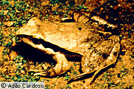

---
aliases:
  - Physalaemus
title: Physalaemus
---

## Phylogeny 

-   « Ancestral Groups  
    -   [Leptodactylinae](../Leptodactylinae.md)
    -   [\'Leptodactylidae\'](%27Leptodactylidae%27)
    -   [Neobatrachia](../../../Neobatrachia.md)
    -   [Salientia](../../../../Salientia.md)
    -   [Living Amphibians](Living_Amphibians)
    -   [Terrestrial Vertebrates](../../../../../../Terrestrial.md)
    -   [Sarcopterygii](../../../../../../../Sarc.md)
    -   [Gnathostomata](../../../../../../../../Gnath.md)
    -   [Vertebrata](../../../../../../../../../Vertebrata.md)
    -   [Craniata](../../../../../../../../../../Craniata.md)
    -   [Chordata](../../../../../../../../../../../Chordata.md)
    -   [Deuterostomia](../../../../../../../../../../../../Deutero.md)
    -  [Bilateria](../../../../../../../../../../../../../Bilateria.md) 
    -  [Animals](../../../../../../../../../../../../../../Animals.md) 
    -  [Eukarya](../../../../../../../../../../../../../../../Eukarya.md) 
    -   [Tree of Life](../../../../../../../../../../../../../../../Tree_of_Life.md)

-   ◊ Sibling Groups of  Leptodactylinae
    -   Physalaemus

-   » Sub-Groups
    -   [Physalaemus aguirrei](Physalaemus_aguirrei)
    -   [Physalaemus albifrons](Physalaemus_albifrons)
    -   [Physalaemus albonotatus](Physalaemus_albonotatus)
    -   [Physalaemus         biligonigerus](Physalaemus_biligonigerus)
    -   [Physalaemus bokermanni](Physalaemus_bokermanni)
    -   [Physalaemus centralis](Physalaemus_centralis)
    -   [Physalaemus cicada](Physalaemus_cicada)
    -   [Physalaemus crombiei](Physalaemus_crombiei)
    -   [Physalaemus cuvieri](Physalaemus_cuvieri)
    -   [Physalaemus enesefae](Physalaemus_enesefae)
    -   [Physalaemus         fuscomaculatus](Physalaemus_fuscomaculatus)
    -   [Physalaemus gracilis](Physalaemus_gracilis)
    -   [Physalaemus jordanensis](Physalaemus_jordanensis)
    -   [Physalaemus kroyeri](Physalaemus_kroyeri)
    -   [Physalaemus lisei](Physalaemus_lisei)
    -   [Physalaemus moreirae](Physalaemus_moreirae)
    -   [Physalaemus nanus](Physalaemus_nanus)
    -   [Physalaemus obtectus](Physalaemus_obtectus)
    -   [Physalaemus olfersii](Physalaemus_olfersii)
    -   [Physalaemus petersi](Physalaemus_petersi)
    -   [Physalaemus pustulatus](Physalaemus_pustulatus)
    -   [Physalaemus pustulosus](Physalaemus_pustulosus)
    -   [Physalaemus signifer](Physalaemus_signifer)

# Physalaemus 

[David Cannatella](http://www.tolweb.org/)

-   *[Physalaemus     aguirrei](Physalaemus_aguirrei)*
-   *[Physalaemus     albifrons](Physalaemus_albifrons)*
-   *[Physalaemus     albonotatus](Physalaemus_albonotatus)*
-   *Physalaemus barrioi*
-   *[Physalaemus     biligonigerus](Physalaemus_biligonigerus)*
-   *[Physalaemus     bokermanni](Physalaemus_bokermanni)*
-   *[Physalaemus     centralis](Physalaemus_centralis)*
-   *[Physalaemus     cicada](Physalaemus_cicada)*
-   *Physalaemus coloradorum*
-   *[Physalaemus     crombiei](Physalaemus_crombiei)*
-   *[Physalaemus     cuvieri](Physalaemus_cuvieri)*
-   *[Physalaemus     enesefae](Physalaemus_enesefae)*
-   *Physalaemus ephippifer*
-   *Physalaemus evangelistai*
-   *Physalaemus fernandezae*
-   *Physalaemus fischeri*
-   *[Physalaemus     fuscomaculatus](Physalaemus_fuscomaculatus)*
-   *[Physalaemus     gracilis](Physalaemus_gracilis)*
-   *Physalaemus henselii*
-   *[Physalaemus     jordanensis](Physalaemus_jordanensis)*
-   *[Physalaemus     kroyeri](Physalaemus_kroyeri)*
-   *[Physalaemus     lisei](Physalaemus_lisei)*
-   *Physalaemus maculiventris*
-   *[Physalaemus     moreirae](Physalaemus_moreirae)*
-   *[Physalaemus     nanus](Physalaemus_nanus)*
-   *Physalaemus nattereri*
-   *[Physalaemus     obtectus](Physalaemus_obtectus)*
-   *[Physalaemus     olfersii](Physalaemus_olfersii)*
-   *[Physalaemus     petersi](Physalaemus_petersi)*
-   *[Physalaemus     pustulatus](Physalaemus_pustulatus)*
-   *[Physalaemus     pustulosus](Physalaemus_pustulosus)*
-   *Physalaemus riograndensis*
-   *Physalaemus santafecinus*
-   *[Physalaemus     signifer](Physalaemus_signifer)*
-   *Physalaemus soaresi*

Containing group: [Leptodactylinae](../Leptodactylinae.md)

## Title Illustrations



  ------------------------------------------------------------------------
  copyright ::   © 1996 [David Cannatella](http://www.catfishlab.org/) 
 
  ------------------------------------------------------------------------

## Confidential Links & Embeds: 

### #is_/same_as :: [[/_Standards/bio/bio~Domain/Eukarya/Animal/Bilateria/Deutero/Chordata/Craniata/Vertebrata/Gnath/Sarc/Tetrapods/Amphibia/Salientia/Neobatrachia/Leptodactylidae/Leptodactylinae/Physalaemus|Physalaemus]] 

### #is_/same_as :: [[/_public/bio/bio~Domain/Eukarya/Animal/Bilateria/Deutero/Chordata/Craniata/Vertebrata/Gnath/Sarc/Tetrapods/Amphibia/Salientia/Neobatrachia/Leptodactylidae/Leptodactylinae/Physalaemus.public|Physalaemus.public]] 

### #is_/same_as :: [[/_internal/bio/bio~Domain/Eukarya/Animal/Bilateria/Deutero/Chordata/Craniata/Vertebrata/Gnath/Sarc/Tetrapods/Amphibia/Salientia/Neobatrachia/Leptodactylidae/Leptodactylinae/Physalaemus.internal|Physalaemus.internal]] 

### #is_/same_as :: [[/_protect/bio/bio~Domain/Eukarya/Animal/Bilateria/Deutero/Chordata/Craniata/Vertebrata/Gnath/Sarc/Tetrapods/Amphibia/Salientia/Neobatrachia/Leptodactylidae/Leptodactylinae/Physalaemus.protect|Physalaemus.protect]] 

### #is_/same_as :: [[/_private/bio/bio~Domain/Eukarya/Animal/Bilateria/Deutero/Chordata/Craniata/Vertebrata/Gnath/Sarc/Tetrapods/Amphibia/Salientia/Neobatrachia/Leptodactylidae/Leptodactylinae/Physalaemus.private|Physalaemus.private]] 

### #is_/same_as :: [[/_personal/bio/bio~Domain/Eukarya/Animal/Bilateria/Deutero/Chordata/Craniata/Vertebrata/Gnath/Sarc/Tetrapods/Amphibia/Salientia/Neobatrachia/Leptodactylidae/Leptodactylinae/Physalaemus.personal|Physalaemus.personal]] 

### #is_/same_as :: [[/_secret/bio/bio~Domain/Eukarya/Animal/Bilateria/Deutero/Chordata/Craniata/Vertebrata/Gnath/Sarc/Tetrapods/Amphibia/Salientia/Neobatrachia/Leptodactylidae/Leptodactylinae/Physalaemus.secret|Physalaemus.secret]] 

