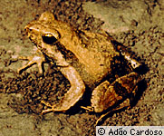
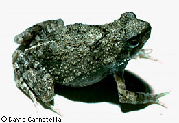
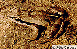

## Phylogeny 

-   « Ancestral Groups  
    -   [Physalaemus](../Physalaemus.md)
    -   [Leptodactylinae](../../Leptodactylinae.md)
    -   [\'Leptodactylidae\'](%27Leptodactylidae%27)
    -   [Neobatrachia](../../../../Neobatrachia.md)
    -   [Salientia](../../../../../Salientia.md)
    -   [Living Amphibians](Living_Amphibians)
    -   [Terrestrial Vertebrates](../../../../../../../Terrestrial.md)
    -   [Sarcopterygii](../../../../../../../../Sarc.md)
    -   [Gnathostomata](../../../../../../../../../Gnath.md)
    -   [Vertebrata](../../../../../../../../../../Vertebrata.md)
    -   [Craniata](../../../../../../../../../../../Craniata.md)
    -   [Chordata](../../../../../../../../../../../../Chordata.md)
    -   [Deuterostomia](../../../../../../../../../../../../../Deutero.md)
    -  [Bilateria](../../../../../../../../../../../../../../Bilateria.md))
    -  [Animals](../../../../../../../../../../../../../../../Animals.md))
    -  [Eukarya](../../../../../../../../../../../../../../../../Eukarya.md))
    -   [Tree of Life](../../../../../../../../../../../../../../../../Tree_of_Life.md)

-   ◊ Sibling Groups of  Physalaemus
    -   [Physalaemus aguirrei](Physalaemus_aguirrei)
    -   [Physalaemus albifrons](Physalaemus_albifrons)
    -   [Physalaemus albonotatus](Physalaemus_albonotatus)
    -   [Physalaemus         biligonigerus](Physalaemus_biligonigerus)
    -   [Physalaemus bokermanni](Physalaemus_bokermanni)
    -   [Physalaemus centralis](Physalaemus_centralis)
    -   [Physalaemus cicada](Physalaemus_cicada)
    -   [Physalaemus crombiei](Physalaemus_crombiei)
    -   Physalaemus cuvieri
    -   [Physalaemus enesefae](Physalaemus_enesefae)
    -   [Physalaemus         fuscomaculatus](Physalaemus_fuscomaculatus)
    -   [Physalaemus gracilis](Physalaemus_gracilis)
    -   [Physalaemus jordanensis](Physalaemus_jordanensis)
    -   [Physalaemus kroyeri](Physalaemus_kroyeri)
    -   [Physalaemus lisei](Physalaemus_lisei)
    -   [Physalaemus moreirae](Physalaemus_moreirae)
    -   [Physalaemus nanus](Physalaemus_nanus)
    -   [Physalaemus obtectus](Physalaemus_obtectus)
    -   [Physalaemus olfersii](Physalaemus_olfersii)
    -   [Physalaemus petersi](Physalaemus_petersi)
    -   [Physalaemus pustulatus](Physalaemus_pustulatus)
    -   [Physalaemus pustulosus](Physalaemus_pustulosus)
    -   [Physalaemus signifer](Physalaemus_signifer)

-   » Sub-Groups 

# *Physalaemus cuvieri* 

Containing group: [Physalaemus](../Physalaemus.md)

## Title Illustrations



  --------
  Copyright ::   © 1996 Adao Cardoso
  --------


  --------
  Copyright ::   © 1996 Adao Cardoso
  --------

## Confidential Links & Embeds: 

### #is_/same_as :: [cuvieri](/_Standards/bio/bio~Domain/Eukarya/Animal/Bilateria/Deutero/Chordata/Craniata/Vertebrata/Gnath/Sarc/Tetrapods/Amphibia/Salientia/Neobatrachia/Leptodactylidae/Leptodactylinae/Physalaemus/cuvieri.md) 

### #is_/same_as :: [cuvieri.public](/_public/bio/bio~Domain/Eukarya/Animal/Bilateria/Deutero/Chordata/Craniata/Vertebrata/Gnath/Sarc/Tetrapods/Amphibia/Salientia/Neobatrachia/Leptodactylidae/Leptodactylinae/Physalaemus/cuvieri.public.md) 

### #is_/same_as :: [cuvieri.internal](/_internal/bio/bio~Domain/Eukarya/Animal/Bilateria/Deutero/Chordata/Craniata/Vertebrata/Gnath/Sarc/Tetrapods/Amphibia/Salientia/Neobatrachia/Leptodactylidae/Leptodactylinae/Physalaemus/cuvieri.internal.md) 

### #is_/same_as :: [cuvieri.protect](/_protect/bio/bio~Domain/Eukarya/Animal/Bilateria/Deutero/Chordata/Craniata/Vertebrata/Gnath/Sarc/Tetrapods/Amphibia/Salientia/Neobatrachia/Leptodactylidae/Leptodactylinae/Physalaemus/cuvieri.protect.md) 

### #is_/same_as :: [cuvieri.private](/_private/bio/bio~Domain/Eukarya/Animal/Bilateria/Deutero/Chordata/Craniata/Vertebrata/Gnath/Sarc/Tetrapods/Amphibia/Salientia/Neobatrachia/Leptodactylidae/Leptodactylinae/Physalaemus/cuvieri.private.md) 

### #is_/same_as :: [cuvieri.personal](/_personal/bio/bio~Domain/Eukarya/Animal/Bilateria/Deutero/Chordata/Craniata/Vertebrata/Gnath/Sarc/Tetrapods/Amphibia/Salientia/Neobatrachia/Leptodactylidae/Leptodactylinae/Physalaemus/cuvieri.personal.md) 

### #is_/same_as :: [cuvieri.secret](/_secret/bio/bio~Domain/Eukarya/Animal/Bilateria/Deutero/Chordata/Craniata/Vertebrata/Gnath/Sarc/Tetrapods/Amphibia/Salientia/Neobatrachia/Leptodactylidae/Leptodactylinae/Physalaemus/cuvieri.secret.md)

