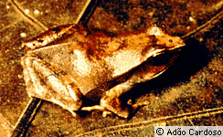
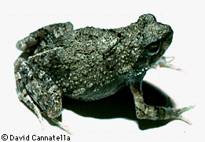

---
aliases:
  - obtectus
title: Physalaemus obtectus
---

## Phylogeny 

-   « Ancestral Groups  
    -   [Physalaemus](../Physalaemus.md)
    -   [Leptodactylinae](../../Leptodactylinae.md)
    -   [\'Leptodactylidae\'](%27Leptodactylidae%27)
    -   [Neobatrachia](../../../../Neobatrachia.md)
    -   [Salientia](../../../../../Salientia.md)
    -   [Living Amphibians](Living_Amphibians)
    -   [Terrestrial Vertebrates](../../../../../../../Terrestrial.md)
    -   [Sarcopterygii](../../../../../../../../Sarc.md)
    -   [Gnathostomata](../../../../../../../../../Gnath.md)
    -   [Vertebrata](../../../../../../../../../../Vertebrata.md)
    -   [Craniata](../../../../../../../../../../../Craniata.md)
    -   [Chordata](../../../../../../../../../../../../Chordata.md)
    -   [Deuterostomia](../../../../../../../../../../../../../Deutero.md)
    -  [Bilateria](../../../../../../../../../../../../../../Bilateria.md) 
    -  [Animals](../../../../../../../../../../../../../../../Animals.md) 
    -  [Eukarya](../../../../../../../../../../../../../../../../Eukarya.md) 
    -   [Tree of Life](../../../../../../../../../../../../../../../../Tree_of_Life.md)

-   ◊ Sibling Groups of  Physalaemus
    -   [Physalaemus aguirrei](Physalaemus_aguirrei)
    -   [Physalaemus albifrons](Physalaemus_albifrons)
    -   [Physalaemus albonotatus](Physalaemus_albonotatus)
    -   [Physalaemus         biligonigerus](Physalaemus_biligonigerus)
    -   [Physalaemus bokermanni](Physalaemus_bokermanni)
    -   [Physalaemus centralis](Physalaemus_centralis)
    -   [Physalaemus cicada](Physalaemus_cicada)
    -   [Physalaemus crombiei](Physalaemus_crombiei)
    -   [Physalaemus cuvieri](Physalaemus_cuvieri)
    -   [Physalaemus enesefae](Physalaemus_enesefae)
    -   [Physalaemus         fuscomaculatus](Physalaemus_fuscomaculatus)
    -   [Physalaemus gracilis](Physalaemus_gracilis)
    -   [Physalaemus jordanensis](Physalaemus_jordanensis)
    -   [Physalaemus kroyeri](Physalaemus_kroyeri)
    -   [Physalaemus lisei](Physalaemus_lisei)
    -   [Physalaemus moreirae](Physalaemus_moreirae)
    -   [Physalaemus nanus](Physalaemus_nanus)
    -   Physalaemus obtectus
    -   [Physalaemus olfersii](Physalaemus_olfersii)
    -   [Physalaemus petersi](Physalaemus_petersi)
    -   [Physalaemus pustulatus](Physalaemus_pustulatus)
    -   [Physalaemus pustulosus](Physalaemus_pustulosus)
    -   [Physalaemus signifer](Physalaemus_signifer)

-   » Sub-Groups 

# *Physalaemus obtectus* 

Containing group: [Physalaemus](../Physalaemus.md)

## Title Illustrations



  --------
  Copyright ::   © 1996 Adao Cardoso
  --------

## Confidential Links & Embeds: 

### #is_/same_as :: [[/_Standards/bio/bio~Domain/Eukarya/Animal/Bilateria/Deutero/Chordata/Craniata/Vertebrata/Gnath/Sarc/Tetrapods/Amphibia/Salientia/Neobatrachia/Leptodactylidae/Leptodactylinae/Physalaemus/obtectus|obtectus]] 

### #is_/same_as :: [[/_public/bio/bio~Domain/Eukarya/Animal/Bilateria/Deutero/Chordata/Craniata/Vertebrata/Gnath/Sarc/Tetrapods/Amphibia/Salientia/Neobatrachia/Leptodactylidae/Leptodactylinae/Physalaemus/obtectus.public|obtectus.public]] 

### #is_/same_as :: [[/_internal/bio/bio~Domain/Eukarya/Animal/Bilateria/Deutero/Chordata/Craniata/Vertebrata/Gnath/Sarc/Tetrapods/Amphibia/Salientia/Neobatrachia/Leptodactylidae/Leptodactylinae/Physalaemus/obtectus.internal|obtectus.internal]] 

### #is_/same_as :: [[/_protect/bio/bio~Domain/Eukarya/Animal/Bilateria/Deutero/Chordata/Craniata/Vertebrata/Gnath/Sarc/Tetrapods/Amphibia/Salientia/Neobatrachia/Leptodactylidae/Leptodactylinae/Physalaemus/obtectus.protect|obtectus.protect]] 

### #is_/same_as :: [[/_private/bio/bio~Domain/Eukarya/Animal/Bilateria/Deutero/Chordata/Craniata/Vertebrata/Gnath/Sarc/Tetrapods/Amphibia/Salientia/Neobatrachia/Leptodactylidae/Leptodactylinae/Physalaemus/obtectus.private|obtectus.private]] 

### #is_/same_as :: [[/_personal/bio/bio~Domain/Eukarya/Animal/Bilateria/Deutero/Chordata/Craniata/Vertebrata/Gnath/Sarc/Tetrapods/Amphibia/Salientia/Neobatrachia/Leptodactylidae/Leptodactylinae/Physalaemus/obtectus.personal|obtectus.personal]] 

### #is_/same_as :: [[/_secret/bio/bio~Domain/Eukarya/Animal/Bilateria/Deutero/Chordata/Craniata/Vertebrata/Gnath/Sarc/Tetrapods/Amphibia/Salientia/Neobatrachia/Leptodactylidae/Leptodactylinae/Physalaemus/obtectus.secret|obtectus.secret]] 

