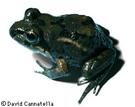

---
aliases:
  - Limnodynastinae
title: Limnodynastinae
has_id_wikidata: Q55479
---
# [[Limnodynastinae]] 

 

## #has_/text_of_/abstract 

> Limnodynastidae, commonly known as the Australian ground frogs, is a family of frogs found in Australia, New Guinea, and the Aru Islands. They were formerly considered a subfamily of the Myobatrachidae, the other large radiation of terrestrial frogs in Australia, but are now considered a distinct family. Both Limnodynastidae and Myobatrachidae are thought to be the only members of the superfamily Myobatrachoidea.
>
> The earliest fossils of this group are of Platypectrum casca from the Early Eocene.
>
> [Wikipedia](https://en.wikipedia.org/wiki/Limnodynastidae) 

## Introduction

[David Cannatella](http://www.tolweb.org/) 

This group is found in Australia, Tasmania and New Guinea. A diverse
group of frogs, ranging from 35 to 115 mm in snout-vent length. Many
species are burrowers. Most genera have vertical pupils. Breeding males
of Limnodynastes beat the egg mass into a foam. In Adelotus the males
are large than females, and have a pair of sharp tusks at the tip of the
lower jaw. Philoria lay direct-developing eggs in moist tunnels of soil
or moss. Some species of Neobatrachus are almost identical to Scaphiopus
of North America, both in appearance and in their fossorial habits.
Notaden are also burrowers, but have extremely poorly ossified skulls,
are mostly brightly colored, and secrete a white sticky skin toxin.

Limnodynastines are generally considered to be part of the family
Myobatrachidae, along with the Myobatrachinae. However, Ford and
Cannatella (1993) presented evidence indicating that no shared derived
characters unite limnodynastines and myobatrachines, and further that
their proposed relationship of Sooglossidae with Myobatrachinae would
make the family Myobatrachidae paraphyletic. Rather than formally
breaking up the Myobatrachidae, Ford and Cannatella (1993) simply dealt
with the two subfamilies separately.

Some Miocene and Pleistocene fossils are known.

### Discussion of Phylogenetic Relationships

Ford and Cannatella (1993) defined the node-based name Limnodynastinae
to be the most recent common ancestor of Adelotus, Heleioporus,
Kyarranus, Lechriodus, Limnodynastes, Megistolotis, Mixophys,
Neobatrachus, Notaden, and Philoria, and all its descendants. See
extensive comments under Myobatrachinae.

## Phylogeny 

-   « Ancestral Groups  
    -   [Neobatrachia](../Neobatrachia.md)
    -   [Salientia](../../Salientia.md)
    -   [Living Amphibians](Living_Amphibians)
    -   [Terrestrial Vertebrates](../../../../Terrestrial.md)
    -   [Sarcopterygii](../../../../../Sarc.md)
    -   [Gnathostomata](../../../../../../Gnath.md)
    -   [Vertebrata](../../../../../../../Vertebrata.md)
    -   [Craniata](../../../../../../../../Craniata.md)
    -   [Chordata](../../../../../../../../../Chordata.md)
    -   [Deuterostomia](../../../../../../../../../../Deutero.md)
    -  [Bilateria](../../../../../../../../../../../Bilateria.md) 
    -  [Animals](../../../../../../../../../../../../Animals.md) 
    -  [Eukarya](../../../../../../../../../../../../../Eukarya.md) 
    -   [Tree of Life](../../../../../../../../../../../../../Tree_of_Life.md)

-   ◊ Sibling Groups of  Neobatrachia
    -   [Allophryne ruthveni](Allophryne_ruthveni.md)
    -   [Brachycephalidae](Brachycephalidae.md)
    -   [Bufonidae](Bufonidae.md)
    -   [Heleophryne](Heleophryne.md)
    -   [\'Leptodactylidae\'](%27Leptodactylidae%27)
    -   Limnodynastinae
    -   [Myobatrachinae](Myobatrachinae.md)
    -   [Sooglossidae](Sooglossidae.md)
    -   [Rhinoderma](Rhinoderma.md)
    -   [Dendrobatidae](Dendrobatidae.md)
    -   [Pseudidae](Pseudidae.md)
    -   [Hylidae](Hylidae.md)
    -   [Centrolenidae](Centrolenidae.md)
    -   [Microhylidae](Microhylidae.md)
    -   [Hemisus](Hemisus.md)
    -   [Arthroleptidae](Arthroleptidae.md)
    -   [\'Ranidae\'](%27Ranidae%27)
    -   [Hyperoliidae](Hyperoliidae.md)
    -   [Rhacophoridae](Rhacophoridae.md)

-   » Sub-Groups 
	-   *Adelotus*
	-   *Heleioporus*
	-   *Kyarranus*
	-   *Lechriodus*
	-   *Limnodynastes*
	-   *Megistolotis*
	-   *Mixophyes*
	-   *Neobatrachus*
	-   *Notaden*
	-   *Philoria*

## Title Illustrations

------------------------------------------------------------------------
Limnodynastes salminii; photo © 1995 David Cannatella)

## Confidential Links & Embeds: 

### #is_/same_as :: [[/_Standards/bio/bio~Domain/Eukarya/Animal/Bilateria/Deutero/Chordata/Craniata/Vertebrata/Gnath/Sarc/Tetrapods/Amphibia/Salientia/Neobatrachia/Limnodynastinae|Limnodynastinae]] 

### #is_/same_as :: [[/_public/bio/bio~Domain/Eukarya/Animal/Bilateria/Deutero/Chordata/Craniata/Vertebrata/Gnath/Sarc/Tetrapods/Amphibia/Salientia/Neobatrachia/Limnodynastinae.public|Limnodynastinae.public]] 

### #is_/same_as :: [[/_internal/bio/bio~Domain/Eukarya/Animal/Bilateria/Deutero/Chordata/Craniata/Vertebrata/Gnath/Sarc/Tetrapods/Amphibia/Salientia/Neobatrachia/Limnodynastinae.internal|Limnodynastinae.internal]] 

### #is_/same_as :: [[/_protect/bio/bio~Domain/Eukarya/Animal/Bilateria/Deutero/Chordata/Craniata/Vertebrata/Gnath/Sarc/Tetrapods/Amphibia/Salientia/Neobatrachia/Limnodynastinae.protect|Limnodynastinae.protect]] 

### #is_/same_as :: [[/_private/bio/bio~Domain/Eukarya/Animal/Bilateria/Deutero/Chordata/Craniata/Vertebrata/Gnath/Sarc/Tetrapods/Amphibia/Salientia/Neobatrachia/Limnodynastinae.private|Limnodynastinae.private]] 

### #is_/same_as :: [[/_personal/bio/bio~Domain/Eukarya/Animal/Bilateria/Deutero/Chordata/Craniata/Vertebrata/Gnath/Sarc/Tetrapods/Amphibia/Salientia/Neobatrachia/Limnodynastinae.personal|Limnodynastinae.personal]] 

### #is_/same_as :: [[/_secret/bio/bio~Domain/Eukarya/Animal/Bilateria/Deutero/Chordata/Craniata/Vertebrata/Gnath/Sarc/Tetrapods/Amphibia/Salientia/Neobatrachia/Limnodynastinae.secret|Limnodynastinae.secret]] 

