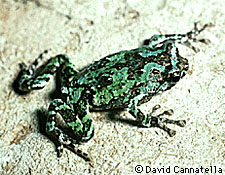
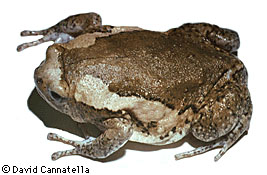
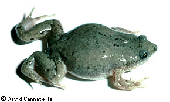
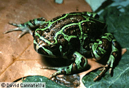

---
aliases:
  - Microhylidae
title: Microhylidae
---

# [[Microhylidae]]

Narrow-Mouthed Frogs 

## #has_/text_of_/abstract 

> The **Microhylidae**, commonly known as narrow-mouthed frogs, are a geographically widespread family of frogs. 
> The 683 species are in 57 genera and 11 subfamilies.
>
> [Wikipedia](https://en.wikipedia.org/wiki/Microhylidae) 

## Introduction

[David Cannatella](http://www.tolweb.org/)

Microhylids are called Narrow-Mouthed Frogs, althought not all of the
species have the very narrow mouths and pointed heads seen in the New
World species. This family has the largest number of genera, with more
than 60. They are found principally in tropical regions of the world:
South America, Africa, Madagascar, SE Asia, Indonesia, New Guinea,
Australia (NE only). They also are found in the more temperate regions
of North America and Africa. The two genera in the United States are
Gastrophryne and Hypopachus.

In size they range from tiny forms (10 mm) to moderately large animals
(100 mm). In many the body form is tear-drop-shaped, with a narrow,
pointed snout and rather rounded body. However, some are more treefrog
like, with expanded digital tips, such as Kaloula.

Breviceps, the Rain Frogs of Africa, have a very short face; during
amplexus the male becomes attached to the female by sticky skin
secretions. Many microhylids are burrowers, emerging only after heavy
rains. Most are dull, but are few such as Dyscophus may be brightly
colored. As a group they tend to be ant and termite-specialists. Some
exhibit a commensal relationship with burrowing spiders (Crocroft and
Hambler, 1989). Phrynomerus, the Rubber Frogs, have intercalary elements
in the digits and have often been placed in a separate family
Phrynomeridae.

The most informative reference remains (Parker, 1934).

### Discussion of Phylogenetic Relationships

One persistent issue of the taxonomy of Microhylidae has been the
inclusion of scaphiophrynines (Scaphiophryne and Pseudohemisus); the
group has been alternatively included in Ranidae or Microhylidae (see
review in Wassersug, 1984). The ambiguity was based on the description
of tadpoles of two Malagasy species by Angel (1931), which were referred
to Pseudohemisus verrucosus and P. longimanus; these tadpoles had beaks
and denticles. However, these larvae were shown to belong to ranid
species (Blommers-Schlösser, personal communication in Wassersug
\[1984\]). Otherwise, the monophyly of Microhylidae has not been
questioned.

The Type 2 larva of Orton (1953, 1957) was generally considered
diagnostic of Microhylidae, but larvae of scaphiophrynines, as for many
microhylids, remained unknown. However, the description of the tadpole
of Pseudohemisus granulosum (Blommers-Schlösser, 1975; Wassersug, 1984,
1989) provided an intermediate suite of characters between the Type 2
and Type 4 tadpoles, and drew attention to the inadequacy of Orton\'s
tadpole groups. Duellman and Trueb (1986) continued to use the Type 2
larva (their character O2) as a synapomorphy of Microhylidae, and
discussed the intermediate morphological status of the scaphiophrynine
tadpole. The concern over the definition of the Type 2 tadpole has
diverted attention from the more important issue, that of relationships.
In fact, analysis of the characters of the Pseudohemisus tadpole
(Wassersug, 1984) provides simultaneously a suite of derived features
uniting scaphiophrynines with the other microhylids, and a suite of
derived features allying those microhylids (here called Scoptanura) to
the exclusion of scaphiophrynines (as represented by Pseudohemisus.)

Ford and Cannatella (1993) defined Scoptanura to be the most recent
common ancestor of dyscophines, cophylines, brevicipitines,
asterophryines, genyophryines, melanobatrachines, Phrynomerus, and
microhylines, as listed in Duellman and Trueb (1986), and all its
descendants. Scoptanura was used by Starrett (1968, 1973) as a name for
the group associated with the Type 2 tadpole. This name is used because
it minimizes the creation of new names, not to encourage the use of
Orton\'s tadpole groups. The name Scoptanura occupies a hierarchical
position between the (family) Microhylidae and the included groups
(subfamilies), but it has no rank. Therefore, it is not necessary to
modify the endings of names such as Cophylinae, etc. Microhylidae was
defined to be the most recent common ancestor of scaphiophrynines and
Scoptanura, and all its descendants; this is the currently used concept
of the name. Scaphiophryninae\* is a metataxon.

Synapomorphies of Microhylidae include the following larval features:
absence of cornified denticles, ventral velum divided medially, glottis
fully exposed on buccal floor, nares not perforated, secretory ridges of
branchial food traps with only a single row of secretory cell apices
(Wassersug, 1984), and two or three palatal folds in adults (Parker,
1934).

Synapomorphies of Scoptanura include these larval characters: median
spiracle, gill filaments poorly developed or absent, modifications of
buccal pumping mechanism (short lever arm on ceratohyal, small buccal
floor area), absence of the suspensoriohyoideus muscle, and the lack of
separation of the quadrato-, hyo-, and suspensorioangularis muscles.

### Addtional Photographs

\
Gastrophryne olivacea, Texas; photo © 1995 David Cannatella\
\

\
Pseudohemisus pustulosa; photo © 1995 David Cannatella\
\

## Phylogeny 

-   « Ancestral Groups  
    -   [Neobatrachia](../Neobatrachia.md)
    -   [Salientia](../../Salientia.md)
    -   [Living Amphibians](Living_Amphibians)
    -   [Terrestrial Vertebrates](../../../../Terrestrial.md)
    -   [Sarcopterygii](../../../../../Sarc.md)
    -   [Gnathostomata](../../../../../../Gnath.md)
    -   [Vertebrata](../../../../../../../Vertebrata.md)
    -   [Craniata](../../../../../../../../Craniata.md)
    -   [Chordata](../../../../../../../../../Chordata.md)
    -   [Deuterostomia](../../../../../../../../../../Deutero.md)
    -  [Bilateria](../../../../../../../../../../../Bilateria.md) 
    -  [Animals](../../../../../../../../../../../../Animals.md) 
    -  [Eukarya](../../../../../../../../../../../../../Eukarya.md) 
    -   [Tree of Life](../../../../../../../../../../../../../Tree_of_Life.md)

-   ◊ Sibling Groups of  Neobatrachia
    -   [Allophryne ruthveni](Allophryne_ruthveni.md)
    -   [Brachycephalidae](Brachycephalidae.md)
    -   [Bufonidae](Bufonidae.md)
    -   [Heleophryne](Heleophryne.md)
    -   [\'Leptodactylidae\'](%27Leptodactylidae%27)
    -   [Limnodynastinae](Limnodynastinae.md)
    -   [Myobatrachinae](Myobatrachinae.md)
    -   [Sooglossidae](Sooglossidae.md)
    -   [Rhinoderma](Rhinoderma.md)
    -   [Dendrobatidae](Dendrobatidae.md)
    -   [Pseudidae](Pseudidae.md)
    -   [Hylidae](Hylidae.md)
    -   [Centrolenidae](Centrolenidae.md)
    -   Microhylidae
    -   [Hemisus](Hemisus.md)
    -   [Arthroleptidae](Arthroleptidae.md)
    -   [\'Ranidae\'](%27Ranidae%27)
    -   [Hyperoliidae](Hyperoliidae.md)
    -   [Rhacophoridae](Rhacophoridae.md)

-   » Sub-Groups 
	-   *Scaphiophryninae\**
	    -   *Pseudohemisus*[ (non-monophyletic) ]
	    -   *Scaphiophryne*
	-   *Scoptanura*
	    -   *Asterophryinae*
	        -   *Asterophrys*
	        -   *Barygenys*
	        -   *Hylophorbus*
	        -   *Pherohapsis*
	        -   *Phrynomantis*
	        -   *Xenobatrachus*
	        -   *Xenorhina*
	    -   *Brevicipitinae*
	        -   *Breviceps*
	        -   *Callulina*
	        -   *Probreviceps*
	        -   *Spelaeophryne*
	    -   *Cophylinae*
	        -   *Anodonthyla*
	        -   *Cophyla*
	        -   *Madecassophryne*
	        -   *Mantipus*
	        -   *Paracophyla*
	        -   *Platypelis*
	        -   *Plethodontohyla*
	        -   *Rhombophryne*
	        -   *Stumpffia*
	    -   *Dyscophinae*
	        -   *Calluela*
	        -   *Dyscophus*
	    -   *Genyophryninae*
	        -   *Choerophryne*
	        -   *Cophixalus*
	        -   *Copiula*
	        -   *Genyophryne*
	        -   *Oreophryne*
	        -   *Sphenophryne*
	    -   *Melanobatrachinae*
	        -   *Holophryne*
	        -   *Melanobatrachus*
	        -   *Parhoplophryne*
	    -   *Microhylinae*
	        -   *Arcovomer*
	        -   *Chaperina*
	        -   *Chiasmocleis*
	        -   *Ctenophryne*
	        -   *Dasypops*
	        -   *Dermatonotus*
	        -   *Elachistocleis*
	        -   *Gastrophryne*
	        -   *Gastrophrynoides*
	        -   *Glossostoma*
	        -   *Glyphoglossus*
	        -   *Hamptophryne*
	        -   *Hypopachus*
	        -   *Hyophryne*
	        -   *Kalophrynus*
	        -   *Kaloula*
	        -   *Metaphrynella*
	        -   *Microhyla*
	        -   *Myersiella*
	        -   *Otophryne*
	        -   *Phrynella*
	        -   *Ramanella*
	        -   *Relictivomer*
	        -   *Stereocyclops*
	        -   *Synapturanus*
	        -   *Syncope*
	        -   *Uperodon*
	    -   *Phrynomerinae*
	        -   *Phrynomerus*

## Title Illustrations

------------------------------------------------------------------------
1. Scaphiophryne cf. marmorata; photo © 1995 David Cannatella\)

------------------------------------------------------------------------
1. Kaloula pulchra, Thailand; photo © 1995 David Cannatella\)

## Confidential Links & Embeds: 

### #is_/same_as :: [[/_Standards/bio/bio~Domain/Eukarya/Animal/Bilateria/Deutero/Chordata/Craniata/Vertebrata/Gnath/Sarc/Tetrapods/Amphibia/Salientia/Neobatrachia/Microhylidae|Microhylidae]] 

### #is_/same_as :: [[/_public/bio/bio~Domain/Eukarya/Animal/Bilateria/Deutero/Chordata/Craniata/Vertebrata/Gnath/Sarc/Tetrapods/Amphibia/Salientia/Neobatrachia/Microhylidae.public|Microhylidae.public]] 

### #is_/same_as :: [[/_internal/bio/bio~Domain/Eukarya/Animal/Bilateria/Deutero/Chordata/Craniata/Vertebrata/Gnath/Sarc/Tetrapods/Amphibia/Salientia/Neobatrachia/Microhylidae.internal|Microhylidae.internal]] 

### #is_/same_as :: [[/_protect/bio/bio~Domain/Eukarya/Animal/Bilateria/Deutero/Chordata/Craniata/Vertebrata/Gnath/Sarc/Tetrapods/Amphibia/Salientia/Neobatrachia/Microhylidae.protect|Microhylidae.protect]] 

### #is_/same_as :: [[/_private/bio/bio~Domain/Eukarya/Animal/Bilateria/Deutero/Chordata/Craniata/Vertebrata/Gnath/Sarc/Tetrapods/Amphibia/Salientia/Neobatrachia/Microhylidae.private|Microhylidae.private]] 

### #is_/same_as :: [[/_personal/bio/bio~Domain/Eukarya/Animal/Bilateria/Deutero/Chordata/Craniata/Vertebrata/Gnath/Sarc/Tetrapods/Amphibia/Salientia/Neobatrachia/Microhylidae.personal|Microhylidae.personal]] 

### #is_/same_as :: [[/_secret/bio/bio~Domain/Eukarya/Animal/Bilateria/Deutero/Chordata/Craniata/Vertebrata/Gnath/Sarc/Tetrapods/Amphibia/Salientia/Neobatrachia/Microhylidae.secret|Microhylidae.secret]] 

