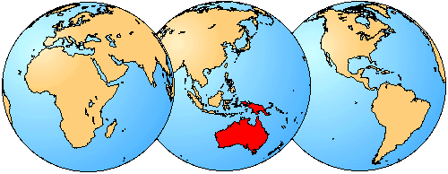

# [[Myobatrachinae]]

Myobatrachine Frogs 

## #has_/text_of_/abstract 

> Myobatrachidae, commonly known as Australian ground frogs or Australian water frogs, is a family of frogs found in Australia and New Guinea. Members of this family vary greatly in size, from species less than 1.5 cm (0.59 in) long, to the second-largest frog in Australia, the giant barred frog (Mixophyes iteratus), at 12 cm (4.7 in) in length. The entire family is either terrestrial or aquatic frogs, with no arboreal species.
>
> [Wikipedia](https://en.wikipedia.org/wiki/Myobatrachidae) 
## Introduction

[David Cannatella](http://www.tolweb.org/)

This clade is endemic to Australia, New Guinea and Tasmania.
Myobatrachines are generally smaller frogs with reduced ossification
(See Ford and Cannatella, 1993). Myobatrachus, a head-first burrower and
termite-eater that resembles Rhinophrynus, reaches 60 mm, but most of
the other myobatrachines are 20-40 mm in snout-vent length. The
gastric-brooding frog Rheobatrachus, which broods the developing eggs in
its stomach, is also larger, 50-80 mm. It has been variously assigned to
the Myobatrachinae, as its own subfamily or its own family.

The majority of myobatrachines are terrestrial or enjoy wet areas.
Rheobatrachus is highly aquatic. Arenophryne is a burrowing frog in
coastal sand dunes. Like its relative Myobatrachus, it burrows
head-first. Some genera such as Crinia and Geocrinia inhabit swamps and
wet areas. Taudactylus frequent mountain streams. Males of Assa have
inguinal pouches in which larvae are reared.

The Eocene fossil †Indobatrachus has been included in this group (Spinar
and Hodrová, 1985); a few Pleistocene fossils are known.

### Geographic Distribution

The distribution of living members of the family Myobatrachinae is
indicated in red.\

### Discussion of Phylogenetic Relationships

Ford and Cannatella (1993) defined the node-based name Myobatrachinae to
be the most recent common ancestor of Arenophryne, Assa, Crinia,
Geocrinia, Myobatrachus, Paracrinia, Pseudophryne, Taudactylus, and
Uperoleia, and all its descendants. Because the name is defined in terms
of the ancestor and its descendants, it will remain stable regardless of
whether Rheobatrachus or Sooglossidae is found to be nested within
Myobatrachinae or not. Duellman and Trueb (1986) included the Eocene
fossil †Indobatrachus in the Myobatrachinae; Ford and Cannatella (1993)
did not use it in the definition because its relationships are
uncertain. Rheobatrachus was not included in the definition, because it
has been placed as closely related to Myobatrachinae, closely related to
Limnodynastinae, or the sister-group of Limnodynastinae +
Myobatrachinae.

Ford and Cannatella examined the literature on several character systems
in myobatrachids (Heyer and Liem, 1976; Horton, 1982; Lynch, 1971) and
found that in all instances myobatrachines and limnodynastines differed,
and more importantly, that they shared no derived features that would
unite them into a clade. Maxson (1992) summarized MC\'F studies on
myobatrachid frogs and concluded that there were two lineages
corresponding to myobatrachine and limnodynastines, as had been adduced
from morphological data. However, she did not compare these to other
families, and thus could not make statements regarding the monophyly of
Myobatrachidae.

Duellman and Trueb (1986) listed a ventral gap in the cricoid cartilage
as uniting Myobatrachidae and Sooglossidae. However the ventral gap is
present only in Myobatrachinae, not in Limnodynastinae (Lynch, 1973;
Heyer and Liem, 1976). Lynch (1973) used that character to unite the
(subfamily) Myobatrachinae and Sooglossidae, rendering Myobatrachidae
paraphyletic. Heyer and Liem (1976) listed one unique feature uniting
myobatrachines and limnodynastines to the exclusion of Rheobatrachus:
the absence of prezygapophyses and transverse processes on the coccyx.
However, coccygeal prezygapophyses and transverse processes are absent
in leptodactylids (Lynch, 1971) and other neobatrachians, indicating
that this character is incorrectly polarized.

Heyer and Liem (1976) reported two unique synapomorphies (among
myobatrachids) for Myobatrachinae: the presence of notochordal vertebrae
with free intervertebral discs and an incomplete cricoid ring. These
were not present in Rheobatrachus or any limnodynastine (but see below
under Sooglossidae). They listed three unique synapomorphies for
Limnodynastinae: a connection between the intermandibularis and
submentalis muscles, stalked alary processes (as opposed to broad and
wing-like), anterior petrohyoid muscle inserting on the lateral edge of
the hyoid (as opposed to insertion on the ventral surface of the hyoid).

Ford and Cannatella (1993) reasoned that the polarity of these latter
two is reversed. Lynch (1971) reported that among leptodactylids and
Heleophryne, the only taxa that share with Myobatrachinae the broad
alary processes and ventral insertion of the anterior petrohyoid muscle
are the leptodactylines Adenomera, Physalaemus, and Pseudopaludicola.
Thus, the broad alary processes and ventral insertion of the anterior
petrohyoideus are apomorphic within Neobatrachia. According to Heyer and
Liem\'s (1976) data matrix, Rheobatrachus has a combination of the
lateral insertion of the anterior petrohyoid (plesiomorphic) and a
broad, wing-like alary process (derived). Assuming these data are
correct, the latter of these two would unite Rheobatrachus with
Myobatrachinae. Rheobatrachus is procoelous and has an entire cricoid
ring; both of these are plesiomorphic. Another probable synapomorphy of
Myobatrachinae is the reduction of the vomers and concomitant absence of
vomerine teeth (Lynch, 1971).

Laurent (1979, 1986) recognized Rheobatrachus as a family distinct from
the Myobatrachidae, based on its derived mode of reproduction\--gastric
brooding; most other workers (e.g., Heyer and Liem, 1976) have placed it
in its own subfamily. Daugherty and Maxson (1982) found one-way
immunological distances from Ranidella (=Crinia) signifera to other
myobatrachines to be as great as 160 (Assa darlingtoni); the distance to
Rheobatrachus silus was 133. They argued that Rheobatrachus was not more
divergent from Ranidella than were some other myobatrachines. Farris et
al. (1982) reanalyzed a subset of Heyer and Liem\'s (1976) data and
found a myobatrachine clade and a limnodynastine clade, with
Rheobatrachus as the sister-group to the limnodynastines, rather than
the myobatrachines. However, reversing the polarity of the characters
(discussed above) places Rheobatrachus closer to myobatrachines.

## Phylogeny 

-   « Ancestral Groups  
    -   [Neobatrachia](../Neobatrachia.md)
    -   [Salientia](../../Salientia.md)
    -   [Living Amphibians](Living_Amphibians)
    -   [Terrestrial Vertebrates](../../../../Terrestrial.md)
    -   [Sarcopterygii](../../../../../Sarc.md)
    -   [Gnathostomata](../../../../../../Gnath.md)
    -   [Vertebrata](../../../../../../../Vertebrata.md)
    -   [Craniata](../../../../../../../../Craniata.md)
    -   [Chordata](../../../../../../../../../Chordata.md)
    -   [Deuterostomia](../../../../../../../../../../Deutero.md)
    -  [Bilateria](../../../../../../../../../../../Bilateria.md))
    -  [Animals](../../../../../../../../../../../../Animals.md))
    -  [Eukarya](../../../../../../../../../../../../../Eukarya.md))
    -   [Tree of Life](../../../../../../../../../../../../../Tree_of_Life.md)

-   ◊ Sibling Groups of  Neobatrachia
    -   [Allophryne ruthveni](Allophryne_ruthveni.md)
    -   [Brachycephalidae](Brachycephalidae.md)
    -   [Bufonidae](Bufonidae.md)
    -   [Heleophryne](Heleophryne.md)
    -   [\'Leptodactylidae\'](%27Leptodactylidae%27)
    -   [Limnodynastinae](Limnodynastinae.md)
    -   Myobatrachinae
    -   [Sooglossidae](Sooglossidae.md)
    -   [Rhinoderma](Rhinoderma.md)
    -   [Dendrobatidae](Dendrobatidae.md)
    -   [Pseudidae](Pseudidae.md)
    -   [Hylidae](Hylidae.md)
    -   [Centrolenidae](Centrolenidae.md)
    -   [Microhylidae](Microhylidae.md)
    -   [Hemisus](Hemisus.md)
    -   [Arthroleptidae](Arthroleptidae.md)
    -   [\'Ranidae\'](%27Ranidae%27)
    -   [Hyperoliidae](Hyperoliidae.md)
    -   [Rhacophoridae](Rhacophoridae.md)

-   » Sub-Groups 
	-   *Arenophryne*
	-   *Assa*
	-   *Crinia*
	-   *Geocrinia*
	-   *Indobatrachus* †
	-   *Myobatrachus*
	-   *Paracrinia*
	-   *Pseudophryne*
	-   *Rheobatrachus*
	-   *Taudactylus*
	-   *Uperoleia*

## Confidential Links & Embeds: 

### #is_/same_as :: [Myobatrachinae](/_Standards/bio/bio~Domain/Eukarya/Animal/Bilateria/Deutero/Chordata/Craniata/Vertebrata/Gnath/Sarc/Tetrapods/Amphibia/Salientia/Neobatrachia/Myobatrachinae.md) 

### #is_/same_as :: [Myobatrachinae.public](/_public/bio/bio~Domain/Eukarya/Animal/Bilateria/Deutero/Chordata/Craniata/Vertebrata/Gnath/Sarc/Tetrapods/Amphibia/Salientia/Neobatrachia/Myobatrachinae.public.md) 

### #is_/same_as :: [Myobatrachinae.internal](/_internal/bio/bio~Domain/Eukarya/Animal/Bilateria/Deutero/Chordata/Craniata/Vertebrata/Gnath/Sarc/Tetrapods/Amphibia/Salientia/Neobatrachia/Myobatrachinae.internal.md) 

### #is_/same_as :: [Myobatrachinae.protect](/_protect/bio/bio~Domain/Eukarya/Animal/Bilateria/Deutero/Chordata/Craniata/Vertebrata/Gnath/Sarc/Tetrapods/Amphibia/Salientia/Neobatrachia/Myobatrachinae.protect.md) 

### #is_/same_as :: [Myobatrachinae.private](/_private/bio/bio~Domain/Eukarya/Animal/Bilateria/Deutero/Chordata/Craniata/Vertebrata/Gnath/Sarc/Tetrapods/Amphibia/Salientia/Neobatrachia/Myobatrachinae.private.md) 

### #is_/same_as :: [Myobatrachinae.personal](/_personal/bio/bio~Domain/Eukarya/Animal/Bilateria/Deutero/Chordata/Craniata/Vertebrata/Gnath/Sarc/Tetrapods/Amphibia/Salientia/Neobatrachia/Myobatrachinae.personal.md) 

### #is_/same_as :: [Myobatrachinae.secret](/_secret/bio/bio~Domain/Eukarya/Animal/Bilateria/Deutero/Chordata/Craniata/Vertebrata/Gnath/Sarc/Tetrapods/Amphibia/Salientia/Neobatrachia/Myobatrachinae.secret.md)

