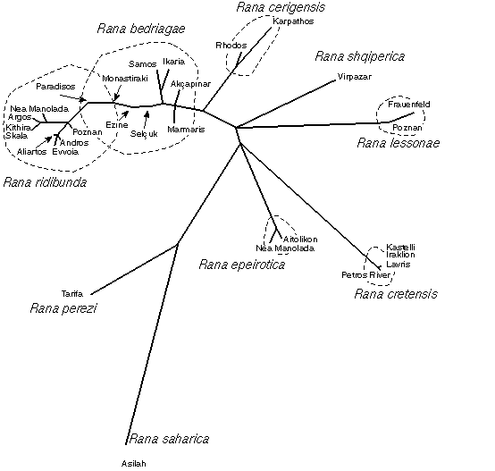

---
aliases:
  - Western_Water_Frogs
  - Western Water Frogs
title: Western Palearctic water frogs
---

# [[Western_Water_Frogs]] 

 

### Information on the Internet

[Peter Beerli\'s Water Frog Info-Pool](http://waterfrogs.csit.fsu.edu/)

## Introduction

[Peter Beerli](http://www.tolweb.org/) 

The western palearctic water frogs are a group of frogs 
which are mostly water-bound and commonly found in ponds and rivers 
throughout Europe, northern Africa and the western parts of Asia.

### Discussion of Phylogenetic Relationships

The systematics of this groups is complicated by common hybrids (see on
water frog home page:
[hybrids](http://www.tolweb.org/accessory/Water_Frog_Hybrids?acc_id=578)).
Because morphological characters are not very discriminating between
species, most populations were lumped into one taxon *Rana ridibunda*.
With the use of molecular methods the number of species increased
strongly, and most new species are removed from this heterogenous taxon.
The shown phylogeny has still uncertainties about positions of some
clades, because there exists more than one most parsimonious tree. An
alternative view gives the following tree (using 31 electrophoretic loci
and the program CONTML of the PHYLIP package of Joe Felsenstein). The
trees does not include *Rana terentievi*, because we had no samples of
it, but looking through its description we believe that it must be a
sister taxon to the ridibunda clade.

### Distribution

Western Palearctic water frogs are very common throughout of Europe, the
Middle East. The probably most southern populations are found in Jemen,
the most eastern in Tadschijkistan or even western China, the most
northern population are found in southern Sweden.

## Phylogeny 

-   « Ancestral Groups  
    -   [Rana (Pelophylax)](../Pelophylax.md)
    -   [Rana](../../Rana.md)
    -   [\'Ranidae\'](%27Ranidae%27)
    -   [Neobatrachia](../../../../Neobatrachia.md)
    -   [Salientia](../../../../../Salientia.md)
    -   [Living Amphibians](Living_Amphibians)
    -   [Terrestrial Vertebrates](../../../../../../../Terrestrial.md)
    -   [Sarcopterygii](../../../../../../../../Sarc.md)
    -   [Gnathostomata](../../../../../../../../../Gnath.md)
    -   [Vertebrata](../../../../../../../../../../Vertebrata.md)
    -   [Craniata](../../../../../../../../../../../Craniata.md)
    -   [Chordata](../../../../../../../../../../../../Chordata.md)
    -   [Deuterostomia](../../../../../../../../../../../../../Deutero.md)
    -  [Bilateria](../../../../../../../../../../../../../../Bilateria.md) 
    -  [Animals](../../../../../../../../../../../../../../../Animals.md) 
    -  [Eukarya](../../../../../../../../../../../../../../../../Eukarya.md) 
    -   [Tree of Life](../../../../../../../../../../../../../../../../Tree_of_Life.md)

-   ◊ Sibling Groups of  Rana (Pelophylax)
    -   Western Palearctic water frogs
    -   [Eastern Palearctic water         frogs](Eastern_Water_Frogs.md)

-   » Sub-Groups
    -   [Rana saharica](Western_Water_Frogs/Rana_saharica.md)
    -   [Rana perezi](Western_Water_Frogs/Rana_perezi.md)
    -   [Rana epeirotica](Western_Water_Frogs/Rana_epeirotica.md)
    -   [Rana shqiperica](Western_Water_Frogs/Rana_shqiperica.md)
    -   [Rana lessonae](Western_Water_Frogs/Rana_lessonae.md)
    -   [Rana cretensis](Western_Water_Frogs/Rana_cretensis.md)
    -   [Rana cerigensis](Western_Water_Frogs/Rana_cerigensis.md)
    -   [Rana bedriagae](Western_Water_Frogs/Rana_bedriagae.md)
    -   [Rana ridibunda](Western_Water_Frogs/Rana_ridibunda.md)

## Title Illustrations

------------

scientific_name ::     Rana lessonae
Comments             Group of calling males
specimen_condition ::  Live Specimen
Sex ::                Male
copyright ::            © 1995 Thomas Uzzell

## Confidential Links & Embeds: 

### #is_/same_as :: [[/_Standards/bio/bio~Domain/Eukarya/Animal/Bilateria/Deutero/Chordata/Craniata/Vertebrata/Gnath/Sarc/Tetrapods/Amphibia/Salientia/Neobatrachia/Ranid/Rana/Pelophylax/Western_Water_Frogs|Western_Water_Frogs]] 

### #is_/same_as :: [[/_public/bio/bio~Domain/Eukarya/Animal/Bilateria/Deutero/Chordata/Craniata/Vertebrata/Gnath/Sarc/Tetrapods/Amphibia/Salientia/Neobatrachia/Ranid/Rana/Pelophylax/Western_Water_Frogs.public|Western_Water_Frogs.public]] 

### #is_/same_as :: [[/_internal/bio/bio~Domain/Eukarya/Animal/Bilateria/Deutero/Chordata/Craniata/Vertebrata/Gnath/Sarc/Tetrapods/Amphibia/Salientia/Neobatrachia/Ranid/Rana/Pelophylax/Western_Water_Frogs.internal|Western_Water_Frogs.internal]] 

### #is_/same_as :: [[/_protect/bio/bio~Domain/Eukarya/Animal/Bilateria/Deutero/Chordata/Craniata/Vertebrata/Gnath/Sarc/Tetrapods/Amphibia/Salientia/Neobatrachia/Ranid/Rana/Pelophylax/Western_Water_Frogs.protect|Western_Water_Frogs.protect]] 

### #is_/same_as :: [[/_private/bio/bio~Domain/Eukarya/Animal/Bilateria/Deutero/Chordata/Craniata/Vertebrata/Gnath/Sarc/Tetrapods/Amphibia/Salientia/Neobatrachia/Ranid/Rana/Pelophylax/Western_Water_Frogs.private|Western_Water_Frogs.private]] 

### #is_/same_as :: [[/_personal/bio/bio~Domain/Eukarya/Animal/Bilateria/Deutero/Chordata/Craniata/Vertebrata/Gnath/Sarc/Tetrapods/Amphibia/Salientia/Neobatrachia/Ranid/Rana/Pelophylax/Western_Water_Frogs.personal|Western_Water_Frogs.personal]] 

### #is_/same_as :: [[/_secret/bio/bio~Domain/Eukarya/Animal/Bilateria/Deutero/Chordata/Craniata/Vertebrata/Gnath/Sarc/Tetrapods/Amphibia/Salientia/Neobatrachia/Ranid/Rana/Pelophylax/Western_Water_Frogs.secret|Western_Water_Frogs.secret]] 

