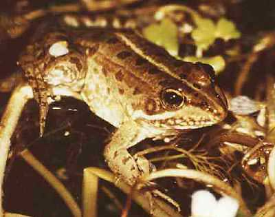
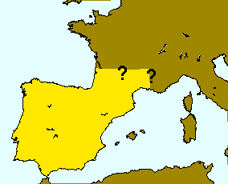

---
title: "Rana perezi"
---

## Phylogeny 

-   « Ancestral Groups  
    -   [Western Palearctic water         frogs](Western_Palearctic_water_frogs)
    -   [Rana (Pelophylax)](Rana_%28Pelophylax%29)
    -   [Rana](../../../../Rana.md)
    -   [\'Ranidae\'](%27Ranidae%27)
    -   [Neobatrachia](../../../../../../Neobatrachia.md)
    -   [Salientia](../../../../../../../Salientia.md)
    -   [Living Amphibians](Living_Amphibians)
    -   [Terrestrial Vertebrates](../../../../../../../../../Terrestrial.md)
    -   [Sarcopterygii](../../../../../../../../../../Sarc.md)
    -   [Gnathostomata](../../../../../../../../../../../Gnath.md)
    -   [Vertebrata](../../../../../../../../../../../../Vertebrata.md)
    -   [Craniata](../../../../../../../../../../../../../Craniata.md)
    -   [Chordata](../../../../../../../../../../../../../../Chordata.md)
    -   [Deuterostomia](../../../../../../../../../../../../../../../Deutero.md)
    -  [Bilateria](../../../../../../../../../../../../../../../../Bilateria.md))
    -  [Animals](../../../../../../../../../../../../../../../../../Animals.md))
    -  [Eukarya](../../../../../../../../../../../../../../../../../../Eukarya.md))
    -   [Tree of Life](../../../../../../../../../../../../../../../../../../Tree_of_Life.md)

-   ◊ Sibling Groups of  Western Palearctic water frogs
    -   [Rana saharica](Rana_saharica)
    -   Rana perezi
    -   [Rana epeirotica](Rana_epeirotica)
    -   [Rana shqiperica](Rana_shqiperica)
    -   [Rana lessonae](Rana_lessonae)
    -   [Rana cretensis](Rana_cretensis)
    -   [Rana cerigensis](Rana_cerigensis)
    -   [Rana bedriagae](Rana_bedriagae)
    -   [Rana ridibunda](Rana_ridibunda)

-   » Sub-Groups 

# *Rana perezi* [Seoane 1885] 

[Peter Beerli](http://www.tolweb.org/)

Containing group: [Western Palearctic water frogs](../../Western Palearctic water frogs)

### Information on the Internet

[Peter Beerli\'s Water Frog Info-Pool](http://waterfrogs.csit.fsu.edu/)

### Distribution

This species occurs on the Iberian peninsula and in southern parts of
France.

### Voice

The following recordings a short sequences of longer recordings. These
files are size reduced (MULAW 8-bit encoded) from 16-bit encoded sound
files. \[[A single call](http://www.tolweb.org/tree/Eukarya/Animal/chordata/salientia/ranidae/rana_%28pelophylax%29/pbsounds/perezi.short.au)
, [Several calls](http://www.tolweb.org/tree/Eukarya/Animal/chordata/salientia/ranidae/rana_%28pelophylax%29/pbsounds/perezi.au)
\]

### Synonyms

Valid name: *Rana (Pelophylax) perezi* Seoane 1885

Synonyms:\"Rana hispanica\" Fitzinger 1826, Rana calcarata Tschudi 1838,
Rana esculenta perezi Seoane 1885.

### References

Arano, B., G. A. Llorente, P. Herrero, and B. Sanchiz. 1994. Current
studies on Iberian water frogs. In: M. Ogielska (Ed.): II International
Symposium on Ecology and Genetics of European water frogs, 18-25
September 1994, Wroclaw, Poland. Zoologica Poloniae 39(3-4): 365-375.

Beerli, P. 1994. Genetic isolation and calibration of an average protein
clock in western Palearctic water frogs of the Aegean region.
Dissertation Universität Zürich 1994.
\[[Summary](http://www.tolweb.org/accessory/Genetic_Isolation_in_Western_Palearctic_Water_Frogs?acc_id=580)\]

Berger, L. 1983. Western Palearctic water frogs (Amphibia, Ranidae):
Systematics, genetics and population compositions. Experientia 39(2):
127-130.

Dubois, A., and A. Ohler. 1994. Frogs of the subgenus *Pelophylax*
(Amphibia, Anura, genus *Rana*): a catalogue of available and valid
scientific names, with comments on the name-bearing types, complete
synonymies. proposed common names, and maps showing all type localities.
In: M. Ogielska (Ed.): II International Symposium on Ecology and
Genetics of European water frogs, 18-25 September 1994, Wroclaw, Poland.
Zoologica Poloniae 39(3-4).

Graf, J.-D. and M. Polls Pelaz. 1989. Evolutionary genetics of the *Rana
esculenta* complex. In: Dawley, R.M. and J.P. Bogart (eds.): Evolution
and ecology of unisexual vertebrates. New York State Museum Bulletin
466: 289-302.

Hotz, H., T. Uzzell, and L. Berger. 1994. Hemiclonal hybrid water frogs
associated with the sexual host species *Rana perezi*. In: M. Ogielska
(Ed.): II International Symposium on Ecology and Genetics of European
water frogs, 18-25 September 1994, Wroclaw, Poland. Zoologica Poloniae
39(3-4):243-266.

## Title Illustrations

)

  -----------
  Scientific Name ::  Rana perezi
  Copyright ::         © 1997 Dirk Schmeller
  -----------

## Confidential Links & Embeds: 

### #is_/same_as ::[perezi](perezi.md)) 

### #is_/same_as :: [perezi.public](/_public/bio/bio~Domain/Eukarya/Animal/Bilateria/Deutero/Chordata/Craniata/Vertebrata/Gnath/Sarc/Tetrapods/Amphibians/Salientia/Neobatrachia/Ranidae/Rana/Pelophylax/Western_Water_Frogs/Rana/perezi.public.md) 

### #is_/same_as :: [perezi.internal](/_internal/bio/bio~Domain/Eukarya/Animal/Bilateria/Deutero/Chordata/Craniata/Vertebrata/Gnath/Sarc/Tetrapods/Amphibians/Salientia/Neobatrachia/Ranidae/Rana/Pelophylax/Western_Water_Frogs/Rana/perezi.internal.md) 

### #is_/same_as :: [perezi.protect](/_protect/bio/bio~Domain/Eukarya/Animal/Bilateria/Deutero/Chordata/Craniata/Vertebrata/Gnath/Sarc/Tetrapods/Amphibians/Salientia/Neobatrachia/Ranidae/Rana/Pelophylax/Western_Water_Frogs/Rana/perezi.protect.md) 

### #is_/same_as :: [perezi.private](/_private/bio/bio~Domain/Eukarya/Animal/Bilateria/Deutero/Chordata/Craniata/Vertebrata/Gnath/Sarc/Tetrapods/Amphibians/Salientia/Neobatrachia/Ranidae/Rana/Pelophylax/Western_Water_Frogs/Rana/perezi.private.md) 

### #is_/same_as :: [perezi.personal](/_personal/bio/bio~Domain/Eukarya/Animal/Bilateria/Deutero/Chordata/Craniata/Vertebrata/Gnath/Sarc/Tetrapods/Amphibians/Salientia/Neobatrachia/Ranidae/Rana/Pelophylax/Western_Water_Frogs/Rana/perezi.personal.md) 

### #is_/same_as :: [perezi.secret](/_secret/bio/bio~Domain/Eukarya/Animal/Bilateria/Deutero/Chordata/Craniata/Vertebrata/Gnath/Sarc/Tetrapods/Amphibians/Salientia/Neobatrachia/Ranidae/Rana/Pelophylax/Western_Water_Frogs/Rana/perezi.secret.md)

