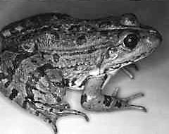

---
title: "Rana ridibunda"
---

## Phylogeny 

-   « Ancestral Groups  
    -   [Western Palearctic water         frogs](Western_Palearctic_water_frogs)
    -   [Rana (Pelophylax)](Rana_%28Pelophylax%29)
    -   [Rana](../../../../Rana.md)
    -   [\'Ranidae\'](%27Ranidae%27)
    -   [Neobatrachia](../../../../../../Neobatrachia.md)
    -   [Salientia](../../../../../../../Salientia.md)
    -   [Living Amphibians](Living_Amphibians)
    -   [Terrestrial Vertebrates](../../../../../../../../../Terrestrial.md)
    -   [Sarcopterygii](../../../../../../../../../../Sarc.md)
    -   [Gnathostomata](../../../../../../../../../../../Gnath.md)
    -   [Vertebrata](../../../../../../../../../../../../Vertebrata.md)
    -   [Craniata](../../../../../../../../../../../../../Craniata.md)
    -   [Chordata](../../../../../../../../../../../../../../Chordata.md)
    -   [Deuterostomia](../../../../../../../../../../../../../../../Deutero.md)
    -  [Bilateria](../../../../../../../../../../../../../../../../Bilateria.md))
    -  [Animals](../../../../../../../../../../../../../../../../../Animals.md))
    -  [Eukarya](../../../../../../../../../../../../../../../../../../Eukarya.md))
    -   [Tree of Life](../../../../../../../../../../../../../../../../../../Tree_of_Life.md)

-   ◊ Sibling Groups of  Western Palearctic water frogs
    -   [Rana saharica](Rana_saharica)
    -   [Rana perezi](Rana_perezi)
    -   [Rana epeirotica](Rana_epeirotica)
    -   [Rana shqiperica](Rana_shqiperica)
    -   [Rana lessonae](Rana_lessonae)
    -   [Rana cretensis](Rana_cretensis)
    -   [Rana cerigensis](Rana_cerigensis)
    -   [Rana bedriagae](Rana_bedriagae)
    -   Rana ridibunda

-   » Sub-Groups 

# *Rana ridibunda* [Pallas 1771] 

[Peter Beerli](http://www.tolweb.org/)

Containing group: [Western Palearctic water frogs](../../Western Palearctic water frogs)

### Information on the Internet

[Peter Beerli\'s Water Frog Info-Pool](http://waterfrogs.csit.fsu.edu/)

### Distribution

This species occurs from Central Europe to the Ural, but its eastern
distribution is not well known.

### Voice

The following recordings a short sequences of longer recordings. These
files are size reduced (MULAW 8-bit encoded) from 16-bit encoded sound
files. \[[A single call](http://www.tolweb.org/tree/Eukarya/Animal/chordata/salientia/ranidae/rana_%28pelophylax%29/pbsounds/ridibunda.short.au),
[Several calls](http://www.tolweb.org/tree/Eukarya/Animal/chordata/salientia/ranidae/rana_%28pelophylax%29/pbsounds/ridibunda.au)\].

### Synonyms

Valid name: *Rana (Pelophylax) ridibunda* Pallas 1771

Synonyms: Rana ridibunda Palla 1771, Rana gigas Gmelin 1789, Rana
cachinnans Pallas 1814, Rana caucasica Pallas 1814, \"Rana bufoides\"
Güldenstadt in Pallas 1814, Rana esculenta var. tigrina Einchwald 1831,
Rana dentex Krynicki 1837, \"Rana taurica\" Bonaparte 1840, Rana fortis
Boulenger 1884, Rana florinskii Katschenko and Sipacev 1913, Rana
mangischlakensis Ahl 1925.

### References

Beerli, P. 1994. Genetic isolation and calibration of an average protein
clock in western Palearctic water frogs of the Aegean region.
Dissertation Universität Zürich 1994.
\[[Summary](http://www.tolweb.org/accessory/Genetic_Isolation_in_Western_Palearctic_Water_Frogs?acc_id=580)\]

Berger, L. 1983. Western Palearctic water frogs (Amphibia, Ranidae):
Systematics, genetics and population compositions. Experientia 39(2):
127-130.

Dubois, A., and A. Ohler. 1994. Frogs of the subgenus *Pelophylax*
(Amphibia, Anura, genus *Rana*): a catalogue of available and valid
scientific names, with comments on the name-bearing types, complete
synonymies. proposed common names, and maps showing all type localities.
In: M. Ogielska (Ed.): II International Symposium on Ecology and
Genetics of European water frogs, 18-25 September 1994, Wroclaw, Poland.
Zoologica Poloniae 39(3-4).

Graf, J.-D. and M. Polls Pelaz. 1989. Evolutionary genetics of the *Rana
esculenta* complex. In: Dawley, R.M. and J.P. Bogart (eds.): Evolution
and ecology of unisexual vertebrates. New York State Museum Bulletin
466: 289-302.

Hotz, H., G. Manchino, S. Bucci-Innocenti, M. Ragghianti, L. Berger, and
T. Uzzell. 1986. *Rana ridibunda* varies geographically in inducing
clonal gametogenesis in interspecific hybrids. Journal of experimental
Zoology 236: 199-210.

Uzzell, T. and L. Berger. 1975. Electrophoretic phenotypes of *Rana
ridibunda*, *Rana lessonae*, and their hybridogenetic associate, *Rana
esculenta*. Proceedings of the Academy of Natural Sciences of
Philadelphia 127(2): 13-24.

## Title Illustrations

)

  ----------
  Scientific Name ::  Rana ridibunda
  Copyright ::         © 1995 Hansjürg Hotz
  ----------

## Confidential Links & Embeds: 

### #is_/same_as ::[ridibunda](ridibunda.md)) 

### #is_/same_as :: [ridibunda.public](/_public/bio/bio~Domain/Eukarya/Animal/Bilateria/Deutero/Chordata/Craniata/Vertebrata/Gnath/Sarc/Tetrapods/Amphibians/Salientia/Neobatrachia/Ranidae/Rana/Pelophylax/Western_Water_Frogs/Rana/ridibunda.public.md) 

### #is_/same_as :: [ridibunda.internal](/_internal/bio/bio~Domain/Eukarya/Animal/Bilateria/Deutero/Chordata/Craniata/Vertebrata/Gnath/Sarc/Tetrapods/Amphibians/Salientia/Neobatrachia/Ranidae/Rana/Pelophylax/Western_Water_Frogs/Rana/ridibunda.internal.md) 

### #is_/same_as :: [ridibunda.protect](/_protect/bio/bio~Domain/Eukarya/Animal/Bilateria/Deutero/Chordata/Craniata/Vertebrata/Gnath/Sarc/Tetrapods/Amphibians/Salientia/Neobatrachia/Ranidae/Rana/Pelophylax/Western_Water_Frogs/Rana/ridibunda.protect.md) 

### #is_/same_as :: [ridibunda.private](/_private/bio/bio~Domain/Eukarya/Animal/Bilateria/Deutero/Chordata/Craniata/Vertebrata/Gnath/Sarc/Tetrapods/Amphibians/Salientia/Neobatrachia/Ranidae/Rana/Pelophylax/Western_Water_Frogs/Rana/ridibunda.private.md) 

### #is_/same_as :: [ridibunda.personal](/_personal/bio/bio~Domain/Eukarya/Animal/Bilateria/Deutero/Chordata/Craniata/Vertebrata/Gnath/Sarc/Tetrapods/Amphibians/Salientia/Neobatrachia/Ranidae/Rana/Pelophylax/Western_Water_Frogs/Rana/ridibunda.personal.md) 

### #is_/same_as :: [ridibunda.secret](/_secret/bio/bio~Domain/Eukarya/Animal/Bilateria/Deutero/Chordata/Craniata/Vertebrata/Gnath/Sarc/Tetrapods/Amphibians/Salientia/Neobatrachia/Ranidae/Rana/Pelophylax/Western_Water_Frogs/Rana/ridibunda.secret.md)

