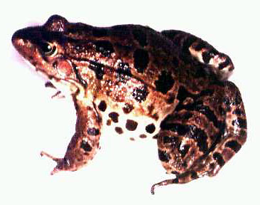
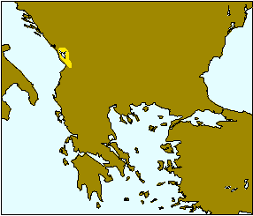

---
title: "Rana shqiperica"
---

## Phylogeny 

-   « Ancestral Groups  
    -   [Western Palearctic water         frogs](Western_Palearctic_water_frogs)
    -   [Rana (Pelophylax)](Rana_%28Pelophylax%29)
    -   [Rana](../../../../Rana.md)
    -   [\'Ranidae\'](%27Ranidae%27)
    -   [Neobatrachia](../../../../../../Neobatrachia.md)
    -   [Salientia](../../../../../../../Salientia.md)
    -   [Living Amphibians](Living_Amphibians)
    -   [Terrestrial Vertebrates](../../../../../../../../../Terrestrial.md)
    -   [Sarcopterygii](../../../../../../../../../../Sarc.md)
    -   [Gnathostomata](../../../../../../../../../../../Gnath.md)
    -   [Vertebrata](../../../../../../../../../../../../Vertebrata.md)
    -   [Craniata](../../../../../../../../../../../../../Craniata.md)
    -   [Chordata](../../../../../../../../../../../../../../Chordata.md)
    -   [Deuterostomia](../../../../../../../../../../../../../../../Deutero.md)
    -  [Bilateria](../../../../../../../../../../../../../../../../Bilateria.md))
    -  [Animals](../../../../../../../../../../../../../../../../../Animals.md))
    -  [Eukarya](../../../../../../../../../../../../../../../../../../Eukarya.md))
    -   [Tree of Life](../../../../../../../../../../../../../../../../../../Tree_of_Life.md)

-   ◊ Sibling Groups of  Western Palearctic water frogs
    -   [Rana saharica](Rana_saharica)
    -   [Rana perezi](Rana_perezi)
    -   [Rana epeirotica](Rana_epeirotica)
    -   Rana shqiperica
    -   [Rana lessonae](Rana_lessonae)
    -   [Rana cretensis](Rana_cretensis)
    -   [Rana cerigensis](Rana_cerigensis)
    -   [Rana bedriagae](Rana_bedriagae)
    -   [Rana ridibunda](Rana_ridibunda)

-   » Sub-Groups 

# *Rana shqiperica* [Hotz, Uzzell, Günther, Tunner and Heppich 1987] 

[Peter Beerli](http://www.tolweb.org/)

Containing group: [Western Palearctic water frogs](../../Western Palearctic water frogs)

### Information on the Internet

[Peter Beerli\'s Water Frog Info-Pool](http://waterfrogs.csit.fsu.edu/)

## Introduction

Mid sized frogs (females 73.8±8.1 mm; males 70.6±7.4 mm) with mostly
greenish brown backs with big brown to black spots, groins and ventral
sides of femores are markeldy pigmented yellow. Morphological features
are distinct from other water frog species, but are, as in all water
frog species very variable. In biochemical characters (protein
electrophoresis) the distinction from other species is easy: fixed
alleles so far known are sAAT:e, aGDH:b, GPI:d, LDH-B:d, sMDH:b,
PEP-2:c, PGM-2:b, MPR-1:b, segregating for MPI:d/e and have predominalty
Alb:b. Private alleles are \[..\] (Hotz and Uzzell 1982, Beerli 1994).

### Distribution

The distribution of this species is restricted to the southwest of
Yugoslavia and the northern parts of Albania. *Rana shqiperica* lives in
sympatry with [*Rana ridibunda*](tree?group=Rana_ridibunda&contgroup=Western_Palearctic_water_frogs).

The map is a transverse Mercator projection and was created with GMT 3.0
([Wessel and Smith, 1995](http://www.agu.org/eos_elec/95154e.html)) and
postprocessed in Virtuoso on a NeXT, and then converted from eps to gif.
\[If you need maps, take a look at [GMT](http://gmt.soest.hawaii.edu/)
and create them yourself\]

### Voice

The following recordings a short sequences of longer recordings. These
files are size reduced (MULAW 8-bit encoded) from 16-bit encoded sound
files. \[[A single call](http://www.tolweb.org/tree/Eukarya/Animal/chordata/salientia/ranidae/rana_%28pelophylax%29/pbsounds/shqiperica.short.au),
[Several calls](http://www.tolweb.org/tree/Eukarya/Animal/chordata/salientia/ranidae/rana_%28pelophylax%29/pbsounds/shqiperica.au)\]

### Synonyms

Valid name: *Rana (Pelophylax) shqiperica* Hotz, Uzzell, Günther, Tunner
and Heppich 1987\
Synonyms: -

### References

Beerli, P. 1994. Genetic isolation and calibration of an average protein
clock in western Palearctic water frogs of the Aegean region.
Dissertation Universität Zürich 1994.
\[[Summary](http://www.tolweb.org/accessory/Genetic_Isolation_in_Western_Palearctic_Water_Frogs?acc_id=580)\]

Hotz, H. and T. Uzzell. 1982. Biochemically detected sympatry of two
water frog species: two different cases in the Adriatic Balkans
(Amphibia, Ranidae). Proceedings of the Academy of Natural Sciences of
Philadelphia 134: 50-79.

Hotz, H., T. Uzzell, R. Günther, H. G. Tunner, and S. Heppich. 1987.
*Rana shqiperica*, a new European water frog species from the Adriatic
Balkans (Amphibia, Salientia, Ranidae). Notulae Naturae, Academy of
Natural Sciences of Philadelphia, (468): 1-3.

## Title Illustrations

*Rana shqiperica*.\
Photographs copyright © 1995, Hansjürg Hotz.
)

  ---------
  Copyright ::   © 1995 Hansjürg Hotz
  ---------

## Confidential Links & Embeds: 

### #is_/same_as ::[shqiperica](shqiperica.md)) 

### #is_/same_as :: [shqiperica.public](/_public/bio/bio~Domain/Eukarya/Animal/Bilateria/Deutero/Chordata/Craniata/Vertebrata/Gnath/Sarc/Tetrapods/Amphibians/Salientia/Neobatrachia/Ranidae/Rana/Pelophylax/Western_Water_Frogs/Rana/shqiperica.public.md) 

### #is_/same_as :: [shqiperica.internal](/_internal/bio/bio~Domain/Eukarya/Animal/Bilateria/Deutero/Chordata/Craniata/Vertebrata/Gnath/Sarc/Tetrapods/Amphibians/Salientia/Neobatrachia/Ranidae/Rana/Pelophylax/Western_Water_Frogs/Rana/shqiperica.internal.md) 

### #is_/same_as :: [shqiperica.protect](/_protect/bio/bio~Domain/Eukarya/Animal/Bilateria/Deutero/Chordata/Craniata/Vertebrata/Gnath/Sarc/Tetrapods/Amphibians/Salientia/Neobatrachia/Ranidae/Rana/Pelophylax/Western_Water_Frogs/Rana/shqiperica.protect.md) 

### #is_/same_as :: [shqiperica.private](/_private/bio/bio~Domain/Eukarya/Animal/Bilateria/Deutero/Chordata/Craniata/Vertebrata/Gnath/Sarc/Tetrapods/Amphibians/Salientia/Neobatrachia/Ranidae/Rana/Pelophylax/Western_Water_Frogs/Rana/shqiperica.private.md) 

### #is_/same_as :: [shqiperica.personal](/_personal/bio/bio~Domain/Eukarya/Animal/Bilateria/Deutero/Chordata/Craniata/Vertebrata/Gnath/Sarc/Tetrapods/Amphibians/Salientia/Neobatrachia/Ranidae/Rana/Pelophylax/Western_Water_Frogs/Rana/shqiperica.personal.md) 

### #is_/same_as :: [shqiperica.secret](/_secret/bio/bio~Domain/Eukarya/Animal/Bilateria/Deutero/Chordata/Craniata/Vertebrata/Gnath/Sarc/Tetrapods/Amphibians/Salientia/Neobatrachia/Ranidae/Rana/Pelophylax/Western_Water_Frogs/Rana/shqiperica.secret.md)

