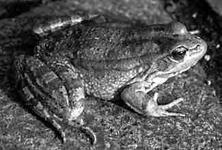
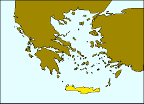
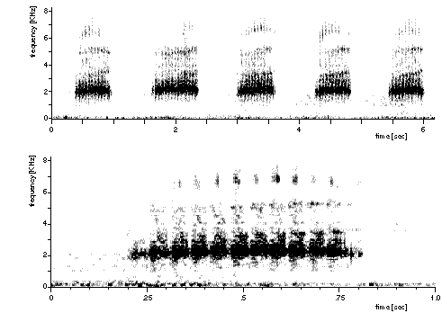

# [[Rana_cretensis]] 

#has_/creator :: Beerli, Hotz, Tunner, Heppich, and Uzzell 1994] 

[Peter Beerli](http://www.tolweb.org/)

Containing group: [Western Palearctic water frogs](../../Western Palearctic water frogs)

### Information on the Internet

[Peter Beerli\'s Water Frog Info-Pool](http://waterfrogs.csit.fsu.edu/)

## Introduction

\[Excerpt of the original description: [Beerli et al. 1994](http://www.tolweb.org/accessory/Two_New_European_Water_Frog_Species?acc_id=581)\]

A member of the western Palearctic water frog group, distinguished from
the Palearctic brown frog group by paired external lateral vocal sacs in
males, extension of webbing of feet to the toe tips, absence of a black
face mask from the eye to the tympanum, and presence of dark mottling on
the inner thigh surfaces; distinguished from the eastern Palearctic
water frog group by protein electrophoretic data: among the loci sharing
no alleles with eastern Palearctic water frogs (at least 50%; cf.
Nishioka and Sumida 1992), those at \[\[alpha\]\]GDH, LDH-B,
sMDH\[=MDH-1\], MPI, and 6PGDH are shared with one to many species of
western Palearctic water frogs, whereas those at LDH-A, mMDH\[=MDH-2\],
and sSOD\[=SOD-1\] are shared with all.

*Rana cretensis* is discriminated from all other western Palearctic
water frog species by a unique multilocus combination of
electrophoretically detected alleles: among alleles shared with other
species, our samples are fixed for mACO *c*, AHH *a*, CK-A *b*, aGDH
*b*, mIDH\[=IDH-2\] *b*; LDH-B *d*, sMDH *a*, MPI *q*; MPR1\[=MProt1\]
*b*, 6PGDH *e*, PGM-2 *d*, sSOD *a*. *Rana cretensis* has unique
(private) alleles, all fixed in our samples, at the loci sAAT\[=AAT-1\]
(*m*), sACO (*d*), ALB (*k*), EST-5 (*f*), EST-6 (*d*), GPI (*h*),
sIDH\[=IDH-1\] (*g*). Centromeres of the 2N=26 chromosomes are
conspicuously fluorescent after Actinomycin D / 33258 Hoechst double
staining.

Morphologically (Fig. 1), among western Palearctic water frogs *Rana
cretensis* is medium-sized (mean ± standard deviation of body length
64.6±9.5 mm for 8 adults). Relative tibia length medium (body
length/tibia length 1.97±0.15, N=37). Callus internus relatively short
(body length/callus internus length 18.8±2.7, N=31), of medium height
(callus length/height 3.4±0.6, N=8), slightly rounded. Digitus primus
medium-sized (body length/digitus primus length 7.3±0.8, N=37; digitus
primus length/callus internus length 2.4±0.3, N=37). Dorsal coloration
light gray to brown with brown to olive-gray spots, occasionally
grass-green with distinct brown spots. Venter and throat uniformly
whitish with slight gray pigmentation. No vertebral stripe in our
samples. Marked yellow pigmentation on posterior flank and inner side of
femur and tibia. Prominent broad brown dorsolateral fold. Vocal sacs of
males dark gray.

Fig. 1. Rana cretensis: adult female (paratype, MHNG 2543.91) of 72 mm
body length from Petros river, Crete.

### Distribution

The distribution of this species is restricted to Crete (Greece). It is
the only water frog species known so far on this island.

The map is a transverse Mercator projection and was created with GMT 3.0
([Wessel and Smith, 1995](http://www.agu.org/eos_elec/95154e.html)) and
postprocessed in Virtuoso on a NeXT, and then converted from eps to gif.
\[If you need maps, take a look at [GMT](http://gmt.soest.hawaii.edu/)
and create them yourself\]

### Voice

### Synonyms

Valid name: *Rana (Pelophylax) cretensis* Beerli, Hotz, Tunner, Heppich,
and Uzzell 1994

### References

Beerli, P. 1994. Genetic isolation and calibration of an average protein
clock in western Palearctic water frogs of the Aegean region.
Dissertation Universität Zürich 1994.
\[[Summary](http://www.tolweb.org/accessory/Genetic_Isolation_in_Western_Palearctic_Water_Frogs?acc_id=580)\]

Beerli H. Hotz, H. Tunner, S. Heppich, and T. Uzzell. 1994. Two new
water frog species from the Aegean islands Crete and Karpathos
(Amphibia, Salientia, Ranidae). Notulae Naturae, Academy of Natural
Sciences of Philadelphia 470:1-9.

\[see [full text](http://www.tolweb.org/accessory/Two_New_European_Water_Frog_Species?acc_id=581)\]

## Phylogeny 

-   « Ancestral Groups  
    -   [Western Palearctic water         frogs](Western_Palearctic_water_frogs)
    -   [Rana (Pelophylax)](../../Pelophylax.md)
    -   [Rana](../../../Rana.md)
    -   [\'Ranidae\'](%27Ranidae%27)
    -   [Neobatrachia](../../../../../Neobatrachia.md)
    -   [Salientia](../../../../../../Salientia.md)
    -   [Living Amphibians](Living_Amphibians)
    -   [Terrestrial Vertebrates](../../../../../../../../../Terrestrial.md)
    -   [Sarcopterygii](../../../../../../../../../Sarc.md)
    -   [Gnathostomata](../../../../../../../../../../Gnath.md)
    -   [Vertebrata](../../../../../../../../../../../Vertebrata.md)
    -   [Craniata](../../../../../../../../../../../../Craniata.md)
    -   [Chordata](../../../../../../../../../../../../../Chordata.md)
    -   [Deuterostomia](../../../../../../../../../../../../../../Deutero.md)
    -  [Bilateria](../../../../../../../../../../../../../../../Bilateria.md))
    -  [Animals](../../../../../../../../../../../../../../../../../Animals.md))
    -  [Eukarya](../../../../../../../../../../../../../../../../../Eukarya.md))
    -   [Tree of Life](../../../../../../../../../../../../../../../../../Tree_of_Life.md)

-   ◊ Sibling Groups of  Western Palearctic water frogs
    -   [Rana saharica](Rana_saharica.md)
    -   [Rana perezi](Rana_perezi.md)
    -   [Rana epeirotica](Rana_epeirotica.md)
    -   [Rana shqiperica](Rana_shqiperica.md)
    -   [Rana lessonae](Rana_lessonae.md)
    -   Rana cretensis
    -   [Rana cerigensis](Rana_cerigensis.md)
    -   [Rana bedriagae](Rana_bedriagae.md)
    -   [Rana ridibunda](Rana_ridibunda.md)

-   » Sub-Groups 

## Title Illustrations

)

  --------------------------------------------------------------------------
  Scientific Name ::  Rana cretensis
  Type              Paratype
  Copyright ::         © 1995 [Peter Beerli](http://www.csit.fsu.edu/%7Ebeerli) 
  --------------------------------------------------------------------------

## Confidential Links & Embeds: 

### #is_/same_as :: [Rana_cretensis](Rana_cretensis.md) 

### #is_/same_as :: [cretensis.public](/_public/bio/bio~Domain/Eukarya/Animal/Bilateria/Deutero/Chordata/Craniata/Vertebrata/Gnath/Sarc/Tetrapods/Amphibia/Salientia/Neobatrachia/Ranidae/Rana/Pelophylax/Western_Water_Frogs/Rana/cretensis.public.md) 

### #is_/same_as :: [cretensis.internal](/_internal/bio/bio~Domain/Eukarya/Animal/Bilateria/Deutero/Chordata/Craniata/Vertebrata/Gnath/Sarc/Tetrapods/Amphibia/Salientia/Neobatrachia/Ranidae/Rana/Pelophylax/Western_Water_Frogs/Rana/cretensis.internal.md) 

### #is_/same_as :: [cretensis.protect](/_protect/bio/bio~Domain/Eukarya/Animal/Bilateria/Deutero/Chordata/Craniata/Vertebrata/Gnath/Sarc/Tetrapods/Amphibia/Salientia/Neobatrachia/Ranidae/Rana/Pelophylax/Western_Water_Frogs/Rana/cretensis.protect.md) 

### #is_/same_as :: [cretensis.private](/_private/bio/bio~Domain/Eukarya/Animal/Bilateria/Deutero/Chordata/Craniata/Vertebrata/Gnath/Sarc/Tetrapods/Amphibia/Salientia/Neobatrachia/Ranidae/Rana/Pelophylax/Western_Water_Frogs/Rana/cretensis.private.md) 

### #is_/same_as :: [cretensis.personal](/_personal/bio/bio~Domain/Eukarya/Animal/Bilateria/Deutero/Chordata/Craniata/Vertebrata/Gnath/Sarc/Tetrapods/Amphibia/Salientia/Neobatrachia/Ranidae/Rana/Pelophylax/Western_Water_Frogs/Rana/cretensis.personal.md) 

### #is_/same_as :: [cretensis.secret](/_secret/bio/bio~Domain/Eukarya/Animal/Bilateria/Deutero/Chordata/Craniata/Vertebrata/Gnath/Sarc/Tetrapods/Amphibia/Salientia/Neobatrachia/Ranidae/Rana/Pelophylax/Western_Water_Frogs/Rana/cretensis.secret.md)

