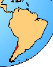

# [[Rhinoderma]]

Darwin\'s Frogs 

## #has_/text_of_/abstract 

> **Rhinoderma**, commonly known as Darwin's frogs, is a genus of small frogs found in Chile and adjacent parts of Argentina. It has just two species, of which the Chile Darwin's frog (R. rufum) is highly endangered or may already be extinct. The better-known Darwin's frog (R. darwinii) is endangered.
>
> Both species are notable for their unusual breeding, with the tadpoles being raised inside the mouths of the males. The eggs are laid on the ground. The male frog transports the tadpoles into his enlarged vocal sac. In the Chile Darwin's frog, the tadpoles are transported to a water source and released for the duration of their development. In Darwin's frog, they reside in the vocal sac until metamorphosis. They may carry between five and 15 offspring. Darwin's frogs are separated into a separate family based purely upon this behavioural adaptation, which is unique among frogs.
>
> Darwin's frogs are small, reaching a size of only 3 cm (1.2 in) in length. They are predominantly brown or green frogs, and have long, narrow noses. They are primarily terrestrial.
>
> [Wikipedia](https://en.wikipedia.org/wiki/Rhinoderma) 
## Introduction

[David Cannatella]()

The genus is known from the temperate forests of southern Chile and
Argentina. The frogs are small, about 30 mm long. In Rhinoderma
darwinii, the males carry the tadpoles in their vocal sacs, and
development is completed as froglets. Were it not for the unusual mode
of development Rhinoderma would be considered a leptodactylid. There are
no fossils.

### Geographic Distribution

The distribution of living members of the family Rhinodermatidae is
indicated in red.\

### Discussion of Phylogenetic Relationships

Ford and Cannatella (1993) defined the name Rhinoderma for the node that
is the last common ancestor of Rhinoderma rufum and R. darwinii. The
family-group name Rhinodermatidae is redundant with Rhinoderma.
Rhinoderma is diagnosed by rearing of the larvae in the vocal sac of the
male, and recognition of the taxon as a family is based on this
apomorphy. The known derived characters of Rhinoderma (Lynch, 1971) do
not clarify its relationships.

## Phylogeny 

-   « Ancestral Groups  
    -   [Neobatrachia](../Neobatrachia.md)
    -   [Salientia](../../Salientia.md)
    -   [Living Amphibians](Living_Amphibians)
    -   [Terrestrial Vertebrates](../../../../Terrestrial.md)
    -   [Sarcopterygii](../../../../../Sarc.md)
    -   [Gnathostomata](../../../../../../Gnath.md)
    -   [Vertebrata](../../../../../../../Vertebrata.md)
    -   [Craniata](../../../../../../../../Craniata.md)
    -   [Chordata](../../../../../../../../../Chordata.md)
    -   [Deuterostomia](../../../../../../../../../../Deutero.md)
    -  [Bilateria](../../../../../../../../../../../Bilateria.md))
    -  [Animals](../../../../../../../../../../../../Animals.md))
    -  [Eukarya](../../../../../../../../../../../../../Eukarya.md))
    -   [Tree of Life](../../../../../../../../../../../../../Tree_of_Life.md)

-   ◊ Sibling Groups of  Neobatrachia
    -   [Allophryne ruthveni](Allophryne_ruthveni.md)
    -   [Brachycephalidae](Brachycephalidae.md)
    -   [Bufonidae](Bufonidae.md)
    -   [Heleophryne](Heleophryne.md)
    -   [\'Leptodactylidae\'](%27Leptodactylidae%27)
    -   [Limnodynastinae](Limnodynastinae.md)
    -   [Myobatrachinae](Myobatrachinae.md)
    -   [Sooglossidae](Sooglossidae.md)
    -   Rhinoderma
    -   [Dendrobatidae](Dendrobatidae.md)
    -   [Pseudidae](Pseudidae.md)
    -   [Hylidae](Hylidae.md)
    -   [Centrolenidae](Centrolenidae.md)
    -   [Microhylidae](Microhylidae.md)
    -   [Hemisus](Hemisus.md)
    -   [Arthroleptidae](Arthroleptidae.md)
    -   [\'Ranidae\'](%27Ranidae%27)
    -   [Hyperoliidae](Hyperoliidae.md)
    -   [Rhacophoridae](Rhacophoridae.md)

-   » Sub-Groups 
	-   *Rhinoderma darwinii*
	-   *Rhinoderma rufum*

## Confidential Links & Embeds: 

### #is_/same_as :: [Rhinoderma](/_Standards/bio/bio~Domain/Eukarya/Animal/Bilateria/Deutero/Chordata/Craniata/Vertebrata/Gnath/Sarc/Tetrapods/Amphibia/Salientia/Neobatrachia/Rhinoderma.md) 

### #is_/same_as :: [Rhinoderma.public](/_public/bio/bio~Domain/Eukarya/Animal/Bilateria/Deutero/Chordata/Craniata/Vertebrata/Gnath/Sarc/Tetrapods/Amphibia/Salientia/Neobatrachia/Rhinoderma.public.md) 

### #is_/same_as :: [Rhinoderma.internal](/_internal/bio/bio~Domain/Eukarya/Animal/Bilateria/Deutero/Chordata/Craniata/Vertebrata/Gnath/Sarc/Tetrapods/Amphibia/Salientia/Neobatrachia/Rhinoderma.internal.md) 

### #is_/same_as :: [Rhinoderma.protect](/_protect/bio/bio~Domain/Eukarya/Animal/Bilateria/Deutero/Chordata/Craniata/Vertebrata/Gnath/Sarc/Tetrapods/Amphibia/Salientia/Neobatrachia/Rhinoderma.protect.md) 

### #is_/same_as :: [Rhinoderma.private](/_private/bio/bio~Domain/Eukarya/Animal/Bilateria/Deutero/Chordata/Craniata/Vertebrata/Gnath/Sarc/Tetrapods/Amphibia/Salientia/Neobatrachia/Rhinoderma.private.md) 

### #is_/same_as :: [Rhinoderma.personal](/_personal/bio/bio~Domain/Eukarya/Animal/Bilateria/Deutero/Chordata/Craniata/Vertebrata/Gnath/Sarc/Tetrapods/Amphibia/Salientia/Neobatrachia/Rhinoderma.personal.md) 

### #is_/same_as :: [Rhinoderma.secret](/_secret/bio/bio~Domain/Eukarya/Animal/Bilateria/Deutero/Chordata/Craniata/Vertebrata/Gnath/Sarc/Tetrapods/Amphibia/Salientia/Neobatrachia/Rhinoderma.secret.md)

