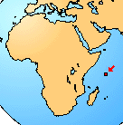

---
aliases:
- Mahénkovití
- Seszelkowate
- Seychelle-szigeteki békafélék
- Seychellenfrösche
- Seychellenkikkers
- seychellfrosker
- Soglosedoj
- Sooglossidae
- Sooglossus
- Sooglòssid
- сейшелски жаби
- Сейшельские лягушки
- Сейшельські жаби
- סוגלוסיים
- ضفادع السيشل
- قورباغههای سیشل
- ಸೂಗ್ಲೊಸಿಡೆ
- 塞舌蛙科
- 세이셸개구리과
title: Sooglossidae
has_id_wikidata: Q56060
dv_has_:
  name_:
    an: Sooglossidae
    ar: ضفادع السيشل
    arz: ضفادع السيشل
    ast: Sooglossidae
    bg: сейшелски жаби
    ca: Sooglòssid
    ceb: Sooglossus
    cs: Mahénkovití
    de: Seychellenfrösche
    de_ch: Seychellenfrösche
    en: Sooglossidae
    en_ca: Sooglossidae
    en_gb: Sooglossidae
    eo: Soglosedoj
    es: Sooglossidae
    eu: Sooglossidae
    ext: Sooglossidae
    fa: قورباغههای سیشل
    fi: Sooglossidae
    fr: Sooglossidae
    ga: Sooglossidae
    gl: Sooglossidae
    he: סוגלוסיים
    hu: Seychelle-szigeteki békafélék
    ia: Sooglossidae
    ie: Sooglossidae
    io: Sooglossidae
    it: Sooglossidae
    kn: ಸೂಗ್ಲೊಸಿಡೆ
    ko: 세이셸개구리과
    la: Sooglossidae
    mul: Sooglossidae
    nb: seychellfrosker
    nl: Seychellenkikkers
    oc: Sooglossidae
    pl: Seszelkowate
    pt: Sooglossidae
    pt_br: Sooglossidae
    ro: Sooglossidae
    ru: Сейшельские лягушки
    sq: Sooglossidae
    sv: Sooglossus
    tr: Sooglossidae
    uk: Сейшельські жаби
    vi: Sooglossidae
    vo: Sooglossidae
    war: Sooglossus
    zh: 塞舌蛙科
    zh_cn: 塞舌蛙科
    zh_hans: 塞舌蛙科
---
# [[Sooglossidae]] 

## #has_/text_of_/abstract 

> **Sooglossidae**, the Seychelles frogs or Seychelles Island frogs, are a family of frogs found on the Seychelles Islands. Until recently, this family was believed to include the genera Sechellophryne, Nesomantis and Sooglossus, but following a major revision of amphibians in 2006, the genus Nesomantis was named a junior synonym of Sooglossus. Their closest relatives are the purple frogs (Nasikabatrachidae) of India.
>
> [Wikipedia](https://en.wikipedia.org/wiki/Sooglossidae) 

## Introduction

[David Cannatella]()

Sooglossids include two genera of small frogs that are restricted to the
Seychelles islands of the Indian Ocean (Silhouette and Mahé). The frogs
are relatively small and terrestrial. Their phylogenetic placement is
the subject of much controversy; see below. They are unusual as
neobatrachians in having inguinal amplexus. There are no fossils.

### Geographic Distribution

The distribution of living members of the family Sooglossidae is
confined to the Seychelles Islands, as indicated in red.\

### Discussion of Phylogenetic Relationships

Ford and Cannatella (1993) defined Sooglossidae as a node-based name for
the common ancestor of Nesomantis and Sooglossus, and all its
descendants. The only published synapomorphy appears to be the presence
of a sesamoid bone in the heel region (os sesamoides tarsale; Nussbaum,
1982), a feature shared with some petropedetine ranids. Sooglossids have
been allied to ranoids (Griffiths, 1959a, 1963; Tyler, 1985) or to
myobatrachids (Lynch, 1973). Duellman (1975) placed the sooglossids with
ranoids on the basis of zoogeography. The two derived characters cited
as evidence of a ranoid relationship (Griffiths, 1959a) are the
semitendinosus tendon passing dorsal to the m. gracilis and partial
fusion of the epicoracoid cartilages and sternum of the pectoral girdle.
Nussbaum (1980) concluded that placement of Sooglossidae in Ranoidea was
not supported, and preferred its placement near myobatrachids. Hay et
al. (1995) placed Sooglossus in a trichotomy with 1) ranoids and 2) a
clade composed of all other neobatrachians.

Ford and Cannatella (1993) described five shared derived characters
allying sooglossids to myobatrachines. The first is a ventrally
incomplete cricoid ring (Lynch, 1973); the ring is complete in
Rheobatrachus and limnodynastines (Heyer and Liem, 1976). The second is
the semitendinosus tendon inserting dorsal to the m. gracilis. This is
shared with all myobatrachines except for Taudactylus, which has a
ventral insertion (plesiomorphic); the insertion is also ventral in
Rheobatrachus (Heyer and Liem, 1976). A third shared derived character
is the horizontal pupil, which sooglossids share with myobatrachines,
except for Uperoleia (also vertical in Rheobatrachus). Limnodynastines
primitively have a vertical pupil, but several genera have horizontal
ones (Heyer and Liem, 1976). A fourth derived character shared with
myobatrachines and Rheobatrachus is the winglike alary processes of the
hyoid (Griffiths, 1959a). The fifth is a divided sphenethmoid, which is
present in sooglossids (Griffiths, 1959a) and myobatrachines but not
limnodynastines (Lynch, 1971). Ford and Cannatella (1993) concluded that
Sooglossidae is the sister taxon of Myobatrachinae (Table 1), and they
treated the two as an unnamed more inclusive taxon.

A character of uncertain status is the presence of notochordal vertebrae
(Lynch, 1973; but Noble \[1926\] reported procoelous vertebrae),
reported in myobatrachines and sooglossids, but not limnodynastines. The
polarity is uncertain because 1) other presumably closely related taxa
have not been characterized adequately, and 2) observations on dried
specimens differ from those made from serial sections (Cannatella,
personal observation). Sooglossids and myobatrachines share the
plesiomorphic condition of inguinal amplexus. According to Heyer and
Liem (1976), Mixophys is the only myobatrachid genus with axillary
amplexus, but Lynch (1973) incorrectly reported that myobatrachines have
inguinal amplexus and limnodynastines have axillary amplexus.

## Phylogeny 

-   « Ancestral Groups  
    -   [Neobatrachia](../Neobatrachia.md)
    -   [Salientia](../../Salientia.md)
    -   [Living Amphibians](Living_Amphibians)
    -   [Terrestrial Vertebrates](../../../../Terrestrial.md)
    -   [Sarcopterygii](../../../../../Sarc.md)
    -   [Gnathostomata](../../../../../../Gnath.md)
    -   [Vertebrata](../../../../../../../Vertebrata.md)
    -   [Craniata](../../../../../../../../Craniata.md)
    -   [Chordata](../../../../../../../../../Chordata.md)
    -   [Deuterostomia](../../../../../../../../../../Deutero.md)
    -  [Bilateria](../../../../../../../../../../../Bilateria.md) 
    -  [Animals](../../../../../../../../../../../../Animals.md) 
    -  [Eukarya](../../../../../../../../../../../../../Eukarya.md) 
    -   [Tree of Life](../../../../../../../../../../../../../Tree_of_Life.md)

-   ◊ Sibling Groups of  Neobatrachia
    -   [Allophryne ruthveni](Allophryne_ruthveni.md)
    -   [Brachycephalidae](Brachycephalidae.md)
    -   [Bufonidae](Bufonidae.md)
    -   [Heleophryne](Heleophryne.md)
    -   [\'Leptodactylidae\'](%27Leptodactylidae%27)
    -   [Limnodynastinae](Limnodynastinae.md)
    -   [Myobatrachinae](Myobatrachinae.md)
    -   Sooglossidae
    -   [Rhinoderma](Rhinoderma.md)
    -   [Dendrobatidae](Dendrobatidae.md)
    -   [Pseudidae](Pseudidae.md)
    -   [Hylidae](Hylidae.md)
    -   [Centrolenidae](Centrolenidae.md)
    -   [Microhylidae](Microhylidae.md)
    -   [Hemisus](Hemisus.md)
    -   [Arthroleptidae](Arthroleptidae.md)
    -   [\'Ranidae\'](%27Ranidae%27)
    -   [Hyperoliidae](Hyperoliidae.md)
    -   [Rhacophoridae](Rhacophoridae.md)

-   » Sub-Groups 
	-   *Sooglossus gardineri*
	-   *Sooglossus sechellensis*
	-   *Nesomantis thomasseti*

## Confidential Links & Embeds: 

### #is_/same_as :: [[/_Standards/bio/bio~Domain/Eukarya/Animal/Bilateria/Deutero/Chordata/Craniata/Vertebrata/Gnath/Sarc/Tetrapods/Amphibia/Salientia/Neobatrachia/Sooglossidae|Sooglossidae]] 

### #is_/same_as :: [[/_public/bio/bio~Domain/Eukarya/Animal/Bilateria/Deutero/Chordata/Craniata/Vertebrata/Gnath/Sarc/Tetrapods/Amphibia/Salientia/Neobatrachia/Sooglossidae.public|Sooglossidae.public]] 

### #is_/same_as :: [[/_internal/bio/bio~Domain/Eukarya/Animal/Bilateria/Deutero/Chordata/Craniata/Vertebrata/Gnath/Sarc/Tetrapods/Amphibia/Salientia/Neobatrachia/Sooglossidae.internal|Sooglossidae.internal]] 

### #is_/same_as :: [[/_protect/bio/bio~Domain/Eukarya/Animal/Bilateria/Deutero/Chordata/Craniata/Vertebrata/Gnath/Sarc/Tetrapods/Amphibia/Salientia/Neobatrachia/Sooglossidae.protect|Sooglossidae.protect]] 

### #is_/same_as :: [[/_private/bio/bio~Domain/Eukarya/Animal/Bilateria/Deutero/Chordata/Craniata/Vertebrata/Gnath/Sarc/Tetrapods/Amphibia/Salientia/Neobatrachia/Sooglossidae.private|Sooglossidae.private]] 

### #is_/same_as :: [[/_personal/bio/bio~Domain/Eukarya/Animal/Bilateria/Deutero/Chordata/Craniata/Vertebrata/Gnath/Sarc/Tetrapods/Amphibia/Salientia/Neobatrachia/Sooglossidae.personal|Sooglossidae.personal]] 

### #is_/same_as :: [[/_secret/bio/bio~Domain/Eukarya/Animal/Bilateria/Deutero/Chordata/Craniata/Vertebrata/Gnath/Sarc/Tetrapods/Amphibia/Salientia/Neobatrachia/Sooglossidae.secret|Sooglossidae.secret]] 

