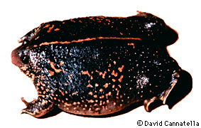
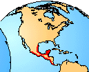

---
aliases:
  - Rhinophrynidae
title: Rhinophrynidae
---

# [[Rhinophrynidae]] 

 

## #has_/text_of_/abstract 

> The **Rhinophrynidae** are a family of frogs containing one extant genus, the monotypic Rhinophrynus, and a number of fossil genera. The family is sometimes known as the Mexican burrowing toads or simply burrowing toads.
>
> Rhinophrynus occurs in the Central America north from Costa Rica to Mexico and Texas. Fossil finds of Rhinophrynidae come from Mexico, the United States, and Canada. Rhinophrynus is a burrowing ant and termite eater.
>
> [Wikipedia](https://en.wikipedia.org/wiki/Rhinophrynidae) 

## Introduction

[David Cannatella](http://www.tolweb.org/)

The Mexican Burrowing Toad (Rhinophrynus dorsalis) is the only living
member of this family. It is one of the strangest of frogs. This animal
is highly fossorial (adapted for burrowing) and apparently only comes to
the surface to breed, and then only during very heavy rains. The head is
small and cone-shaped, and not surprisingly, the skull resembles that of
a mole (Spalax). The skin is quite thick, and an early naturalist
described the frog (in French) as a bag of bones. It ranges through
southern Rio Grande Valley of Texas to Costa Rica. This frog is 5-7 cm
long. There is usually a broad red or orange stripe down the middle of
the back. There is a spade, used for digging, on the inner edge of the
foot; the first toe is also modified to extend the functional edge of
the spade.

Rhinophrynus is specialized for eating termites, and the tongue seems to
be particularly modified for this activity. Instead of being flipped out
over itself, as in most frogs, the tongue is projected straight out of
the mouth (Trueb, 1983).

Many small eggs are laid in water, and the tadpoles aggregate and form
large schools. They are specialized for filter-feeding on small
particles suspended in the water, rather than grazing on algae or eating
detritus from the bottom of the pond. Correlated with this behavior, the
larvae lack beaks and denticles; they also have paired spiracles like
most pipid tadpoles. This type of tadpole (Orton Type 1) is evidence of
a close phylogenetic relationship between Rhinophrynidae and Pipidae.
The larger group to which these two families, and the fossil family
Palaeobatrachidae, belong is called the Pipoidea.

### Geographic Distribution

The distribution of living members of the family Rhinophrynidae is
indicated in red.\

### Discussion of Phylogenetic Relationships

Definition of the name Rhinophrynidae and thus a listing of
synapomorphies for the taxon is problematic because name Rhinophrynidae
has been applied consistently to several fossil taxa (Henrici, 1991)
that are related to the single living taxon dorsalis. Association of the
name Rhinophrynidae or even Rhinophrynus with living taxa only would
render those names redundant with the name of the living species.
Because the living taxon has a widely used name, we use the more
inclusive names Rhinophrynus and Rhinophrynidae for taxa that
incorporate fossils. This also has the advantage of stabilizing those
names with their common usage. Therefore, Rhinophrynidae is defined to
be a stem-based name for those pipoids that are more closely related to
the taxon dorsalis than to †Palaeobatrachidae + Pipidae. Rhinophrynus is
defined as a stem-based name for rhinophrynids that are more closely
related to the living taxon dorsalis than to †Eorhinophrynus or
†Chelomophrynus.

By this definition, synapomorphies of Rhinophrynidae include (1) the
division of the distal condyle of the femur into lateral and medial
condyles, (Henrici, 1991), and three others that we derived from
Henrici\'s work: (2) modification of the prehallux and distal phalanx of
the first digit into a spade for digging, (3) tibiale and fibulare short
and stocky, with distal ends fused, and (4) an elongate (at least as
long as wide) atlantal neural arch. The first three of these are unknown
in †Eorhinophrynus. Synapomorphies of Rhinophrynus are given by Henrici
(1991).

Maxson and Daugherty (1980) reported MC\'F distances of 170 between
Ascaphus and Rhinophrynus dorsalis, more than 190 between Rhinophrynus
and Bombina, and more than 200 between Rhinophrynus and Xenopus,
Scaphiopus, Pelobates, and three neobatrachians. From these data they
tentatively concluded that \"\... Rhinophrynus appears to have shared a
common ancestor more recently with Ascaphus than with other salientian
lineages\...\" (p. 279). This is in contrast to the conclusions reached
by Cannatella (1985) and Hay et al. (1995).

## Phylogeny 

-   « Ancestral Groups  
    -   [Salientia](../Salientia.md)
    -   [Living Amphibians](Living_Amphibians)
    -   [Terrestrial Vertebrates](../../../Terrestrial.md)
    -   [Sarcopterygii](../../../../Sarc.md)
    -   [Gnathostomata](../../../../../Gnath.md)
    -   [Vertebrata](../../../../../../Vertebrata.md)
    -   [Craniata](../../../../../../../Craniata.md)
    -   [Chordata](../../../../../../../../Chordata.md)
    -   [Deuterostomia](../../../../../../../../../Deutero.md)
    -  [Bilateria](../../../../../../../../../../Bilateria.md) 
    -  [Animals](../../../../../../../../../../../Animals.md) 
    -  [Eukarya](../../../../../../../../../../../../Eukarya.md) 
    -   [Tree of Life](../../../../../../../../../../../../Tree_of_Life.md)

-   ◊ Sibling Groups of  Salientia
    -   [Triadobatrachus         massinoti](Triadobatrachus_massinoti.md)
    -   [Vieraella herbsti](Vieraella_herbsti.md)
    -   [Notobatrachus degiustoi](Notobatrachus_degiustoi.md)
    -   [Ascaphus truei](Ascaphus_truei.md)
    -   [Leiopelma](Leiopelma.md)
    -   [Eodiscoglossus         santonjae](Eodiscoglossus_santonjae.md)
    -   [Bombinatoridae](Bombinatoridae.md)
    -   [Discoglossidae](Discoglossidae.md)
    -   [Eopelobatinae](Eopelobatinae.md)
    -   [Megophryidae](Megophryidae.md)
    -   [Pelobatidae](Pelobatidae.md)
    -   [Pelodytidae](Pelodytidae.md)
    -   Rhinophrynidae
    -   [\'Pipids\'](%27Pipids%27)
    -   [Palaeobatrachidae](Palaeobatrachidae.md)
    -   [Pipid](Pipid.md)
    -   [Neobatrachia](Neobatrachia.md)

-   » Sub-Groups 

## Title Illustrations

------------ 
)
Scientific Name ::  Rhinophrynus dorsalis
Copyright ::         © 1995 E. D. Brodie, Jr.

## Confidential Links & Embeds: 

### #is_/same_as :: [Rhinophrynidae](/_Standards/bio/bio~Domain/Eukarya/Animal/Bilateria/Deutero/Chordata/Craniata/Vertebrata/Gnath/Sarc/Tetrapods/Amphibia/Salientia/Rhinophrynidae.md) 

### #is_/same_as :: [Rhinophrynidae.public](/_public/bio/bio~Domain/Eukarya/Animal/Bilateria/Deutero/Chordata/Craniata/Vertebrata/Gnath/Sarc/Tetrapods/Amphibia/Salientia/Rhinophrynidae.public.md) 

### #is_/same_as :: [Rhinophrynidae.internal](/_internal/bio/bio~Domain/Eukarya/Animal/Bilateria/Deutero/Chordata/Craniata/Vertebrata/Gnath/Sarc/Tetrapods/Amphibia/Salientia/Rhinophrynidae.internal.md) 

### #is_/same_as :: [Rhinophrynidae.protect](/_protect/bio/bio~Domain/Eukarya/Animal/Bilateria/Deutero/Chordata/Craniata/Vertebrata/Gnath/Sarc/Tetrapods/Amphibia/Salientia/Rhinophrynidae.protect.md) 

### #is_/same_as :: [Rhinophrynidae.private](/_private/bio/bio~Domain/Eukarya/Animal/Bilateria/Deutero/Chordata/Craniata/Vertebrata/Gnath/Sarc/Tetrapods/Amphibia/Salientia/Rhinophrynidae.private.md) 

### #is_/same_as :: [Rhinophrynidae.personal](/_personal/bio/bio~Domain/Eukarya/Animal/Bilateria/Deutero/Chordata/Craniata/Vertebrata/Gnath/Sarc/Tetrapods/Amphibia/Salientia/Rhinophrynidae.personal.md) 

### #is_/same_as :: [Rhinophrynidae.secret](/_secret/bio/bio~Domain/Eukarya/Animal/Bilateria/Deutero/Chordata/Craniata/Vertebrata/Gnath/Sarc/Tetrapods/Amphibia/Salientia/Rhinophrynidae.secret.md)

