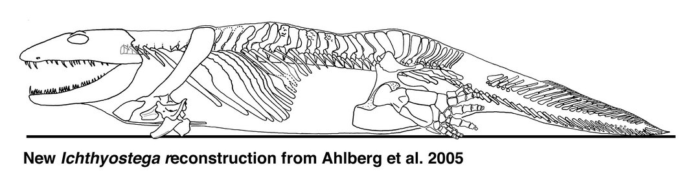
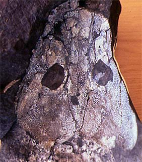
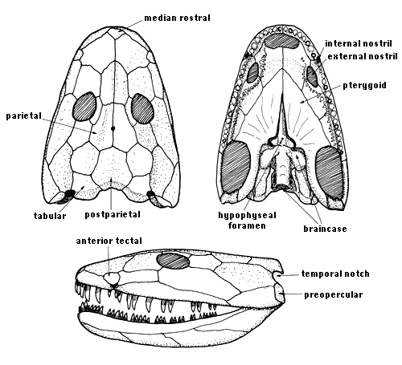
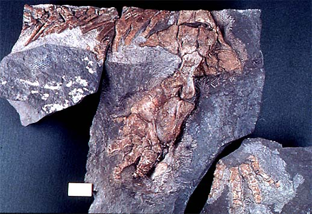
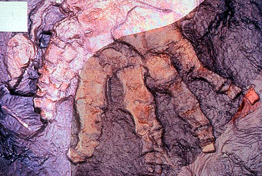

---
aliases:
  - Ichthyostega
title: Ichthyostega
---

# [[Ichthyostega]]

## #has_/text_of_/abstract 

> **Ichthyostega**, from Ancient Greek ἰχθύς (ikthús), meaning "fish", and στέγη (stégē), meaning "roof", is an extinct genus of limbed tetrapodomorphs from the Late Devonian of what is now Greenland. It was among the earliest four-limbed vertebrates ever in the fossil record and was one of the first with weight-bearing adaptations for terrestrial locomotion. Ichthyostega possessed lungs and limbs that helped it navigate through shallow water in swamps. Although Ichthyostega is often labelled a 'tetrapod' because of its limbs and fingers, it evolved long before true crown group tetrapods and could more accurately be referred to as a stegocephalian or stem tetrapod. Likewise, while undoubtedly of amphibian build and habit, it is not a true member of the group in the narrow sense, as the first modern amphibians (members of the group Lissamphibia) appeared in the Triassic Period. Until finds of other early stegocephalians and closely related fishes in the late 20th century, Ichthyostega stood alone as a transitional fossil between fish and tetrapods, combining fish and tetrapod features. Newer research has shown that it had an unusual anatomy, functioning more akin to a seal than a salamander, as previously assumed.
>
> [Wikipedia](https://en.wikipedia.org/wiki/Ichthyostega) 

## Introduction

[Jennifer A. Clack](http://www.tolweb.org/)

*Ichthyostega* specimens were the first Devonian tetrapods to be found
and described (Säve-Söderbergh 1932, Jarvik 1952, 1980, 1996).
*Ichthyostega* comes from the Upper Devonian (Famennian) of East
Greenland and is widely featured in the literature as the first
'four-legged fish'. Reconstructions of the animal (see title figure)
have been influential in ideas about what the earliest tetrapods were
like, though more recent studies (Bjerring 1985, Coates and Clack 1990,
Clack et al. 2003, Ahlberg et al. 2005) have challenged more traditional
interpretations (Jarvik 1996).

Figure 1. Skull roof of *Ichthyostega*. MGUH VP 6064 Geological Museum,
Copenhagen. Photo J. A. Clack. Copyright © 1997 University Museum of
Zoology, Cambridge.

### Phylogenetic Position of *Ichthyostega*

Four species were originally named by Save-Soderbergh (1932), and a
second genus, *Ichthyostegopsis* was also described. Jarvik (1996)
suggested that these were most likely to be synonyms but further study
has shown the existence of three valid species based on skull
proportions and associated with three distinct horizons in the Celsius
Bjerg Formation: *I. stensioei*, *I. eigili*, and *I. watsoni* (Blom
2005). *Ichthyostegopsis* is probably a juvenile *I. eigili*.
*Ichthyostega* shows a mixture of plesiomorphic and apomorphic
characters which make it difficult to place phylogenetically, though it
is clearly a basal stem-tetrapod (Ahlberg and Clack 1998, Clack 2002a,
Ruta et al. 2003). Only one character, lack of an intertemporal (Fig.
2), may indicate a close relationship to *Acanthostega*, but the
phylogenetic siginifcance of this feature is debatable. There is
certainly no basis for the clade \'Ichthyostegalia\'.

The author disagrees with the move to restrict the vernacular term
'tetrapod' to a crown clade (Gauthier et al. 1989). In this page, the
term 'tetrapod' and 'stem-tetrapod' refer only to vertebrates with limbs
and digits. (Refer to the note on the [Definition of the taxon Tetrapoda](http://www.tolweb.org/accessory/Definition_of_the_Taxon_Tetrapoda?acc_id=503)
to get more information on this topic.)

Figure 2. Reconstructions of the skull of *Ichthyostega* in dorsal (top
left), ventral (top right) and lateral views (bottom). © 1997 J. A.
Clack.

### Skull

The **skull roof** was broad and flat with a rounded snout. The
structure retains some primitive characters such as a median rostral,
and an anterior tectal above the external nostril, but recent studies
have been unable to confirm the presence a lateral rostral that carried
the lateral line canal beneath the nostril (cf. Jarvik 1980). The skull
table was broad, lacking an intertemporal but with a pentagonal
supratemporal, unlike the dart-shaped bone of *Acanthostega*. There was
a single midline postparietal. The tabulars, also approximately
pentagonal, each bore a posteroventral notch and had deep ventrally
projecting flanges which attached to the braincase.

The **closed palate** bore a row of teeth of varying sizes in the
palatal arcade, but though some are relatively large, the distinct fang
pairs found in many other stem-tetrapods are not always distinguishable
or consistently present.

The **braincase** does not resemble those of other tetrapods or
osteolepiforms, such that it has only recently proved possible to
identify the anatomical regions with any confidence. The otic region was
elongated, with a narrow, notochordal basioccipital with no occipital
condyle. The braincase and ear region were very highly modified, with
enclosed apparently air-filled chambers either side of the otic region.
The delicate, spoon-shaped stapes projected into the chambers, cupping
the its floor. It articulated with the basicoccipital via a narrow stem
and footplate that occluded a small foramen, presumably the homologue of
the fenestra vestibuli. The ear apparatus has been interpreted as
adapted for underwater audition (Clack et al. 2003).

*Ichthyostega* is now known to have had an ossified **hyobranchial
skeleton** comparable to that in *Acanthostega* (Clack et al. 2003), but
recent work has not confirmed the presence of a subopercular, rather
this bone may have been a misidentified element of the hyobranchial
skeleton.

The **lower jaw** consists of the usual complement of dermal bones, with
three coronoids bearing a row of small thorn-shaped teeth, a
parasymphysial plate, and a long prearticular that bore no shagreen.
There was a disparity between the upper and lower dentitions, with the
lower jaw having about 37 toothspaces, against about 32 larger teeth in
the upper jaw.

### Postcranial skeleton

The most conspicuous feature of the **axial skeleton** is the degree to
which the ribs overlapped each other. One thoracic rib may overlap three
or four more posterior ones, forming a barrel-shaped 'corset' around the
body. This is in contrast to the short straight ribs of *Acanthostega*.
It suggests that the animal could not flex its trunk laterally during
either walking or swimming. The vertebrae were notochordal, but the
neural arches bore more prominent zygapophyses than *Acanthostega*.
Recent work has shown that there was considerable differentiation among
the neural arches, particulary of the presacral and sacral regions. The
attitude of the zygapophyses in these regions, combined with overlapping
ribs has suggested that the animal moved more by dorsoventral flexion
than by the conventional lateral walk. The massive forelimbs may have
been used to pull the animal forwards followed by flexion of the
presacral region to pull up the rear, in what has been described as an
\'inch-worm\' like mode of locomotion (Ahlberg et al. 2005). Their
reconstruction, shown above, is very different from earlier versions
(cf. Jarvik 1980, 1996).

The atlas and axis arches are unknown. The tail, shorter than shown by
Jarvik (1996), bore a fin supported by supraneural spines but fewer,
shorter fin-rays than in *Acanthostega*.

In the **shoulder girdle**, the cleithrum and clavicle were co-ossified
as in *Acanthostega* and *Hynerpeton*. There is no evidence for a
post-branchial lamina or anocleithrum. Large supraglenoid and
supracoracoid foramina pierced the scapulocoracoid.

The **humerus** was L-shaped and flattened, but had a more prominent
ectepicondylar buttress than in most other tetrapods. The bone was
pierced by several accessory foramina lost in most other tetrapods. The
radial condyle was long and positioned anteroventrally, while the ulna
condyle was terminal. The ulna bore a conspicuous, forked olecranon
process, while the radius was short and stubby. In these forearm bones,
*Ichthyostega* resembles later stem-tetrapods more closely than
*Acanthostega*. The wrist and manus are unknown.

The **pelvic girdle** was large and unitary in structure. It bore a
horizontal post-iliac process and a dorsally orientated iliac blade. The
sacral rib is undescribed.

Figure 3. Hindlimb of *Ichthyostega*; specimen collected in 1987.
Geological Museum, Copenhagen MGUH Field number 1349. Photo M. Coates.
Copyright © 1997 University Museum of Zoology, Cambridge.

The **hindlimb** consisted of a short, stout femur with a large adductor
flange and deep intercondylar fossa (Figs 3 and 4). The large, almost
quadrangular tibia and shorter fibula were both flattened. A large
intermedium and fibulare comprised most of the identifiable ankle bones;
tarsals and metatarsals are difficult to recognize. A well-preserved
specimen collected in 1987 shows a full complement of seven digits,
three small ones at the leading edge and four stout ones more
posteriorly (Coates and Clack 1990). Jarvik (1996) gave a different
interpretation. The new interpretation is more consistent with recent
discoveries about the axial skeleton.

Figure 4. Photographs of part and counterpart superimposed to show seven
digits (specimen collected in 1987). Geological Museum, Copenhagen MGUH
Field number 1349. Photo M. Coates. Copyright © 1997 University Museum
of Zoology, Cambridge.

### Paleoecology and lifestyle

No *Ichthyostega* specimen has been described in its sedimentological
context, but the material discovered in 1987 appears to have derived
from a channel deposit. Specimens are frequently found in association
with *Remigolepis* plates and *Holoptychius* scales, but the ecological
association between these forms is not understood (Clack and Neininger
2000, Blom et al. 2005). Many *Ichthyostega* specimens are found in
coarse red matrix, while the best-preserved come from a much
finer-grained, darker red rock. All appear to have been transported to
some degree, and are preserved in flood deposits. *Ichthyostega* and
*Acanthostega* specimens are not, as a rule, found in quite the same
horizons, but the precise temporal and ecological separation between
them has yet to be worked out.

In *Ichthyostega*, the forelimbs seem to have been weight-bearing, but
the forearm was unable to extend fully. The proportions of an elephant
seal appear the closest analogue among living animals. Perhaps
*Ichthyostega* hauled itself up shelving beaches, moving its forelimbs
in parallel and dragging its hindquarters along (Clack 2002b, Ahlberg et
al. 2005).

## Phylogeny 

-   « Ancestral Groups  
    -   [Terrestrial Vertebrates](../Terrestrial.md)
    -   [Sarcopterygii](../../Sarc.md)
    -   [Gnathostomata](../../../Gnath.md)
    -   [Vertebrata](../../../../Vertebrata.md)
    -   [Craniata](../../../../../Craniata.md)
    -   [Chordata](../../../../../../Chordata.md)
    -   [Deuterostomia](../../../../../../../Deutero.md)
    -  [Bilateria](../../../../../../../../Bilateria.md))
    -  [Animals](../../../../../../../../../Animals.md))
    -  [Eukarya](../../../../../../../../../../Eukarya.md))
    -   [Tree of Life](../../../../../../../../../../Tree_of_Life.md)

-   ◊ Sibling Groups of  Terrestrial Vertebrates
    -   [Amniota](Amniota.md)
    -   [Solenodonsaurus         janenschi](Solenodonsaurus_janenschi)
    -   [Living Amphibians](Living_Amphibians)
    -   [Seymouriamorpha](Seymouriamorpha.md)
    -   [Temnospondyli](Temnospondyli.md)
    -   [Baphetidae](Baphetidae.md)
    -   [Crassigyrinus scoticus](Crassigyrinus_scoticus)
    -   Ichthyostega
    -   [Acanthostega gunnari](Acanthostega_gunnari)

-   » Sub-Groups 

## Title Illustrations

-------------------------------------------------------------------------------)
Scientific Name ::     Ichthyostega
Comments             Skeletal reconstruction of *Ichthyostega* based on recent finds and a new interpretation of the hind limb anatomy and proportions.
Specimen Condition   Fossil \-- Period: Devonian
Copyright ::            © 2005 [Jennifer A. Clack](http://www.zoo.cam.ac.uk/museum/jenny.htm) 

## Confidential Links & Embeds: 

### #is_/same_as :: [Ichthyostega](/_Standards/bio/bio~Domain/Eukarya/Animal/Bilateria/Deutero/Chordata/Craniata/Vertebrata/Gnath/Sarc/Tetrapods/Ichthyostega.md) 

### #is_/same_as :: [Ichthyostega.public](/_public/bio/bio~Domain/Eukarya/Animal/Bilateria/Deutero/Chordata/Craniata/Vertebrata/Gnath/Sarc/Tetrapods/Ichthyostega.public.md) 

### #is_/same_as :: [Ichthyostega.internal](/_internal/bio/bio~Domain/Eukarya/Animal/Bilateria/Deutero/Chordata/Craniata/Vertebrata/Gnath/Sarc/Tetrapods/Ichthyostega.internal.md) 

### #is_/same_as :: [Ichthyostega.protect](/_protect/bio/bio~Domain/Eukarya/Animal/Bilateria/Deutero/Chordata/Craniata/Vertebrata/Gnath/Sarc/Tetrapods/Ichthyostega.protect.md) 

### #is_/same_as :: [Ichthyostega.private](/_private/bio/bio~Domain/Eukarya/Animal/Bilateria/Deutero/Chordata/Craniata/Vertebrata/Gnath/Sarc/Tetrapods/Ichthyostega.private.md) 

### #is_/same_as :: [Ichthyostega.personal](/_personal/bio/bio~Domain/Eukarya/Animal/Bilateria/Deutero/Chordata/Craniata/Vertebrata/Gnath/Sarc/Tetrapods/Ichthyostega.personal.md) 

### #is_/same_as :: [Ichthyostega.secret](/_secret/bio/bio~Domain/Eukarya/Animal/Bilateria/Deutero/Chordata/Craniata/Vertebrata/Gnath/Sarc/Tetrapods/Ichthyostega.secret.md)

