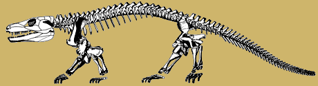
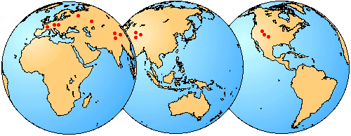
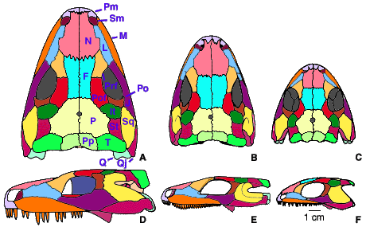
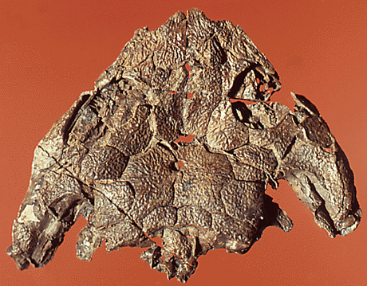

## Phylogeny 

-   « Ancestral Groups  
    -   [Terrestrial Vertebrates](../Terrestrial.md)
    -   [Sarcopterygii](../../Sarc.md)
    -   [Gnathostomata](../../../Gnath.md)
    -   [Vertebrata](../../../../Vertebrata.md)
    -   [Craniata](../../../../../Craniata.md)
    -   [Chordata](../../../../../../Chordata.md)
    -   [Deuterostomia](../../../../../../../Deutero.md)
    -  [Bilateria](../../../../../../../../Bilateria.md))
    -  [Animals](../../../../../../../../../Animals.md))
    -  [Eukarya](../../../../../../../../../../Eukarya.md))
    -   [Tree of Life](../../../../../../../../../../Tree_of_Life.md)

-   ◊ Sibling Groups of  Terrestrial Vertebrates
    -   [Amniota](Amniota.md)
    -   [Solenodonsaurus         janenschi](Solenodonsaurus_janenschi)
    -   [Living Amphibians](Living_Amphibians)
    -   Seymouriamorpha
    -   [Temnospondyli](Temnospondyli.md)
    -   [Baphetidae](Baphetidae.md)
    -   [Crassigyrinus scoticus](Crassigyrinus_scoticus)
    -   [Ichthyostega](Ichthyostega.md)
    -   [Acanthostega gunnari](Acanthostega_gunnari)

-   » Sub-Groups
    -   [Utegenia shpinari](Seymouriamorpha/Utegenia_shpinari.md)
    -   [Discosauriscus](Seymouriamorpha/Discosauriscus.md)
    -   [Ariekanerpeton sigalovi](Seymouriamorpha/Ariekanerpeton_sigalovi.md)
    -   [Seymouria](Seymouriamorpha/Seymouria.md)

# Seymouriamorpha 

[Michel Laurin](http://www.tolweb.org/)

Tree modified from Laurin (1996a).

Containing group: [Terrestrial Vertebrates](../Terrestrial.md)

## Introduction

Seymouriamorphs are a small but widespread group of early terrestrial
choanates. They are known from the Lower to Upper Permian and have been
found in Europe, Asia, and North America (Fig. 1). Six genera and eight
species are known. Many additional species have been erected, but most
of them are not valid (Klembara and Janiga, 1993).

Figure 1. Geographic distribution of seymouriamorph localities. These
localities are located in Eurasia and North America, but in the Permian,
the continents were in different positions and Eurasia was represented
by several smaller plates.

Small aquatic larvae bearing external gills are known in some
seymouriamorphs (Ivakhnenko, 1981; Kuznetsov and Ivakhnenko, 1981;
Klembara, 1995). The adults, when known, appear to have been
terrestrial. The skull length of the known specimens ranges from about 6
mm in the smallest larvea (Ivakhnenko, 1981) to 15 cm in presumably
mature individuals. The monophyly of this group has long been doubted
because of size and ontogenetic differences between various taxa.
Seymouria and Kotlassia are only known from relatively large and mature
specimens (Fig. 2) whereas all other known seymouriamorphs are
represented by larval and small to mid-sized postmetamorphic specimens
and were previously called discosauriscids (this is now known to be a
paraphyletic group). However, recent discoveries of fairly large
specimens of Discosauriscus (Klembara and Meszáros, 1992) and
Ariekanerpeton (Laurin, 1996b) and relatively small specimens of
Seymouria (Berman and Martens, 1993) have bridged this gap.

Figure 2. Seymouriamorph skulls in dorsal (A-C) and left lateral (D-F)
views. Seymouria baylorensis (A, D). Seymouria sanjuanensis (B, E).
Ariekanerpeton sigalovi (E, F). The specimens on which the
reconstructions of S. sanjuanensis and A. sigalovi are based are
probably not mature and these taxa may have reached approximately the
same size as S. baylorensis. Modified from Laurin (1995).

### Characteristics

The gut contents or coprolites of seymouriamorphs have only been found
recently (Klembaraand Meszáros, 1992), and they suggest that
seymouriamorphs resorted at least occasionally to cannibalism. Their
main diet is unknown. However, their sharp, conical teeth and palatal
fangs suggest that seymouriamorphs were predators.

The dermal cranial bones of adult seymouriamorphs are deeply sculptured
and exhibit a hexagonal pattern of ridges also found in many
temnospondyls (Fig. 3). The larvae lacked this sculpturing but they were
covered by shallow pits and grooves radiating from the center of
ossification of the bones. The presence of dermal sculpturing suggests
that the skin was tightly attached to the skull. Seymouriamorphs
retained all the dermal bones found in most other groups of terrestrial
choanates, and, as in embolomeres and amniotes, the tabular contacted
the parietal.

Figure 3. Dorsal view of the skull of a juvenile postmetamorphic
specimen of Discosauriscus austriacus showing the dermal sculpturing
that characterizes relatively mature seymouriamorphs. Courtesy of Dr.
Jozef Klembara.

Seymouriamorphs had a relatively short trunk (24 to 28 presacral
vertebrae) and stout limbs. Each vertebra was composed of a neural arch,
a large, cylindrical, amphicoelous pleurocentrum, and a small,
crescentic intercentrum. The neural arches were swollen, especially in
large, mature specimens. The atlantal (first cervical) arch and
pleurocentrum were paired. This is probably a primitive character
because the neural arches and pleurocentra of the earliest terrestrial
vertebrates were also paired (they had independent left and right arches
and pleurocentra rather than a fused median arch and pleurocentrum).
Hemal arches were present in the tail. There was usually only one sacral
vertebra in small specimens, but large individuals occasionally had two.
In this case, the posterior pair of sacral ribs was much more slender
than the anterior pair, as in Seymouria baylorensis, or only one of the
anterior ribs (right or left) contacted the ilium, as in Kotlassia. Ribs
were present from the first cervical to the first few caudal vertebrae.
The ribs of the pectoral region were expanded, presumably to provide
better attachment to the muscles that supported the shoulder girdle. The
exact number of caudal ribs is unknown, but as many as fifteen pairs may
have been present (Ivakhnenko, 1981).

The dermal shoulder girdle included a median interclavicle and a paired
clavicle and cleithra. The endochondral shoulder girdle included a
scapula and a coracoid. Like many other terrestrial choanates,
seymouriamorphs had five fingers and toes. The phalangeal formula was 2
3 4 4 3 or 2 3 4 5 3 in the hand (depending on the genus) and 2 3 4 5 3
in the foot.

Seymouriamorphs share a few derived characters, but an exhaustive list
is difficult to establish because most taxa are incompletely known.
However, all seymouriamorphs have relatively small posttemporal
fenestrae (these are openings on the occiput through which blood vessels
enter the skull), although this character is especially noticeable in
large, mature seymouriamorphs. Their posttemporal fenestra may have
grown with a negative allometry.

All seymouriamorphs appear to have an otic tube composed of the
opisthotic, the prootic, and the parasphenoid.

Most, if not all, seymouriamorphs had a large, transverse dorsal flange
of the pterygoid (called the lamina ascendens by Bystrow, 1944) that
extended to the skull roof.

All seymouriamorphs had a slender stapes that may have been involved in
hearing. This character appeared convergently in temnospondyls and in
several groups of tetrapods.

### Discussion of Phylogenetic Relationships

Seymouriamorphs have long played a prominent role in scenarios and
theories on the origin of amniotes. They were originally believed to be
closely related to amniotes or even to represent the most archaic
amniotes (Broili, 1904, White, 1939). The discovery of larval
seymouriamorphs with external gills contradicts this hypothesis.
However, many scientists still consider them close relatives of amniotes
(Gauthier et al., 1988). Despite their long association with the origin
of amniotes, seymouriamorphs have long been considered amphibians
simplybecause they are not amniotes, and all anamniotic terrestrial
vertebrates were considered amphibians before classifications were
modified to include only monophyletic groups (Carroll, 1988). However,
seymouriamorphs are not closely related to lissamphibians and are not
amphibians in the modern sense of this word.

Some recent studies suggesting that seymouriamorphs are not as closely
related to amniotes as previously thought also assert that lepospondyls
were more closely related to amniotes than to seymouriamorphs (Carroll,
1995). Others (Laurin and Reisz, 1997) argued that seymouriamorphs were
not more closely related to amniotes than to amphibians. If the latter
view is correct, seymouriamorphs are not tetrapods because Tetrapoda is
defined as the crown-group of terrestrial choanates (Gauthier et al.,
1989).

Few studies have dealt with the phylogeny within Seymouriamorpha.
However, recent work has suggested that Discosauriscus, Ariekanerpeton,
and Seymouria are more closely related to each other than to Kotlassia
and Utegenia (Laurin, in press). The affinities of Urumqia are difficult
to evaluate because this seymouriamorph is poorly known (Zhang et al.,
1984), but the presence of rhomboidal ventral bony scales (gastralia)
suggests that it is not closely related to Discosauriscus,
Ariekanerpeton, and Seymouria.

### Sensory Organs

The dermal cranial bones of larval and perhaps some juvenile
postmetamorphic specimens of seymouriamorphs bear grooves for the
lateral-line organ. This organ is composed of ciliated cells that can
detect motion in the water. Only aquatic vertebrates have a
lateral-line. The lateral-line organ is found in all fishes, most
permanently aquatic amphibians, and many aquatic larvae of terrestrial
amphibians. Therefore, juvenile seymouriamorphs were certainly aquatic.
However, the absence of grooves in large postmetamorphic specimens of
seymouriamorphs suggests the lateral-line may have disappeared during or
after the metamorphosis.

Enigmatic structures consisting of foramina located in deep depressions
were recently discovered on some cranial bones of larval specimens of
Discosauriscus (Klembara, 1994). These structures have been interpreted
as foraminate pits, structures that were previously known in
osteolepiforms, but in no terrestrial vertebrate. Comparisons with
urodeles suggest that the foraminate pits housed ampullary
electroreceptive organs. Similar electroreceptive organs are widespread
in vertebrates and are found, among other groups, in sharks, teleosts,
and lungfishes. However, in all extant taxa, the ampullary organ is
located in soft tissues and leaves no trace on the skeleton. Therefore,
it is difficult to prove that the foraminate pits of Discosauriscus
housed ampullary organs.

The slender stapes of seymouriamorphs and the presence of a large otic
notch in the temporal area suggest that seymouriamorphs had a tympanic
middle ear. The otic notch probably supported a large tympanum (ear
drum) and the stapes probably transmitted the sounds from the tympanum
to the fenestra ovalis (the stapes is involved in sound transmission in
all tetrapods that have a tympanum, although in mammals, other bones are
also involved). The tympanic middle ear is an adaptation to hear
high-frequency air-borne sounds (it is not effective underwater).
Tetrapods lacking a tympanum, like salamanders, can detect low-frequency
seismic vibrations (Duellman and Trueb, 1986), but they cannot detect
high-frequency air-borne sounds (above 1000 Hz). The presence of a
tympanic middle ear in seymouriamorphs and the absence of lateral-line
canal grooves in large postmetamorphic specimens suggest that adult
seymouriamorphs were terrestrial.

### References

Berman, D. S. & T. Martens. 1993. First occurrence of Seymouria
(Amphibia: Batrachosauria) in the Lower Permian Rotliegend of central
Germany. Annals of Carnegie Museum 62: 63-79.

Broili, F. 1904. Stammreptilien. Anatomischer Anzeiger 25: 577-587.

Bystrow A. P. 1944. Kotlassia prima Amalitzky. Geological Society of
America Bulletin 55: 379-416.

Carroll, R. L. 1988. Vertebrate Paleontology and Evolution. New York: W.
H. Freeman and Company.

Carroll, R. L. 1995. Problems of the phylogenetic analysis of Paleozoic
choanates. Bulletin du Muséum national d\'Histoire naturelle de Paris
4ème série 17: 389-445.

Duellman, W. E. & L. Trueb. 1986. Biology of Amphibians. New York:
McGraw-Hill.

Gauthier, J., A. G. Kluge, & T. Rowe. 1988. The early evolution of the
Amniota. In M. J. Benton (ed.) The phylogeny and classification of the
tetrapods, Volume 1: amphibians, reptiles, birds: 103-155. Oxford:
Clarendon Press.

Gauthier, J., D. C. Cannatella, K. De Queiroz, A. G. Kluge, & T. Rowe.
1989. Tetrapod phylogeny. In B. Fernholm, K. Bremer, and H. Jornvall
(eds.) The Hierarchy of Life: 337-353. New York: Elsevier Science
Publishers B. V. (Biomedical Division).

Ivakhnenko, M. F. 1981. Discosauriscidae from the Permian of
Tadzhikistan. Paleontological Journal 1981: 90-102.

Klembara, J. 1994. Electroreceptors in the Lower Permian tetrapod
Discosauriscus austriacus. Palaeontology 37: 609-626.

Klembara, J. 1995. The external gills and ornamentation of skull roof
bones of the Lower Permian tetrapod Discosauriscus (Kuhn 1933) with
remarks to its ontogeny. Paläontologische Zeitschrift 69: 265-281.

Klembara, J. & S. Meszáros. 1992. New finds of Discosauriscus austriacus
(Makowsky 1876) from the Lower Permian of Boskovice furrow
(Czecho-Slovakia). Geologica Carpathica 43: 305-312.

Klembara, J. & M. Janiga. 1993. Variation in Discosauriscus austriacus
(Makowsky 1876) from the Lower Permian of the Boskovice furrow (Czech
Republic). Zoological Journal of the Linnean Society 108: 247-270.

Kuznetsov, V. V. & M. F. Ivakhnenko. 1981. Discosauriscids from the
Upper Paleozoic in Southern Kazakhstan. Paleontological Journal 1981:
101-108.

Laurin, M. 1995. Comparative cranial anatomy of Seymouria sanjuanensis
(Tetrapoda: Batrachosauria) from the Lower Permian of Utah and New
Mexico. PaleoBios 16 (4): 1-8.

Laurin, M. 1996a. A reappraisal of Utegenia, a Permo-Carboniferous
seymouriamorph (Tetrapoda: Batrachosauria) from Kazakhstan. Journal of
Vertebrate Paleontology 16 (3): 374-383.

Laurin M. 1996b. A reevaluation of Ariekanerpeton, a Lower Permian
seymouriamorph (Tetrapoda: Seymouriamorpha) from Tadzhikistan. Journal
of Vertebrate Paleontology 16: 653-665.

Laurin, M. & R. R. Reisz. 1997. A new perspective on tetrapod phylogeny.
In S. Sumida and K. Martin (eds.) Amniotes Origins: Completing the
Transition to Land: 9-59. London: Academic Press.

White, T. E. 1939. Osteology of Seymouria baylorensis Broili. Bulletin
of the Museum of Comparative Zoology 85: 325-409.

Zhang, F., Y. Li, & X. Wan. 1984. A new occurrence of Permian
seymouriamorphs in Xinjiang, China. Vertebrata PalAsiatica 22: 294-304.

## Title Illustrations



  ------------------------------------------------
  Scientific Name ::     Seymouria baylorensis
  Location ::           Texas
  Reference            Reproduced from White, T. E. 1939. Osteology of Seymouria baylorensis Broili. Bulletin of the Museum of Comparative Zoology 85:325-409.
  Specimen Condition   Fossil \-- Period: Lower Permian
  ------------------------------------------------

## Confidential Links & Embeds: 

### #is_/same_as :: [Seymouriamorpha](/_Standards/bio/bio~Domain/Eukarya/Animal/Bilateria/Deutero/Chordata/Craniata/Vertebrata/Gnath/Sarc/Tetrapods/Seymouriamorpha.md) 

### #is_/same_as :: [Seymouriamorpha.public](/_public/bio/bio~Domain/Eukarya/Animal/Bilateria/Deutero/Chordata/Craniata/Vertebrata/Gnath/Sarc/Tetrapods/Seymouriamorpha.public.md) 

### #is_/same_as :: [Seymouriamorpha.internal](/_internal/bio/bio~Domain/Eukarya/Animal/Bilateria/Deutero/Chordata/Craniata/Vertebrata/Gnath/Sarc/Tetrapods/Seymouriamorpha.internal.md) 

### #is_/same_as :: [Seymouriamorpha.protect](/_protect/bio/bio~Domain/Eukarya/Animal/Bilateria/Deutero/Chordata/Craniata/Vertebrata/Gnath/Sarc/Tetrapods/Seymouriamorpha.protect.md) 

### #is_/same_as :: [Seymouriamorpha.private](/_private/bio/bio~Domain/Eukarya/Animal/Bilateria/Deutero/Chordata/Craniata/Vertebrata/Gnath/Sarc/Tetrapods/Seymouriamorpha.private.md) 

### #is_/same_as :: [Seymouriamorpha.personal](/_personal/bio/bio~Domain/Eukarya/Animal/Bilateria/Deutero/Chordata/Craniata/Vertebrata/Gnath/Sarc/Tetrapods/Seymouriamorpha.personal.md) 

### #is_/same_as :: [Seymouriamorpha.secret](/_secret/bio/bio~Domain/Eukarya/Animal/Bilateria/Deutero/Chordata/Craniata/Vertebrata/Gnath/Sarc/Tetrapods/Seymouriamorpha.secret.md)

