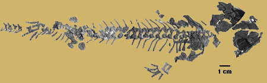
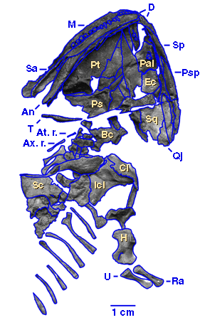

## Phylogeny 

-   « Ancestral Groups  
    -   [Seymouriamorpha](../Seymouriamorpha.md)
    -   [Terrestrial Vertebrates](../../Terrestrial.md)
    -   [Sarcopterygii](../../../Sarc.md)
    -   [Gnathostomata](../../../../Gnath.md)
    -   [Vertebrata](../../../../../Vertebrata.md)
    -   [Craniata](../../../../../../Craniata.md)
    -   [Chordata](../../../../../../../Chordata.md)
    -   [Deuterostomia](../../../../../../../../Deutero.md)
    -  [Bilateria](../../../../../../../../../Bilateria.md))
    -  [Animals](../../../../../../../../../../Animals.md))
    -  [Eukarya](../../../../../../../../../../../Eukarya.md))
    -   [Tree of Life](../../../../../../../../../../../Tree_of_Life.md)

-   ◊ Sibling Groups of  Seymouriamorpha
    -   [Utegenia shpinari](Utegenia_shpinari.md)
    -   [Discosauriscus](Discosauriscus.md)
    -   Ariekanerpeton sigalovi
    -   [Seymouria](Seymouria.md)

-   » Sub-Groups 

# *Ariekanerpeton sigalovi* 

[Michel Laurin](http://www.tolweb.org/)

Containing group: [Seymouriamorpha](../Seymouriamorpha.md)

## Introduction

Ariekanerpeton sigalovi was found in Lower Permian strata of
Tadzhikistan. It is represented by over nine hundred compressed but
otherwise well-preserved specimens. These specimens constitute one of
the best known growth series of seymouriamorphs that includes skulls
ranging from 6 mm to 54 mm in length (Ivakhnenko, 1981). However, the
poor ossification of the skeleton of the largest known specimens
suggests that even these are not fully mature.

Figure 1. One of the largest known specimens of Ariekanerpeton sigalovi.
The poor ossification of the long bones and the absence of the quadrate
suggest that this specimen is immature. Anatomical abbreviations: An,
angular; At. r., atlantal rib; Ax. r., axial rib; Bc, braincase; Cl,
clavicle; D, dentary; Ec, ectopterygoid; H, humerus; Icl, interclavicle;
Ps, parasphenoid; Psp, postsplenial; Pt, pterygoid; Qj, quadratojugal;
Ra, radius; Sa, surangular; Sc, scapula; Sp, splenial; Sq, squamosal; U,
ulna.

### Characteristics

Ariekanerpeton sigalovi, like other small seymouriamorphs, has been
reconstructed with a broad, triangular skull, but recent study of this
taxon suggests that the skull was slightly more narrow (Laurin, 1996).
There is usually no contact between the postorbital and the
supratemporal. This suggests that Ariekanerpeton is more closely related
to Seymouria and Discosauriscus than to Utegenia, who consistently
retained this contact in postmetamorphic specimens (the contact is
occasionally present in Discosauriscus and Ariekanerpeton, but only
rarely).

Ariekanerpeton had twenty-four presacral vertebrae. The neural arches
are paired and disarticulated from the pleurocentra even in the largest
known specimen, but this is probably a juvenile character.

Larval specimens of Ariekanerpeton had circular scales with concentric
rings similar to those found in Discosauriscus, but postmetamorphic
specimens appear to have lost them. Ariekanerpeton lacked the
rectangular ventral scales (gastralia) found in most other early
terrestrial choanates. The loss of gastralia suggests that
Ariekanerpeton was more closely related to Discosauriscus than to
Utegenia, who still had gastralia. In most fossil taxa, such
characteristics of the integument are not known, but the great number of
known specimens and their excellent preservation (scales are often
preserved in the larval specimens) allow changes in the integument of
Ariekanerpeton to be followed through its growth.

### References

Ivakhnenko, M. F. 1981. Discosauriscidae from the Permian of
Tadzhikistan. Paleontological Journal 1981: 90-102.

Laurin, M. 1996. A reevaluation of Ariekanerpeton, a Lower Permian
seymouriamorph (Tetrapods: Batrachosauria) from Tadzhikistan. Journal of
Vertebrate Paleontology 16 (4): 653-665.

## Title Illustrations

)

  ---------------------------------------------------------------------------------
  Scientific Name ::     Ariekanerpeton sigalovi
  Location ::           Tadzhikistan
  Comments             Skeleton of a small postmetamorphic specimen
  Specimen Condition   Fossil
  Copyright ::            © 1996 [Michel Laurin](http://tolweb.org/tree/laurin/Laurin_Home_page.html) 
  ---------------------------------------------------------------------------------

## Confidential Links & Embeds: 

### #is_/same_as :: [Ariekanerpeton_sigalovi](/_Standards/bio/bio~Domain/Eukarya/Animal/Bilateria/Deutero/Chordata/Craniata/Vertebrata/Gnath/Sarc/Tetrapods/Seymouriamorpha/Ariekanerpeton_sigalovi.md) 

### #is_/same_as :: [Ariekanerpeton_sigalovi.public](/_public/bio/bio~Domain/Eukarya/Animal/Bilateria/Deutero/Chordata/Craniata/Vertebrata/Gnath/Sarc/Tetrapods/Seymouriamorpha/Ariekanerpeton_sigalovi.public.md) 

### #is_/same_as :: [Ariekanerpeton_sigalovi.internal](/_internal/bio/bio~Domain/Eukarya/Animal/Bilateria/Deutero/Chordata/Craniata/Vertebrata/Gnath/Sarc/Tetrapods/Seymouriamorpha/Ariekanerpeton_sigalovi.internal.md) 

### #is_/same_as :: [Ariekanerpeton_sigalovi.protect](/_protect/bio/bio~Domain/Eukarya/Animal/Bilateria/Deutero/Chordata/Craniata/Vertebrata/Gnath/Sarc/Tetrapods/Seymouriamorpha/Ariekanerpeton_sigalovi.protect.md) 

### #is_/same_as :: [Ariekanerpeton_sigalovi.private](/_private/bio/bio~Domain/Eukarya/Animal/Bilateria/Deutero/Chordata/Craniata/Vertebrata/Gnath/Sarc/Tetrapods/Seymouriamorpha/Ariekanerpeton_sigalovi.private.md) 

### #is_/same_as :: [Ariekanerpeton_sigalovi.personal](/_personal/bio/bio~Domain/Eukarya/Animal/Bilateria/Deutero/Chordata/Craniata/Vertebrata/Gnath/Sarc/Tetrapods/Seymouriamorpha/Ariekanerpeton_sigalovi.personal.md) 

### #is_/same_as :: [Ariekanerpeton_sigalovi.secret](/_secret/bio/bio~Domain/Eukarya/Animal/Bilateria/Deutero/Chordata/Craniata/Vertebrata/Gnath/Sarc/Tetrapods/Seymouriamorpha/Ariekanerpeton_sigalovi.secret.md)

