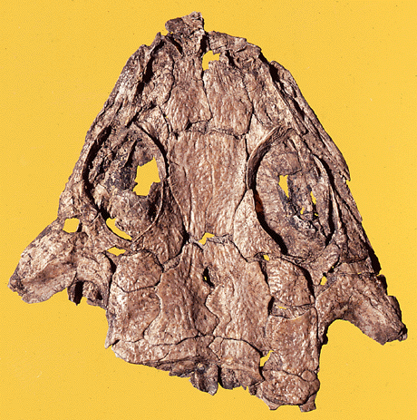
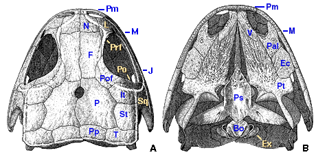

---
aliases:
  - Discosauriscus
title: Discosauriscus
---

## Phylogeny 

-   « Ancestral Groups  
    -   [Seymouriamorpha](../Seymouriamorpha.md)
    -   [Terrestrial Vertebrates](../../Terrestrial.md)
    -   [Sarcopterygii](../../../Sarc.md)
    -   [Gnathostomata](../../../../Gnath.md)
    -   [Vertebrata](../../../../../Vertebrata.md)
    -   [Craniata](../../../../../../Craniata.md)
    -   [Chordata](../../../../../../../Chordata.md)
    -   [Deuterostomia](../../../../../../../../Deutero.md)
    -  [Bilateria](../../../../../../../../../Bilateria.md) 
    -  [Animals](../../../../../../../../../../Animals.md) 
    -  [Eukarya](../../../../../../../../../../../Eukarya.md) 
    -   [Tree of Life](../../../../../../../../../../../Tree_of_Life.md)

-   ◊ Sibling Groups of  Seymouriamorpha
    -   [Utegenia shpinari](Utegenia_shpinari.md)
    -   Discosauriscus
    -   [Ariekanerpeton sigalovi](Ariekanerpeton_sigalovi.md)
    -   [Seymouria](Seymouria.md)

-   » Sub-Groups 

# *Discosauriscus* 

[Jozef Klembara](http://www.tolweb.org/)

-   *Discosauriscus pulcherrimus* †

Containing group: [Seymouriamorpha](../Seymouriamorpha.md)

## Introduction

Several hundred specimens of Discosauriscus have been found in the Lower
Permian deposits of Central and West Europe. The skeletons preserved in
the lacustrine deposits of the Boskovice Furrow in Moravia (Czech
Republic) are the best preserved specimens (Klembara and Meszáros,
1992). Discosauriscus is known from larval, metamorphic and early
juvenile specimens; no adult individuals are known (Klembara, 1995a).

Discosauriscus includes two valid species (Klembara, in preparation): D.
austriacus (Makowsky, 1876), the best known species from the Boskovice
Furrow, and D. pulcherrimus (Fritsch, 1879), represented by a few
specimens from the Boskovice Furrow, and several individuals from north
Bohemia (Czech Republic), Germany (Werneburg, 1985), Poland (Werneburg,
personal communication) and France (Heyler, 1969).

### Characteristics

The following ontogenetic stages can be distinguished in the material of
D. austriacus (SL = skull length): larval (SL: up to 30 mm), metamorphic
(SL: 30-50 mm), and early juvenile (SK: 50-62 mm). Only about five
specimens represent the early juvenile stage. Most specimens represent
the metamorphic stage.

The lateral-line system is well preserved (Klembara, in press). In
addition to sensory grooves in the dermal bones, there are also
pit-lines (Klembara, 1992, 1994b) and foraminate pits. The latter are
present in the skull roof bones; these pits probably housed clusters of
ampullary electroreceptive organs and are homologous with the
pore-groups in osteolepiforms (Klembara, 1994b).

There is no kinetic line between the skull table and the cheek. The
rectangular tabular process is probably homologous with the tabular horn
of embolomeres (Fig. 1). The jugal is exposed on the ventral skull
margin. There was no interpremaxillary fenestra. A
postorbital-supratemporal contact is occasionally present (Klembara,
1994a). The labyrinthine infolding characteristic of many early
terrestrial vertebrates only appears in the late larval stage. One to
four palatal tusts can be found on each vomer, and one to five on the
palatine. The palate is closed in early juveniles, but earlier
ontogenetic stages retain a narrow interpterygoid vacuity. The
transverse flange of the pterygoid sweeps slightly below the ventral
margin of the cheek. A suborbital fenestra is present. The laterally
expanded otic tubes found in other seymouriamorphs remain cartilaginous
in all known specimens. Two small Meckelian fenestrae pierce the medial
surface of the lower jaw. All three coronoids bear small teeth. The
dentary bears up to 43 teeth. The quadrate and articular are unossified
in all specimens. Many specimens have subdivided or fused skull roof
bones (Klembara, 1993, 1995b).

Figure 1. Cranial reconstruction of a larva of Discosauriscus in dorsal
(A) and palatal (B) view. Abbreviations: Bo, basioccipital; Ec,
ectopterygoid; Ex, exoccipital; F, frontal; It, intertemporal; J, jugal;
L, lacrimal; M, maxilla; N, nasal; P, parietal; Pal, palatine; Pm,
premaxilla; Po, postorbital; Pof, postfrontal; Pp, postparietal; Prf,
prefrontal; Ps, parasphenoid; Pt, pterygoid; St, supratemporal; T,
tabular; V, vomer. Drawings by Mr. J. Gullar.

There are 24 presacral vertebrae. The single sacral vertebra has a
massive sacral rib. At metamorphosis, the neural arches are similar to
those of embolomeres, but in early juveniles, they are already swollen
(contra Heaton, 1980) and almost completely fused with the large
pleurocentrum. The dermal shoulder girdle elements include the
interclavicle (with a long parasternal process), paired clavicles (with
relatively broad ventral plates), and slender, cylindrical cleithra.
Endoskeletal components include scapula (with a stout supraglenoid
buttress and a large supraglenoid foramen) and coracoid (with distinct
coracoid foramen). The phalangeal formula is 2-3-4-5-3 for manus and
pes.

Rounded scales with concentric rings covered the body from all sides
(Spinar, 1952; Klembara and Meszáros, 1992).

### References

Fritsch A. 1879. Neue Übersicht der in der Gaskohle und den Kalksteinen
der Permformation in Böhmen vorgefundenen Tierreste. Sitzungsberichte
der königlichen böhmischen Gesselschaft der Wissenschaften (Prag 1879),
184-195.

Heaton M. J. 1980. The Cotylosauria: A Reconsideration of a Group of
Archaic Tetrapods. In: A. L. Panchen (ed.) The Terrestrial Environment
and the Origin of Land Vertebrates: 497-551. London: Academic Press.

Heyler D. 1969. Vertébrés de l\'Autunien de France. Vol. 1. Cahiers de
paléontologie, ed. J. P. Lehman. Paris: CNRS.

Klembara J. 1992. The first record of pit-lines and foraminal pits in
tetrapods and the problem of the skull roof bones homology between
tetrapods and fishes. Geologica carpathica 42: 249-252.

Klembara J. 1993. The subdivisions and fusions of the exoskeletal skull
bones of Discosauriscus austriacus (Makowsky 1876) and their possible
homologues in rhipidistians. Paläontologische Zeitschrift 67: 145-168.

Klembara J. 1994a. The sutural pattern of skull-roof bones in Lower
Permian Discosauriscus austriacus from Moravia. Lethaia 27: 85-95.

Klembara J. 1994b. Electroreceptors in the Lower Permian tetrapod
Discosauriscus austriacus. Palaeontology 37: 609-626.

Klembara J. 1995a. The external gills and ornamentation of skull roof
bones of the Lower Permian tetrapod Discosauriscus (Kuhn 1933) with
remarks to its ontogeny. Paläontologische Zeitschrift 69: 265-281.

Klembara J. 1995b. Some cases of fused and concrescent exocranial bones
in the Lower Permian seymouriamorph tetrapod Discosauriscus Kuhn 1933.
In: H. Lelièvre, S. Wenz, A. Blieck and R. Cloutier (eds.) Premiers
vertébrés et vertébrés inférieurs (Geobios mémoire spécial no. 19), pp.
263-267.

Klembara, J. In press. The lateral line system of Discosauriscus
austriacus (Makowsky 1876) and the homologization of skull roof bones
between tetrapods and fishes. Palaeontographica A.

Klembara, J. In preparation. The cranial anatomy of Discosauriscus from
the Upper Permian of the Boskovice Furrow.

Klembara J. & S. Meszáros. 1992. New finds of Discosauriscus austriacus
(Makowsky 1876) from the Lower Permian of Boskovice furrow
(Czecho-Slovakia). Geologica Carpathica 43: 305-312.

Makowsky A. 1876. Über einen neuen Labyrinthodonten \"Archegosaurus
austriacus nov. spec.\". Sitzungsberichte der kaiserlichen Akademie der
Wissenschaft 73: 155-166.

Spinar Z. 1952. Revision of some Moravian Discosauriscidae. Rozpravy
Ustredního ustavu geologického 15: 1-159.

Werneburg R. 1985. Zur Taxonomie der jungpaläozoischen Familie
Discosauriscidae Romer 1947 (Batrachosauria, Amphibia). Freiberger
Forschungshefte, Reihe C 400: 117-139.

## Title Illustrations

 

  ----------------------
  scientific_name ::  Discosauriscus austriacus
  Comments          metamorphic specimen
  Body Part         skull
  View              dorsal
  copyright ::         © 1996 L. Osvald (Faculty of Natural Sciences, Bratislava)
  ----------------------

## Confidential Links & Embeds: 

### #is_/same_as :: [[/_Standards/bio/bio~Domain/Eukarya/Animal/Bilateria/Deutero/Chordata/Craniata/Vertebrata/Gnath/Sarc/Tetrapods/Seymouriamorpha/Discosauriscus|Discosauriscus]] 

### #is_/same_as :: [[/_public/bio/bio~Domain/Eukarya/Animal/Bilateria/Deutero/Chordata/Craniata/Vertebrata/Gnath/Sarc/Tetrapods/Seymouriamorpha/Discosauriscus.public|Discosauriscus.public]] 

### #is_/same_as :: [[/_internal/bio/bio~Domain/Eukarya/Animal/Bilateria/Deutero/Chordata/Craniata/Vertebrata/Gnath/Sarc/Tetrapods/Seymouriamorpha/Discosauriscus.internal|Discosauriscus.internal]] 

### #is_/same_as :: [[/_protect/bio/bio~Domain/Eukarya/Animal/Bilateria/Deutero/Chordata/Craniata/Vertebrata/Gnath/Sarc/Tetrapods/Seymouriamorpha/Discosauriscus.protect|Discosauriscus.protect]] 

### #is_/same_as :: [[/_private/bio/bio~Domain/Eukarya/Animal/Bilateria/Deutero/Chordata/Craniata/Vertebrata/Gnath/Sarc/Tetrapods/Seymouriamorpha/Discosauriscus.private|Discosauriscus.private]] 

### #is_/same_as :: [[/_personal/bio/bio~Domain/Eukarya/Animal/Bilateria/Deutero/Chordata/Craniata/Vertebrata/Gnath/Sarc/Tetrapods/Seymouriamorpha/Discosauriscus.personal|Discosauriscus.personal]] 

### #is_/same_as :: [[/_secret/bio/bio~Domain/Eukarya/Animal/Bilateria/Deutero/Chordata/Craniata/Vertebrata/Gnath/Sarc/Tetrapods/Seymouriamorpha/Discosauriscus.secret|Discosauriscus.secret]] 

