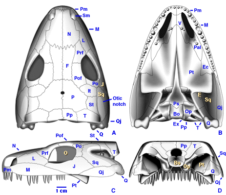

## Phylogeny 

-   « Ancestral Groups  
    -   [Seymouriamorpha](../Seymouriamorpha.md)
    -   [Terrestrial Vertebrates](../../Terrestrial.md)
    -   [Sarcopterygii](../../../Sarc.md)
    -   [Gnathostomata](../../../../Gnath.md)
    -   [Vertebrata](../../../../../Vertebrata.md)
    -   [Craniata](../../../../../../Craniata.md)
    -   [Chordata](../../../../../../../Chordata.md)
    -   [Deuterostomia](../../../../../../../../Deutero.md)
    -  [Bilateria](../../../../../../../../../Bilateria.md))
    -  [Animals](../../../../../../../../../../Animals.md))
    -  [Eukarya](../../../../../../../../../../../Eukarya.md))
    -   [Tree of Life](../../../../../../../../../../../Tree_of_Life.md)

-   ◊ Sibling Groups of  Seymouriamorpha
    -   [Utegenia shpinari](Utegenia_shpinari.md)
    -   [Discosauriscus](Discosauriscus.md)
    -   [Ariekanerpeton sigalovi](Ariekanerpeton_sigalovi.md)
    -   Seymouria

-   » Sub-Groups 

# *Seymouria* 

[Michel Laurin](http://www.tolweb.org/)

-   *Seymouria sanjuanensis* †
-   *Seymouria baylorensis* †
-   *Seymouria grandis* †

Containing group: [Seymouriamorpha](../Seymouriamorpha.md)

## Introduction

Seymouria is by far the best known seymouriamorph (White, 1939; Berman
et al., 1987; Laurin 1995, 1996a). It is represented by several well
ossified postmetamorphic specimens with excellent three-dimensional
preservation. However, its larvae are not known. Seymouria has long been
known from strata in North America, and two specimens were recently
found in Germany (Berman and Martens, 1993). These specimens are also
the smallest and presumably ontogenetically youngest known specimens of
Seymouria.

Seymouria includes three valid species that lived in the Lower Permian.
S. baylorensis is represented by the largest number of specimens, all of
which were found in Texas (White, 1939). S. sanjuanensis includes the
smallest known specimens of Seymouria and some relatively large
specimens (Vaughn, 1966). It was fairly widespread and has been found in
Utah, New Mexico, and Germany (Berman et al., 1987). S. grandis is
represented by fragmentary remains found in Oklahoma and Texas (Olson,
1979).

### Characteristics

Seymouria, like Kotlassia, is known from several three-dimensional
skeletons of mature individuals. Because of this, its skull can be
reconstructed with much more confidence than most other seymouriamorphs.
Its postcranial anatomy is also well known because its limb bones were
well ossified, whereas those of many other seymouriamorphs still had
cartilaginous ends.

Several of the autapomorphies of seymouriamorphs were first noticed in
Seymouria, and some potential autapomorphies of seymouriamorphs are
still only documented in this genus. These include:

A small posttemporal fenestra (a hole in the occiput through which blood vessels and nerves entered or exited the skull).\
A closed palate without an interpterygoid vacuity.
:   In most tetrapods and their relatives, a long median slit called the
    interpterygoid vacuity separates the two pterygoids (the largest
    bones of the palate). Other seymouriamorphs were previously believed
    to have had an interpterygoid vacuity, but recent studies suggest
    that Ariekanerpeton and Discosauriscus had a closed palate, like
    Seymouria (Laurin, in press; Klembara, personal communication).

A slender stapes that probably transmitted sounds from the tympanum to the inner ear.
:   A tympanic middle ear was probably present in all seymouriamorphs,
    but the stapes is best preserved in Seymouria.

Sharp notches in the anteroventral and posteroventral corners of the orbit.
:   These notches have not been observed in other seymouriamorphs yet.
    They may be genuine autapomorphies of Seymouria.

A long, ventrally bent process of the tabular.
:   This character may be partly ontogenetic. Small specimens of
    seymouriamorphs like most known specimens of Utegenia lacked the
    process. The smallest known specimens of Seymouria had a small
    process that was only slightly bent ventrally, and the larger
    specimens had a long, ventrally bent process.

Seymouria also had a transverse flange of the pterygoid that extended
ventrolaterally, as in early amniotes. Earlier workers believed that the
flange was horizontal because it is compressed in the horizontal plane
in most specimens of other seymouriamorphs (White, 1939).

The neural arches were swollen (strongly convex dorsally, in anterior or
posterior view). All seymouriamorphs had swollen neural arches, but this
feature is most obvious in large specimens of Seymouria. The neural
arches of all known specimens of Seymouria were solidly fused to their
centra, and no sutures are visible.

The humerus and femur were robust. Their proximal and distal heads were
strongly expanded to accommodate the limb musculature. The relatively
short forelimb and shank suggest that Seymouria was not a particularly
fast animal.

No scales have been found, but this could be an artifact of
preservation.

### References

Berman, D. S., R. R. Reisz, & D. A. Eberth. 1987. Seymouria sanjuanensis
(Amphibia, Batrachosauria) from the Lower Permian Cutler Formation of
north-central New Mexico and the occurrence of sexual dimorphism in that
genus questioned. Canadian Journal of Earth Sciences 24: 1769-1784.

Berman, D. S. &;T. Martens. 1993. First occurrence of Seymouria
(Amphibia: Batrachosauria) in the Lower Permian Rotliegend of central
Germany. Annals of Carnegie Museum 62: 63-79.

Laurin M. 1995. Comparative cranial anatomy of Seymouria sanjuanensis
(Tetrapoda: Batrachosauria) from the Lower Permian of Utah and New
Mexico. PaleoBios 16: 1-8.

Laurin M. 1996a. A redescription of the cranial anatomy of Seymouria
baylorensis, the best known seymouriamorph (Vertebrata:
Seymouriamorpha). PaleoBios 17: 1-16.

Laurin, M. 1996b. A reevaluation of Ariekanerpeton, a Lower Permian
seymouriamorph (Tetrapods: Batrachosauria) from Tadzhikistan. Journal of
Vertebrate Paleontology 16 (4): 653-665.

Olson, E. C. 1979. Seymouria grandis n. sp. (Batrachosauria: Amphibia)
from the Middle Clear Fork (Permian) of Oklahoma and Texas. Journal of
Paleontology 53: 720-728.

Vaughn, P. P. 1966. Seymouria from the Lower Permian of Southeastern
Utah, and possible sexual dimorphism in that genus. Journal of
Paleontology 40: 603-612.

White, T. E. 1939. Osteology of Seymouria baylorensis Broili. Bulletin
of the Museum of Comparative Zoology 85: 325-409.

## Title Illustrations

)

  ---------------------------------------------------------------------------------
  Scientific Name ::  Seymouria baylorensis
  Location ::        Texas
  Comments          Cranial reconstruction in dorsal (A), palatal (B), left lateral (C), and occipital (D) views. S. baylorensis is represented by several specimens from Texas.
  Reference         Modified from Laurin M. 1996. A redescription of the cranial anatomy of Seymouria baylorensis, the best known seymouriamorph (Vertebrata: Seymouriamorpha). PaleoBios 17:1-16.
  View              dorsal, palatal, left palatal, occipital
  Copyright ::         © 1996 [Michel Laurin](http://tolweb.org/tree/laurin/Laurin_Home_page.html) 
  ---------------------------------------------------------------------------------

## Confidential Links & Embeds: 

### #is_/same_as :: [Seymouria](/_Standards/bio/bio~Domain/Eukarya/Animal/Bilateria/Deutero/Chordata/Craniata/Vertebrata/Gnath/Sarc/Tetrapods/Seymouriamorpha/Seymouria.md) 

### #is_/same_as :: [Seymouria.public](/_public/bio/bio~Domain/Eukarya/Animal/Bilateria/Deutero/Chordata/Craniata/Vertebrata/Gnath/Sarc/Tetrapods/Seymouriamorpha/Seymouria.public.md) 

### #is_/same_as :: [Seymouria.internal](/_internal/bio/bio~Domain/Eukarya/Animal/Bilateria/Deutero/Chordata/Craniata/Vertebrata/Gnath/Sarc/Tetrapods/Seymouriamorpha/Seymouria.internal.md) 

### #is_/same_as :: [Seymouria.protect](/_protect/bio/bio~Domain/Eukarya/Animal/Bilateria/Deutero/Chordata/Craniata/Vertebrata/Gnath/Sarc/Tetrapods/Seymouriamorpha/Seymouria.protect.md) 

### #is_/same_as :: [Seymouria.private](/_private/bio/bio~Domain/Eukarya/Animal/Bilateria/Deutero/Chordata/Craniata/Vertebrata/Gnath/Sarc/Tetrapods/Seymouriamorpha/Seymouria.private.md) 

### #is_/same_as :: [Seymouria.personal](/_personal/bio/bio~Domain/Eukarya/Animal/Bilateria/Deutero/Chordata/Craniata/Vertebrata/Gnath/Sarc/Tetrapods/Seymouriamorpha/Seymouria.personal.md) 

### #is_/same_as :: [Seymouria.secret](/_secret/bio/bio~Domain/Eukarya/Animal/Bilateria/Deutero/Chordata/Craniata/Vertebrata/Gnath/Sarc/Tetrapods/Seymouriamorpha/Seymouria.secret.md)

