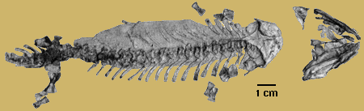
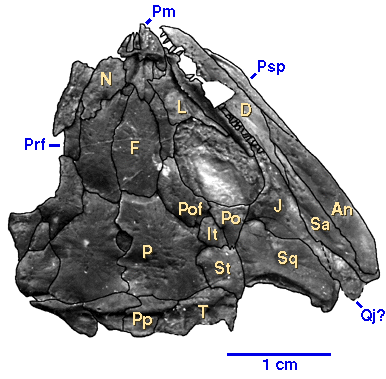
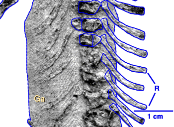

---
aliases:
  - Utegenia_shpinari
  - Utegenia shpinari
title: Utegenia shpinari
---

## Phylogeny 

-   « Ancestral Groups  
    -   [Seymouriamorpha](../Seymouriamorpha.md)
    -   [Terrestrial Vertebrates](../../Terrestrial.md)
    -   [Sarcopterygii](../../../Sarc.md)
    -   [Gnathostomata](../../../../Gnath.md)
    -   [Vertebrata](../../../../../Vertebrata.md)
    -   [Craniata](../../../../../../Craniata.md)
    -   [Chordata](../../../../../../../Chordata.md)
    -   [Deuterostomia](../../../../../../../../Deutero.md)
    -  [Bilateria](../../../../../../../../../Bilateria.md) 
    -  [Animals](../../../../../../../../../../Animals.md) 
    -  [Eukarya](../../../../../../../../../../../Eukarya.md) 
    -   [Tree of Life](../../../../../../../../../../../Tree_of_Life.md)

-   ◊ Sibling Groups of  Seymouriamorpha
    -   Utegenia shpinari
    -   [Discosauriscus](Discosauriscus.md)
    -   [Ariekanerpeton sigalovi](Ariekanerpeton_sigalovi.md)
    -   [Seymouria](Seymouria.md)

-   » Sub-Groups 

# *Utegenia shpinari* 

[Michel Laurin](http://www.tolweb.org/)

Containing group: [Seymouriamorpha](../Seymouriamorpha.md)

## Introduction

Utegenia shpinari was found in the Upper Pennsylvanian or Lower Permian
of Kazakhstan (the stratigraphy of this area is problematic). It is
represented by more than four hundred flattened but well preserved
specimens. These specimens document a growth series ranging from small
larvae to small post-metamorphic specimens. This growth series shows
that the neural arches ossify before the centra, and the external gills
disappear when the skull reaches a length of about 1.5 cm (Kuznetsoz and
Ivakhnenko, 1981). However, the poor ossification of most endochondral
elements suggests that no fully mature specimen was found. The cranial
length of the known specimens ranges from 1 cm to 3.5 cm (Kuznetsov and
Ivakhnenko, 1981).

### Characteristics

The first published reconstructions of Utegenia shpinari showed a very
broad skull (Kuznetsov and Ivakhnenko, 1981), but recent work suggests
that Kuznetsov and Ivakhnenko did not take the extensive crushing into
consideration (Fig. 1), and that the skull was somewhat more narrow
(Laurin, in press). The braincase is virtually unknown because its
endochondral elements were cartilaginous. However, the parasphenoid was
broad, triangular, and covered in a shagreen of denticles.

Figure 1. Skull of a postmetamorphic specimen of Utegenia shpinari.
Notice the contact between the postorbital (Po) and the supratemporal
(St).

Utegenia had a moderately long trunk, with 28 presacral vertebrae (three
of four more than in other seymouriamorphs). The neural arches are
paired and disarticulated from the pleurocentra even in the largest
known specimen, but this is probably a juvenile character (neural arch
fusion occurred relatively late in the ontogeny of early terrestrial
vertebrates).

The appendicular skeleton is poorly known because of its poor
ossification. The scapula and coracoid are discrete elements, and the
scapula is approximately circular. The ends of the limb bones are
unossified. The carpus and tarsus are usually not ossified.

Utegenia had circular scales over most of its body, like Discosauriscus.
It retained rhomboidal ventral scales (Fig. 2) arranged in a chevron
pattern (gastralia) and a contact between the postorbital and the
supratemporal (Fig. 1). Both of these characters suggest that it is not
closely related to Discosauriscus, Ariekanerpeton, or Seymouria (none of
these seymouriamorphs appear to have had rhomboidal gastralia, although
circular ventral scales were present in Discosauriscus, and the presence
of gastralia cannot be determined in Seymouria). The contact between the
supratemporal and the postorbital is rarely present in Discosauriscus
and Ariekanerpeton, and it is not found in Seymouria, but it is present
in most postmetamorphic specimens of Utegenia.

Figure 2. Impressions of ventral scales of Utegenia.

### References

Kuznetsov, V.V., and M.F. Ivakhnenko. 1981. Discosauriscids from the
Upper Paleozoic in Southern Kazakhstan. Paleontological Journal 1981:
101-108.

Laurin, M. In press. A reappraisal of Utegenia, a Permo-Carboniferous
seymouriamorph (Tetrapoda: Batrachosauria) from Kazakhstan. Journal of
Vertebrate Paleontology 29 pages, 6 figures.

## Title Illustrations

)

  ---------------------------------------------------------------------------------
  Scientific Name ::     Utegenia shpinari
  Location ::           Kazakhstan
  Comments             Skeleton of a postmetamorphic specimen. This specimen is one of more than four hundred skeletons recently collected in Kazakhstan. Impressions of ventral scales are preserved on the right side of the abdomen.
  Specimen Condition   Fossil
  View                 ventral
  Copyright ::            © 1996 [Michel Laurin](http://tolweb.org/tree/laurin/Laurin_Home_page.html) 
 
  ---------------------------------------------------------------------------------

## Confidential Links & Embeds: 

### #is_/same_as :: [Utegenia_shpinari](/_Standards/bio/bio~Domain/Eukarya/Animal/Bilateria/Deutero/Chordata/Craniata/Vertebrata/Gnath/Sarc/Tetrapods/Seymouriamorpha/Utegenia_shpinari.md) 

### #is_/same_as :: [Utegenia_shpinari.public](/_public/bio/bio~Domain/Eukarya/Animal/Bilateria/Deutero/Chordata/Craniata/Vertebrata/Gnath/Sarc/Tetrapods/Seymouriamorpha/Utegenia_shpinari.public.md) 

### #is_/same_as :: [Utegenia_shpinari.internal](/_internal/bio/bio~Domain/Eukarya/Animal/Bilateria/Deutero/Chordata/Craniata/Vertebrata/Gnath/Sarc/Tetrapods/Seymouriamorpha/Utegenia_shpinari.internal.md) 

### #is_/same_as :: [Utegenia_shpinari.protect](/_protect/bio/bio~Domain/Eukarya/Animal/Bilateria/Deutero/Chordata/Craniata/Vertebrata/Gnath/Sarc/Tetrapods/Seymouriamorpha/Utegenia_shpinari.protect.md) 

### #is_/same_as :: [Utegenia_shpinari.private](/_private/bio/bio~Domain/Eukarya/Animal/Bilateria/Deutero/Chordata/Craniata/Vertebrata/Gnath/Sarc/Tetrapods/Seymouriamorpha/Utegenia_shpinari.private.md) 

### #is_/same_as :: [Utegenia_shpinari.personal](/_personal/bio/bio~Domain/Eukarya/Animal/Bilateria/Deutero/Chordata/Craniata/Vertebrata/Gnath/Sarc/Tetrapods/Seymouriamorpha/Utegenia_shpinari.personal.md) 

### #is_/same_as :: [Utegenia_shpinari.secret](/_secret/bio/bio~Domain/Eukarya/Animal/Bilateria/Deutero/Chordata/Craniata/Vertebrata/Gnath/Sarc/Tetrapods/Seymouriamorpha/Utegenia_shpinari.secret.md)

