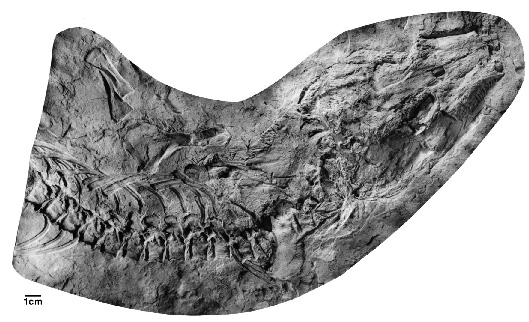
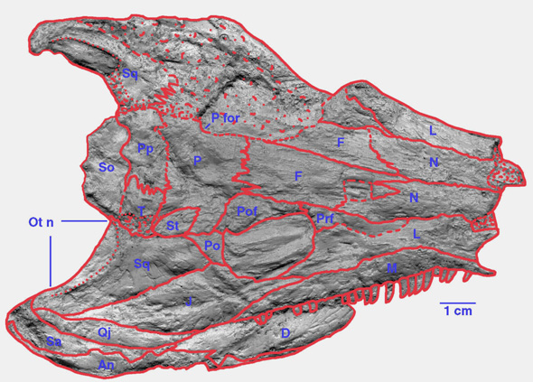
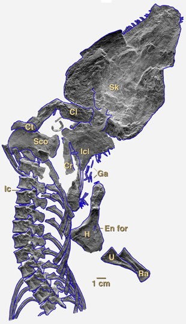

---
aliases:
  - Solenodonsaurus
title: Solenodonsaurus janenschi
---

## [[Solenodonsaurus]]

Solenodonsaurus janenschi 

## #has_/text_of_/abstract 

> **Solenodonsaurus** ("single-tooth lizard") is an extinct genus of reptiliomorphs 
> that lived in what is now Czech Republic, during the Westphalian stage.
>
> [Wikipedia](https://en.wikipedia.org/wiki/Solenodonsaurus) 
## Introduction

[Michel Laurin](http://www.tolweb.org/) 

*Solenodonsaurus janenschi* (the only recognized species of
*Solenodonsaurus*) is a small extinct tetrapod that measured about 45 cm
(snout-vent length). It was probably carnivorous or insectivorous, as
shown by its sharp, slightly curved teeth. It has played a prominent
role in discussions on the origin of amniotes (see the [Relationships of Solenodonsaurus to Other Stegocephalians](#RelationshipsofSolenodonsaurustoOtherStegocephalians)
section), even though it lived too late (in the Westphalian D, Upper
Carboniferous) to ever be considered an ancestor of amniotes (that
appear slightly earlier, in the Westphalian B).

### Characteristics

The skull of *Solenodonsaurus* possesses a shallow temporal emargination
(also called an otic notch). This emargination (Fig. 1) is shallower
than in most other early stegocephalians, and its shape is unsuitable to
have supported a tympanum. Thus, *Solenodonsaurus* could probably not
hear high-frequency air-borne sounds very well, if at all.

Figure 1. Skull of *Solenodonsaurus* in dorsal view. Abbreviations: An,
angular; D, dentary; F, frontal; J, jugal; L, lacrimal; M, maxilla; N,
nasal; Ot n, otic notch; P, parietal; P for, pineal foramen; Po,
postorbital; Pof, postfrontal; Pp, postparietal; Prf, prefrontal; Qj,
quadratojugal; Sa, surangular; So, supraoccipital; Sq, squamosal; St,
supratemporal; T, tabular. Pictures copyright © 2001 Michel Laurin.

Its humerus was fairly robust, with strongly expanded proximal and
distal heads (Fig. 2). There appears to have been a single sacral rib.
Its neural arches were not swollen, unlike those of seymouriamorphs and
diadectomorphs. As in many other early stegocephalians, its skin was
reinforced by long ventral (Fig. 2, Ga) and circular dorsal, bony
scales.

Unfortunately, our knowledge of the skeletal anatomy of this taxon is
poor because only a few incomplete skeletons are known. The preserved
skulls are also poor. Therefore, the path of some of the sutures on the
skull is uncertain (Fig. 1; as shown by dashed lines).

Figure 2. Skeleton of *Solenodonsaurus* in dorsal view. Abbreviations:
Cl, clavicla; Cr, cervical rib; Ct, cleithrum; En for, entepicondylar
foramen; Ga, gastralia; H, humerus; Ic, intercentrum; Icl,
interclavicle; Ra, radius; Sco, scapulocoracoid; Sk, skull; U, ulna.
Pictures copyright © 2001 Michel Laurin.

### Relationships of Solenodonsaurus to Other Stegocephalians

*Solenodonsaurus* was erected and described by Broili (1924), who
considered that it was a \"cotylosaur\" (a group that included some
early amniotes and their presumed closest known relatives). Its teeth
lack the labyrinthine infolding primitively found in stegocephalians,
and this is one of the characters (the other being the morphology of the
vertebral centrum) that led Broili (1924) to suggest that this animal
was an amniote (a \"reptile\", in his terminology). Its interclavicle
has a long posterior stem (Fig. 2), and this has long been thought to
unite it with other anthracosaurs, but this character has a broader
distribution (Laurin & Reisz, 1997). The vertebral centrum of
*Solenodonsaurus* (Fig. 2) resembles that of seymouriamorphs,
diadectomorphs, early amniotes and some early amphibians. It consists of
a large, cylindrical pleurocentrum and a small, crescentic intercentrum.
Other characters that were taken as evidence of amniote affinities of
*Solenodonsaurus* are the absence of an intertemporal and the presence
of a supraoccipital and of a contact between the tabular and the
parietal. However, most of these characters have a broader distribution
(Laurin & Reisz, 1997).

Subsequent studies confirmed that *Solenodonsaurus* was either an early
amniote or a close relative of amniotes (Pearson, 1924; Brough & Brough,
1967; Carroll, 1970). The advent of cladistics clarified somewhat the
position *Solenodonsaurus*; this taxon was considered to be definitely
outside Amniota, but to be closely related to the clade that includes
diadectomorphs and amniotes (Gauthier, Kluge & Rowe, 1988).

In a recent analysis that included amphibians (Laurin & Reisz, 1999),
*Solenodonsaurus* appears to be the sister-group of all other known
anthracosaurs (amniotes and their extinct relatives).

## Phylogeny 

-   « Ancestral Groups  
    -   [Terrestrial Vertebrates](../Terrestrial.md)
    -   [Sarcopterygii](../../Sarc.md)
    -   [Gnathostomata](../../../Gnath.md)
    -   [Vertebrata](../../../../Vertebrata.md)
    -   [Craniata](../../../../../Craniata.md)
    -   [Chordata](../../../../../../Chordata.md)
    -   [Deuterostomia](../../../../../../../Deutero.md)
    -  [Bilateria](../../../../../../../../Bilateria.md) 
    -  [Animals](../../../../../../../../../Animals.md) 
    -  [Eukarya](../../../../../../../../../../Eukarya.md) 
    -   [Tree of Life](../../../../../../../../../../Tree_of_Life.md)

-   ◊ Sibling Groups of  Terrestrial Vertebrates
    -   [Amniota](Amniota.md)
    -   Solenodonsaurus janenschi
    -   [Living Amphibians](Living_Amphibians)
    -   [Seymouriamorpha](Seymouriamorpha.md)
    -   [Temnospondyli](Temnospondyli.md)
    -   [Baphetidae](Baphetidae.md)
    -   [Crassigyrinus scoticus](Crassigyrinus_scoticus)
    -   [Ichthyostega](Ichthyostega.md)
    -   [Acanthostega gunnari](Acanthostega_gunnari)

-   » Sub-Groups 

## Title Illustrations

----------------------------------------------------------------------- 
)
Scientific Name ::     Solenodonsaurus janenschi
Reference            Reproduced from Laurin M. & R. R. Reisz. 1999. A new study of Solenodonsaurus janenschi, and a reconsideration of amniote origins and stegocephalian evolution. Canadian Journal of Earth Sciences 36:1239-1255.
Specimen Condition   Fossil
Body Part            skeleton
Copyright ::            © 1999 Michel Laurin and Robert Reisz

## Confidential Links & Embeds: 

### #is_/same_as :: [Solenodonsaurus](/_Standards/bio/bio~Domain/Eukarya/Animal/Bilateria/Deutero/Chordata/Craniata/Vertebrata/Gnath/Sarc/Tetrapods/Solenodonsaurus.md) 

### #is_/same_as :: [Solenodonsaurus.public](/_public/bio/bio~Domain/Eukarya/Animal/Bilateria/Deutero/Chordata/Craniata/Vertebrata/Gnath/Sarc/Tetrapods/Solenodonsaurus.public.md) 

### #is_/same_as :: [Solenodonsaurus.internal](/_internal/bio/bio~Domain/Eukarya/Animal/Bilateria/Deutero/Chordata/Craniata/Vertebrata/Gnath/Sarc/Tetrapods/Solenodonsaurus.internal.md) 

### #is_/same_as :: [Solenodonsaurus.protect](/_protect/bio/bio~Domain/Eukarya/Animal/Bilateria/Deutero/Chordata/Craniata/Vertebrata/Gnath/Sarc/Tetrapods/Solenodonsaurus.protect.md) 

### #is_/same_as :: [Solenodonsaurus.private](/_private/bio/bio~Domain/Eukarya/Animal/Bilateria/Deutero/Chordata/Craniata/Vertebrata/Gnath/Sarc/Tetrapods/Solenodonsaurus.private.md) 

### #is_/same_as :: [Solenodonsaurus.personal](/_personal/bio/bio~Domain/Eukarya/Animal/Bilateria/Deutero/Chordata/Craniata/Vertebrata/Gnath/Sarc/Tetrapods/Solenodonsaurus.personal.md) 

### #is_/same_as :: [Solenodonsaurus.secret](/_secret/bio/bio~Domain/Eukarya/Animal/Bilateria/Deutero/Chordata/Craniata/Vertebrata/Gnath/Sarc/Tetrapods/Solenodonsaurus.secret.md)

