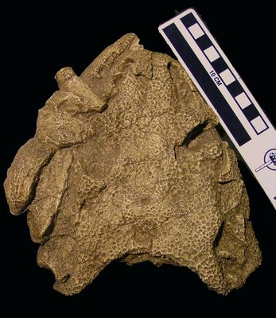
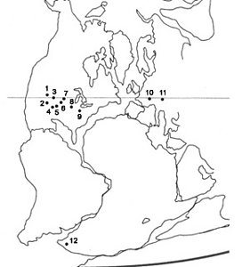
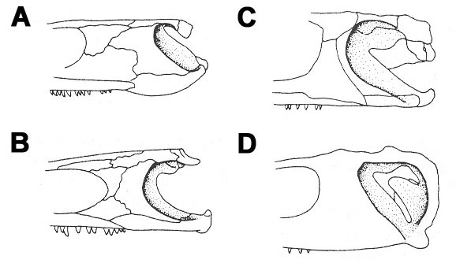

---
aliases:
  - Dissorophoidea
title: Dissorophoidea
---

# [[Dissorophoidea]] 
[Bolt 1969]

 

## #has_/text_of_/abstract 

> **Dissorophoidea** is a clade of medium-sized, temnospondyl amphibians that appeared during the Moscovian in Euramerica, and continued through to the Late Permian and the Early Triassic of Gondwana. They are distinguished by various details of the skull, and many species seem to have been well adapted for life on land.
>
> Dissorophoid diversity was highest in the Permian; some of the more diverse families within the group include Dissorophidae (toad-like amphibians with armored scutes along their backbone), Trematopidae (terrestrial predators with large triangular skulls), and Branchiosauridae (small neotenic amphibians with large external gills). The small Permo-Carboniferous Micromelerpetontidae are another example of neotenic dissorophoids. Many small dissorophoids with short rounded skulls were historically known as "amphibamids"; in 2018, the name Amphibamiformes was erected for a clade equivalent to the broad historical definition of "Amphibamidae".
>
> Since 2008, a consensus of early amphibian researchers consider Lissamphibia (modern amphibians) to be part of this clade. There is a large degree of similarity between lissamphibians (for which the oldest known fossils are Early Triassic) and certain Early Permian amphibamiforms, such as Gerobatrachus and Doleserpeton. A few authors still dispute affinities between dissorophoids and lissamphibians.
>
> [Wikipedia](https://en.wikipedia.org/wiki/Dissorophoidea)

## Introduction

[Adam Huttenlocker](http://www.tolweb.org/) 

Dissorophoids comprise a diverse group of small and medium-sized
temnospondyl stegocephalians that occupied a number of ecological niches
(both aquatic and terrestrial) and played an important role in
vertebrate communities for at least 80 million years (Carroll, 1964;
Holmes, 2000).  Some of the earliest known dissorophoid fossils occur in
Pennsylvanian-aged sediments (325-299 million years ago) of the Czech
Republic and the Midwestern United States. They are represented by the
tiny, paedomorphic Branchiosauridae and Micromelerpetontidae.  These
forms were virtually ubiquitous in aquatic freshwater vertebrate
communities of the Pennsylvanian and Early Permian in Europe and North
America.  Both groups had aquatic larvae and adult branchiosaurids seem
to have retained an ossified hyobranchial skeleton into maturity, along
with external gill filaments and gill rakers (Holmes, 2000). These taxa
resided in a niche similar to that which is occupied by some[ambystomatid salamanders](../Amphibia/Caudata/Ambystomatidae.md)) (e.g., the
Mexican axolotl) today.

Figure 1. Paleobiogeographic distribution of Permo-Carboniferous and
Triassic dissorophoids based on selected fossil localities.  (1) Utah,
USA (Lower Permian); (2) Rio Arriba County, north-central New Mexico,
USA (Lower Permian); (3) Badger Creek quarry, central Colorado, USA
(Upper Pennsylvanian); (4) Baylor County localities, Texas, USA (Lower
Permian); (5) Fort Sill fissure fill, Oklahoma, USA (Lower Permian); (6)
Hamilton quarry, Kansas, USA (Upper Pennsylvanian); (7) Mayer Farm
locality, Humboldt, Nebraska, USA (Lower Permian); (8) Mazon Creek,
Illinois, USA (Upper Pennsylvanian); (9) Linton Coal, Ohio, USA (Upper
Pennsylvanian); (10) Rotliegendes, Germany (Upper Pennsylvanian / Lower
Permian); (11) Nýřany, Czech Republic (Upper Pennsylvanian); (12)
*Micropholis* localities, Karoo Basin, South Africa (Lower Triassic).
(Modified from Kissel and Reisz, 2004.) © [Adam Huttenlocker](http://www.geocities.com/paleo_biology/)

Another taxon, the Amphibamidae, first appears in slightly younger
deposits than the earliest dissorophoids, ranging from the Late
Pennsylvanian to the Early Triassic. It was composed of miniaturized
temnospondyls showing predominantly terrestrial adaptations based on the
development and degree of ossification of the appendicular skeleton and
histological evidence in the long bones of some specimens (Bolt, 1977,
Laurin et al., 2004).  While these adaptations are most evident in
adults, amphibamids still relied on water for reproduction and had
aquatic larvae with external gills, closely resembling branchiosaurs
(Milner, 1982).  Amphibamidae was the longest-lived dissorophoid taxon,
persisting for at least 60 million years.

The latest dissorophoid clades that appear in the fossil record are the
trematopids (Late Pennsylvanian to Early Permian) and the armored
dissorophids (Early to Late Permian).  The trematopids are typified by a
posteriorly elongated or keyhole-shaped external naris (as in
*Ecolsonia*) and large 'caniniform' maxillary teeth.  The most widely
recognized feature of the Dissorophidae, on the other hand, is the
development of an armored carapace covering the dorsal surface of the
body.  Together, these two taxa display more progressive trends in
terrestriality, larger adult body sizes, and an otic notch that is often
closed off posteriorly.

### Characteristics

The skulls of some selected dissorophoids are illustrated in Figure 2
for a comparison of the major cranial features, particularly in the
region of the otic notch. In general, the antorbital region of the skull
is very short and broad with large, widely spaced nares, and the
posterior region of the skull is usually abbreviated when compared to
other early stegocephalians (particularly in branchiosaurids and most
amphibamids where the tabular and postparietal form short, transverse
bars). The otic notch, believed by some authors to be associated with
the reception of airborne sounds (Bolt, 1974; Holmes, 2000), is also an
important feature in dissorophoids. However, the role of the otic notch
for hearing air-borne sounds has recently been disputed (Laurin, 1998;
Laurin and Soler-Gijon, 2006).  Among Permo-Carboniferous temnospondyls,
the otic notch is most deeply developed in this group, particularly in
the trematopids and dissorophids where it is quite long
anteroposteriorly and sometimes closed off posteriorly (fig. 2C,D).

Figure 2. Evolutionary trends in the development of the otic notch based
on selected temnospondyls.  Posterior region of the skull (not to scale)
is shown in left lateral view.  (A) edopoid *Dendrerpeton*; (B)
amphibamid dissorophoid *Eoscopus*; (C) dissorophid *Dissorophus*; (D)
cacopine dissorophid *Cacops*.  (modified from Holmes et al., 1998). ©
[Adam Huttenlocker](http://www.geocities.com/paleo_biology/).

A complete list of synapomorphies supporting the monophyly of
Dissorophoidea is listed below (from Daly, 1994; Schoch and Rubidge,
2005):

1.  Laterally exposed palatine (absent or reduced in some branchiosaurs
    and amphibamids)
2.  Ventral prefrontal process contacts dorsal process of palatine
    medial to the lacrimal within the orbit (absent in some amphibamids)
3.  Dorsal quadrate process
4.  Posteromedial process of the quadratojugal
5.  Supratympanic flange on dorsal border of the otic notch in some
    dissorophoids (absent in branchiosaurids, micromelerpetontids, and
    some amphibamids)
6.  Internal nasal flange, located ventrally in the snout
7.  Pterygoid-vomer contact lost (except in trematopids)
8.  Interclavicle anterior process reduced
9.  Contribution of frontals to dorsal orbital margins (except in some
    amphibamids: *Platyrhinops* and *Amphibamus*)

### Discussion of Phylogenetic Relationships

The phylogenetic position of Dissorophoidea within Temnospondyli is
generally well resolved, with most authors favoring a sister-group
relationship to eryopoids or zatrachydid temnospondyls (collectively the
"Euskelia" of Yates and Warren, 2000). It is very likely that the
earliest members of the group evolved from a small, eryopoid or
zatrachydid-like ancestor. Within Dissorophoidea, five major taxa,
usually recognized as families, are currently recognized, including the
Branchiosauridae, Micromelerpetontidae, Amphibamidae, Trematopidae, and
Dissorophidae (discussed above). It is beyond this point that the
interrelationships of the various dissorophoid families are less agreed
upon.

An early cladistic analysis performed by Trueb and Cloutier (1991)
supported a monophyletic Amphibamidae (= 'Doleserpetontidae'), uniting
the taxa *Tersomius*, *Doleserpeton*, and *Amphibamus* within the group
and suggesting close affinities to the Dissorophidae. Daly (1994)
provided the first substantial cladistic analysis of the relationships
of dissorophoids, but did not explore genus-level relationships in any
detail and assumed the monophyly of most of the known dissorophoid
families. She suggested that Dissorophidae was monophyletic and
represented the sister taxon to Trematopidae, and that Amphibamidae was
more closely related to dissorophids and trematopids than to the more
basal branchiosaurids. Yates and Warren (2000) performed an analysis of
temnospondyls, demonstrating a monophyletic Euskelia (discussed above).
The authors further demonstrated relationships within Dissorophoidea
consistent with the hypothesis of Daly (1994), supporting Dissorophidae
and Trematopidae as the monophyletic sister group to Amphibamidae
(represented by the genus *Tersomius*).

More recently, Ruta, Jeffery, and Coates (2003) demonstrated
Amphibamidae as the monophyletic sister taxon to Branchiosauridae or to
Branchiosauridae + Crown-Lissamphibia (including modern amphibians),
with Trematopidae and Dissorophidae serving as successive outgroups.
Their phylogenetic hypothesis suggests a basal position for trematopids
within Dissorophoidea.  Other recent analyses (Anderson, in press;
Anderson et al., 2004) have indicated similar familial-level
relationships, suggesting close affinities between amphibamids,
'branchiosaurs,' and at least some lissamphibians, and placing
Trematopidae in a relatively basal position. However, the most recent
analyses excluded the family Dissorophidae and other important
dissorophoid taxa. Given these recent views, a better consensus of
dissorophoid relationships will have to await systematic revisions of
key genera and more detailed anatomical descriptions of well preserved
specimens (Anderson and Bolt, 2005).

## Phylogeny 

-   « Ancestral Groups  
    -   [Temnospondyli](../Temnospondyli.md)
    -   [Terrestrial Vertebrates](../../Terrestrial.md)
    -   [Sarcopterygii](../../../Sarc.md)
    -   [Gnathostomata](../../../../Gnath.md)
    -   [Vertebrata](../../../../../Vertebrata.md)
    -   [Craniata](../../../../../../Craniata.md)
    -   [Chordata](../../../../../../../Chordata.md)
    -   [Deuterostomia](../../../../../../../../Deutero.md)
    -  [Bilateria](../../../../../../../../../Bilateria.md) 
    -  [Animals](../../../../../../../../../../Animals.md) 
    -  [Eukarya](../../../../../../../../../../../Eukarya.md) 
    -   [Tree of Life](../../../../../../../../../../../Tree_of_Life.md)

-   ◊ Sibling Groups of  Temnospondyli
    -   Dissorophoidea

-   » Sub-Groups 

## Title Illustrations

------------------------------------------------------------------------------ 
 
Scientific Name ::     Ecolsonia cutlerensis
Location ::           North-central New Mexico
Specimen Condition   Fossil \-- Period: Early Permian (Cutler Fm)
Identified By        Berman et al., 1985
Copyright ::            © [Adam Huttenlocker](http://www.geocities.com/paleo_biology/) 

## Confidential Links & Embeds: 

### #is_/same_as :: [[/_Standards/bio/bio~Domain/Eukarya/Animal/Bilateria/Deutero/Chordata/Craniata/Vertebrata/Gnath/Sarc/Tetrapods/Temnospondyli/Dissorophoidea|Dissorophoidea]] 

### #is_/same_as :: [[/_public/bio/bio~Domain/Eukarya/Animal/Bilateria/Deutero/Chordata/Craniata/Vertebrata/Gnath/Sarc/Tetrapods/Temnospondyli/Dissorophoidea.public|Dissorophoidea.public]] 

### #is_/same_as :: [[/_internal/bio/bio~Domain/Eukarya/Animal/Bilateria/Deutero/Chordata/Craniata/Vertebrata/Gnath/Sarc/Tetrapods/Temnospondyli/Dissorophoidea.internal|Dissorophoidea.internal]] 

### #is_/same_as :: [[/_protect/bio/bio~Domain/Eukarya/Animal/Bilateria/Deutero/Chordata/Craniata/Vertebrata/Gnath/Sarc/Tetrapods/Temnospondyli/Dissorophoidea.protect|Dissorophoidea.protect]] 

### #is_/same_as :: [[/_private/bio/bio~Domain/Eukarya/Animal/Bilateria/Deutero/Chordata/Craniata/Vertebrata/Gnath/Sarc/Tetrapods/Temnospondyli/Dissorophoidea.private|Dissorophoidea.private]] 

### #is_/same_as :: [[/_personal/bio/bio~Domain/Eukarya/Animal/Bilateria/Deutero/Chordata/Craniata/Vertebrata/Gnath/Sarc/Tetrapods/Temnospondyli/Dissorophoidea.personal|Dissorophoidea.personal]] 

### #is_/same_as :: [[/_secret/bio/bio~Domain/Eukarya/Animal/Bilateria/Deutero/Chordata/Craniata/Vertebrata/Gnath/Sarc/Tetrapods/Temnospondyli/Dissorophoidea.secret|Dissorophoidea.secret]] 

