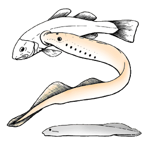

---
aliases:
- Hyperoartia
- ingolaalakúak
- Lampetra
- Lampredo
- Lamprei
- Lampreia
- Lampret
- lamprey
- Lampreya
- Lamprez
- Lamproye
- Lanproi
- Llamprea
- loimpre
- mihule
- Minogalar
- minogi
- Mkunga Mfyonzaji
- nahkiaiset
- Nejonögon
- Neunaugen
- niaugo
- Niøyer
- Njoggeneagen
- Njügenuugen
- nēģveidīgie
- Nėginės
- Paklare
- Petromizo
- Petromizontiformes
- Petromyzontiformes
- piškurji
- prikken
- Silmulised
- Steinsuga
- Taşemengiller
- Uyaġam aluqtuqtiŋa
- zmijuljice
- İlanbalığıkimilər
- λάμπραινα
- змијуљице
- змиулки
- Міногі
- Міногові
- Миногалар
- миногообразные
- миногоподобни
- Тілтістер
- Шӹм ыражан колвлӓ
- צמדאים
- جلكيات
- دهانگردماهی
- లాంప్రే
- ปลาแลมป์เพรย์
- လမ္ပရီငါး
- ヤツメウナギ目
- 七鰓鰻目
- 七鳃鳗目
- 八目鰻目
- 칠성장어목
title: Hyperoartia
has_id_wikidata: Q261485
dv_has_:
  name_:
    ar: جلكيات
    arz: جلكيات
    ast: Petromyzontiformes
    az: İlanbalığıkimilər
    be: Міногі
    be-tarask: Міногі
    bg: миногоподобни
    br: Lamprez
    ca: Llamprea
    ceb: Petromyzontiformes
    cs: mihule
    cy: Petromyzontiformes
    da: Lampret
    de: Neunaugen
    el: λάμπραινα
    en: lamprey
    eo: Petromizo
    es: Hyperoartia
    et: Silmulised
    eu: Lanproi
    fa: دهانگردماهی
    fi: nahkiaiset
    fr: petromyzontiformes
    frr: Njügenuugen
    fy: Njoggeneagen
    ga: loimpre
    gl: Petromizontiformes
    he: צמדאים
    hr: Paklare
    hu: ingolaalakúak
    ia: Petromyzontiformes
    id: Lamprey
    ik: Uyaġam aluqtuqtiŋa
    io: Lampredo
    is: Steinsuga
    it: Petromyzontiformes
    ja: ヤツメウナギ目
    kk: Тілтістер
    ko: 칠성장어목
    ky: Миногалар
    la: Petromyzontiformes
    lij: Petromyzontiformes
    lt: Nėginės
    lv: nēģveidīgie
    mk: змиулки
    mrj: Шӹм ыражан колвлӓ
    ms: Lamprei
    mul: Petromyzontiformes
    my: လမ္ပရီငါး
    nb: Niøyer
    nl: prikken
    nn: niaugo
    oc: Petromyzontiformes
    pl: minogi
    pt: Lampreia
    ro: Petromyzontiformes
    ru: миногообразные
    sh: Paklare
    sk: Mihule
    sl: piškurji
    sq: Petromyzontiformes
    sr: змијуљице
    sr-ec: змијуљице
    sr-el: zmijuljice
    sv: Nejonögon
    sw: Mkunga Mfyonzaji
    te: లాంప్రే
    th: ปลาแลมป์เพรย์
    tl: Lampreya
    tr: Taşemengiller
    uk: Міногові
    uz: Minogalar
    vi: Lamprey
    wa: Lamproye
    war: Lampetra
    yue: 八目鰻目
    zh: 七鰓鰻目
    zh-cn: 七鳃鳗目
    zh-hans: 七鳃鳗目
    zh-tw: 七鰓鰻目
---
# [[Hyperoartia]]

Lampreys 

 

Interrelationships of the Hyperoartia. (Recent taxa not worked out cladistically.)

The main characteristics supporting the nodes of this phylogeny are:

**Node 1**: Piston cartilage in lingual apparatus, loss of anal fin\
**Node 2**: Horny plates or denticles on sucker\
**Node 3**: Seven gill openings, gill pouches larger and more
posteriorly placed, eel-shaped aspect.\

## #has_/text_of_/abstract 

> Lampreys  (sometimes inaccurately called lamprey eels) are a group of jawless fish comprising the order Petromyzontiformes , sole order in the class Petromyzontida. The adult lamprey is characterized by a toothed, funnel-like sucking mouth. The common name "lamprey" is probably derived from Latin lampetra, which may mean "stone licker" (lambere "to lick" + petra "stone"), though the etymology is uncertain.  "Lamprey" is sometimes seen for the plural form.
>
> About 38 extant species of lampreys are known, with around seven known extinct species. They are classified in three families—two small families in the Southern Hemisphere (Geotriidae, Mordaciidae) and one large family in the Northern Hemisphere (Petromyzontidae).
>
> Genetic evidence suggests that lampreys are more closely related to hagfish, the only other living group of jawless fish, than they are to jawed vertebrates, forming the superclass Cyclostomi. The oldest fossils of stem-group lampreys are from the latest Devonian, around 360 million years ago, with modern-looking forms only appearing during the Jurassic, around 163 million years ago, with the modern families likely splitting from each sometime between the Middle Jurassic and the end of the Cretaceous.
>
> Modern lampreys spend the majority of their lives in the juvenile "ammocoete" stage, where they burrow into the sediment and filter feed. Adult carnivorous lampreys are the most well-known species, and feed by boring into the flesh of other fish (or in rare cases marine mammals) to consume flesh and/or blood; but only 18 species of lampreys engage in this predatory lifestyle (with Caspiomyzon suggested to feed on carrion rather than live prey). Of the 18 carnivorous species, nine migrate from saltwater to freshwater to breed (some of them also have freshwater populations), and nine live exclusively in freshwater. All noncarnivorous forms are freshwater species. Adults of the noncarnivorous species do not feed; they live on reserves acquired as ammocoetes.
>
> [Wikipedia](https://en.wikipedia.org/wiki/Lamprey) 

## Introduction

[Philippe Janvier]() 

Lampreys are anadromous or fresh water, eel-shaped jawless fishes. They
can be readily recognized by the large, rounded sucker which surrounds
their mouth and by their single \"nostril\" on the top of their head.
The skin of lampreys is entirely naked ans slimy, and their seven gill
openings extend behind the eyes. Whether marine or fresh water, lampreys
always spaw and lay eggs in brooks and rivers. During most of their life
(about seven years), they are larval; then they undergo a metamorphose
and become an adult. Anadromous lampreys, when adult, return to the sea,
where they become mature, and live there for one or two years. Then they
return to rivers, reproduce and generally die. Many lampreys are
parasites. They attach on other fishes by means of their sucker, scrape
their skin with their rasping tongue, and suck their blood. All
lampreys, however can also feed on small invertebrates. The sucker is
also for them a means to travel upstreams in rivers. They use it to
attach on stones to rest (Petromyzon, the name of the European lamprey,
means \"stone sucker\") or on more powerful fishes which trail them.
Although lampreys are sometimes regarded as a delicacy and fished in
Europe, the main cause of their disappearance is water pollution, to
which they (in particular larvae) are particularly sensitive.

Recent lampreys, or Petromyzontiformes, include ten genera:
Ichthyomyzon, Petromyzon, Caspiomyzon, Geotria, Mordacia, Eudontomyzon,
Tetrapleurodon, Entosphenus, Lethenteron, and Lampetra. Lampreys have an
amphitropical distribution and are restricted to relatively cold waters.
Geotria and Mordacia are the only lampreys of the southern hemisphere,
all other genera live in the northern hemisphere.

### Characteristics

Lampreys are characterized by:

-   A large sucker surrounding the mouth, strengthened by an annular
    cartilage.
-   Spine-shaped processes on gill arches

Lampreys are also unique among extant vertebrates in having a median
dorsal \"nostril\", the nasohypophysial opening, but some other fossil
vertebrates also display the same structure. It is therefore not
diagnostic of lampreys only.

Lampreys are devoid of a mineralized skeleton, although traces of
globular calcified cartilage may occur in the endoskeleton.

The head of adult lampreys has relatively large eyes, followed
posteriorly by a series of seven, rounded gill openings. Dorsally, there
is a translucent pineal spot and, anteriorly to it, a median dorsal
\"nostril\" called the nasohypophysial opening because it is the opening
of both the olfactory organ and a blind hypophysial tube including the
pituitary gland or hypophysis. This tube is thought to be the remnant of
the primitive nasopharyngeal duct (see Hyperotreti). The skin of
lampreys is naked and shows large neuromasts of the sensory-line system.
The unpaired fins are the dorsal and caudal fins, which are strengthened
by numerous, thin cartilaginous radials associated with radial muscles.
The tail is slightly hypocercal; that is, the fleshy part containing the
notochord is downwardly bent.

The sucker which surrounds the mouth is strengthened by a ring-shaped
annular cartilage and bears numerous horny denticles. The depression in
the sucker is effected by a complex mechanism which comprises a pumping
device, the velum, and a recess of the oral cavity, the hydrosinus. The
mouth includes a complex \"tongue\"-like apparatus which shows some
resemblance to that of hagfishes as to its basic mechanism. It bears a
series of comb-shaped horny \"teeth\" which can rotate on the tip of a
retractable piston cartilage. The overall resemblance of the \"tongue\"
of lampreys and hagfishes was long regarded as a unique cyclostome
character. Considering the current phylogeny, it is now better viewed as
independently derived from a basically similar device of the common
ancestor to all craniates.

The skull of lampreys is, like that of hagfishes, made up of
cartilaginous plates and bars, but it is more complex and includes a
true cartilaginous braincase. The gills, although enclosed in
muscularized pouches in the adult, are supported by unjointed gill
arches (see figure in the
[Craniata](tree?group=Craniata&contgroup=Chordata)
page), which form a \"branchial basket\". The gill arches lie externally
to the gill filaments and associated blood vessels. Lampreys possess,
like hagfishes, a very large notochord but, in addition, there are small
cartilaginous dorsal arcualia (basidorsals and interdorsals).

The brain has a very poorly developed cerebellum but large optic lobes.
The spinal cord is flattened, almost ribon-shaped, yet thicker than that
of hagfishes.

The eyes possess a lens, but no intrinsic eye muscles for accomodation.
The extrinsic eye muscles are as in extant gnathostomes, except for the
superior oblique muscle, which is attached posteriorly in the orbit,
instead of anteriorly.

The labyrinth has two vertical semicircular canals, a blind
endolymphatic duct, and a number of large ciliated sacs which play a
role in equilibrium.

Lampreys undergo a larval development which can last up to seven years.
The larval lamprey, or \"ammocoetes\", has no sucker and poorly
developed eyes. Its gills are not enclosed in pouches and it feeds by
trapping minute food particles with a strand of mucus produced by the
pharynx. Between the mouth and the pharynx, the lamprey larva has a
two-valved pumping and anti-reflux device, the velum which, in the adult
plays no role in the respiration. The skeleton of the larval head
largely consists of a special, elastic tissue, the muco-cartilage,
which, during metamorphosis gives rise to a variety of tissues,
including true cartilage.

### Discussion of Phylogenetic Relationships

The interrelationships of the ten extant genera is still unclear, but it
is currently admitted that the organisation of the horny denticles of
the sucker in Ichthyomyzon, Petromyzon and Caspiomyzon is primitive for
the group. It is also quite similar to that found in one of the fossil
lamprey, Pipiscius.

There are three fossil lampreys, Mayomyzon, Hardistiella, and Pipiscius,
all from the Late Carboniferous of USA. Mayomyzon is the best known of
them and resembles extant lampreys in many respects, except for the
somewhat stouter body shape, smaller gill pouches, and coalescent dorsal
and caudal fins. Mayomyzon possessed as piston cartilage and, thus, a
complex \"tongue\"-like apparatus. Hardistiella may have retained a
small anal fin and a more clearly hypocercal tail. Pipiscius is poorly
known but possessed a rouded sucker armed with polygonal horny plates.

Other fossils, formerly referred to the Anaspida are now tentatively
regarded as relatives of lampreys. Jamoytius (Early Silurian of
Scotland) is a naked jawless craniate which may have possessed an
annular cartilage. Euphanerops (Late Devonian of Canada) looks like a
naked anaspid, with a strongly hypocercal tail, and also seems to have
an annular cartilage. Some, however, still put this genus, as well as
Endeiolepis among anaspids.

## Phylogeny 

-   « Ancestral Groups  
    -   [Vertebrata](../Vertebrata.md)
    -   [Craniata](../../Craniata.md)
    -   [Chordata](../../../Chordata.md)
    -   [Deuterostomia](../../../../Deutero.md)
    -  [Bilateria](../../../../../Bilateria.md) 
    -  [Animals](../../../../../../Animals.md) 
    -  [Eukarya](../../../../../../../Eukarya.md) 
    -   [Tree of Life](../../../../../../../Tree_of_Life.md)

-   ◊ Sibling Groups of  Vertebrata
    -   Hyperoartia
    -   [Euconodonta](Euconodonta.md)
    -   [Pteraspidomorphi](Pteraspidomorphi.md)
    -   [Thelodonti](Thelodonti.md)
    -   [Anaspida](Anaspida.md)
    -   [Galeaspida](Galeaspida.md)
    -   [Pituriaspida](Pituriaspida.md)
    -   [Osteostraci](Osteostraci.md)
    -   [Gnathostomata](Gnath.md)

-   » Sub-Groups 

## Title Illustrations

Some modern lampreys (top) are external parasites of other fishes and
suck their blood by attaching to their prey by means of a large sucker
surrounding their mouth. Lampreys have a single, median and dorsal
\"nostril\", the nasohypophysial opening, which is situated anteriorly
to the eyes. One of the earliest known fossil lamprey, Mayomyzon
(bottom), from the Late Carboniferous of Illinois, may not have been
such a parasitic form and had a stouter body than modern lampreys)
(after Bardack & Zangerl 1971).
 
copyright ::   © 1997 Philippe Janvier

## Confidential Links & Embeds: 

### #is_/same_as :: [[/_Standards/bio/bio~Domain/Eukarya/Animal/Bilateria/Deutero/Chordata/Craniata/Vertebrata/Hyperoartia|Hyperoartia]] 

### #is_/same_as :: [[/_public/bio/bio~Domain/Eukarya/Animal/Bilateria/Deutero/Chordata/Craniata/Vertebrata/Hyperoartia.public|Hyperoartia.public]] 

### #is_/same_as :: [[/_internal/bio/bio~Domain/Eukarya/Animal/Bilateria/Deutero/Chordata/Craniata/Vertebrata/Hyperoartia.internal|Hyperoartia.internal]] 

### #is_/same_as :: [[/_protect/bio/bio~Domain/Eukarya/Animal/Bilateria/Deutero/Chordata/Craniata/Vertebrata/Hyperoartia.protect|Hyperoartia.protect]] 

### #is_/same_as :: [[/_private/bio/bio~Domain/Eukarya/Animal/Bilateria/Deutero/Chordata/Craniata/Vertebrata/Hyperoartia.private|Hyperoartia.private]] 

### #is_/same_as :: [[/_personal/bio/bio~Domain/Eukarya/Animal/Bilateria/Deutero/Chordata/Craniata/Vertebrata/Hyperoartia.personal|Hyperoartia.personal]] 

### #is_/same_as :: [[/_secret/bio/bio~Domain/Eukarya/Animal/Bilateria/Deutero/Chordata/Craniata/Vertebrata/Hyperoartia.secret|Hyperoartia.secret]] 

